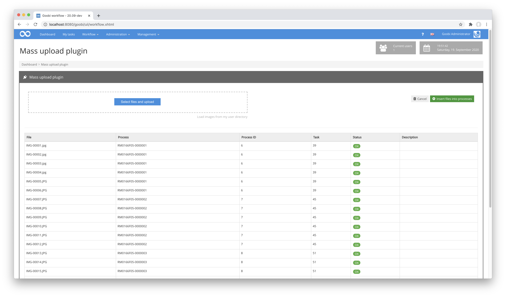
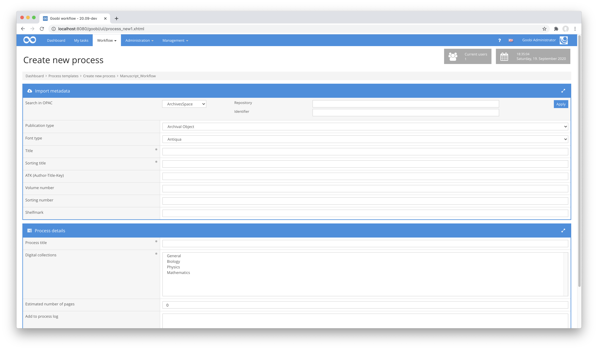
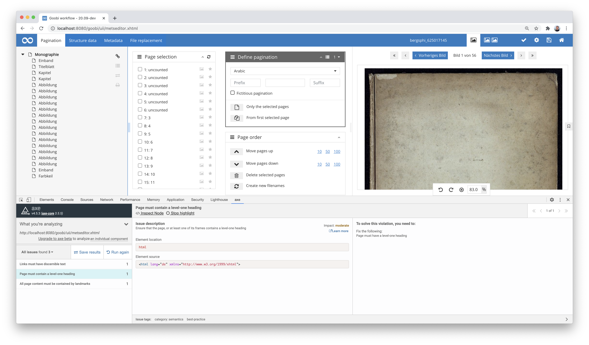

# August 2020

## Coming soon

In the coming weeks we will probably focus on the following points:

* Implementation of a tectonics processing mask
* Extension of metadata processing for a better handling of corporate bodies
* Other general plugin developments
* Preparation of the Goobi days :)

## Mass upload plugin with barcode recognition

In August we developed a number of new plugins for partly completely new working methods. The first plugin to be mentioned here concerns the mass upload. This plugin has already been around for some time. It allows you to upload several images or read them from a directory to automatically assign them to the correct processes. The previous functionality was limited to recognising the correct Goobi processes on the basis of the file names. With the new development, it is now also possible to recognise a barcode on images so that the image with the barcode and all subsequent images up to the next image with barcode are assigned to the process from the barcode.


With this plugin, completely new working methods are now possible, where images created across objects are automatically divided into independent entities and assigned to the correct workflows.



The detailed documentation of the plugin can be found at the following URL:


https://docs.goobi.io/goobi-workflow-plugins-en/workflow/plugin-workflow-massupload


The source code of the plugin itself is available at the following URL:


https://github.com/intranda/goobi-plugin-workflow-massupload


## New step plugin for scaling and watermarking

A new plugin now enables Goobi workflow to scale images as required in a single step. You can specify the maximum size of the scaled image on its longest side in a configuration file. You can also configure a watermark to be included in the image. This can consist of text as well as graphic elements. It is also possible to control where exactly the watermark should be inserted.


The definition of how the scaling and creation of the watermark should be done is controllable within the plugin configuration for different workflows. For example, a configuration for the image shown here would look like this within the file `plugin_intranda_step_image_resize_and_watermark.xml`:

```markup
<config_plugin>
    <gmPath>/usr/local/bin/gm</gmPath>
    <convertPath>/usr/local/bin/convert</convertPath>

    <config>
        <!-- which projects to use for (can be more than one, otherwise use *) -->
        <project>*</project>
        <step>*</step>
        <sourceDir>master</sourceDir>
        <destDir>media</destDir>

        <imageConfig collection="*" mediaType="*">
            <resizeTo>1500</resizeTo>
            <watermark>
                <image>/opt/digiverso/goobi/watermark.png</image>
                <location>south</location>
                <xDistance>0</xDistance>
                <yDistance>150</yDistance>
            </watermark>
        </imageConfig>
    </config>
</config_plugin>
```

The documentation of the plugin can be found here:


https://docs.goobi.io/goobi-workflow-plugins-en/step/intranda_step_image_resize_and_watermark


The source code of the plugin itself is available at the following URL:


https://github.com/intranda/goobi-plugin-step-image-resize-and-watermark


## Opac Plugins with more query options

Plug-ins for querying catalogues have been available in Goobi since 2009, although until now it has always been sufficient to query a single record from a catalogue using a specific identifier. However, in one of the most recent projects in which we were involved, it became clear that there was also a need for more complex queries. Specifically, depending on the catalogue selection, one, two or even three identifiers should be used together in the catalogue query to obtain a concrete record. For this reason, the interface for Opac plugins had to be extended in such a way that such plugins can now control an additional area in which further entries should be possible. In the case of the JSON Opac plugin, this has been put into productive operation and the interface is now different from the Opac plugins of the past. In addition to the input of an identifier at least one line with additional information is now possible.



Details of what the JSON Opac plugin does, how it is configured and put into operation can be found in the documentation here:


https://docs.goobi.io/goobi-workflow-plugins-en/opac/goobi-plugin-opac-json


The plugin's source code can be found on GitHub here:


https://github.com/intranda/goobi-plugin-opac-json


## Accessibility in METS Editor

After we have already put a lot of energy into supporting accessibility according to WCAG 2.1 in the past weeks, we had to work on it further in the METS Editor. The work has not yet been fully completed, so that this will continue to accompany us in September.



[https://github.com/intranda/goobi-workflow/commit/52225055feac93b713c815bc4c02f8ac49bf4b79](https://github.com/intranda/goobi-workflow/commit/52225055feac93b713c815bc4c02f8ac49bf4b79)\
[https://github.com/intranda/goobi-workflow/commit/d62135f801ddb12e741b4335d9157d6f2f5e44a1](https://github.com/intranda/goobi-workflow/commit/d62135f801ddb12e741b4335d9157d6f2f5e44a1)\
[https://github.com/intranda/goobi-workflow/commit/6dc1fe71c727c8a941eb26f12aeac0a974da33af](https://github.com/intranda/goobi-workflow/commit/6dc1fe71c727c8a941eb26f12aeac0a974da33af)

## Processing jobs in queues: Support for Amazon SQS

In our major conversion of Goobi workflow for operation within the Amazon cloud, we have now included Amazon SQS. From now on, the queue for computationally intensive work as externally executable tasks can also be based on Amazon SQS. This further simplifies integration into an infrastructure maintained in AWS.

[https://github.com/intranda/goobi-workflow/commit/2f399e7374322b577e1cdbc3ee8e4af3565d72e5](https://github.com/intranda/goobi-workflow/commit/2f399e7374322b577e1cdbc3ee8e4af3565d72e5)