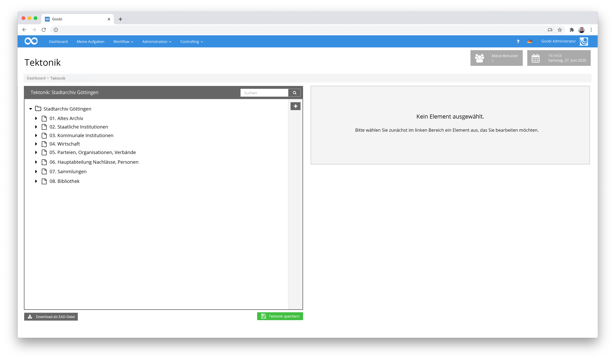
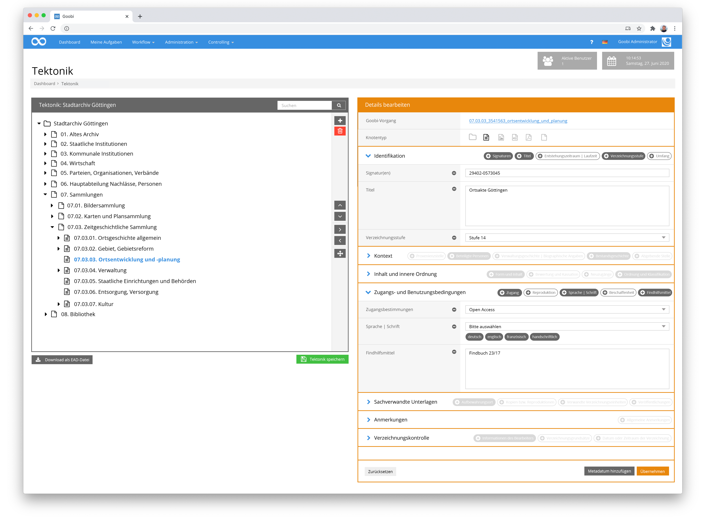
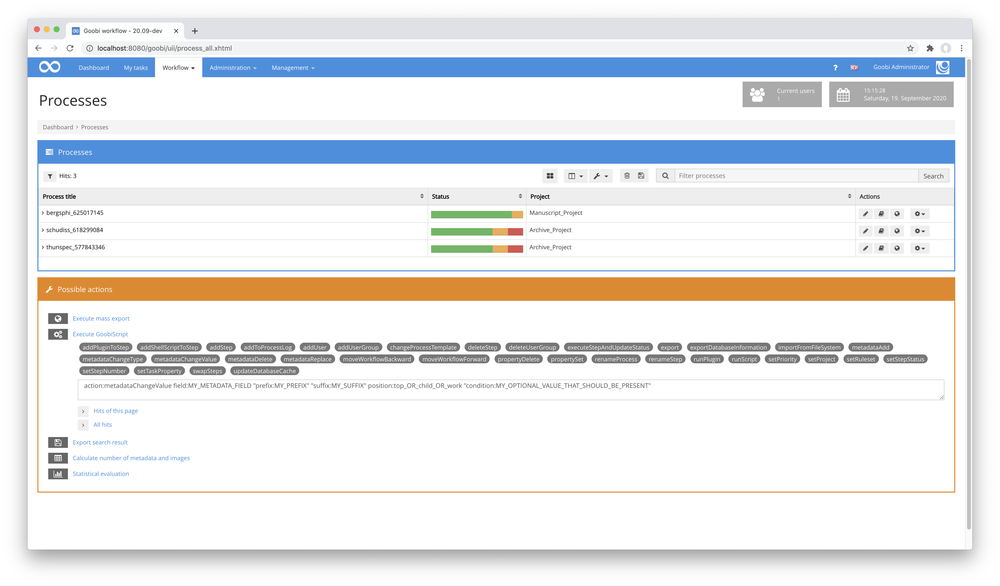
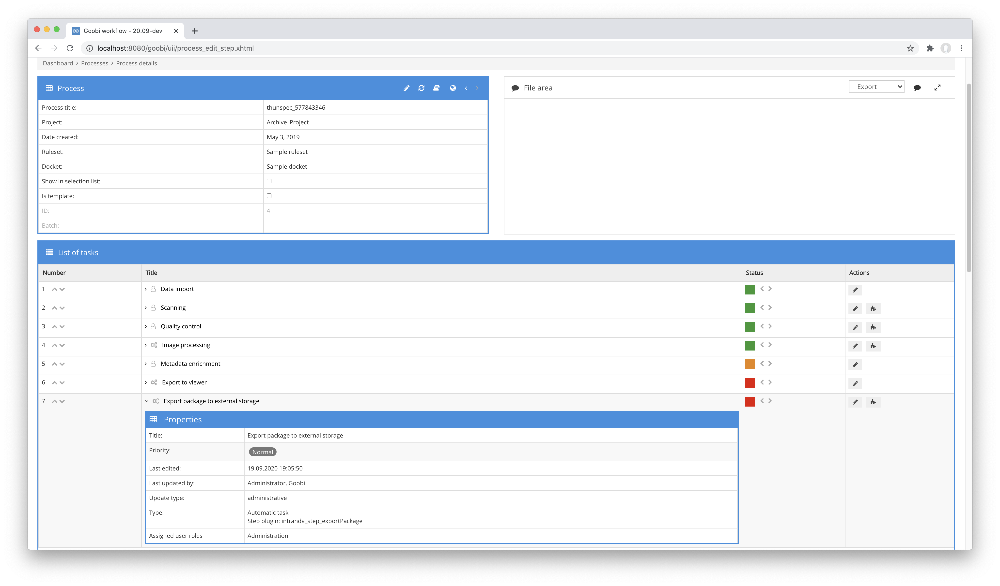
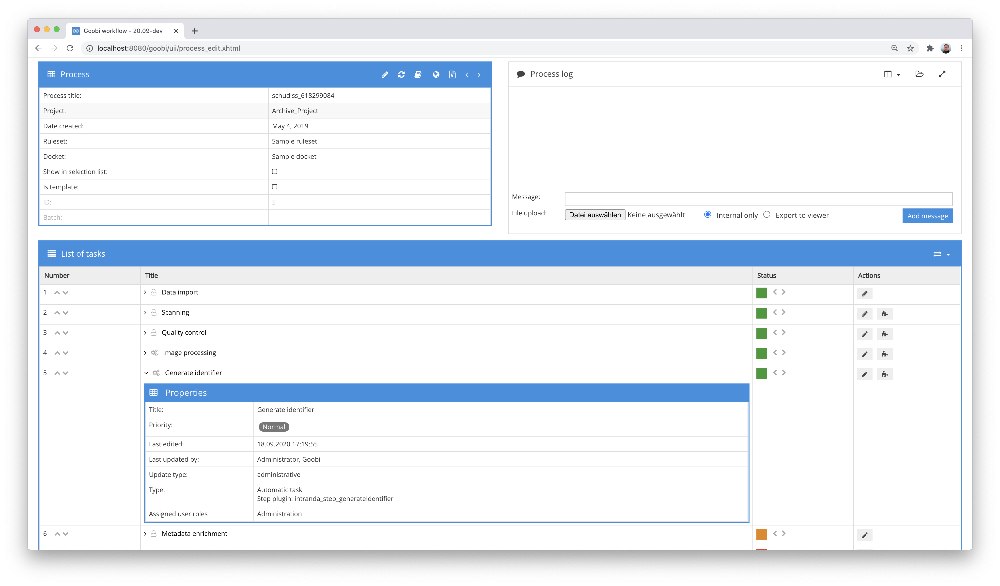
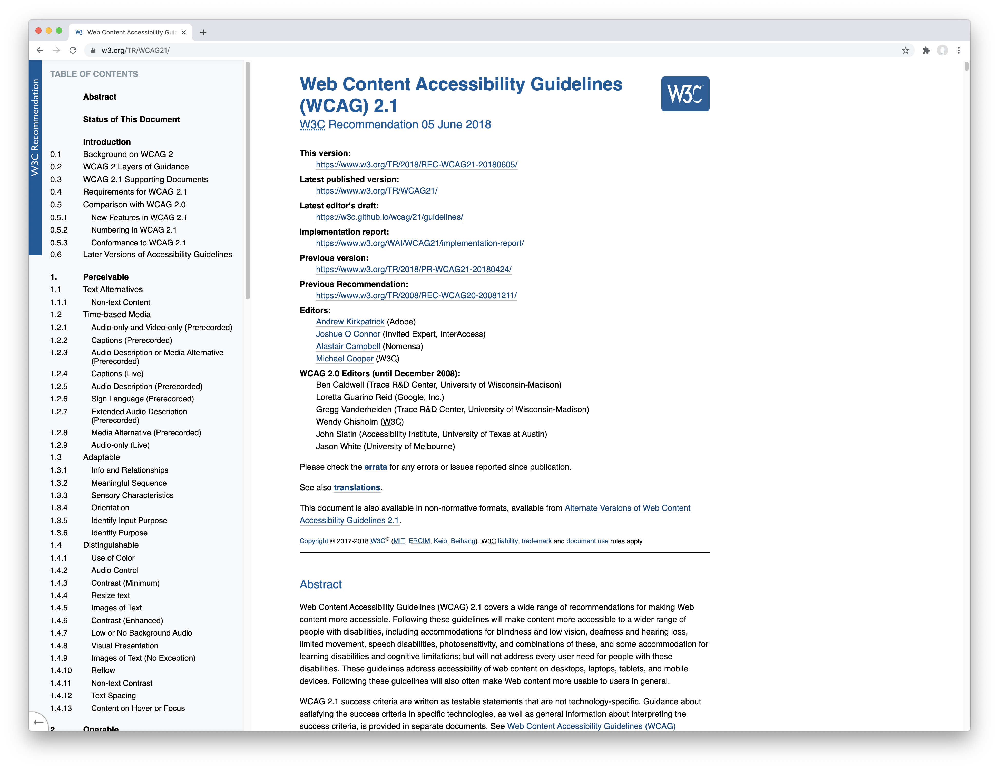
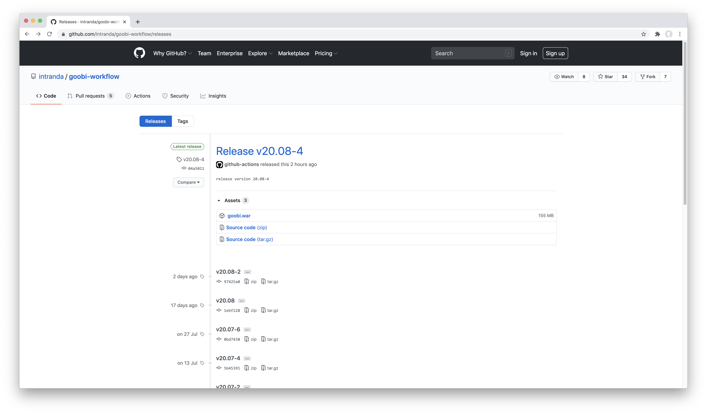

# September 2020

## Coming soon

* Completion of the tectonics editor
* Extension of the manuscript editor with provenance information
* Implementation of a multi-process editor

## Implementation of a tectonics editor

Data management within archives is fundamentally different from that of libraries. In particular the very hierarchical metadata acquisition is to be mentioned here, which results in the fact that hardly any metadata are available on the level of the object to be digitised. Instead, the metadata of the nodes of the so-called tectonic tree, which are arranged hierarchically above, play a decisive role here.



We are currently implementing a tectonics editor to enable smaller archives in particular to record their tectonics directly in Goobi workflow on the basis of an open source infrastructure and at the same time record the metadata in accordance with the ISAD(G) standard.



The user interface views shown here are still mockups. The implementation is already in progress. However, it hasn't been completed in September yet, so we will continue working on it next month and will be able to show actual screenshots and the corresponding documentation.

## Extension of the metadata library UGH for better support of corporations

Within the German-speaking user community, the desire was repeatedly expressed that Goobi worklow should offer better support for corporate bodies. This development has now been tackled in a collaborative manner. A large part of this work has already been carried out this month, primarily on the basis of the UGH metadata library that works in the background. A second part of the development is still pending, but will follow next month. At that time, visual changes will also be visible within the Goobi user interface, which will be based on current developments.

## GoobiScripts metadataChange and metdataTypeChange renamed to metadataChangeValue and metadataChangeType

The GoobiScripts metadataChange and metdataTypeChange, which are still quite new, have been renamed once again to make them more intuitive to use. The new names for these are now as follows:

| Name                  | Description                                                                                                                                                                             |
| --------------------- | --------------------------------------------------------------------------------------------------------------------------------------------------------------------------------------- |
| `metadataChangeValue` | This GoobiScript allows you to change values within an existing metadata (e.g. the previous value `NY` within the metadata `place of publication` is replaced by the value `New York`). |
| `metadataChangeType`  | This GoobiScript keeps the value of the metadata unchanged. However, it changes the type of metadata (e.g. `main title` becomes `description`)                                          |

We also took the opportunity to update the GoobiScript documentation within the Goobi Manual. It can be found at the following addresses:


https://docs.goobi.io/goobi-workflow-en/manager/7/7.4#goobiscript-metadatachangevalue



https://docs.goobi.io/goobi-workflow-en/manager/7/7.4#goobiscript-metadatachangetype




[https://github.com/intranda/goobi-workflow/commit/0b0fb555cf35d95ea80f8020dc9c30e22b72f69a](https://github.com/intranda/goobi-workflow/commit/0b0fb555cf35d95ea80f8020dc9c30e22b72f69a)

## Step plugin for generic export and XSLT processing

In most cases, Goobi workflow is used at the end of the workflow to export the processes in the form of a METS file together with the digitised material as a derivative and display it online. The export of full-text results is often included in this process. If, on the other hand, master images, the internal metadata file or other data are to be exported in addition to the derivatives, Goobi workflow's standard export function reaches its limits. We have therefore developed a new generic export plugin that can be used repeatedly, even within a workflow, but which can also behave differently.



For each step within the workflow that wants to use this plugin, it can be individually defined how the export should be done. It can be controlled which image folders are to be exported, whether full texts are to be exported, whether selected other folders are to be considered for the export and where the whole thing is to be written to. Furthermore, the plugin also exports the internal METS file and the standard export METS file. For both METS files it can be defined whether they should be processed further by an XSLT transformation, for example to create another data format from them.

Such a configuration looks like the following example:

```markup
<config_plugin>
    <config>
        <!-- which projects to use for (can be more then one, otherwise use *) -->
        <project>*</project>
        <step>*</step>

        <!-- export path -->
        <target>/opt/digiverso/export/</target>

        <!-- which image folders to use (master|media|jpeg|source|...) -->
        <imagefolder>master</imagefolder>
        <imagefolder>media</imagefolder>

        <!-- which additional folders to use -->
        <ocr>false</ocr>
        <source>false</source>
        <import>false</import>
        <export>false</export>
        <itm>false</itm>
        <validation>false</validation>

        <!-- if the internal METS file shall get transformed into another file define the path of the xsl file here -->
        <transformMetaFile>true</transformMetaFile>
        <transformMetaFileXsl>/opt/digiverso/goobi/xslt/export_meta.xsl</transformMetaFileXsl>
        <transformMetaFileResultFileName>xslt_result_meta.xml</transformMetaFileResultFileName>

        <!-- if the METS file shall get transformed into another file define the path of the xsl file here -->
        <transformMetsFile>true</transformMetsFile>
        <transformMetsFileXsl>/opt/digiverso/goobi/xslt/export_mets.xsl</transformMetsFileXsl>
        <transformMetsFileResultFileName>xslt_result_mets.xml</transformMetsFileResultFileName>
    </config>
</config_plugin>
```

With this generic plugin almost any export can be implemented. If the standard METS export is not sufficient, this plugin can be used to quickly create an individual solution.

The detailed documentation of the plugin can be found at the following URL:


https://docs.goobi.io/goobi-workflow-plugins-en/step/intranda_step_exportPackage


The source code of the plugin itself is available at the following URL


https://github.com/intranda/goobi-plugin-step-exportPackage


## Step plugin for selective content deletion

In order to be able to automatically delete certain contents of a process during the workflow, no plugin existed until now. Instead, we had helped ourselves in the past by implementing bash scripts. The new Delete Content plugin takes over this work from now on.

Like almost all step plugins, this one can be used repeatedly within a workflow and take over different tasks. Exactly which content is to be deleted in each case is controlled via a central configuration file. In this file it can be defined, for example, that the master images should be kept, but the derivatives and METS files should be deleted. This also controls whether the entire processes should be deactivated after deletion.

More details about the possibilities and configuration of the Delete Content plugin can be found in the documentation here:


https://docs.goobi.io/goobi-workflow-plugins-en/step/intranda_step_deletecontent


Der Quellcode des Plugins ist unter folgender URL verfügbar:


https://github.com/intranda/goobi-plugin-step-deleteContent


## Step plugin for identifier generation

From time to time there is a need to generate identifiers that are not yet available and that should be stored within the METS file. With the Generate Identifier plugin, such identifiers can be easily generated in the workflow and saved in a desired metadata field of the METS file. Here it can be defined whether a possibly already existing identifier should be overwritten or only generated in case of a missing metadata. It can also be determined how the identifier should be designed. At present, UUIDs, timestamps and random numbers with configurable length are available.



As usual, more information about the plugin can be found in the online documentation:


https://docs.goobi.io/goobi-workflow-plugins-en/step/intranda_step_generateidentifier


The source code of the plugin is available at the following URL:


https://github.com/intranda/goobi-plugin-step-generateIdentifier


## Reorder Step plugin extended

In many cultural institutions, book objects are not digitised in their completely opened state, so that often the left and right pages of a book do not follow each other alternately. Instead, such books are sometimes digitised in such a way that a book is turned over from the front and only the right pages are included. This is followed by a second pass, in which the book is flipped through from the back and only the left pages are recorded. With the Reorder-Images plugin, such pages can be automatically put in the correct order. A configuration can be used to control how the sorting is to proceed and whether the images are to be renamed within the same directory or copied to another directory. With the latest developments it is possible to specify specific parts of file names which should not be affected by the sorting process and which should be inserted in a fixed order after the sorted files.


As usual, more information about the plugin can be found in the online documentation:


https://docs.goobi.io/goobi-workflow-plugins-en/step/intranda_step_reorder_images


The source code of the plugin is available at the following URL:


https://github.com/intranda/goobi-plugin-step-reorder-images


## Accessibility for the METS-Editor and first plugins

Work on the METS Editor has progressed diligently in order to comply with WCAG 2.1 accessibility requirements. With the help of two automated validations, we were able to eliminate the individual complaints step by step in order to comply with WCAG at level AA. With the help of a university library, we were also able to carry out tests with a screen reader. In addition to the METS editor, we have now also revised the first plugins for Goobi workflow to improve accessibility. This includes the following plugins:

| Plugin         | Explanation                                                                                   |
| -------------- | --------------------------------------------------------------------------------------------- |
| FileUpload     | Plugin for the upload of master images, digital copies or other files within a task           |
| ImageQA        | Plugin for performing quality control of digitised material directly in the browser interface |
| Dashboard      | Plugin to generate content for the dashboard that most Goobi installations use for your users |
| JSON-Opac      | Opac plugin for retrieving data using the JSON format                                         |
| Statistics     | Standard statistics plugin that has been put into operation in most Goobi installations       |
| Replace images | Plugin to replace previously generated placeholder images                                     |

The specifications on how web applications also have to guarantee accessibility can be found at the following URL:


https://www.w3.org/TR/WCAG21/




Please note that these specifications may also be binding for your Goobi installation. You can find out more at these addresses:


https://de.wikipedia.org/wiki/Web_Content_Accessibility_Guidelines



https://en.wikipedia.org/wiki/Web_Content_Accessibility_Guidelines



https://wikis.ec.europa.eu/display/WEBGUIDE/01.+Accessibility+overview


[https://github.com/intranda/goobi-plugin-step-fileupload/commit/397702fef2225c46bc01a4ab4ec953f8542d7967](https://github.com/intranda/goobi-plugin-step-fileupload/commit/397702fef2225c46bc01a4ab4ec953f8542d7967)

## Automatically compiled releases on GitHub

For many months now, we have been releasing at least one stable version of Goobi workflow every month as a new release and combine this with the monthly digest. Following a major change to the infrastructure for compiling the application and the plugin, the automatic deployment of the compiled application no longer worked properly. This is now corrected. Under the following URL you can view and track the published releases of each month:


https://github.com/intranda/goobi-workflow/releases




And the latest stable version of Goobi workflow can always be downloaded from this URL:


https://github.com/intranda/goobi-workflow/releases/latest


## Preparations for the Goobi User Meeting 2020

As in previous years, a large German-speaking user meeting of Goobi users and developers was held. Although this year's event was held in purely digital form, a similar amount of work was required to prepare presentations in the run-up to the event. Among other things, small visual refinements were again corrected in numerous places, layouts and translations were adapted, documentation was added or completely rewritten and published, and additional plugins were released on GitHub. All these numerous minor changes are also reflected within the application and its daily use.