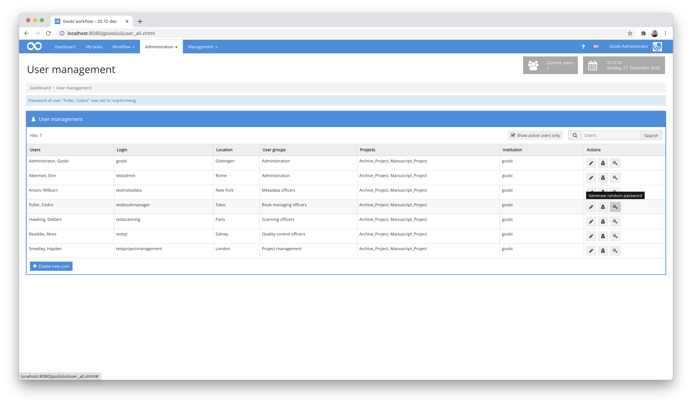

# October 2020

## Coming soon

* Extension of single sign-on support
* Implementation of checksum comparisons for exports
* Completion of accessibility work according to WCAG
* Swagger support

## Workflow plugin for exporting a complete project

In the context of a project, it was required that individual processes should not be exported at the end of their workflow. Instead, it was required that a Goobi project be exported as a whole, so that an entire Excel file should be generated for all the processes of a project to be exported and the associated images saved in directories. In addition, the entire export should finally be available for download.

With a newly developed workflow plugin, this way of working is now possible. And as long as all processes of the project have also completed a configured workflow step, the plugin completes the likewise configured export step within the workflow, so that the workflow has a correct status progress.

Please note that the plugin with the very specific specifications of the Excel export may not necessarily be able to be used unchanged for other projects. Depending on the project goal and Goobi installation, adjustments to the plugin may be necessary for other application scenarios.

The detailed documentation of the plugin can be found at the following URL:


https://docs.goobi.io/goobi-workflow-plugins-en/workflow/intranda_workflow_projectexport


The source code of the plugin itself is available at the following URL:


https://github.com/intranda/goobi-plugin-workflow-projectexport


## Step Plugin for editing selected metadata

Editing metadata should not be accompanied by entering the METS Editor in every use case. For some uses, a simplified interface is already sufficient here. For this reason, we have developed a new plugin that allows defined metadata to be edited directly within an open task. A configuration file can be used to define which metadata are to be displayed in which task and in which form they are to be editable (e.g. as a checkbox, input field, text area, dropdown).

In addition to editing the metadata, the plugin also allows a pure visual control of the data, so that the fields can be displayed as readonly. In addition, the representative of the process can also be set directly in the interface.

The editable metadata can also come from a configured vocabulary and thus be offered in a selection list. And in the event that metadata of another process is to be taken over, it is possible to search directly for the desired processes (e.g. for those with the same identifiers) and to reuse individual or all metadata from these.

The detailed documentation of the plugin can be found at the following URL:


https://docs.goobi.io/goobi-workflow-plugins-en/step/intranda_step_metadata_edition


The source code of the plugin itself is available at the following URL:


https://github.com/intranda/goobi-plugin-step-metadata-edition


## New statistics plugin for the evaluation of translations

In the context of a Hebrew- and an Arabic-language project, the requirement arose that the multilingual metadata be entered by translators. The particular difficulty here was to keep track of progress. For this reason, a new statistics plugin was developed that prepares this information in tabular form and offers it for download.

A detailed documentation of the plugin can be found published here:


https://docs.goobi.io/goobi-workflow-plugins-de/statistics/intranda_statistics_sudan_memory


The source code of the plugin itself is available at the following URL:


https://github.com/intranda/intranda_statistics_sudan_memory_activity_by_user


## Better password reset

We found the previous mechanism for resetting passwords less than ideal. Therefore, we have revised this area once. From now on, an administrator no longer has to switch to the user's role in order to change the user's password. Instead, this can now be done directly from the administration area for users.

To access this new function, the administrators' user group must have the new user role `Allow setting of a new password`.

In this context, we have also made a change for changing your own password. From now on, it is necessary to enter the old password before a new password can be set.

## Extension of the LayoutWizzard for background formatting

With the plugin `LayoutWizzard` many optimisations of digital copies can be automated very efficiently. First and foremost, it is used for (semi-) automatic cropping of digitised single or double pages from books, as explained in detail in its documentation here.:


https://docs.goobi.io/goobi-workflow-plugins-en/step/intranda_step_crop


Within the framework of a project, further requirements arose that the LayoutWizzard should also fulfil. Pages should not only be recognised from their background, straightened and trimmed. Rather, the background should be cleaned of irregularities. Black sponge rubber mats, as often used during digitisation, with slight discolouration, lint or other structures can be given a darker black tone more evenly in this way. The following example shows the difference between activated and non-activated background processing:

## Extension for operation under Docker: Use of configuration files from mounted directory

Since Goobi workflow is increasingly also being operated under Docker, new requirements also arise here with regard to commissioning. Specifically, the need arose for existing configuration files to be automatically copied from a mounted directory to the configuration directory `/opt/digiverso/goobi/config/` when the Docker container is started. This functionality has now been implemented so that from now on individual configuration files can be maintained independently of the Docker image.

The Docker version of Goobi workflow can be found as usual at the following URL:


https://hub.docker.com/r/intranda/goobi-workflow
