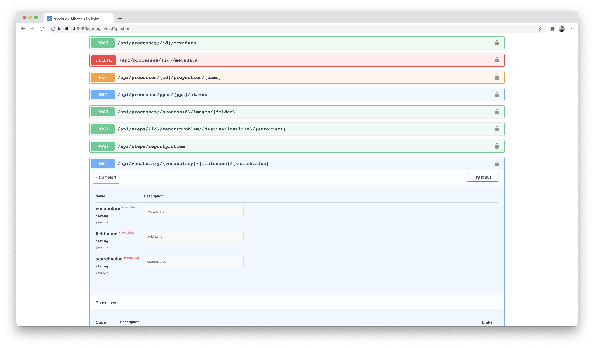

# November 2020

## Coming soon

* Final work on the archive management plugin
* Extension of the Flex editor for provenances
* Extension of the vocabulary management

## New single sign-on authentication for users based on HTTP headers

Goobi workflow has supported various authentication methods for some time, including authentication using OpenID. Now, another very generic solution has been added, which evaluates HTTP headers of a request. This implementation has the great advantage that it can be used for many different scenarios, since the actual authentication can be left to external Apache modules. In this way, for example, authentication by means of a CAS is possible.

In order to provide a better overview of the different types of user authentication, we have created a new section in the documentation that lists the different configurations. The documentation can be found here:


https://docs.goobi.io/goobi-workflow-en/admin/10


Neben der Authentifizierung über die Datenbank, eine Anbindung an LDAP-Server und Active Directory, OpenID ist damit nun auch eine Anbindung an zahlreiche weitere Single-Sign-On-Systeme möglich.

[https://github.com/intranda/goobi-workflow/commit/a30441e78bf7e7f2e6aebc08f94d8d4aac43f87f](https://github.com/intranda/goobi-workflow/commit/a30441e78bf7e7f2e6aebc08f94d8d4aac43f87f)

## Metadata Editor: Thumbnail Navigation revised

The navigation for the display of thumbnails in the metadata editor has been revised. From now on, the navigation buttons are fixed in the upper area and remain visible even when scrolling down.

In addition, when switching from the large image view to the thumbnails, the system now scrolls directly to the currently selected image. This saves searching for the last image used in the future.

[https://github.com/intranda/goobi-workflow/commit/d5d020e1d1ddac3642f570c5534743298a0968fa](https://github.com/intranda/goobi-workflow/commit/d5d020e1d1ddac3642f570c5534743298a0968fa)

## Inclusion of Swagger UI as interface description

A description for the Goobi REST API is now available using `Swagger UI`. This is a very common interface description that allows developers to try out the REST API of Goobi workflow with their own commands and thus implement a connection of external applications to Goobi workflow.

More information about the possibilities offered by interface documentation via Swagger can be found here:


https://swagger.io/


This new interface description can be accessed within Goobi workflow via the Administration menu and from here immediately allows interactive testing of individual commands directly in the web browser:

[https://github.com/intranda/goobi-workflow/commit/ec286ee1268a9316199b4f3097c20fc255cafedc](https://github.com/intranda/goobi-workflow/commit/ec286ee1268a9316199b4f3097c20fc255cafedc)\
[https://github.com/intranda/goobi-workflow/commit/31e0496783d0b24870861aca3ddc8b535f60b0b4](https://github.com/intranda/goobi-workflow/commit/31e0496783d0b24870861aca3ddc8b535f60b0b4)

## Final work on accessibility for the user interface

The topic of accessibility has been with us for several months now and is proving to be very time-consuming. Nevertheless, we have now been able to achieve our ambitious goal of successful validation by means of two well-known browser plugins that check websites for compliance with the WCAG guidelines at level AA.

Especially the revision of the user interface for the metadata editor turned out to be quite complex. In addition to the typical requirements regarding colour contrasts, icons and help texts, we also took another look at the tab sequences, among other things.

The issue of accessibility is not finished for us with this work. We will continue to routinely check the user interfaces and will certainly have to adjust some plugins in this context. With the work described here, however, we have reached an enormous milestone for a accessible user interface for Goobi workflow.

[https://github.com/intranda/goobi-workflow/commit/edb97cdd94ee298894452926ad2240273f1d9a48](https://github.com/intranda/goobi-workflow/commit/edb97cdd94ee298894452926ad2240273f1d9a48)

## New plugin for registration of unique identifiers: OID

Within a project, the requirement arose that the entire digitised object as well as each associated file had to be provided with its own identifiers, which were queried by a central service and subsequently had an influence on the naming of the files as well as being stored within the METS file. For this purpose, we have developed a new plugin, the OID-Creation-Plugin, and documented its installation and configuration here:


https://docs.goobi.io/goobi-workflow-plugins-en/step/intranda_step_oid_creation


The source code for the plugin can be found as usual on GitHub published here:


https://github.com/intranda/goobi-plugin-step-oid-creation


## Extension of the package export plugin for the use of OID identifiers

In order for the OID identifier generation procedure described here to be used for the further workflow, the package export plugin also had to be extended.


https://docs.goobi.io/goobi-workflow-plugins-en/step/intranda_step_exportpackage


This has been extended to support OID, the generation of UUIDs as well as for a validation of previously generated checksums for the individual image files.

## Extension of the Excel plugin to use multiple identifiers

In the context of the development of the [JSON-Opac-Plugin](https://docs.goobi.io/goobi-workflow-plugins-en/opac/intranda_opac_json), Goobi was equipped for the first time with a function that allows a dataset to be queried and imported from the source system using more than just a single identifier. The Excel import plugin has been extended to enable this functionality for mass import using Excel files. In this context, the documentation of the plugin was also updated to describe such a use case there as well:


https://docs.goobi.io/goobi-workflow-plugins-en/import/intranda_import_excel


[https://github.com/intranda/goobi-plugin-import-excel/commit/5cc58b6b9e52ae9fb4e0b7941bbc811037335ff9](https://github.com/intranda/goobi-plugin-import-excel/commit/5cc58b6b9e52ae9fb4e0b7941bbc811037335ff9)

## New plugin for transcribing content on images

We have developed a new plugin for transcribing content on images. It is still manageable in terms of its range of functions and does not yet allow the recording of coordinates for words or letters. It does, however, allow existing plaintext full texts to be edited or to be captured from scratch.

The way the plugin works is that it allows full text to be recorded page by page, so that a transcription is made for each digital record individually. The transcription is done by means of a rich text editor and allows some basic format adjustments. Due to the use of the very popular editor [`TinyMCE`](https://www.tiny.cloud/), further formatting can also be allowed quite easily if required.

A detailed documentation of the new plugin can be found at this URL:


https://docs.goobi.io/goobi-workflow-plugins-en/step/intranda_step_transcription


The source code for the plugin has been published on GitHub here:


https://github.com/intranda/goobi-plugin-step-transcription


## Bugfix: Inverted commas in project names

If a project title contained a single inverted comma (`'`), its processes could not be opened and edited correctly. This error has been fixed.

[https://github.com/intranda/goobi-workflow/commit/56d26b9752571dc34d2a0633768a9c0f2e4bd388](https://github.com/intranda/goobi-workflow/commit/56d26b9752571dc34d2a0633768a9c0f2e4bd388)\
[https://github.com/intranda/goobi-workflow/commit/eb8a238b6af0088c64c73ffc72918c8d199f2cef](https://github.com/intranda/goobi-workflow/commit/eb8a238b6af0088c64c73ffc72918c8d199f2cef)