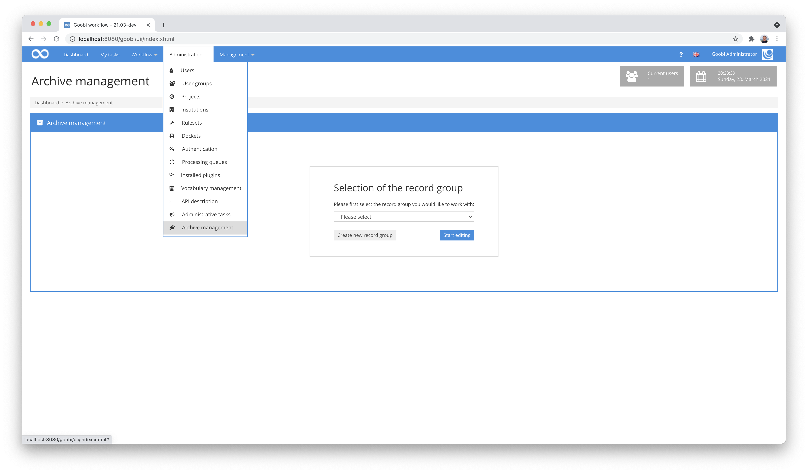
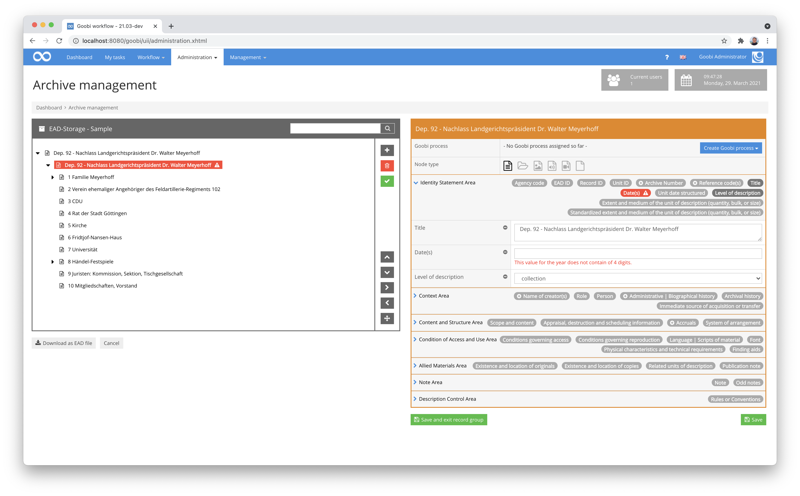
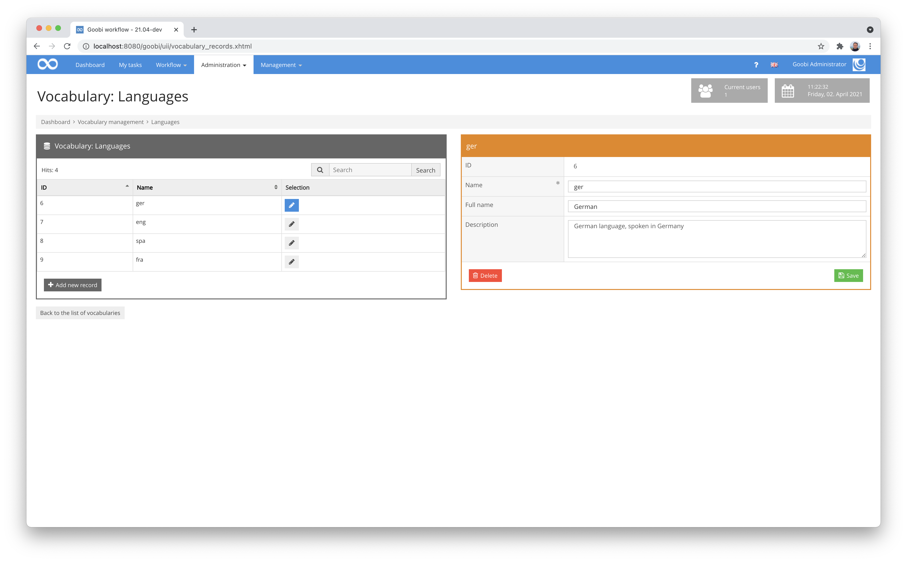
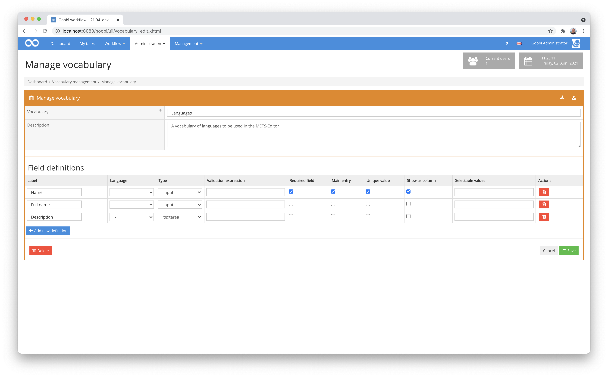
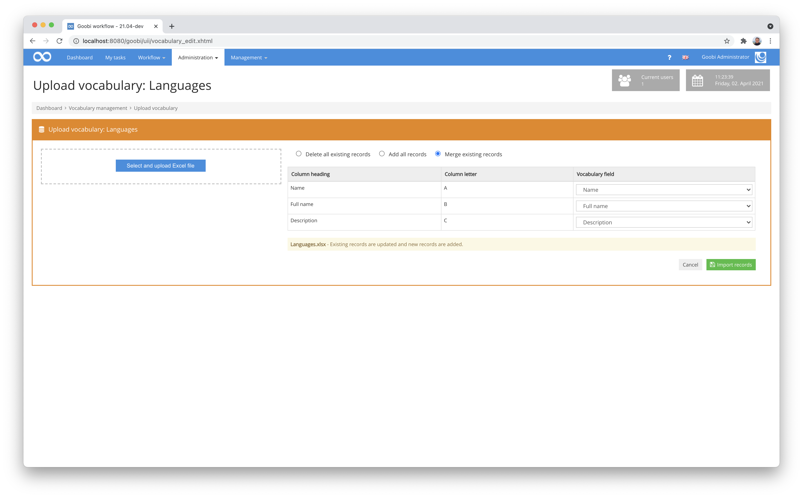
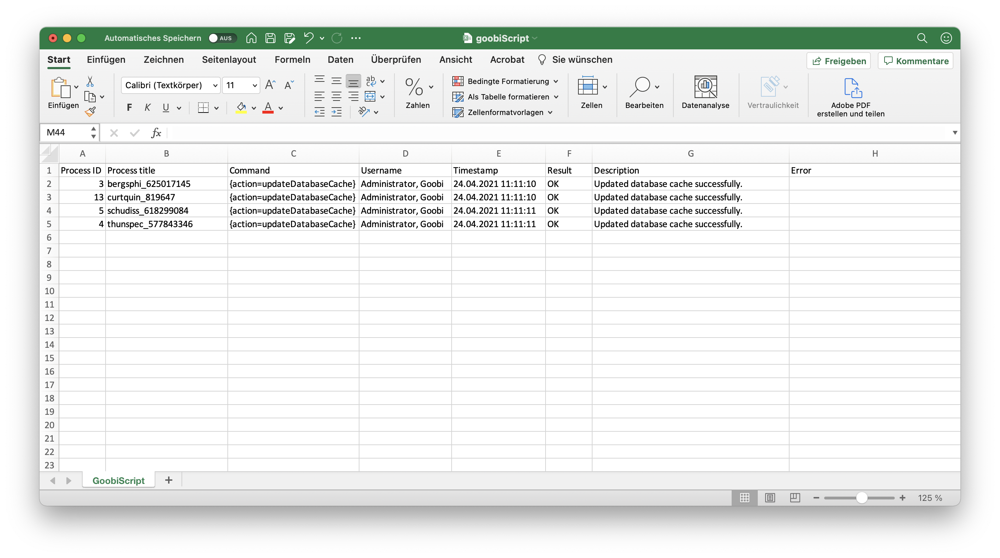
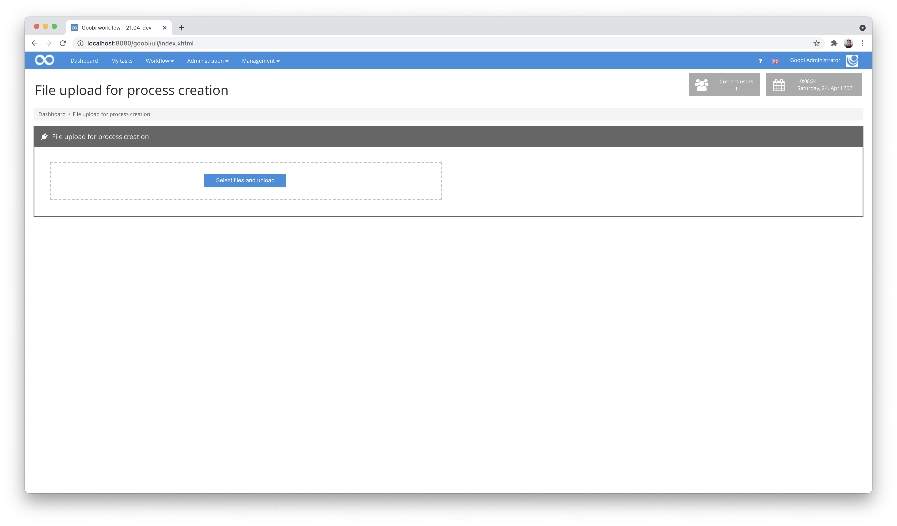

# December 2020

## Coming soon

* Extension of LayoutWizzard functionalities
* Extension of the documentation for many existing plugins
* Implementation of metadata transfer from images
* Extension for handling corporate bodies

## New plugin for recording archival material

Over the course of several months, we have developed a comprehensive new plugin for processing archival records. This plugin allows the capture of metadata for very extensive archive holdings within EAD files. It not only allows existing extensive archive holdings to be processed and selectively digitised. It also allows data to be entered as new holdings.



Internally, the objects, their metadata and the hierarchy of the objects among each other are stored in a standardised EAD file, which can also be downloaded from the web interface at any time.

For each node within the fonds, the metadata are subdivided into different areas (`identification`, `context`, `content and internal order`, `access and use conditions`, `related documents`, `annotations`, `directory control`) according to the ISAD(G) standard and, thanks to the intensive cooperation with the MNHA in Luxembourgh, are also immediately available in German, English and French.



The structure of the entire tree can be changed very easily from the plugin's interface and individual nodes of even extensive stocks can be searched quickly. For the user interface, we have again resorted to the display of so-called badges. They allow a quick overview of the possible and also already used metadata per area of each node. In addition, the freely configurable validations highlight very clearly the points in the metadata where adjustments may still be necessary.

The detailed documentation of the plugin can be found at the following URL:


https://docs.goobi.io/goobi-workflow-plugins-en/administration/intranda_administration_archive_management


The source code of the plugin itself is available at the following URL:


https://github.com/intranda/goobi-plugin-administration-archive-management


## Visual overhaul of the Vocabulary Manager and enabling search

The Vocabulary Manager has been used quite a lot since its release, first as a plugin and then as a core component of Goobi workflow. There are already early Goobi users, with several thousand records per vocabulary. However, it was also noticed that the handling of the vocabularies was not yet optimal, especially with large data sets. Therefore, we have now implemented a tabular display of the data records in the left-hand area, which allows sorting and searching in the columns. All in all, the operation of the vocabularies has not only become more intuitive and clearer, but also much better performing.



Within the administration of the vocabularies, it is possible to define which fields each vocabulary has, which type each of these fields should have and now also whether it should be displayed as a searchable and sortable column within the vocabulary.



[https://github.com/intranda/goobi-workflow/commit/531bb9828f210770b42571b79c215768c156d816](https://github.com/intranda/goobi-workflow/commit/531bb9828f210770b42571b79c215768c156d816)

## Faster import of vocabularies from Excel files

Often, the contents of vocabularies initially come from other systems. Therefore, the vocabulary manager has an import mechanism for Excel files. We have also made some extensions and adjustments to this mechanism. For example, in future it will no longer be possible to completely overwrite existing vocabularies but to add to them, for example if data is to be imported again at a later date.



In this context, we have also reworked the routines for importing in order to be able to import even very extensive vocabularies in a performant way.

[https://github.com/intranda/goobi-workflow/commit/59820a1832caf5149489c26443764f12830f90e9](https://github.com/intranda/goobi-workflow/commit/59820a1832caf5149489c26443764f12830f90e9)

## Pagination revised

We have once again made some changes to the pagination within the METS editor of Goobi workflow. This concerns, for example, the functionality for the creation of Roman page numbers, so that now not only capital letters (X, V, I, etc.) can be used for Roman pagination but also small letters (x, v, i, etc.).


If you hold the mouse pointer over the respective elements, the name of the associated image file is now displayed as a tooltip.


Furthermore, the display of the assigned pagination has been revised to make it more readable. This has been adapted both in the middle area of the METS editor and within the pop-up that appears when the mouse pointer is held over the structure elements in the structure tree on the left-hand side.


In this way, the pagination information has become much easier to read and can also be better distinguished from the image number.

[https://github.com/intranda/goobi-workflow/commit/c4fab02d29deec6b68de76d858b26b2a429d9e50](https://github.com/intranda/goobi-workflow/commit/c4fab02d29deec6b68de76d858b26b2a429d9e50)

## New REST API endpoint for status query of logged-in users

Whether from the terminal to check that no users are logged in before a restart, or for general monitoring: this new REST endpoint is simply practical. Under the URL `https://mygoobi.tld/goobi/api/currentusers/`, a JSON-encoded list of currently logged-in users can be queried:

```javascript
[
  {
    "user": "Engel, Detlev",
    "address": "127.0.0.1",
    "browser": "Firefox",
    "created": "14:59:02",
    "last": "14:59:11"
  },
  {
    "user": " - ",
    "address": "0:0:0:0:0:0:0:1",
    "browser": "Chrome",
    "created": "14:59:25",
    "last": "15:01:25"
  }
]
```

## Goobiscript: Excel export now also includes timestamps and user names

The Excel export of executed GoobiScripts has been slightly enhanced. It now also lists a timestamp and the name of the user who started the GoobiScript.



## New workflow plugin for creating processes based on uploaded files

A new workflow plugin has been implemented that allows a mass upload of images and automatically creates Goobi processes based on the file names used. A configuration file can be used to control which naming scheme the files have to match in order to recognise them as belonging together. It is also possible to specify which process template is to be used and as which publication type the processes are to be generated.



The detailed documentation of the plugin can be found here:


https://docs.goobi.io/goobi-workflow-plugins-en/workflow/intranda_workflow_fileupload_processcreation


The source code for the plugin can be found as usual on GitHub published here:


https://github.com/intranda/goobi-plugin-workflow-fileupload-processcreation


## Step Plugin for importing exif data as metadata

In the context of a project with a city archive, the need arose to extract metadata from image files. For this reason, we developed a step plugin that takes the first image of a process, reads selected metadata from it and transfers it to Goobi according to a configurable mapping. This then allows this information to be edited within the metadata editor and also displayed within the Goobi viewer.

How such a mapping is configured can be seen in this configuration file as an example:

```markup
<config_plugin>

    <config>
        <project>*</project>
        <step>*</step>

        <command>/usr/bin/exiftool</command>
        <field line="Object Name" metadata="TitleDocMain" />
        <field line="Keywords" metadata="SubjectTopic" />
        <field line="Special Instructions" metadata="Footnote" />
        <field line="City" metadata="PlaceOfPublication" />
        <field line="Source" metadata="singleDigCollection" />
        <field line="Copyright Notice" metadata="AccessCondition" />
        <field line="Caption-Abstract" metadata="Abstract" />
    </config>

</config_plugin>
`
```

More information about the functionality of the new plugin can be found in the documentation here:


https://docs.goobi.io/goobi-workflow-plugins-en/step/intranda_step_imagemetadataextraction


The source code of the plugin was published here:


https://github.com/intranda/goobi-plugin-step-image-metadata-extraction


## Bug fixes

There have been some minor adjustments and improvements to the core of Goobi workflow for various areas. Among others, the following areas were affected:

* When clicking on the `Cancel` button when creating facilities, a message incorrectly appeared stating that the institution name was a required field. This has been corrected.
* When editing institutions, contents of text fields were reset when the values of checkboxes were changed. This behaviour has been corrected.
* Creating new users was not always successful due to changes in authentication options and has been fixed by revision.
* The display of the processing status of message queues was incorrect in the case of deactivated message queues, so that a new login was necessary. This was also corrected.

[https://github.com/intranda/goobi-workflow/commit/2094d049b8b81b7af3ccf8d51e0b1801d273a847](https://github.com/intranda/goobi-workflow/commit/2094d049b8b81b7af3ccf8d51e0b1801d273a847)\
[https://github.com/intranda/goobi-workflow/commit/064c2c0b95d826d5d656aa11936f3e7379af9327](https://github.com/intranda/goobi-workflow/commit/064c2c0b95d826d5d656aa11936f3e7379af9327)\
[https://github.com/intranda/goobi-workflow/commit/7ef268114a40b6c2a224884fde7dcb7e2c2aa8b4](https://github.com/intranda/goobi-workflow/commit/7ef268114a40b6c2a224884fde7dcb7e2c2aa8b4)\
[https://github.com/intranda/goobi-workflow/commit/cc2cabec9d35a10a98768db66892d9e831b2abec](https://github.com/intranda/goobi-workflow/commit/cc2cabec9d35a10a98768db66892d9e831b2abec)