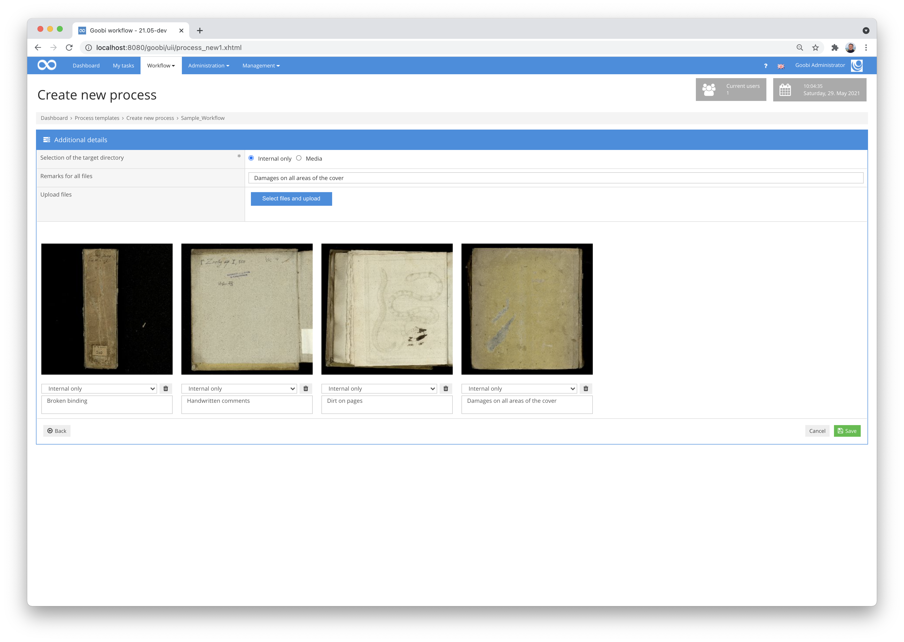
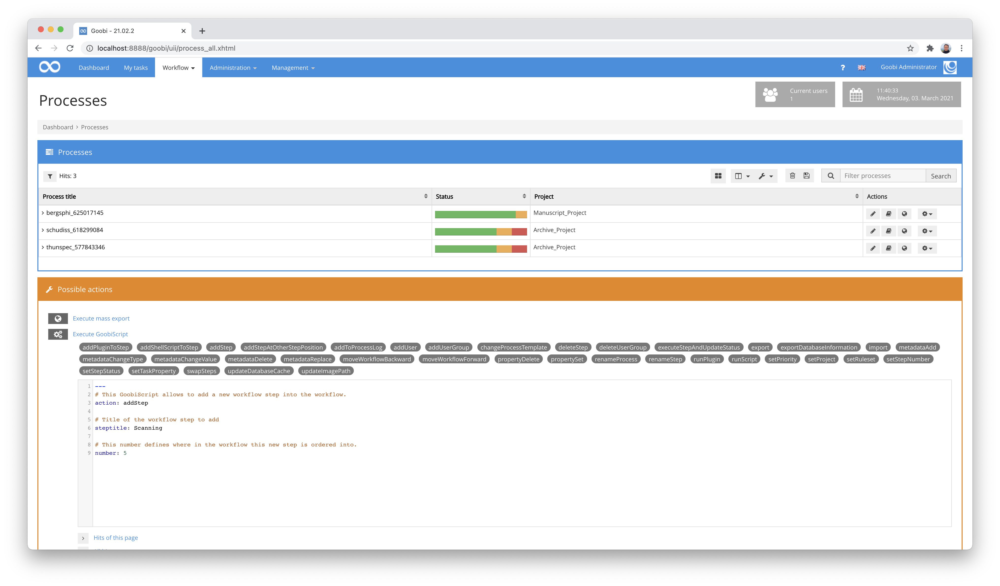

# January 2021

## Coming soon

* Flex editor for capturing handwriting and more
* Extension of rights management for individual GoobiScripts
* Enhancement of the dashboard
* Better support for corporate bodies

## New function for documenting damage before digitisation begins

Goobi workflow now has a new function for documenting damage that is already known when processes are created and is to be recorded by means of photos. This is particularly helpful when the works concerned are to be handed over to a service provider, for example, and thus the condition of the works is to be documented before handover. The photos and descriptions uploaded in this context are stored within the process log and can be viewed again at any time.

A positive side effect that has arisen as a result of the introduction of this new functionality is that from now on master images and other files can also be uploaded directly into Goobi when processes are created, without this having to happen in a separate workflow step. This should prove to be a practical innovation for small project teams in particular.

To activate this new functionality, the following block within the element `<createNewProcess>` must be defined for individual projects within the configuration file `/opt/digiverso/goobi/config/goobi_projects.xml`:

```markup
<fileupload use="true">            
    <folder regex="/^.*$/" messageKey="uploadFileErrorIntern">intern</folder>
</fileupload>
```

As soon as this function is activated, the Goobi workflow user interface adapts by no longer displaying the save button when processes are created, but instead displaying a button that leads to the next page.


If not only damage documentation is to be uploaded but also files are to be uploaded to selected folders before processes are created, the configuration can be carried out as follows:

```markup
<fileupload use="true">            
    <folder regex="/^.*$/" messageKey="uploadFileErrorIntern">intern</folder>
    <folder regex="/^.*\\.(jpg\|jpeg\|png\|tif\|jp2)$/" messageKey="uploadFileErrorMaster">master</folder>
    <folder regex="/^.*\\.jpg$/" messageKey="uploadFileErrorMedia">media</folder>
    <folder regex="/^.*\\.pdf$/" messageKey="uploadFileErrorExport">export</folder>
</fileupload>
```

If the user has clicked on the button to go to the next page, a global comment can be entered here that is to apply to all images. The files can then be uploaded.


After uploading to the selected folder, the images are displayed together with the associated commentary and saved with the process. The comments on the individual images can, of course, be individual for each image.



Please note that comments are only saved for those images that are uploaded to the folder 'internal' as damage documentation. Images that are uploaded as master images, for example, do not have the option of including a comment per file.

## Display of damage documentation within the docket

The new function for the damage documentation can be considered within the automatically generated dockets. Thereby, all uploaded images together with the associated comments are listed on the subsequent pages of the docket.


To activate this display in the docket, a block like the following should be added to the configuration files `/opt/digiverso/goobi/xslt/docket.xsl` and `/opt/digiverso/goobi/xslt/docket_english.xsl`:

```markup
<xsl:if test="goobi:log/goobi:file">
  <fo:page-sequence master-reference="A5">
    <fo:flow flow-name="xsl-region-body" font-family="opensans, unicode">

      <!-- title of process -->
      <fo:block text-align="center" font-weight="bold" font-size="11pt" margin-top="0pt">
          <xsl:text disable-output-escaping="yes">Schadensdokumentation für: </xsl:text>
          <xsl:value-of select="goobi:title"/>
      </fo:block>
      <!-- // title of process -->
      <fo:block border-top-width="1pt" border-top-style="solid" border-top-color="#cccccc" margin-top="10pt"/>

      <!-- show all images uploaded into the process log -->
      <xsl:for-each select="goobi:log/goobi:file">
        <xsl:if test="not(position() > 20)">
          <fo:block text-align="center" font-size="12pt" margin-top="10pt">
            <fo:external-graphic src="url('{@url}')" content-height="80mm"/>
          </fo:block>
          <fo:block text-align="center" font-size="9pt" margin-top="5pt">
            <xsl:value-of select="@comment" />
          </fo:block>
        </xsl:if>
      </xsl:for-each>
      <!-- // show all images uploaded into the process log -->

    </fo:flow>
  </fo:page-sequence>
</xsl:if>
```


## Compressed representative when generating the metadata PDF file.

The PDF file that Goobi can generate based on the metadata usually contains an image of the representative. This image was previously included in an uncompressed version, so that the PDF files were sometimes very large. This has now been changed so that the embedded images first run through a JPEG compression and are only embedded in the PDF file afterwards. In this context, an adjustment has also been made to the configuration of the layout of these PDF files. Accordingly, these changes must now also be taken into account in the Goobi installations during updates. Until now, this block was usually used in the configuration file `/opt/digiverso/goobi/xslt/docket_metadata.xsl`:

```markup
<!-- thumbnail on right side -->
<fo:block-container position="fixed" left="11.5cm" top="1cm">
  <fo:block>
      <fo:external-graphic src="url('{goobi:thumbnail}')" content-height="100mm"/>
  </fo:block>
</fo:block-container>
<!-- // thumbnail on right side -->
```

From now on, this block must be adjusted with regard to the image path as follows:

```markup
<!-- thumbnail on right side -->
<fo:block-container position="fixed" left="11.5cm" top="1cm">
  <fo:block>
      <fo:external-graphic src="url('{goobi:representative/@url}')" content-height="100mm"/>
  </fo:block>
</fo:block-container>
<!-- // thumbnail on right side -->
```

The encoding of the file should also be adapted so that it is changed to `utf-8`:

```markup
<?xml version="1.0" encoding="utf-8"?>
```

## Adjustment for the default docket

The standard docket of Goobi workflow also needs a change within the configuration for the correct display of the internally renamed creation date for the process. Until now, this expression was usually used in the configuration files `/opt/digiverso/goobi/xslt/docket.xsl` and `/opt/digiverso/goobi/xslt/docket_english.xsl`:

```markup
<xsl:value-of select="goobi:time"/>
```

This expression must be adapted as follows:

```markup
<xsl:value-of select="goobi:creationDate"/>
```

And also the encoding of these files should be adapted so that it is changed to `utf-8`:

```markup
<?xml version="1.0" encoding="utf-8"?>
```

## Adjustment for the batch docket

The batch docket also needs a change in the configuration for the correct display of the creation date for the processes.

The file `/opt/digiverso/goobi/xslt/docket_multipage.xsl` used to contain this value:

```markup
<xsl:value-of select="goobi:process/goobi:time" />
```

This expression must be adjusted as follows:

```markup
<xsl:value-of select="goobi:process/goobi:creationDate" />
```

Again, the encoding of the file should be adjusted to change it to `utf-8`:

```markup
<?xml version="1.0" encoding="utf-8"?>
```

## Catalogue Poller and Catalogue Request with extended functions

For some time now, Goobi has had two different plugins that allow catalogue polling to be carried out in the running workflow or even periodically, so that metadata can be imported or updated. These two plugins have been thoroughly extended once and their documentation has been adapted. A new time control has been implemented for the Catalogue Poller, which allows specifically defined datasets to be updated at configurable intervals. In addition, both the 'Catalogue Poller' and the 'Catalogue Request Plugin' have been extended so that queries can now also be made to the catalogue for sub-elements in order to update them.


How exactly the configuration must be set up in order to be able to use these new functions is explained in the respective documentation of the two plugins.

Here you can find the new detailed documentation of the Catalogue Request Plugin:


https://docs.goobi.io/goobi-workflow-plugins-en/step/intranda_step_catalogue_request


And here is the updated documentation of the Catalogue Poller:


https://docs.goobi.io/goobi-workflow-plugins-en/administration/intranda_administration_catalogue_poller


## New GoobiScript syntax (YAML)

With GoobiScript, Goobi workflow has for some time now had a mechanism to be able to modify even large lists of processes in bulk. This can include performing exports, making changes to workflow status, adding metadata within METS files and much more. Over the years, numerous GoobiScripts have been added, each with new functions, which we also explain in detail on a separate documentation page. Nevertheless, in the long run we found the structure of the commands not to be the right way, so we decided to make a major change here. Instead of the previous syntax, GoobiScript now uses the YAML language to define Goobi scripts. The structure of the commands is therefore a bit different than in the past. However, the change brings several major advantages.



On the one hand, the display of the commands now has syntax highlighting, so that reading and writing the Goobi scripts has become much clearer thanks to the formatting and colours. And secondly, all Goobi scripts now come with their own embedded documentation including examples, which is listed above each parameter. This makes it even easier to calculate how to use a specific command.

```yaml
---
# This GoobiScript allows to assign a user group to an existing workflow step.
action: addUserGroup

# Title of the workflow step to be edited
steptitle: Upload images

# Use the name of the user group to be assigned to the selected workflow step.
group: Photographers
```

Another enormous gain of the conversion to the new YAML format is that we can now also very clearly combine different Goobi scripts one after the other in the same call by listing them one after the other with the separator line.

```yaml
---
# This GoobiScript allows to add a new workflow step into the workflow.
action: addStep

# Title of the workflow step to add
steptitle: Upload images

# This number defines where in the workflow this new step is ordered into.
number: 3

---
# This GoobiScript allows to assign a user group to an existing workflow step.
action: addUserGroup

# Title of the workflow step to be edited
steptitle: Upload images

# Use the name of the user group to be assigned to the selected workflow step.
group: Photographers

---

[...]
```

The documentation supplied can also be simply removed for a better overview:


The documentation for using GoobiScript can be found here, where the operation and possibilities are explained in detail:


https://docs.goobi.io/goobi-workflow-en/manager/7/7.4


## New GoobiScript "addStepAtOtherStepPosition

A new GoobiScript has been developed that now allows new workflow steps to be better integrated into the workflow. With this command it is now possible to specify the new target position within the workflow that is still occupied by another workflow step. By calling this command, it is now possible that the new workflow step is inserted at this desired position and all subsequent workflow steps are moved to the correct positions accordingly.

```yaml
---
# This GoobiScript allows to add a new workflow step into the workflow before or after another step (defined by name).
action: addStepAtOtherStepPosition

# The new step can be executed "before" or "after" the existing step.
insertionstrategy: after

# Title of the existing workflow step
existingsteptitle: Scanning

# Title of the new workflow step
newsteptitle: Analyzing
```


The documentation for the new GoobiScript can be found here:


https://docs.goobi.io/goobi-workflow-en/manager/7/7.4#goobiscript-addstepatotherstepposition


## Use of CDI

The technical infrastructure of Goobi workflow has been changed to CDI. This change was necessary in order to be able to provide Goobi workflow with important security updates in the future. In addition, this change opens up some new technical possibilities, such as the use of websockets. With websockets, the server can proactively inform the client (i.e. the web browser) about changes. This new technology is extremely practical for longer-running tasks such as imports or the Goobi scripts, for example, to keep the user informed about progress.