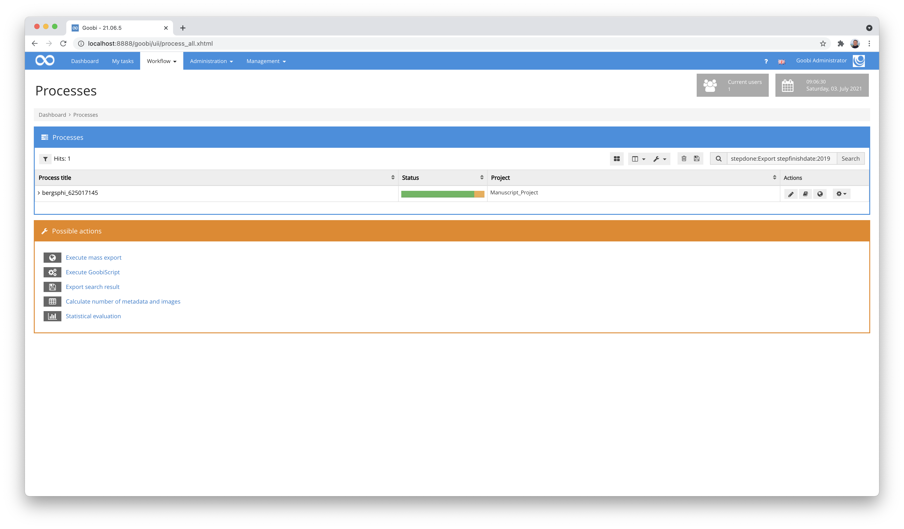
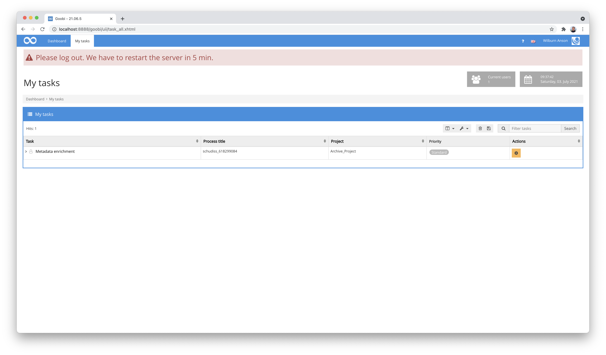
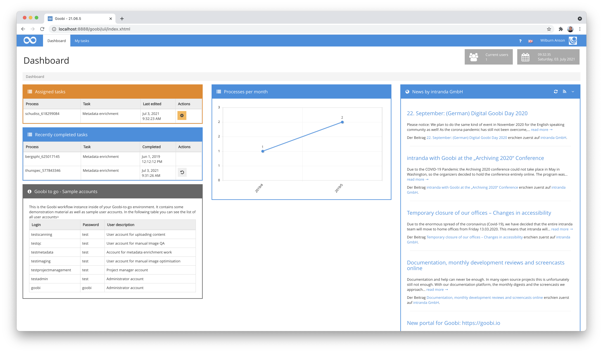
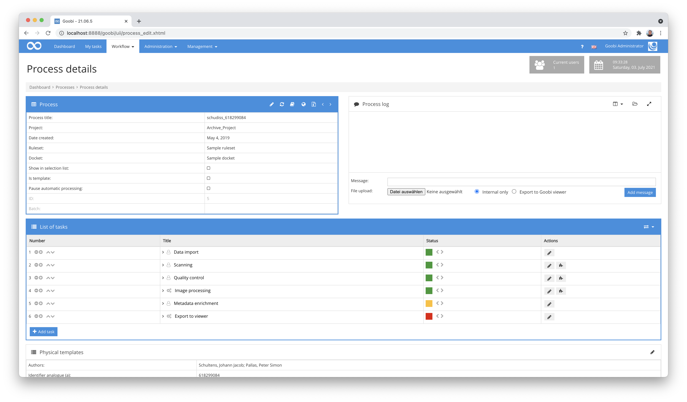
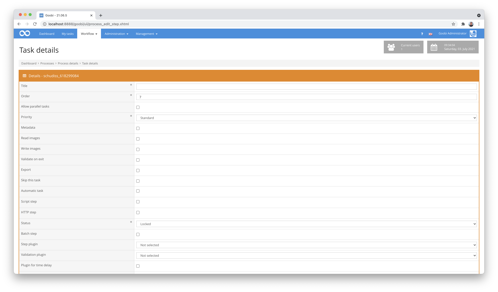
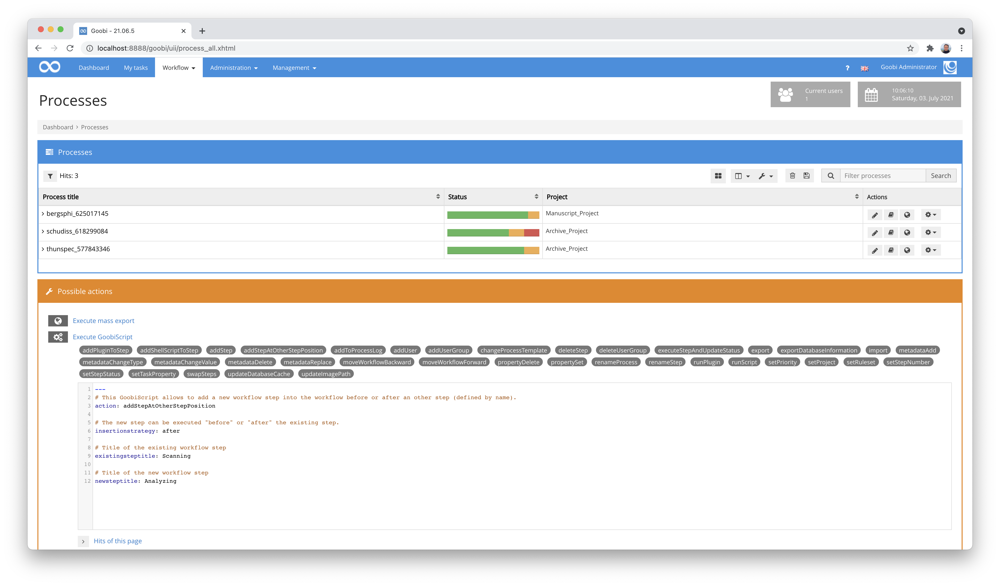

# February 2021

## Coming soon

* Extension of the processing of GoobiScripts
* New rights management for the execution of GoobiScript
* Better support for corporate bodies and metadata groups
* Flex editor for capturing manuscripts and more

## New search options for a search for processes by date

We have extended the search options so that it is now possible to find processes by their creation date. The search syntax is as follows.

```
processdate=2021
```

It is also possible to filter for processes created before or after a certain date (or even time):

```
"processdate<2020-01-01 12:00:00"
```

These new search parameters thus also allow processes to be searched for a period of time:

```
processdate>2020-01-01 processdate<2020-12-31
```

## Search for workflow steps by date

Analogous to the new search options for processes, it is also possible to filter by workflow steps. Here the distinction is between `stepstartdate` as the time of the start of processing and `stepfinishdate` for the time of the end of processing.

To filter for the end of processing, the status of a step must also be searched for in the same search query. This looks accordingly as follows:

```
stepdone:Export stepfinishdate:2019
```



The following filter searches for processes where `Scanning` and `Export` were completed in 2021:

```
stepdone:Scanning stepdone:Export stepfinishdate:2021
```

The use of the search has been adapted to the new possibilities within the documentation and can still be found at this address:


https://docs.goobi.io/goobi-workflow-en/manager/7/7.1


## Adaptation for the Change Workflow Plugin

The functionality of the Change Workflow plug-in has been extended. From now on, not only the status of tasks can be changed, but also the assignment of user groups. A configuration for this looks as follows, for example:

```markup
<config>
    <!-- which projects to use for (can be more then one, otherwise use *) -->
    <project>*</project>
    <step>*</step>

    <!-- multiple changes can be done within one configuration rule; simply add another 'change' element with other properties here -->
    <change>
      <!-- name of the property to check -->
      <propertyName>{meta.ISBN}</propertyName>
      <!-- expected value (can be blank too) -->
      <propertyValue></propertyValue>
      <!-- condition for value comparing, can be 'is' or 'not' or 'missing' or 'available' -->
      <propertyCondition>missing</propertyCondition>

      <!-- list of steps to deactivate -->
      <steps type="deactivate">
          <title>Metadata enrichment</title>
      </steps>

      <!-- user groups to assign -->
      <usergroups step="Metadata enrichment">
          <usergroup>Administration</usergroup>
      </usergroups>
    </change>
</config>
```

In addition, with this update, properties of the processes can no longer be checked for their values alone. Instead, all available values that can be expressed as variables can now be used. From the previous configurations in this form:

```markup
<propertyName>Template</propertyName>
```

such wording must now be used in the configuration files:

```markup
<propertyName>{process.Template}</propertyName>
```

Further explanations about the possibilities of the variables can be found at the following URL:


https://docs.goobi.io/goobi-workflow-en/manager/8


The updated documentation for the Change Workflow plugin can be found here:


https://docs.goobi.io/goobi-workflow-plugins-en/step/intranda_step_changeworkflow


## Plugin for automatic generation of metadata within the METS file

In several projects, the requirement arose that metadata within the METS file should be dynamically updatable. For example, it should be possible to generate metadata for hierarchically subordinate structural elements and, if necessary, enrich them with data from other structural elements or properties.

As with many other plug-ins, this plug-in has been kept quite generic and can be configured very individually depending on the purpose and workflow. Such a configuration looks like this, for example:

```markup
<config_plugin>
    <config>
        <!-- which projects to use for (can be more then one, otherwise use *) -->
        <project>*</project>
        <step>*</step>

        <!-- multiple updates can happen within one call. 
            Repeat the update blocks for each additional change -->
        <update>
            <!-- define for which field inside of the METS file the content shall be generated -->
            <field>TitleDocMain</field>

            <!-- for which structure elements shall the content be updated? 
                Multiple 'element' can be listed here. 
                Use '*' to match all structure element types. -->
            <element>Monograph</element>

            <!-- define if the content shall be overwritten if the field is not empty -->
            <forceUpdate>true</forceUpdate>

            <!-- define a list of content here to be used for the field as metadata value
                variable: this content gets analyzed and replaced by the variable replacer 
                metadata: value of the metadata field with the given name inside of the same docstruct element
                static: a static string
                random: a random number with a defined length 
                uuid: a UUID with 36 characters
                timestamp: a numeric timestamp 
                groupcounter: a separate counter for each value of 'groupField' -->
            <content type="variable">{meta.CatalogIDDigital}</content>
            <content type="metadata">DocLanguage</content>
            <content type="static">_</content>
            <content type="random">9</content>
            <content type="uuid" />
            <content type="timestamp" />
            <content type="counter">%03d</content>
            <content groupField="{meta.PublicationYear}" type="groupcounter">%03d</content>
        </update>

        <update>
            <field>DocLanguage</field>
            <element>Chapter</element>
            <forceUpdate>false</forceUpdate>
            <content type="variable">{meta.DocLanguage}</content>
        </update>

    </config>

</config_plugin>
```

In the case of this configuration example, several different data are inserted consecutively into the field 'TitleDocMain' within monographs. These are field contents from the Mets file, static values, timestamps, counters and other types. Such combinations can also be used for deeper structural elements and thus allow very flexible application possibilities.

The detailed documentation of the plugin has not been written yet and will follow soon. The source code of the plugin itself is available at the following URL:


https://github.com/intranda/goobi-plugin-step-metadata-update-field


## Websockets for notifying users

By switching to current technologies (CDI, JSF 2.3), websockets can now be used in Goobi worflow. These enable a high-performance bidirectional communication between server and browser. This means that we are now able to send messages to the user from the server side. A first use case where this is applied are the following two areas:

Administrative messages that are to be displayed to all users are now immediately displayed to all users, not just at the next reload.

The progress of GoobiScript executions is displayed live, without the need for a manual reload to update the progress bar.



## Goobi now monitors dead letter queue for external queue

When a message in a message queue repeatedly generates errors, it is marked as undeliverable and sent to another message queue, the "dead letter queue". Goobi now monitors this "Dead Letter Queue" for messages and sets the step associated with the message to error status so that a human user can view the error.

## Dashboard enhanced for backlogged tasks

The most frequently used dashboard has received a helpful enhancement. There, it is now possible for those tasks to be listed that the user completed last. In addition to the display of which tasks the user is currently working on, there is now an immediate view of the recently completed tasks.



At the same time, a frequently expressed wish was realised: Recently completed tasks that have already disappeared from the task list and have progressed further in the workflow can also be undone from the dashboard in order to process them again. However, this is only possible if the subsequent task has not already been accepted for processing by a user or started by an automatism.

## Extended logic for adjustments to the sequence of workflow steps

The mostly sequential order of workflow steps basically allows a very good overview of the sequence of tasks involved and their progress. However, we found the operation too cumbersome if the sequence of tasks should be changed or new tasks should be integrated between existing tasks of a workflow. Therefore, some major changes were made here. In the revised user interface, tasks can be moved by means of the arrow icon so that the corresponding sequence numbers of the workflow steps concerned are automatically adjusted without having to change the sequence numbers manually.



The second major innovation in this context is that new tasks to be integrated into an existing workflow are automatically given a correct sequence number, so that the new task is automatically placed correctly at the end of the existing workflow.



If, however, a sequence number is specified at this point that lies in the middle of the workflow, the already existing tasks are automatically shifted by one position each in order to insert the new task in between. However, this behaviour can also be prevented if desired, so that parallel execution of tasks is still possible.

To benefit from these new developments, this logic has also been extended to the execution of GoobiScript. For this reason, a new GoobiScript exists that allows the insertion of tasks into the workflow, taking into account the correct sequences to be changed for inserted tasks, even in bulk.



For the use of the new GoobiScript, see the relevant section within the Goobi workflow documentation:


https://docs.goobi.io/goobi-workflow-en/manager/7/7.4#goobiscript-addstepatotherstepposition
