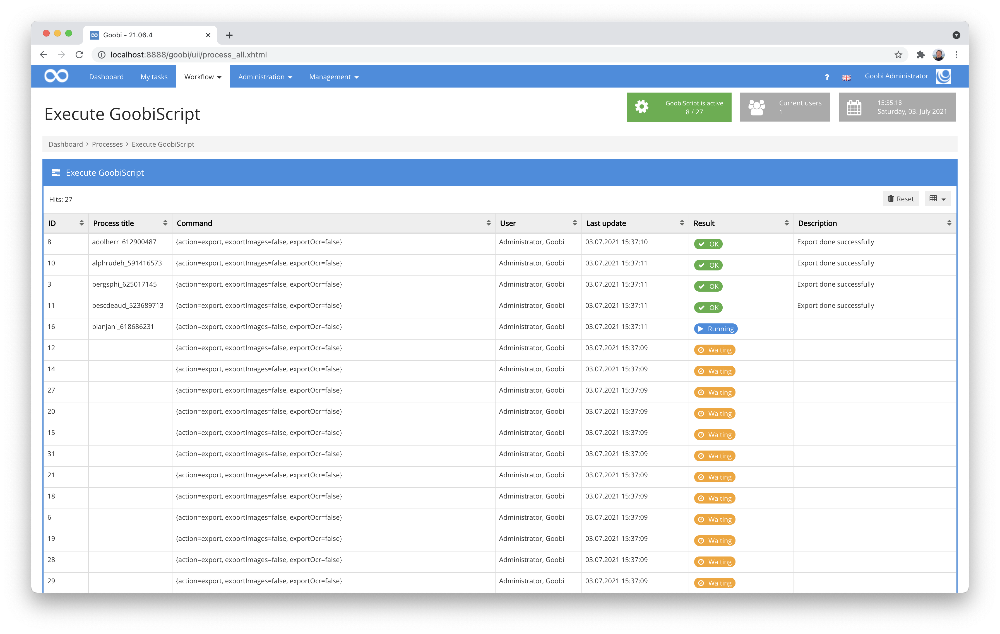
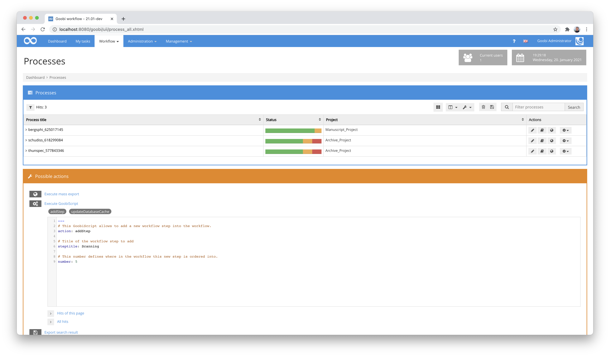
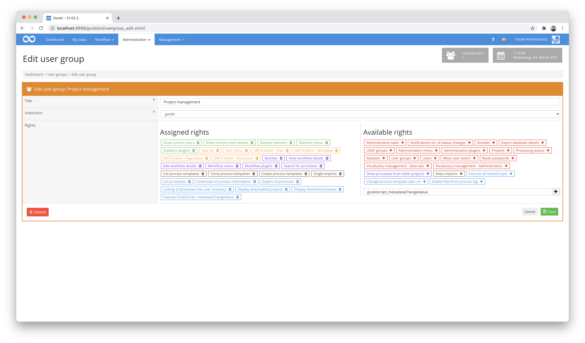
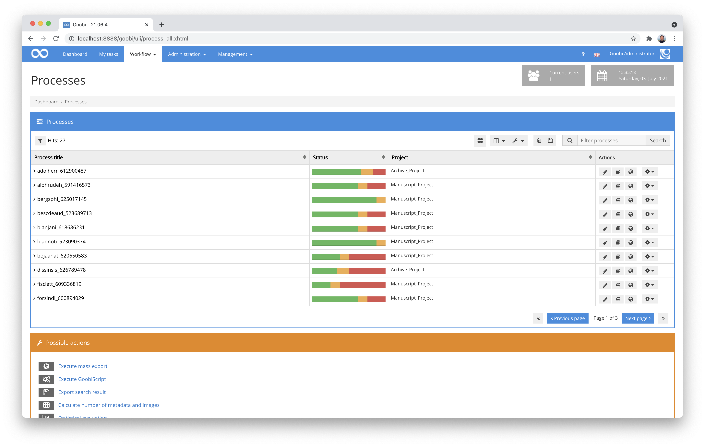
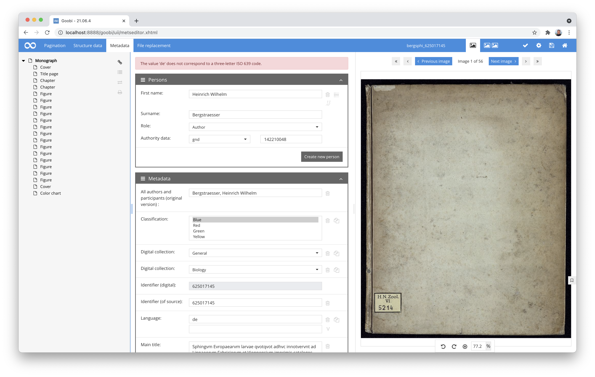
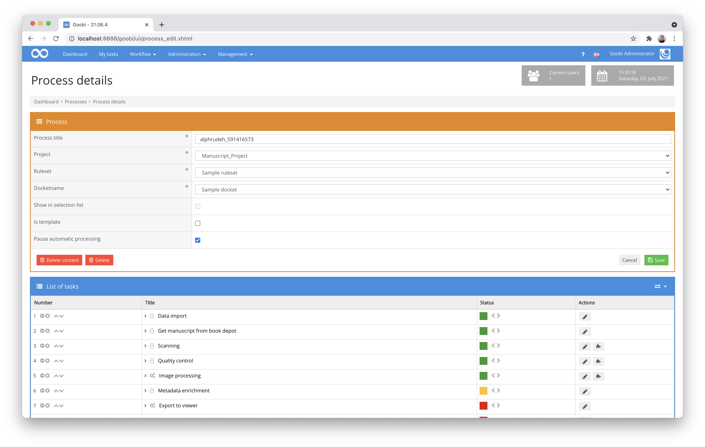
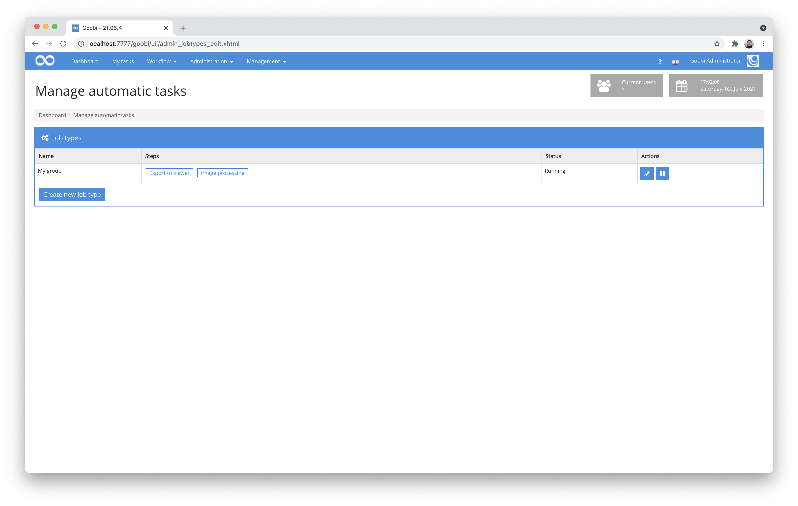
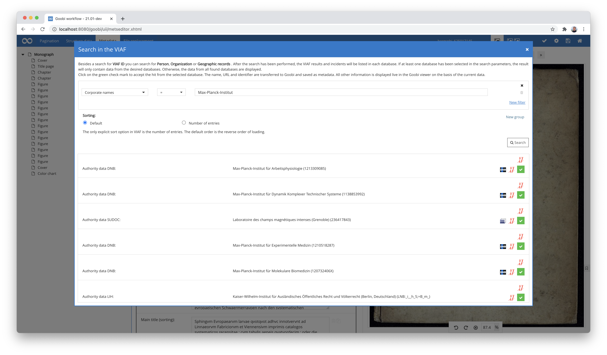

# March 2021

## Coming soon

* Extension of metadata group support
* Flex editor for capturing manuscripts and more
* New pagination type for double pages
* Markup of double pages in METS
* Support for IIIF URLs within the Variable Replacer

## GoobiScript conversion

GoobiScripts have become an indispensable part of the Goobi user's toolbox. However, although they are extremely practical and helpful, there were always problems with stuck queues or high system load when many GoobiScripts were waiting to be executed. There were also problems with parallel execution from time to time. These problems are now all a thing of the past, as the internal GoobiScript management and execution have been completely rethought and implemented. As a result, GoobiScript is now more efficient than ever before.



[https://github.com/intranda/goobi-workflow/commit/7d9306f9b644508d5a2dd292b079e4c34ee43120](https://github.com/intranda/goobi-workflow/commit/7d9306f9b644508d5a2dd292b079e4c34ee43120)

## Tiered rights for GoobiScript

Goobi workflow allows GoobiScript to perform extensive operations to influence processes, their workflows, metadata or other areas, and to apply this uniformly to thousands of processes at once. In this respect, GoobiScript is often a great help when it comes to mass changes. Unfortunately, in the past these options were only available to a very limited group of users, as GoobiScript could of course also be used to inadvertently intervene in the processes in a major way, which meant that often only administrators had access to GoobiScript.

With the new developments in the rights system of Goobi workflow, there have been some improvements in this respect, so that it is now possible to grant individual user groups selected rights for the execution of defined Goobi scripts. In this way it is possible, for example, to allow users to execute the GoobiScript for performing the export even for many processes, but not other Goobi scripts such as changing metadata or intervening in the workflow.



The configuration of these rights is kept relatively simple. Individual commands can be specifically added here in the user group area, as can be seen in the following screenshot.



The revised rights management for controlling access to GoobiScript is clearly described within the Goobi manual. You can read about it here:


https://docs.goobi.io/goobi-workflow-en/manager/6#individual-goobiscripts


By the way, we have also significantly revised the documentation of the GoobiScripts in general to better explain their execution and operation. This documentation can still be found at the following address:


https://docs.goobi.io/goobi-workflow-en/manager/7/7.4


## Improved handling for message queues

The fact that computationally intensive or time-consuming automatisms can be executed via a so-called message queue is still relatively new and brings enormous advantages, especially for larger projects, because in this way, for example, the calculations can also be distributed over several servers. What we have revised here is that tasks that got stuck during processing because one of the available queues was not accessible no longer remain in an uncertain state. Instead, they are now set to a formal error status, so that their faulty processing becomes apparent and their execution can be corrected accordingly.

[https://github.com/intranda/goobi-workflow/commit/8d7abaef78b43fd0eef26dabe67675c4fed88b1e](https://github.com/intranda/goobi-workflow/commit/8d7abaef78b43fd0eef26dabe67675c4fed88b1e)

## New step status for automatic workflow steps

A completely new step status `INFLIGHT` has been introduced. This new status is set when an automatic workflow step is to be processed on another system, is transferred there, but has not yet been picked up by the external system and is accordingly not yet processed. With this new step status, it is possible to check at any time how busy the entire system is and whether additional servers should be connected to process computationally intensive tasks.

[https://github.com/intranda/goobi-workflow/commit/47a1b3e50a122b5d5b0a1f126f98aeca9d50aead](https://github.com/intranda/goobi-workflow/commit/47a1b3e50a122b5d5b0a1f126f98aeca9d50aead)

## Accessibility: Links become buttons

For good accessibility, it is particularly important that HTML elements have the right semantics. For example, a `<a>` (a link, or **a**nchor) means that a new page is being entered and not that an action is being performed. A `<button>`, on the other hand, indicates that an action is being carried out. For historical-technical and also visual reasons, every action in Goobi workflow was previously implemented as a link. In the course of the great accessibility efforts of the last few months, we have also made major changes here. All links that actually trigger an action and are not only used for navigation have been converted into buttons.



This change should not affect the appearance of the website for the user. If there are any functional surprises because one of the numerous changes did not go smoothly, we would be pleased to receive feedback so that we can make adjustments if necessary.

[https://github.com/intranda/goobi-workflow/commit/b4170331f68491f3747dab8ff648dd793f59e608](https://github.com/intranda/goobi-workflow/commit/b4170331f68491f3747dab8ff648dd793f59e608)

## Individual validation messages for metadata

Long requested and now they are here: customisable validation messages in the metadata editor.

For the very granular controllable validation checks that can be defined within the rule sets, messages were displayed in the metadata editor in the past that were not understandable for everyone because they were too technical. With the developments in this context, these messages are now controllable and can be specified individually and multilingually within the rule sets. Within the rule sets, this looks like this, for example:

```markup
  <MetadataType>
    <Name>DocLanguage</Name>
    <language name="de">Sprache</language>
    <language name="en">Language</language>
    <language name="es">Idioma</language>
    <validationExpression>[a-z]{3}</validationExpression>
    <validationErrorMessage name="de">Der Wert muss ein dreistelliger ISO 639 Code sein. Vorgefunden wurde jedoch der Wert '{}'.</validationErrorMessage>
    <validationErrorMessage name="en">The value '{}' does not correspond to a three-letter ISO 639 code.</validationErrorMessage>    
  </MetadataType>
```

In the user interface, this message is then displayed accordingly in the event of a violation of the validation requirements, for example:



[https://github.com/intranda/goobi-workflow/commit/a279925b4aef785fcb4f0b32351823c989ace165](https://github.com/intranda/goobi-workflow/commit/a279925b4aef785fcb4f0b32351823c989ace165)\
[https://github.com/intranda/goobi-workflow/commit/8fbabedd71540ffad860d3f19b53f038908db5b7](https://github.com/intranda/goobi-workflow/commit/8fbabedd71540ffad860d3f19b53f038908db5b7)

## Local translation files are created at start-up if they do not exist

Goobi workflow has local translation files located in the configuration directory. The translations stored in these files overwrite the translations provided by Goobi workflow itself. In this way it is possible to use individual texts in each Goobi workflow instance that are to be displayed in the user interface.

Goobi always monitors these files for changes and reloads these local translations if anything has changed in the files. However, this routine only works if the files are already available when Goobi is started. In the past it often happened that Goobi had to be restarted just to change or display a translation. With the changes we have now made, Goobi also checks on start-up whether all the translation files it may need are available in the corresponding directory and creates any missing files automatically.

[https://github.com/intranda/goobi-workflow/commit/7f7fea7b5ec0dfbc5f2c327561c0750bc810386e](https://github.com/intranda/goobi-workflow/commit/7f7fea7b5ec0dfbc5f2c327561c0750bc810386e)

## Automatic workflows can now be paused

By means of a setting in the process details, the processing of automatic workflow steps can now be paused in individual processes. This is particularly useful if a work has been imported into Goobi workflow earlier than planned, but the rest of the workflow takes place fully automatically. By making this change, the automatic export that should not yet take place can be prevented by just two clicks.



[https://github.com/intranda/goobi-workflow/commit/d3d27cc2d20da0ea6b04278f5d6514cc1e80ef0b](https://github.com/intranda/goobi-workflow/commit/d3d27cc2d20da0ea6b04278f5d6514cc1e80ef0b)

## Pausing grouped automatic workflow steps (job types)

In the menu `Administration` there is now a new menu item `Automatic Steps`. This makes it possible to group automatic steps into so-called "job types". These job types can then be paused. This allows several fully automatic processes to be paused at once at a specific point. When the job type is started again at a later time, all paused steps are started again.



[https://github.com/intranda/goobi-workflow/commit/72014e78697d7fb57c778970f44b4817de99b7c4](https://github.com/intranda/goobi-workflow/commit/72014e78697d7fb57c778970f44b4817de99b7c4)

## JWT authentication for all endpoints in the Goobi API

Goobi workflow allows to authenticate requests to its API via JSON Web Token (JWT). Such JWTs are created by Goobi workflow itself and sent to a third party service, which later uses them to legitimise the execution of an action in Goobi. The use of such a JWT method has the great advantage that a JWT only ever authenticates a very specific endpoint (for example, to complete a single workflow step from a single concrete process). Furthermore, this approach allows such a JWT to expire after a certain time. Thus, the potential loss of a JWT is also much less problematic than the loss of a token or password that is valid indefinitely for multiple endpoints.

To use this functionality, a central JWT secret must be stored within the central configuration file of Goobi workflow `goobi_config.properties`. For example, the configuration may look like this:

```
jwtSecret = MySecretForJwt
```

[https://github.com/intranda/goobi-workflow/commit/35fd0008b36df6648b125f5052bae7c744972965](https://github.com/intranda/goobi-workflow/commit/35fd0008b36df6648b125f5052bae7c744972965)

## Support for corporate bodies within the metadata editor

After several months of work, Goobi workflow now fully supports corporate bodies. These are now listed as a separate section within the metadata editor, similar to People, Metadata and Metadata Groups, and allow multiple associated metadata to be captured.


Of course, it has also been taken into account that the connection to common standards databases is supported. Correspondingly, it is now also possible to search for corporate bodies and transfer their data.



The definition of entities is explained within the central UGH documentation for processing metadata:


https://docs.goobi.io/ugh-en/3/3.1#3-1-3-corporate-bodies


## Easier configuration of multiple projects

A central configuration file of Goobi workflow is the file `goobi_projects.xml`. It primarily controls how the creation screen for processes should behave, which fields should be displayed and to what extent this should vary per publication type.

Basically, this configuration of Goobi is already one of the more complex files and not necessarily self-explanatory. In addition, up to now this configuration file has in principle allowed different configurations to be defined for different projects. To do this, however, the entire, usually very extensive blocks had to appear several times in the file, which often led to unnecessary redundancies and repetitions. With a change at this point, this configuration should now become somewhat simpler and avoid such repetitions. Therefore, the previous 'project' elements now allow a repeatable naming of several project names for which the respective section is to apply. A direct comparison makes it easy to see where the innovations are:

### Previous configuration

Previous configuration of multiple projects where the configuration for the 'manuscript project' and the 'archive project' is identical and differs from the 'default':

```markup
<?xml version="1.0" encoding="UTF-8"?>
<goobiProjects>

    <project name="Manuscript-Project">
        <createNewProcess>

            <itemlist>
                <item from="werk" multiselect="false">
                    Font type
                    <select label="Antiqua">Antiqua </select>
                    <select label="Gothic"> Gothic </select>
                    <select label="Mixed">Mixed </select>
                </item>

                <!-- Title for Monograph and Periodical -->
                <item docstruct="topstruct" from="vorlage" isnotdoctype="multivolume" metadata="TitleDocMain" required="true" ughbinding="true"> Title </item>
            </itemlist>

            <opac use="true">
                <catalogue>Library of Congress</catalogue>
            </opac>

        </createNewProcess>
    </project>    

    <project name="Archive-Project">
        <createNewProcess>

            <itemlist>
                <item from="werk" multiselect="false">
                    Font type
                    <select label="Antiqua">Antiqua </select>
                    <select label="Gothic"> Gothic </select>
                    <select label="Mixed">Mixed </select>
                </item>

                <!-- Title for Monograph and Periodical -->
                <item docstruct="topstruct" from="vorlage" isnotdoctype="multivolume" metadata="TitleDocMain" required="true" ughbinding="true"> Title </item>
            </itemlist>

            <opac use="true">
                <catalogue>Library of Congress</catalogue>
            </opac>

        </createNewProcess>
    </project>    

    <project name="default">
        <createNewProcess>

            <itemlist>
                <!-- Title for Monograph and Periodical -->
                <item docstruct="topstruct" from="vorlage" isnotdoctype="multivolume" metadata="TitleDocMain" required="true" ughbinding="true"> Title </item>
            </itemlist>

            <opac use="true">
                <catalogue>K10Plus</catalogue>
            </opac>

        </createNewProcess>
    </project>    
</goobiProjects>
```

### New configuration

Future configuration of several projects to be treated in the same way combined in one block:

```markup
<?xml version="1.0" encoding="UTF-8"?>
<goobiProjects>

    <project>
        <name>Manuscript-Project</name>
        <name>Archive-Project</name>
        <name>Biology.*</name>
        <createNewProcess>

            <itemlist>
                <item from="werk" multiselect="false">
                    Font type
                    <select label="Antiqua">Antiqua </select>
                    <select label="Gothic"> Gothic </select>
                    <select label="Mixed">Mixed </select>
                </item>

                <!-- Title for Monograph and Periodical -->
                <item docstruct="topstruct" from="vorlage" isnotdoctype="multivolume" metadata="TitleDocMain" required="true" ughbinding="true"> Title </item>
            </itemlist>

            <opac use="true">
                <catalogue>Library of Congress</catalogue>
            </opac>

        </createNewProcess>
    </project>    

    <project name="default">
        <createNewProcess>

            <itemlist>
                <!-- Title for Monograph and Periodical -->
                <item docstruct="topstruct" from="vorlage" isnotdoctype="multivolume" metadata="TitleDocMain" required="true" ughbinding="true"> Title </item>
            </itemlist>

            <opac use="true">
                <catalogue>K10Plus</catalogue>
            </opac>

        </createNewProcess>
    </project>    
</goobiProjects>
```

Documentation on the structure of the configuration file `goobi_projects.xml` can be found at the following URL:


https://docs.goobi.io/goobi-workflow-en/admin/7/7.6


[https://github.com/intranda/goobi-workflow/commit/d36c63bdb7802922c53b3e9531a3f09f5f593a78](https://github.com/intranda/goobi-workflow/commit/d36c63bdb7802922c53b3e9531a3f09f5f593a78)