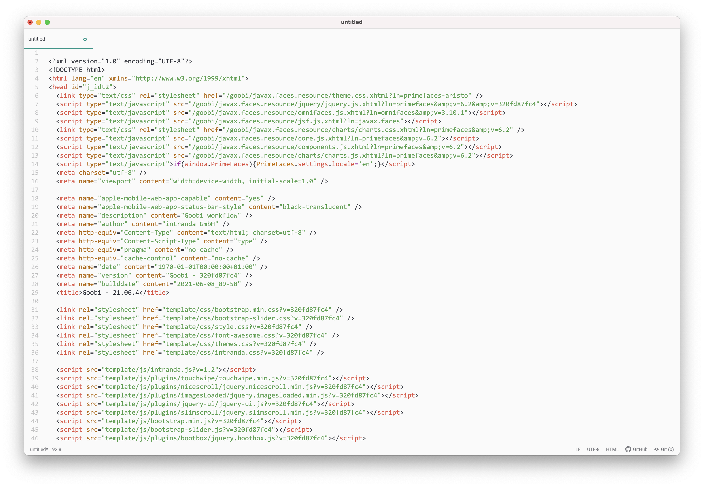
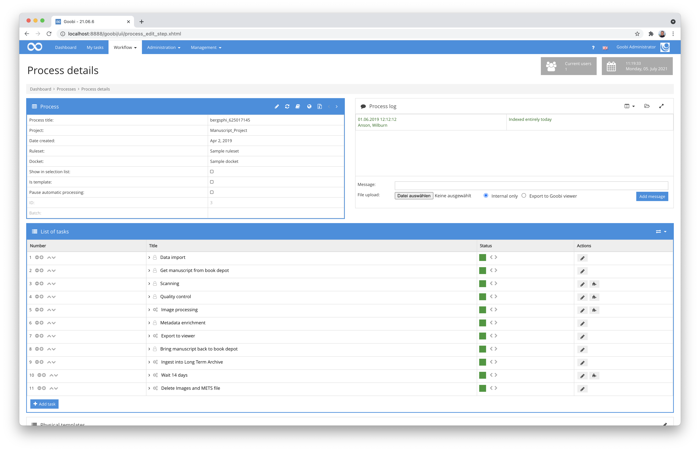
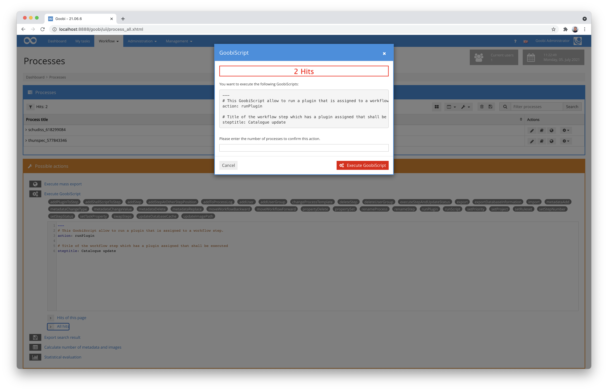
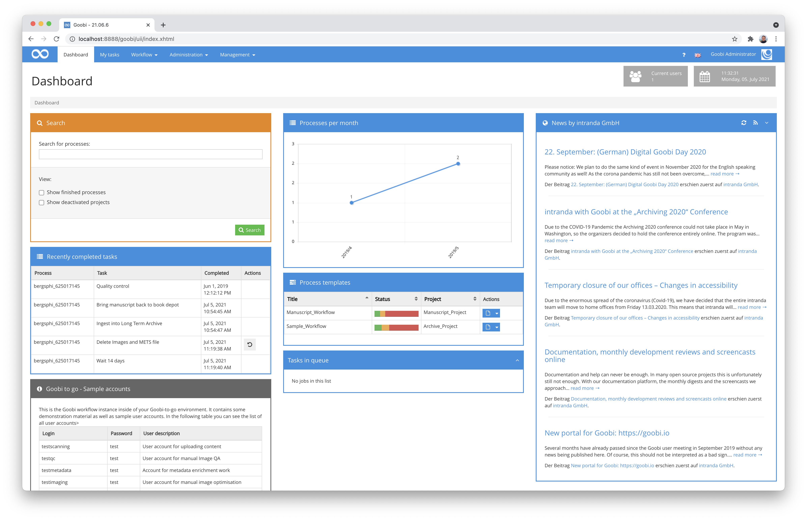
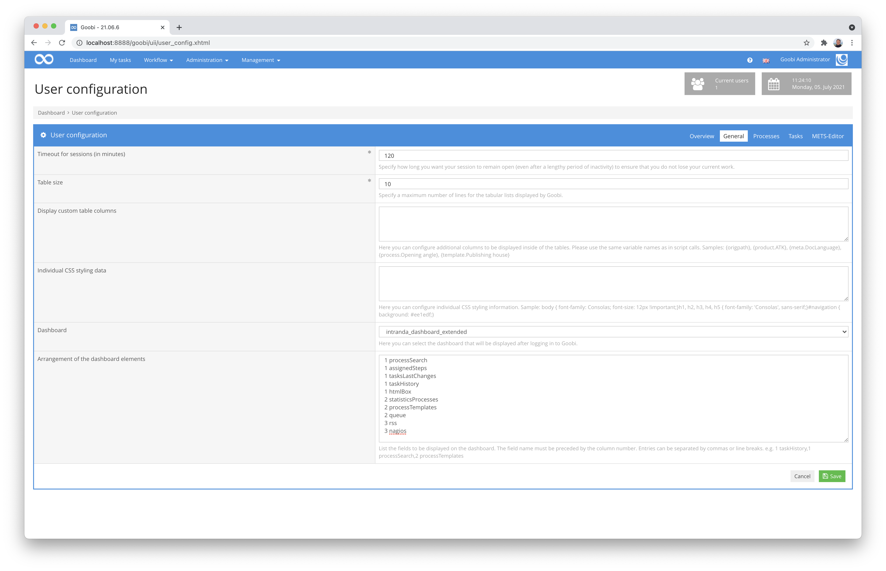

# May 2021

## Coming soon

* Extension of the Archive Management Plugin
* Extended Java 11 support
* Adaptation of the export options
* Extension of the handling of museum data from LIDO

## New functionality for full text editing in the metadata editor as ALTO files

For some time now, the Goobi workflow metadata editor has allowed OCR results to be viewed in text format. However, if you then discovered a recognition error, you were left with only three options:

1. use the transcription plugin in Goobi workflow and export `text` instead of `ALTO-XML`, which however prevents the marking of search hits on an image in Goobi viewer.
2. edit the ALTO file with a separate text editor in the file system. This is very time-consuming and hardly feasible for non-professionals.
3. do not correct the recognition error and try to sleep peacefully anyway.

Since this Goobi workflow version there is a new possibility:


You can use the new integrated ALTO editor within the metadata editor. The coordinates of the words are thus preserved and the full text can be edited almost like regular continuous text.


Highlighting the lines and words allows it to be easily seen where on the page each word is printed.


The documentation for the new functionality can also already be found in the Goobi workflow manual available online:


https://docs.goobi.io/goobi-workflow-en/user/4/4.4


[https://github.com/intranda/goobi-workflow/commit/50302f4464c417f090593a91151eb3c127643223](https://github.com/intranda/goobi-workflow/commit/50302f4464c417f090593a91151eb3c127643223)\
[https://github.com/intranda/goobi-workflow/commit/4ebd2aa551680117bd8ef6f224f030a31caaef3c](https://github.com/intranda/goobi-workflow/commit/4ebd2aa551680117bd8ef6f224f030a31caaef3c)\
[https://github.com/intranda/goobi-workflow/commit/04b4cddefcebb8d8675c116946bff3c1df4a9fda](https://github.com/intranda/goobi-workflow/commit/04b4cddefcebb8d8675c116946bff3c1df4a9fda)\
[https://github.com/intranda/goobi-workflow/commit/293e19fc4cdc3289d4f6049868578bc7d4e21d61](https://github.com/intranda/goobi-workflow/commit/293e19fc4cdc3289d4f6049868578bc7d4e21d61)\
[https://github.com/intranda/goobi-workflow/commit/c0dcfcb477ef0c3266db1d18c7ff5da495f1835b](https://github.com/intranda/goobi-workflow/commit/c0dcfcb477ef0c3266db1d18c7ff5da495f1835b)\
[https://github.com/intranda/goobi-workflow/commit/ef8609c9de7aeee3e00d66ff62a7545d1f88c00e](https://github.com/intranda/goobi-workflow/commit/ef8609c9de7aeee3e00d66ff62a7545d1f88c00e)\
[https://github.com/intranda/goobi-workflow/commit/c619c43bdbd02763391e253056e44b3fc4953c2f](https://github.com/intranda/goobi-workflow/commit/c619c43bdbd02763391e253056e44b3fc4953c2f)\
[https://github.com/intranda/goobi-workflow/commit/0a4350efff933aed8a6196074f40329591b19efa](https://github.com/intranda/goobi-workflow/commit/0a4350efff933aed8a6196074f40329591b19efa)\
[https://github.com/intranda/goobi-workflow/commit/94db988c85e3861fcad3c946917e353a697a1824](https://github.com/intranda/goobi-workflow/commit/94db988c85e3861fcad3c946917e353a697a1824)\
[https://github.com/intranda/goobi-workflow/commit/e82ee6d1a2d8544a692141affda6fbffce51e31b](https://github.com/intranda/goobi-workflow/commit/e82ee6d1a2d8544a692141affda6fbffce51e31b)

## Layout adjustments in the metadata editor and faster loading times

When an action is triggered in the metadata editor, the entire page is rarely reloaded so that the workflow is not interrupted and the scroll position of the individual containers can be maintained. When refreshing the page in this way, the developer can decide exactly which parts of the page should be refreshed.

In the past, some actions also updated parts of the page where it was not necessary. As a result, some actions, such as setting the representative, took an unusually long time. We have completely checked the metadata editor for this problem and optimised the updating for all actions.

[https://github.com/intranda/goobi-workflow/commit/c8c4bb7bf26e3127795e5efef016f6c7bd88a36b](https://github.com/intranda/goobi-workflow/commit/c8c4bb7bf26e3127795e5efef016f6c7bd88a36b)\
[https://github.com/intranda/goobi-workflow/commit/8d8fc0ba9de8344d1f8d7fe7ed1a4f6f99e2dba2](https://github.com/intranda/goobi-workflow/commit/8d8fc0ba9de8344d1f8d7fe7ed1a4f6f99e2dba2)\
[https://github.com/intranda/goobi-workflow/commit/e583242c440624e4b6ee8c63691c8ed7bfd7e993](https://github.com/intranda/goobi-workflow/commit/e583242c440624e4b6ee8c63691c8ed7bfd7e993)\
[https://github.com/intranda/goobi-workflow/commit/f472088c86c579faffabd33800cda5960d9227c2](https://github.com/intranda/goobi-workflow/commit/f472088c86c579faffabd33800cda5960d9227c2)\
[https://github.com/intranda/goobi-workflow/commit/5c43b1e89e32ccf9927c2770354d78950213a26b](https://github.com/intranda/goobi-workflow/commit/5c43b1e89e32ccf9927c2770354d78950213a26b)\
[https://github.com/intranda/goobi-workflow/commit/c390ceb75df8c4219711c9ef1fa9d0d754dd5844](https://github.com/intranda/goobi-workflow/commit/c390ceb75df8c4219711c9ef1fa9d0d754dd5844)\
[https://github.com/intranda/goobi-workflow/commit/5550ce2393456cc214f1f21787fa49c91f841616](https://github.com/intranda/goobi-workflow/commit/5550ce2393456cc214f1f21787fa49c91f841616)\
[https://github.com/intranda/goobi-workflow/commit/27a0653758593f24d7e82ef645f239ed0805f8d2](https://github.com/intranda/goobi-workflow/commit/27a0653758593f24d7e82ef645f239ed0805f8d2)\
[https://github.com/intranda/goobi-workflow/commit/5cf7bd6e7b3176ae4692df5a25373f8474db49f6](https://github.com/intranda/goobi-workflow/commit/5cf7bd6e7b3176ae4692df5a25373f8474db49f6)\
[https://github.com/intranda/goobi-workflow/commit/827aa52ff63663fa1aab7028b32786e4e5206976](https://github.com/intranda/goobi-workflow/commit/827aa52ff63663fa1aab7028b32786e4e5206976)\
[https://github.com/intranda/goobi-workflow/commit/7cc545c634bd355d0d5b7ea66e39d5261930376c](https://github.com/intranda/goobi-workflow/commit/7cc545c634bd355d0d5b7ea66e39d5261930376c)\
[https://github.com/intranda/goobi-workflow/commit/020f270d011bb10d81ef23dddec9d095c9c2be57](https://github.com/intranda/goobi-workflow/commit/020f270d011bb10d81ef23dddec9d095c9c2be57)\
[https://github.com/intranda/goobi-workflow/commit/5ccfbf44e4c57302b834b8a04d7d0638ec229f05](https://github.com/intranda/goobi-workflow/commit/5ccfbf44e4c57302b834b8a04d7d0638ec229f05)\
[https://github.com/intranda/goobi-workflow/commit/adf93e08dff00cf879fb4c4436cf935e156c6cf2](https://github.com/intranda/goobi-workflow/commit/adf93e08dff00cf879fb4c4436cf935e156c6cf2)\
[https://github.com/intranda/goobi-workflow/commit/fc516f07f9170849331be0271ae093b5e38f9cdb](https://github.com/intranda/goobi-workflow/commit/fc516f07f9170849331be0271ae093b5e38f9cdb)

## Avoiding unwanted caching for layouts

In the past, it was often the case that after an update, the first time you entered the just freshly updated Goobi, the layout and/or some stylings were completely broken. This was not because the developers did a bad job, but because browsers like Chrome or Firefox cache files on the local device to save resources and bandwidth. The files are only re-downloaded from the server if they have changed. Therefore, it sometimes happened after an update that old files were mixed with new files and therefore the layout was broken. In this case, the page had to be completely reloaded (with the key combination `Ctrl`+`Shift`+`R`) to discard the cached files and reload them.

To prevent this from happening in the future, we now append a unique text associated with the version to the address of each file that could potentially be cached locally for each Goobi release. This way, the browser will always request a new file for new versions and the layout will look correct immediately after the update, without having to press secret key combinations.



[https://github.com/intranda/goobi-workflow/commit/b597c0439d3f5d6004e82811929c6156100ce167](https://github.com/intranda/goobi-workflow/commit/b597c0439d3f5d6004e82811929c6156100ce167)

## Better handling of processes without metadata

Goobi workflow is used in many different ways. For example, there are some institutions that are not interested in metadata in METS/MODS or LIDO format. For these institutions it has been noticed that script calls mandatorily require a `meta.xml` file in the task folder, otherwise they are aborted with an error. This has now been changed so that the `meta.xml` file is only read for script calls if metadata information is actually required within the script call.



[https://github.com/intranda/goobi-workflow/commit/d7d7d2ca5fa60a59c2ef3a996eaa43c5acb2845a](https://github.com/intranda/goobi-workflow/commit/d7d7d2ca5fa60a59c2ef3a996eaa43c5acb2845a)

## Adjustments to the functionality of GoobiScript

After the GoobiScript runtime was completely re-implemented last month, some problems with GoobiScripts from plugins still arose that caused the plugins not to work properly. These problems have now been fixed and everything is working as usual again.



[https://github.com/intranda/goobi-workflow/commit/d154874ba63a7e815267db378218c551cf11273c](https://github.com/intranda/goobi-workflow/commit/d154874ba63a7e815267db378218c551cf11273c)\
[https://github.com/intranda/goobi-workflow/commit/a8320d942345e6aaa39bc856a1d701184c2ed0ae](https://github.com/intranda/goobi-workflow/commit/a8320d942345e6aaa39bc856a1d701184c2ed0ae)\
[https://github.com/intranda/goobi-workflow/commit/d232a0f60d6db4b81c3c14d0ade4ddc1e668c97c](https://github.com/intranda/goobi-workflow/commit/d232a0f60d6db4b81c3c14d0ade4ddc1e668c97c)

## New functions and setting options of the dashboard

The enhanced dashboard has been extended even further. There are two new widgets: The widget `Changes in the last 7 days` shows steps that were completed, in progress or had errors in the last 7 days. The second new widget shows the steps that are currently in the queue. This is based on the new `INFLIGHT` status introduced last month.



Another new feature is that the layout of the dashboard can now be configured individually via the user settings. This configuration can be done by editing the setting `Arrangement of dashboard elements` within the user-specific `User configuration` in the tab `General`. Each line within the text box adds an element to the dashboard. Each line consists of two parts, separated by a space: First is a number that specifies the column in which the widget is to be displayed. The second part after the space is then the name of the widget to be added.

The list of currently available widgets is: `assignedSteps`, `batches`, `htmlBox`, `itm`, `processSearch`, `processTemplates`, `queue`, `rss`, `statisticsProcesses2`, `statisticsProcesses`, `taskHistory`, `tasksLastChanges`.

An example configuration could look as follows:

```
1 processSearch
1 assignedSteps
1 tasksLastChanges
1 taskHistory
1 htmlBox
2 statisticsProcesses
2 processTemplates
2 queue
3 rss
```

