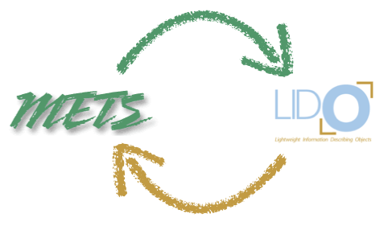
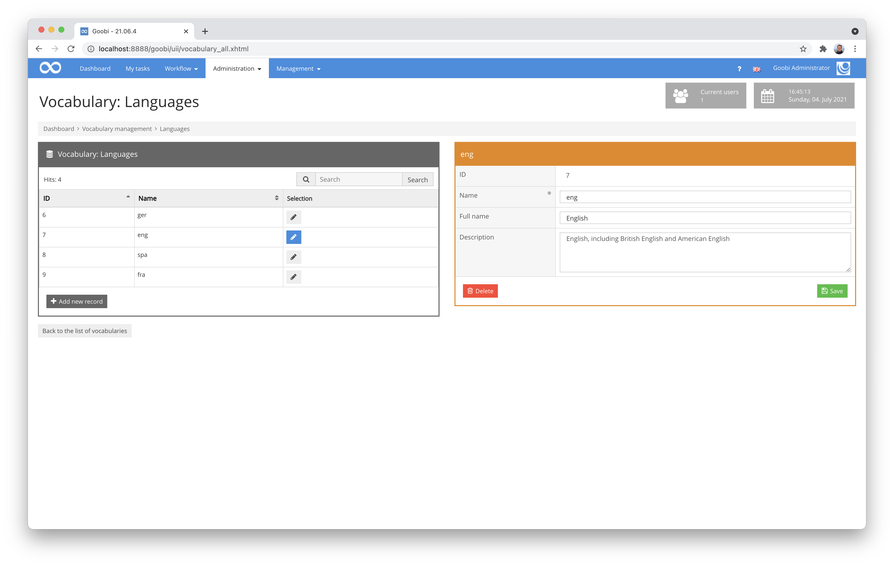
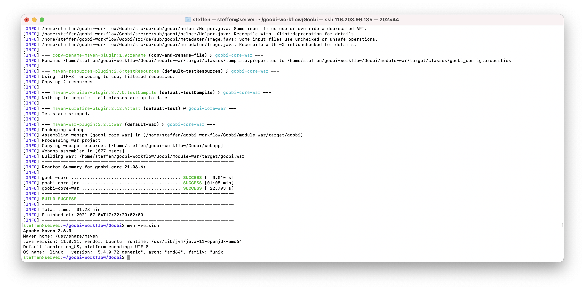
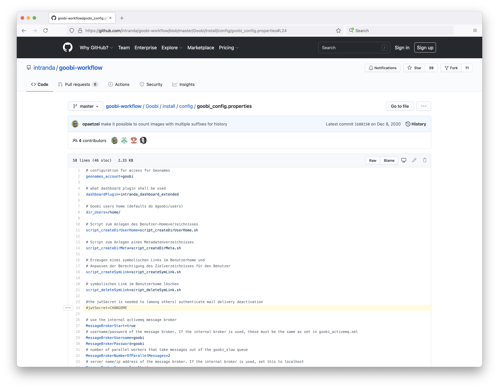
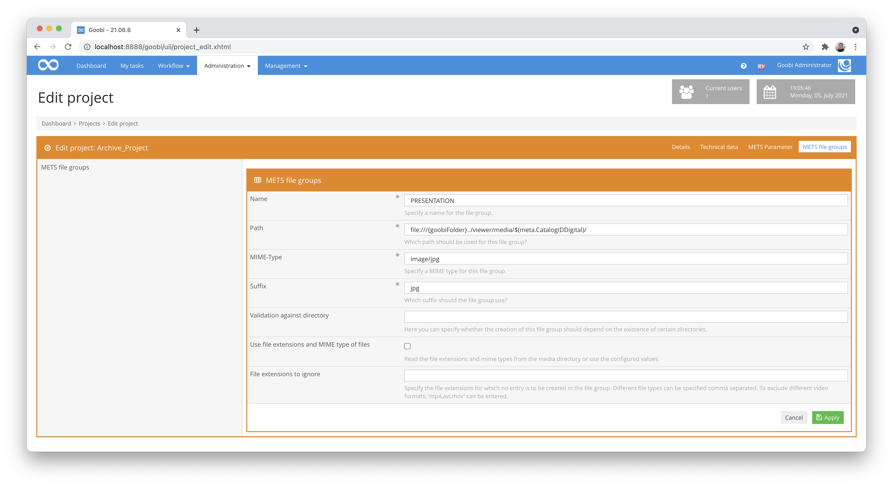
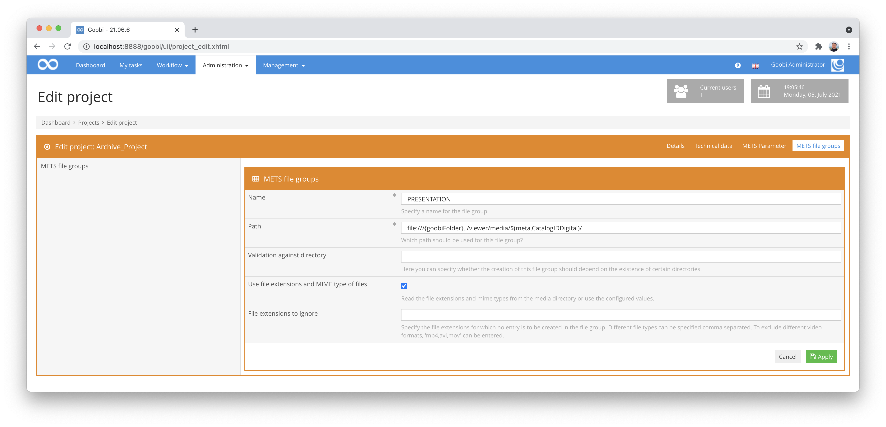
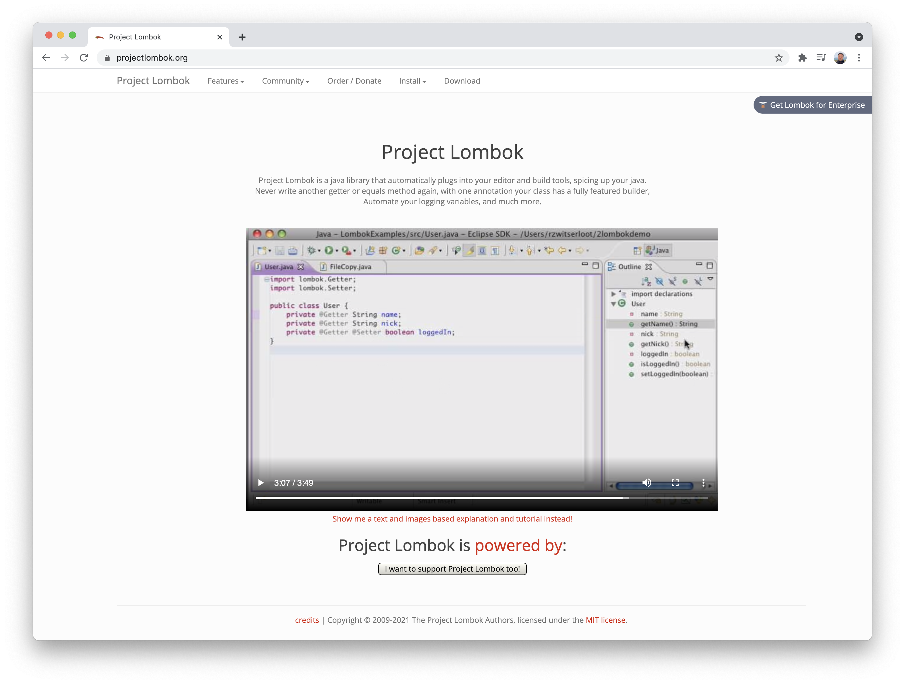

# June 2021

## Coming soon

* Outsourcing of some statistics to plugins with refreshing of the user interface
* Implementation of a new search syntax
* Revision of the internal folder structure to comply with the Maven convention
* Expansion of the plugin documentation

## Conversion from Lido to METS/MODS and METS/MODS to Lido now possible

Goobi now supports the conversion of the metadata format LIDO to METS. For example, it is now possible to import a LIDO file and save it internally as a METS file. In the same way, an existing METS file can also be exported again as a LIDO data set.



[https://gitea.intranda.com/intranda/ugh-extension/commit/e9ce2e551e644f9e20ab6caf69c08f60ec37b48d](https://gitea.intranda.com/intranda/ugh-extension/commit/e9ce2e551e644f9e20ab6caf69c08f60ec37b48d)\
[https://gitea.intranda.com/intranda/ugh-extension/commit/f3b6864a867c28567c8c76af89436daaa6fc65f4](https://gitea.intranda.com/intranda/ugh-extension/commit/f3b6864a867c28567c8c76af89436daaa6fc65f4)

## Additional locations for image referencing in LIDO files.

Previously, images in LIDO were expected as `<linkResource>` within the `<resourceRepresentation>` element:

```markup
<lido:administrativeMetadata>
<lido:resourceWrap>
<lido:resourceSet>
    <lido:resourceRepresentation lido:type="local">
    <lido:linkResource>00000001.jpg</lido:linkResource>
    </lido:resourceRepresentation>
</lido:resourceSet>
</lido:resourceWrap>
</lido:administrativeMetadata>
```

With this month's developments, it has now become possible for images to be specified as `<resourceID>` instead. This is particularly helpful for data transfer from the MuseumPlus application:

```markup
<lido:administrativeMetadata>
<lido:resourceWrap>
<lido:resourceSet>
    <lido:resourceID>00000001.tif</lido:resourceID>
</lido:resourceSet>
</lido:resourceWrap>
</lido:administrativeMetadata>
```

Please note: If an image belongs to a sub-element, the specification must be made within the `<lido>` element that describes this sub-element.

[https://gitea.intranda.com/intranda/ugh-extension/commit/183ef6f4b93a8b0becd0627df8094babce1a32ef](https://gitea.intranda.com/intranda/ugh-extension/commit/183ef6f4b93a8b0becd0627df8094babce1a32ef)

## Adjustments to the usability of IIIF URLs in script calls

Recently, we had extended the so-called variable-replacer to the effect that it now also allows IIIF URLs for the corresponding images of a process in script calls. We had to make some corrections here so that the encoding of the URLs fits the respective use cases.

[https://github.com/intranda/goobi-workflow/commit/b887afbc47b8871588e0c1f2d7275981e1141eab](https://github.com/intranda/goobi-workflow/commit/b887afbc47b8871588e0c1f2d7275981e1141eab)\
[https://github.com/intranda/goobi-workflow/commit/1715a8603f476141b1c13d58385f51bc8641dff8](https://github.com/intranda/goobi-workflow/commit/1715a8603f476141b1c13d58385f51bc8641dff8)

## Building an Authority Server for Vocabularies

The vocabulary management in Goobi workflow makes it possible to manage controlled vocabularies in the user interface and to use them as choices for metadata fields in the metadata editor. A particularly practical feature is that the description for a particular entity can be changed and, by linking to only one vocabulary entry in the METS file, the entry is also automatically updated in all processes. Because of these advantages, vocabulary management is being used in more and more projects.



A problem can arise when using the vocabularies if, after exporting the data, Goobi viewer also needs to access the same vocabularies, as the Goobi workflow installation is often inaccessible from outside the facility network because it is located behind a firewall. For this reason, we have developed a new vocabulary server to which Goobi workflow mirrors all changes to the vocabularies configured in this way. In such a case, the URL of the data records in the publicly accessible vocabulary server, which is hosted by intranda and accordingly accessible worldwide, is entered in the metadata of the METS file. This means that the Goobi viewer can then access the vocabularies without any problems and always receive up-to-date data records from the vocabulary.

The code for this server has not yet been published and can be found in the intranda-internal Git repository: [https://gitea.intranda.com/intranda/goobi-authority-server](https://gitea.intranda.com/intranda/goobi-authority-server). The still internal documentation can also be found there in the repository: [https://gitea.intranda.com/intranda/goobi-authority-server/src/branch/master/goobi-authority-server/docs/AuthorityServer.md](https://gitea.intranda.com/intranda/goobi-authority-server/src/branch/master/goobi-authority-server/docs/AuthorityServer.md). We have not yet decided when to publish this project. Before that, we would like to review the source code and also prepare and translate the documentation.

## Beautifier for MARC data sets

Since the first days of Goobi, there has been the possibility to create processes based on a catalogue query and thus reuse the data from the catalogue. Unfortunately, however, the response from the respective catalogues is sometimes not such that Goobi can reliably interpret, for example, the publication types from the expected fields. For this reason, it has long been possible to manipulate the catalogue response with the so-called Beautifier before evaluating it. This was already possible in the past with PICA records. What is new is that these possibilities now also exist for MARC records. Such a configuration could look like this, for example:

### Manipulations on the leader

In this example, the leader at position `19` is replaced with a space (`\u0020`) if the value `e` is in the leader at position `6`.

```markup
<beautify>
<setvalue tag="leader19" subtag="" value="\u0020">
<condition tag="leader6" subtag="" value="e" />
</setvalue>
</beautify>
```

### Writing Controlfields

This example shows how to create the field `<controlfield tag="999">` with the value `KXP` for a record of an OPAC query.

```markup
<beautify>
<setvalue tag="999" subtag="" value="KXP" />
</beautify>
```

### Replace field contents:

This example shows how a field content can be changed. Here the field `041$a` is replaced with the value `ger` if it contains the value `lat`.

```markup
<beautify>
<setvalue tag="041" subtag="a" value="ger">
<condition tag="041" subtag="a" value="lat" />
</setvalue>
</beautify>
```

The following URL documents the configuration for catalogues and also the definition of the Beautifier:


https://docs.goobi.io/goobi-workflow-en/admin/7/7.2


[https://github.com/intranda/goobi-plugin-opac-marc/commit/13de8118b5aff7c3a82127d0d01a31cdf0a5edc1](https://github.com/intranda/goobi-plugin-opac-marc/commit/13de8118b5aff7c3a82127d0d01a31cdf0a5edc1)\
[https://github.com/intranda/goobi-plugin-opac-marc/commit/930386f0838e462ce5d31c1567beb00bc4b637f4](https://github.com/intranda/goobi-plugin-opac-marc/commit/930386f0838e462ce5d31c1567beb00bc4b637f4)\
[https://github.com/intranda/goobi-plugin-opac-marc/commit/54d86f5246d3cad5b4f437d22a70ef0aee39d67b](https://github.com/intranda/goobi-plugin-opac-marc/commit/54d86f5246d3cad5b4f437d22a70ef0aee39d67b)

## Further accessibility adjustments

And the wild ride continued this month as far as accessibility optimisations are concerned. One gets the impression that this is a life task. But at least it feels like we are on the home stretch. Let's see how it looks next month. :)


[https://github.com/intranda/goobi-workflow/commit/bcc76fa67841af7a7fe2a50a1fe3398c12554d1c](https://github.com/intranda/goobi-workflow/commit/bcc76fa67841af7a7fe2a50a1fe3398c12554d1c)\
[https://github.com/intranda/goobi-workflow/commit/70f65c14ab97a2394a7d5b0d7baa98c6bc433af2](https://github.com/intranda/goobi-workflow/commit/70f65c14ab97a2394a7d5b0d7baa98c6bc433af2)\
[https://github.com/intranda/goobi-workflow/commit/b6bd4dad318910aa8d0aa98a8e8ea0d54ba469a3](https://github.com/intranda/goobi-workflow/commit/b6bd4dad318910aa8d0aa98a8e8ea0d54ba469a3)\
[https://github.com/intranda/goobi-workflow/commit/17b88937cc79b71c1914533aa85b3685c5ca01fc](https://github.com/intranda/goobi-workflow/commit/17b88937cc79b71c1914533aa85b3685c5ca01fc)\
[https://github.com/intranda/goobi-workflow/commit/5806a5e8e5e011d2ac5ac6c68da2dfa950ec4a01](https://github.com/intranda/goobi-workflow/commit/5806a5e8e5e011d2ac5ac6c68da2dfa950ec4a01)\
[https://github.com/intranda/goobi-workflow/commit/106283895a5604de04c809d2e3a7bcfa99d8fc93](https://github.com/intranda/goobi-workflow/commit/106283895a5604de04c809d2e3a7bcfa99d8fc93)

## Compilation with Java 11 possible

Compiling Goobi workflow is no longer limited to the already quite old version 8 of Java. Instead, from now on not only operation with Java 11 is possible but also compiling.



For those who would like to compile Goobi themselves, here is a mini-summary of how to do it yourself:

```bash
# install needed packages
sudo apt install git
sudo apt install maven

# checkout Goobi workflow from GitHub
git clone https://github.com/intranda/goobi-workflow.git

# go into the Goobi workflow project
cd goobi-workflow/Goobi/

# compile Goobi workflow
mvn package
```

[https://github.com/intranda/goobi-workflow/commit/2049aa3ff998b4be5d11a8d792d8287cd65bafa7](https://github.com/intranda/goobi-workflow/commit/2049aa3ff998b4be5d11a8d792d8287cd65bafa7)\
[https://github.com/intranda/goobi-workflow/commit/7cdde2381c9e0ce2d5bd9eb741b2f82c3f4d7fe3](https://github.com/intranda/goobi-workflow/commit/7cdde2381c9e0ce2d5bd9eb741b2f82c3f4d7fe3)\
[https://github.com/intranda/goobi-workflow/commit/0138cc4c39a6985094e0f61d1c3adce71d1990c6](https://github.com/intranda/goobi-workflow/commit/0138cc4c39a6985094e0f61d1c3adce71d1990c6)

## Automatic generation of JWT Secrets

JSON Web Tokens (JWTs) are being used more and more in Goobi workflow to allow other programmes or people to perform certain actions for a certain time. Until now, a `JWT-Secret` had to be pre-configured manually in order to be able to use this functionality. As of this month, Goobi workflow generates the JWT secret itself if it has not yet been pre-configured.



[https://github.com/intranda/goobi-workflow/commit/35b13272d0f514b156eff0627783a87c258f60be](https://github.com/intranda/goobi-workflow/commit/35b13272d0f514b156eff0627783a87c258f60be)

## JWT key Rotation

During the implementation of the automatic generation of the JWT secrets described above, a potential security gap was discovered: The JWT keys were not rotated, which could have allowed an attacker to guess the secret if many messages were intercepted. This has now been changed and the keys are rotated every 24 hours.

[https://github.com/intranda/goobi-workflow/commit/8441eadb77d075d24ba6c448d2ceb27a3c189589](https://github.com/intranda/goobi-workflow/commit/8441eadb77d075d24ba6c448d2ceb27a3c189589)

## Adjustments to the standard export for naming changes

It happens very rarely that file names of images of individual processes are renamed bypassing Goobi, so that Goobi was previously unaware of these renaming changes and this could lead to problems when re-exporting the METS files.



With an adaptation of the standard export, we now circumvent this problem. Because in the case of the project configuration that the METS file should dynamically generate the file names depending on the recognised MIME type (e.g. image/jpeg), an update of the internally stored file names changed in the meantime is now also carried out within the METS file. In this way, such potential errors in the case of renaming carried out independently of Goobi (e.g. adjusted upper and lower case, changed file extension) are intercepted.



[https://github.com/intranda/goobi-workflow/commit/e58838f80e6bd24fc48e649602eca004ecd1a5ec](https://github.com/intranda/goobi-workflow/commit/e58838f80e6bd24fc48e649602eca004ecd1a5ec)

## Code optimisations

Less spectacular for non-programmers sounds an elaborate change we are currently making internally for further code optimisations. We are currently using the Lombok program library even more for code generation of boring, bloated but unfortunately necessary source code, which by convention has to be within Java applications.

For those readers who are Java programmers themselves: Lombok is definitely worth a look and takes care of the automatic generation of getters, setters, constructors and a lot more.



[https://github.com/intranda/goobi-workflow/commit/17a0d32698c2c941cc7ec47317b08e0904dac756](https://github.com/intranda/goobi-workflow/commit/17a0d32698c2c941cc7ec47317b08e0904dac756)\
[https://github.com/intranda/goobi-workflow/commit/ef797453faf8c83a5bb6cd5096d04106cbebae18](https://github.com/intranda/goobi-workflow/commit/ef797453faf8c83a5bb6cd5096d04106cbebae18)\
[https://github.com/intranda/goobi-workflow/commit/a3ee13e8559eceb29f059557fdf80bb093bf73fd](https://github.com/intranda/goobi-workflow/commit/a3ee13e8559eceb29f059557fdf80bb093bf73fd)\
[https://github.com/intranda/goobi-workflow/commit/5eb5eecb3dfe7e4bc103cd061b64d2b13dc17384](https://github.com/intranda/goobi-workflow/commit/5eb5eecb3dfe7e4bc103cd061b64d2b13dc17384)\
[https://github.com/intranda/goobi-workflow/commit/afd5b82169ed063da7586ed9c329c5465785336f](https://github.com/intranda/goobi-workflow/commit/afd5b82169ed063da7586ed9c329c5465785336f)\
[https://github.com/intranda/goobi-workflow/commit/93b8d5cc45897e949322b79a8e3a7634bc1396c2](https://github.com/intranda/goobi-workflow/commit/93b8d5cc45897e949322b79a8e3a7634bc1396c2)\
[https://github.com/intranda/goobi-workflow/commit/16e903327281e247d6e3da84c4bf6224d89175f3](https://github.com/intranda/goobi-workflow/commit/16e903327281e247d6e3da84c4bf6224d89175f3)\
[https://github.com/intranda/goobi-workflow/commit/665f4bd3e2d9b94d479f0fbdb89a0bea3f66d264](https://github.com/intranda/goobi-workflow/commit/665f4bd3e2d9b94d479f0fbdb89a0bea3f66d264)

## Duplicating metadata groups expanded

We have recently massively expanded the metadata groups. For a project in Croatia, we needed some rework here: It was necessary that metadata groups can also be duplicated, so that they now correctly duplicate all associated metadata, persons and subgroups. This saves some unnecessary manual editing.


[https://github.com/intranda/goobi-workflow/commit/4ae3035f0e6e1582d68235fd71a22fde8079b0b9](https://github.com/intranda/goobi-workflow/commit/4ae3035f0e6e1582d68235fd71a22fde8079b0b9)