# July 2021

## Coming soon

* Performance optimisations for very large data sets
* Development of a new capture plug-in for integration with Atlas AEON
* Development of a plugin for simultaneous processing of metadata from multiple processes
* Development of a new configuration editor

## Extension of the archive management plugin

The development of a plugin for combining the processing of archive holdings with the possibility of selectively digitising them is arousing more and more interest and is already in productive use in several institutions. In this context, areas naturally come to light that should be readjusted in order to be able to cover further purposes:

### Adjustments for creating processes in bulk

Previously, it was possible to select individual record within the archive management plugin in order to create a process for them, which then runs through its workflow. What is new now is that this is also possible for an entire range of records.

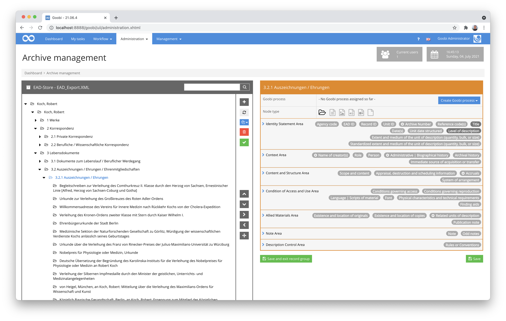

To do this, one simply selects a parent node from the inventory and chooses the process template to be used. A new process is then created for each record for which no process exists yet and allows it to be processed.

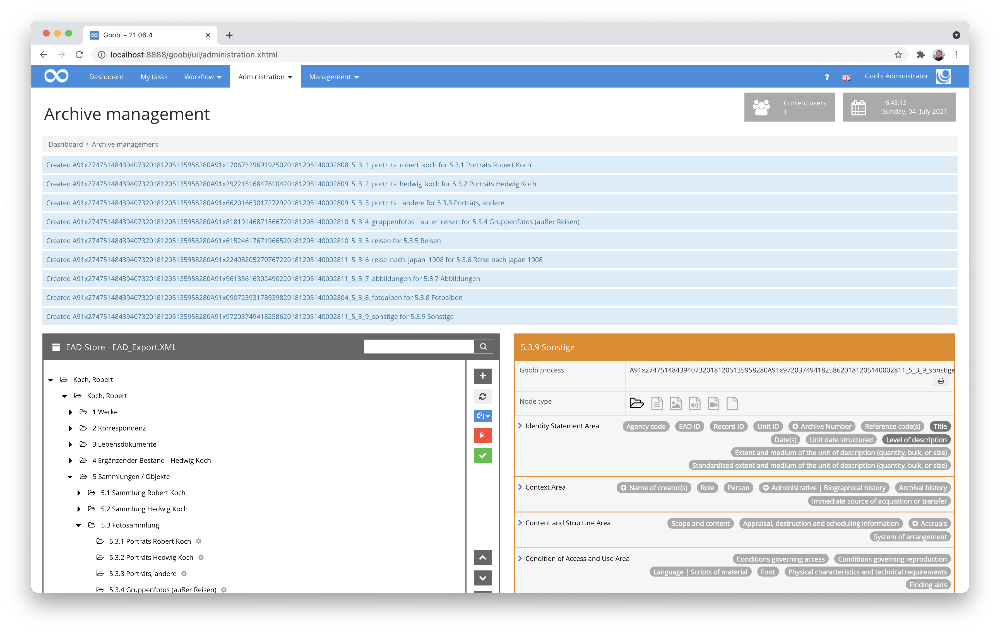

### Revision of the operating logic for empty datasets

In addition to the new functionality described for creating processes, there were also some minor changes in the operating logic. Especially when there was no archive record group yet and therefore a completely new record group was to be created, there was a need for improvement, which we tackled.

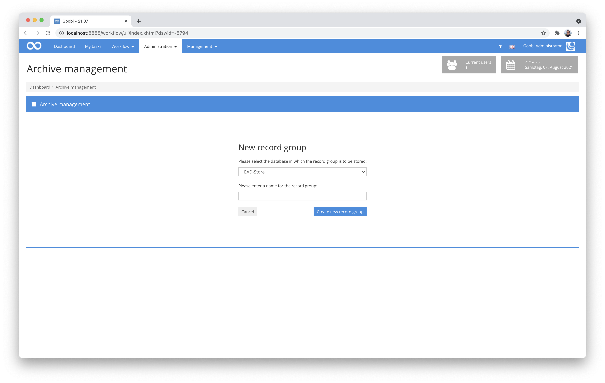

Accordingly, adding new record groups is now easier and also more comprehensible in the event of problems occurring.

## Working with multiple tabs now possible

A feature that we have all been wishing for for a long time has finally been implemented: Working in Goobi within multiple tabs or browser windows.

In the past it was a common problem that users of Goobi workflow tried to enter information from one project into another project and wanted to work with several windows at the same time. However, this used to be problematic because Goobi could only load one such element at a time in the background. For this reason, the last object entered was always the one loaded in the background and saved accordingly. In the past, this often led to great irritation. Now, however, this restriction has been removed so that it is possible to work with the same browser in the same session and with several tabs.

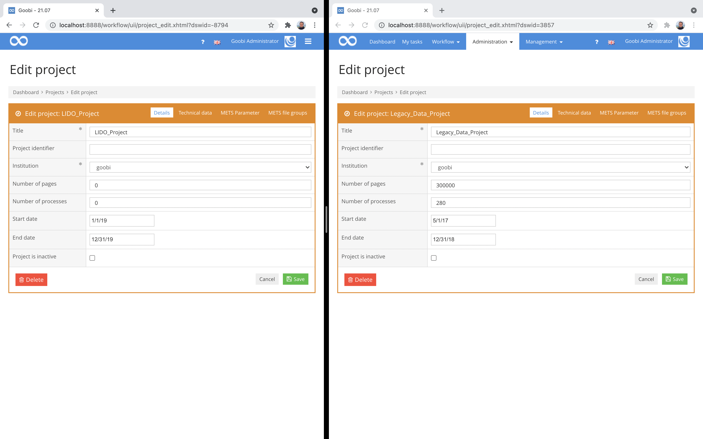

There is still one restriction: At the moment, a maximum of 64 tabs can be used simultaneously with Goobi. If one day this should be too little, we can increase the value to a maximum of 1024 tabs. :)

## Announcement: Java 11 will become a mandatory requirement as of 01.09.2021

We have been using Java 11 for the development of Goobi workflow for some time now. Even with new installations and updates, the installed systems are now converted to Java 11.

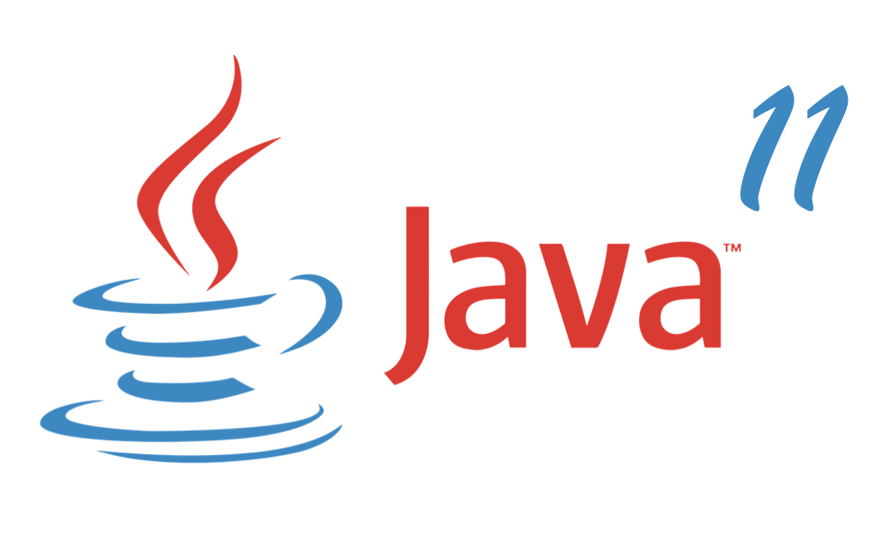

From 1 September 2021, we will make Java 11 a mandatory requirement for all systems. If a system has not yet been updated to Java 11, this must be done after this date at the latest with the next Goobi workflow update.

## Export of processes only if desired

Until now, processes that do not contain an explicit export step in the workflow could still be exported via the administrative views (e.g. using GoobiScript). However, as this behaviour was not always desired for materials with IP rights, we have made a change here and adapted the behaviour. Exports are now only possible for processes if they also contain a workflow step that is marked as `Export`.

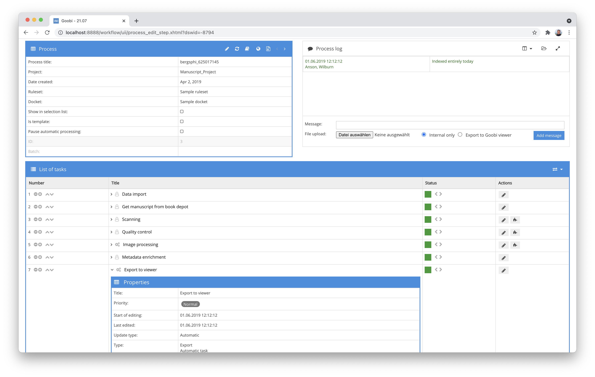

This change has been considered for the following areas:

* GoobiScript for performing mass exports.
* Button in the task listing
* Button within the task details
* The command plugin for exporting

## Downloading the log file for processes

Within the process list of Goobi workflow, various extended functions have been available for a long time. Among other things, you can generate and download the dockets. The internal log file of the selected process could also be generated here. However, until now it was only stored in the user's folder within the server file system, so that accessing it was quite cumbersome. This has been adjusted. The log file can now be downloaded in the same way as, for example, the routing slip and a complete PDF file of the respective process.

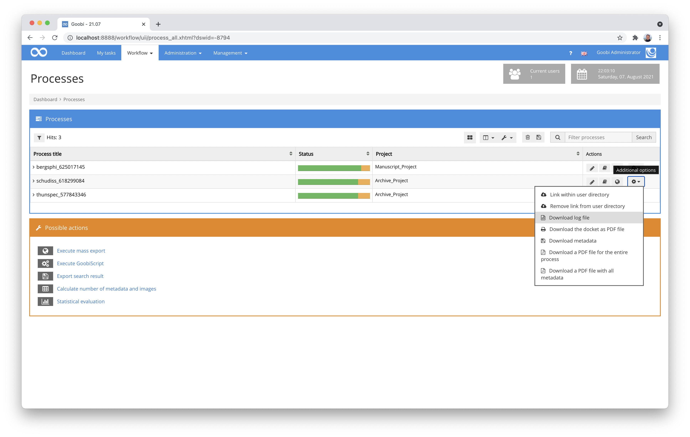

## New plugin for taking over images from the file system

We have developed a new plugin to simplify the transfer of images. This is especially interesting for mass imports. The need arose for us in order to take over the pictures after the automatic creation of processes from a previous archive stock of an EAD file in the archive management plugin, which were listed within the EAD file in a metadatum, however, in an incomplete form. With this plugin, it is therefore possible for such information to be evaluated, split up on the basis of separators and then provided with additional path information in order to actually take over the files afterwards.

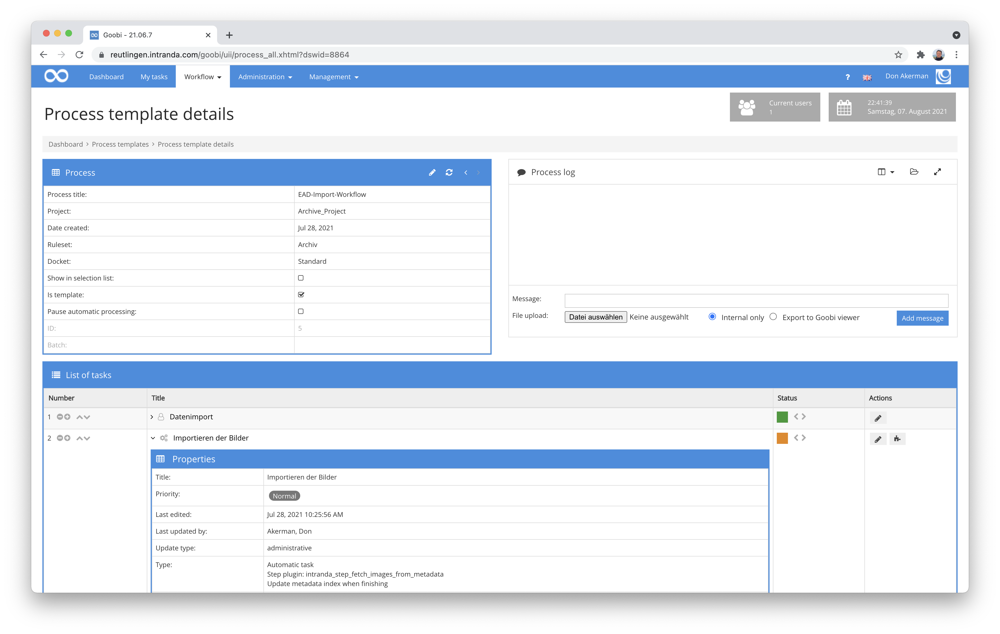

Documentation for this plugin has not yet been published and will follow in the next few days. The same applies to the publication of the plugin on Github.

## Add user groups and projects

When editing the details of a user, it has always been possible to specify which project and user group the user should belong to. At this point, the button for adding user groups and projects was previously displayed even if the user already belonged to all existing groups and projects.

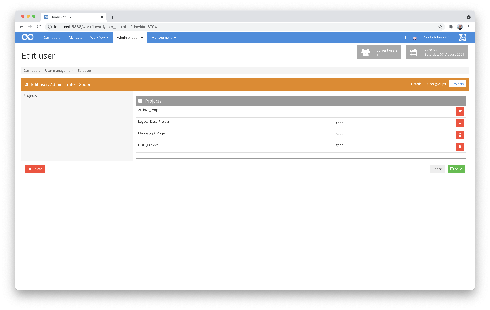

The user interface has now been adapted so that the buttons for adding users are only displayed if they can also fulfil a function, i.e. if there are still user groups and projects of which the user is not yet a member. This has once again made the administration of users somewhat easier.

## Advanced search for batches

The advanced search for batches makes it possible to find all processes of a certain batch. The search syntax for such a search looks like this, for example:

```
"batch:42"
```

This search finds all processes that are in the batch with the ID '42'. The opposite of this search, i.e. all those processes that are _not_ in batch `42`, was not possible until now. This new search option has now been implemented and looks like this:

```
"-batch:42"
```

The extension of this search option is also already documented within the Goobi manual:


https://docs.goobi.io/goobi-workflow-en/manager/7/7.1


## OAI-PMH Harvester for EAD files

For a project it was necessary to harvester EAD files from an OAI interface. For this purpose, we developed a new plugin that creates processes in Goobi workflow for all data of the configured interface, if they do not already exist.

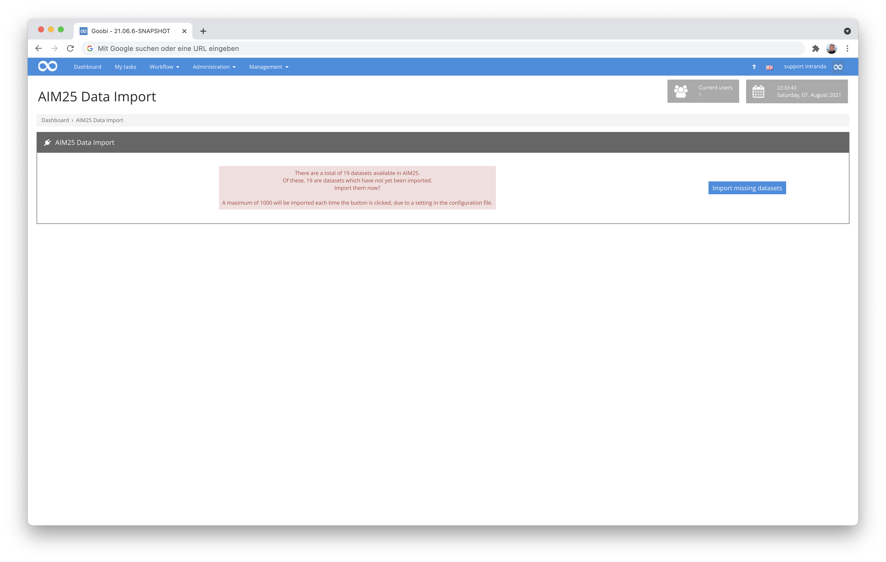

During the execution of the plugin, the metadata is selectively transferred to METS according to a configuration of XPath expressions.

Documentation for this plugin has not yet been published and will follow in the next few days. The same applies to the publication of the plugin on Github.

## Institution is no longer always displayed

Since not too long ago, Goobi workflow has had the option to allow multiple institutions, each with their own administrators, to work in one instance. However, since such a way of working is very rare in everyday life, we have now made the display of institutions a little more dynamic.

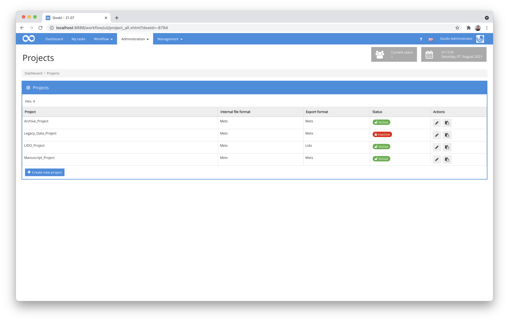

From now on, institutions will only be displayed within the listings of users, groups and projects if more than one institution has been configured. This makes working with Goobi a little clearer again at this point.

## User administration now with better search and sortability

In the user administration, it was previously only possible to search for the name of the user. With the latest changes, it is now possible to search all other fields as well. In addition, sorting is now also possible across all columns of the user table.

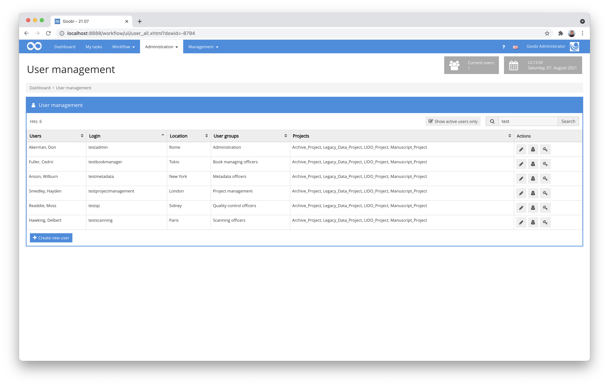

## Display of active users

In the past, there was often confusion among Goobi users who wondered about unknown IPs in the list of logged-in users or the display of unknown active sessions. In the past, security problems were also wrongly feared here. To avoid this confusion in the future, the list of sessions is now filtered for the display of active users and only those are displayed who are actually logged in. This way we avoid potential misunderstandings and misinterpretations that could result from the display.

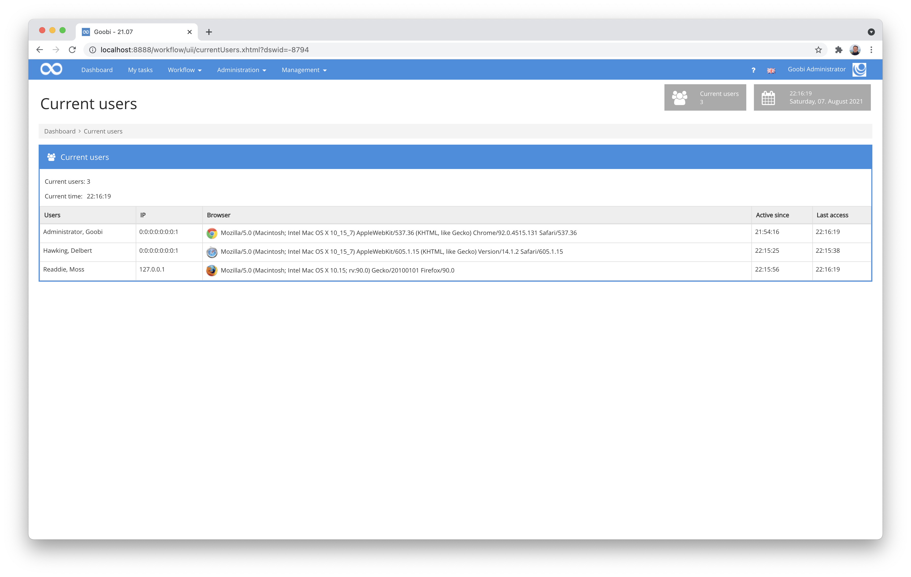

## Adjustments to the Metadata Editor

In the area of the metadata editor, there were again many changes, which we would like to briefly discuss here:

### Integration of the authority database KulturNav

Thanks to the support of [@hemed](https://github.com/hemed) from the University Library of Bergen, Goobi is now able to search the authority database KulturNav, which is very popular especially in Scandinavia, and to take over authority data from it. This development was actually the first major pull request we have received on GitHub from an external developer.

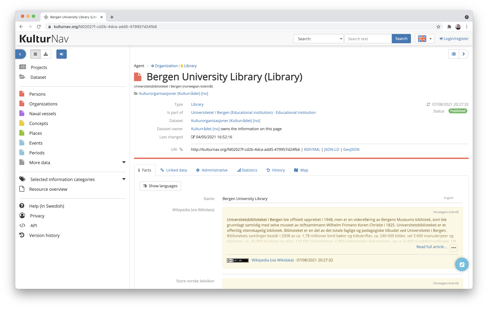

Here you can find the technical details of the development together with the extensive communication between the developers involved:


https://github.com/intranda/goobi-workflow/pull/23


Thanks to you [@hemed](https://github.com/hemed) for this great collaboration and your contribution to Goobi workflow!

### Small visual adjustment in the menu

There was a small inconsistency in the top menu of the metadata editor when moving the mouse over the single image/thumbnail buttons. The display has been adjusted and should now behave as expected.

### Focus in the page selection

When displaying thumbnails during pagination, there were undesired scrolling effects when clicking on an image. This bug has been fixed.

### Reset pagination in the metadata editor now with warning

In the metadata editor, there are some actions that immediately save the METS file. Examples of this are, among others, the two buttons that reset the pagination or recreate it based on the image files that actually exist. This behaviour often hits users unexpectedly and therefore a warning is now displayed before performing these actions that the changes are saved directly and can only be undone by an administrator.


## Creating processes

We have also made some changes in the area responsible for creating processes:

### Improved error handling when creating processes.

In the event that unexpected errors occur during the creation of processes, more detailed information is now provided on the errors that occurred. With these adjustments, incorrectly created processes should occur even less frequently.

We have also made a similar adjustment for the case that, for example, no metadata file 'meta.xml' could be created due to special ruleset configurations. Here too, a helpful error message is now displayed and prevents the incorrect creation of a process without a metadata file.

## Creating processes in deactivated projects

If projects are set to inactive, from now on the buttons for creating new processes in the production templates will be displayed in red and provided with a warning that the associated project is deactivated. In addition, the project name is also coloured grey to indicate that it is deactivated.

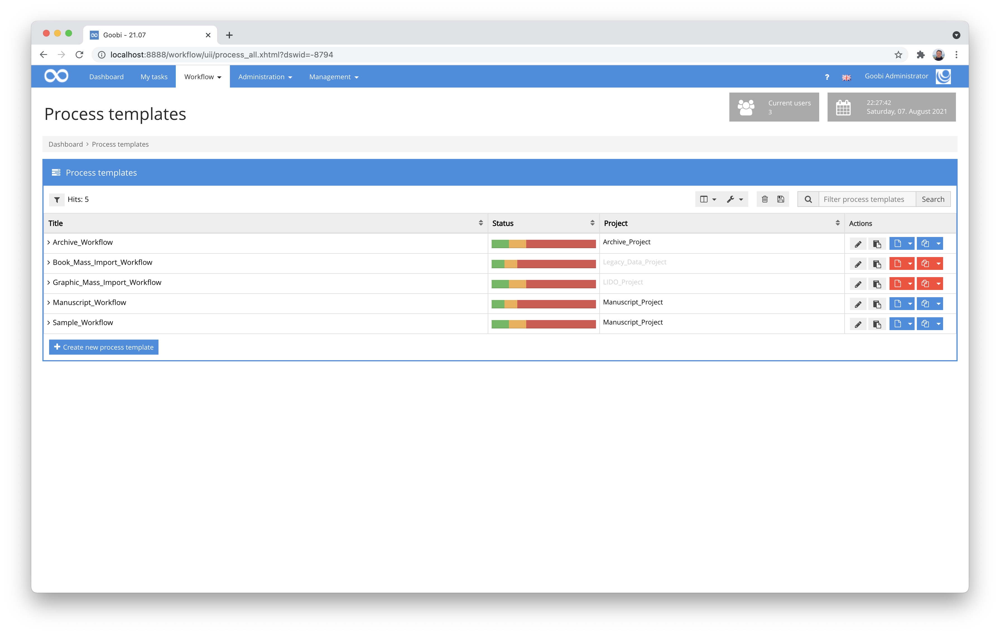

### User for creating new processes is no longer registered for all steps

When creating new processes, the user who created the processes was also registered as the last user in all workflow steps, even before the processes were actually processed. In the past, this did not cause any problems, nor did it have any undesired side effects. However, we found it irritating and have now improved it.

## Adjustments to the extended dashboard

The extended dashboard is super popular and used in almost every Goobi installation. Here we have made some adjustments this month:

### Processes per month for authorised projects only.

The dashboard usually shows a chart that visualises the number of processes added in the last few months. Until now, all processes were listed that were available in the Goobi instance. With a change at this point, the diagram now behaves a little more helpfully: from now on, only those processes are taken into account in the diagram that are in projects of which the user is also a member. This is much more intuitive for the user.

### Widgets without content are hidden

As helpful as the dashboard is and as much as it can display; sometimes some of the widgets are not filled with data because they are simply not available. However, we found it unattractive that empty widgets were then displayed. For this reason, the display has now been revised and hides empty widgets.

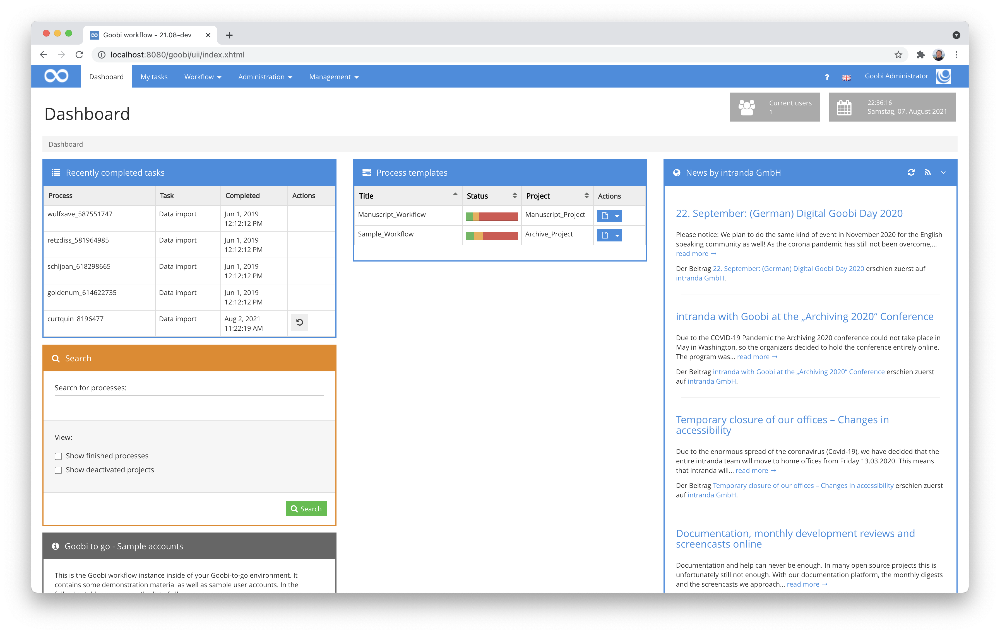

## Further adjustments

There were again numerous smaller adjustments in various areas that should not go unmentioned.

### Task titles in Firefox can be marked again

Due to the changeover to buttons for accessibility reasons, the task titles in the task lists could no longer be marked in Firefox. This was inconvenient if you wanted to copy such a title to the clipboard. For this reason, we have made a change here so that this is possible again.

### Adjustments for renaming processes

When a process is renamed in Goobi, all directories in the process directory are renamed in the background to match the new process name. Previously, symbolic links were omitted. This has been changed and from now on symbolic links will also be renamed.

### Task log: Uniform titles for all icons

Within the task details, consistent mouse-over texts were not displayed for all buttons. We have standardised this.

## Version number

The current version number of Goobi workflow with this release is: **21.07**. Within plugin developments, the following dependency must be entered accordingly for Maven projects within the `pom.xml` file:

```markup
<dependency>
  <groupId>de.intranda.goobi.workflow</groupId>
  <artifactId>goobi-core-jar</artifactId>
  <version>21.07</version>
</dependency>
```