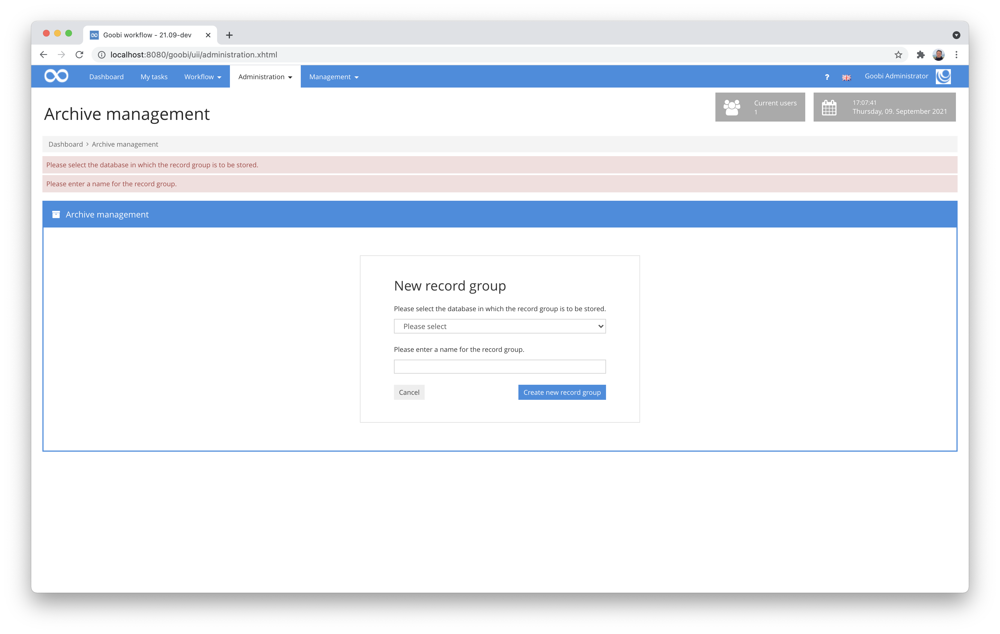

# August 2021

## Coming soon

* Development of a new capture plugin for integration with Atlas AEON
* Development of a new plugin for editing configuration files from the user interface
* Development of a new plugin for editing rule sets from the user interface
* Development of a plugin for simultaneous editing of metadata from multiple processes

## No new processes for deactivated projects

Until now, it was possible to continue to create processes within production templates for projects that are actually marked as deactivated. There has now been a change that should simplify the operation and make it more intuitive.


The buttons for creating individual processes and also those for mass import are now displayed in red for deactivated projects and show an explanatory warning message when used. In addition, the project name is also displayed in grey to indicate that the project has been deactivated. Deactivated projects are no longer listed in the drop-down fields that open by clicking on the arrow icon of the button.


## Hiding buttons that are not required

Within the configuration of users, among other things, the required user groups and projects can be assigned that should belong to a user. At this point we have made a small optimisation that makes the operation more logical.


In both areas, the button for adding projects and user groups is now only displayed if further projects and user groups are available that have not yet been assigned. Accordingly, the button is now only displayed if it really enables a change. This should make operation a little more intuitive.


## Improvements to the user interface for archive management

To improve the use of the archive management plugin once again, we have implemented some additional internal check routines and issue more informative messages within the user interface than before.


If, for example, the connection to the database is not available or expected information is missing, e.g. for the selection of the stock to be processed, helpful error messages are now displayed for the processor.



## Adjustments to the menu

In the course of various internal menu changes, we have also merged the mobile menu (for smartphones and other narrow devices), which was previously maintained in a separate file, into one file. As a user, you will hopefully not notice anything. For us as developers, on the other hand, this approach is now much simpler, as new menu items to be added now only have to be considered in one central place.

We also took the opportunity to make some minimal visual adjustments and to change the colour highlighting of active pages. In the meantime, there was a colour inconsistency between some blue and some grey highlighted menu items. Now all active menu items are displayed in grey again.


## New plugin to check ruleset conformity

We have developed a new plugin that we all didn't know we actually needed for a long time. The need came to light because large mass exports of data in particular occasionally resulted in errors due to rule set adjustments made in the meantime. Such situations can arise, for example, because metadata is defined differently at a later date. For example, if metadata is no longer allowed to occur but was allowed in the past, the METS files will not open correctly. Older Goobi processes were exported successfully and validly in the past, but with an updated rule set they may now violate the new rules.


This new plugin makes it easier to detect such processes. It can be easily executed for a filtered list of processes and checks the successful readability of the METS files at hand. In case of errors, these are listed in a table and it is possible to directly enter the METS editor for the corresponding process.

The source code of the plugin has been published here on GitHub:


https://github.com/intranda/goobi-plugin-administration-ruleset-compatibility


The detailed documentation on installation, configuration and operation can be found at the following address:


https://docs.goobi.io/goobi-workflow-plugins-en/administration/intranda_administration_ruleset_compatibility


## New plugin for resetting pagination

In another project we had the special case that we had to completely reset the pagination for many processes, because the number of files for hundreds of processes changed. In this context, we noticed that there was no automatism in Goobi workflow that could make such a required change for many processes in mass.


For this reason, we have developed a plugin that allows resetting the pagination for large amounts of data. With the help of a freely selectable filter, the plugin can be used for thousands of processes.

The source code of the plugin has been published here on GitHub:


https://github.com/intranda/goobi-plugin-administration-reset-pagination


The detailed documentation on installation, configuration and operation can be found at the following address:


https://docs.goobi.io/goobi-workflow-plugins-en/administration/intranda_administration_reset_pagination


## Display error in the user settings

If users had assigned many projects within the user settings, the display of the information was not optimal. We therefore made a small optical adjustment here in August so that even very extensive lists of projects are displayed correctly.


And because this representation is also useful for the user groups, we have also changed it. However, this small adjustment will only be included in the upcoming September release.

## Change to the configuration

The storage of keystore information is now no longer done from the user interface of Goobi workflow. For a better use of keystores also by other programs the configuration has been changed and is now done via the central configuration file `goobi_config.properties`. A keystore can now be defined there as follows:

```
truststore = /path/to/file
truststore_password = password
```

These and other changes that need to be considered for updates have been included in the publicly available update instructions. Those who do not yet know them can find them here:


https://docs.goobi.io/goobi-workflow-en/admin/9


## Database optimisations for larger data sets

Slowly but surely, some Goobi installations reach a data volume where database queries with unoptimised tables and database queries become too slow. For this reason, we have taken a close look at some database queries and tables and made changes. These adjustments are always included in the Goobi update. If, on the other hand, you carry out the update yourself, you will find further details on the changes in the update instructions:


https://docs.goobi.io/goobi-workflow-de/admin/9/9.2


## Version number

The current version number of Goobi workflow with this release is: **21.08**. Within plugin developments, the following dependency must be entered accordingly for Maven projects within the `pom.xml` file:

```markup
<dependency>
  <groupId>de.intranda.goobi.workflow</groupId>
  <artifactId>goobi-core-jar</artifactId>
  <version>21.08</version>
</dependency>
```