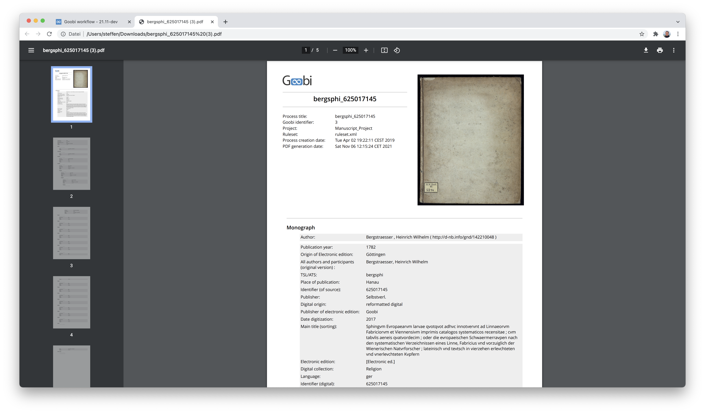
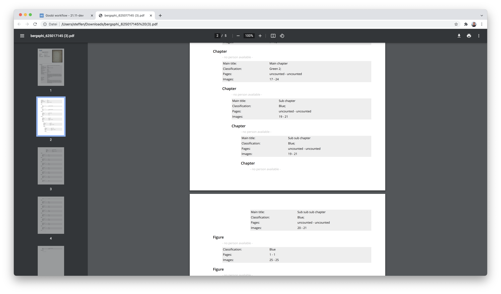
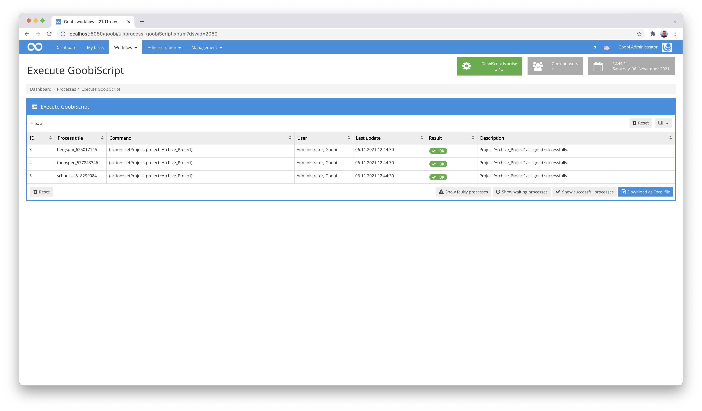
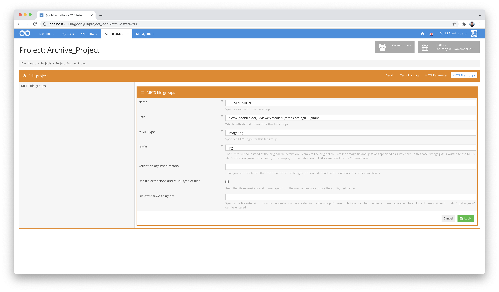
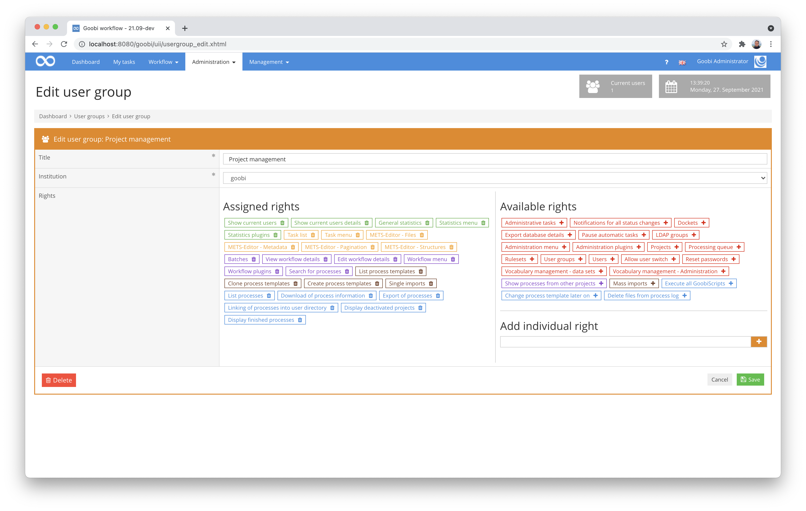
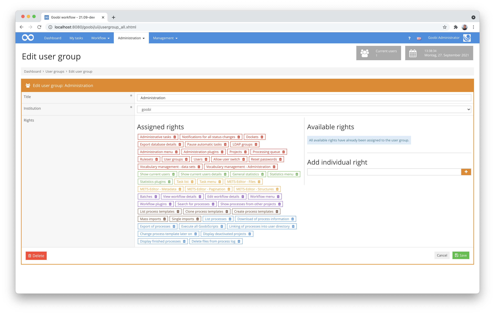
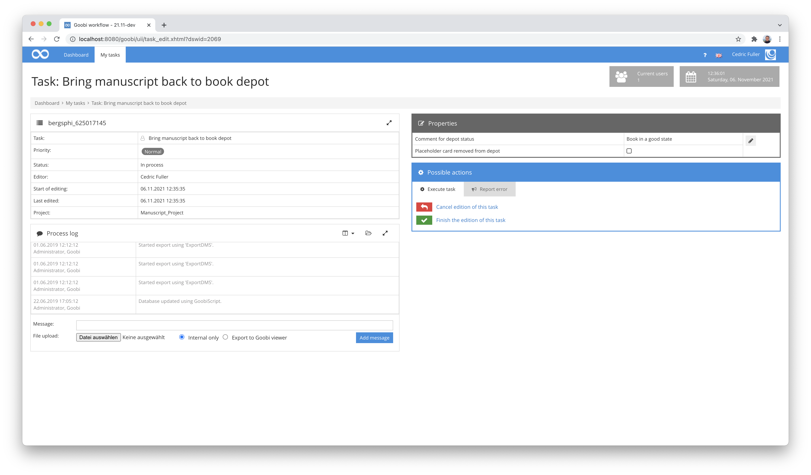
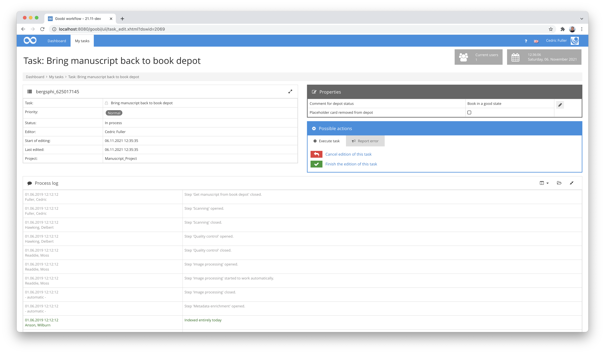

# September 2021

## Coming soon
- New plugin for editing configuration files
- New plugin for editing rule sets
- Adjustments to the institution display
- AEON plugin

## Print view for metadata revised
About two years ago we had implemented a completely new print view for metadata. This not only introduced the new feature of having a picture of the representative. Above all, it was now possible to print the hierarchy of the structure tree with the corresponding person and metadata. 


However, what we had not considered in the implementation was that Goobi users will really use this function intensively right away, even for very deep hierarchies. We had initially only implemented the consideration of two hierarchy levels. With the current revision, however, we now go up to eight levels deep in the listing on the print view.



What is new in this context is that the corresponding pages are now also listed. For each structural element, both the image numbers and the logical page numbers are now listed as a page range.




## More understandable display within GoobiScript
Once again there have been some minor changes within the execution of GoobiScript and the display of the results. A good example of such a minor change is, for example, that now the description of what the status of a GoobiScript is is a bit more meaningful. For example, for the GoobiScript for changing the project affiliation, understandable information is now displayed instead of the previously quite cryptic information that not even we as developers could do anything with. :)




## Better documentation for the XMP header plugin
During the commissioning of the XMP header plugin on a productive system, we noticed that the documentation was not completely up to date. This has now been revised and in connection with this some changes have been made to the plugin, which allow even better logging in case the plugin encounters errors during execution.

Here you can find the current version of the documentation online:



## Minor revisions to inline help
In some parts of Goobi workflow there were again several small changes to make it easier to use. These changes are too many and too small to be listed here. One example is the extension of the inline help texts, which have been slightly rewritten, including the configuration of file groups for the creation of METS files.



There have been several such changes in the background. In the best case, the user does not even notice these small adjustments.

## Improved save behaviour in user administration and project administration
In the user administration, changes to the affiliations for projects and groups can now be undone with the `Cancel` button. This was not possible before. We have also made a similar adjustment to the projects, where the settings for the file groups now behave similarly.


## Revision of the user interface for user groups
In the area of user groups, the interface for users was still not ideal. This mainly concerned the assignment of individual permissions that can be brought by individual plugins. The possibility of entering such individual permissions already existed. However, it was not intuitive enough, so that it was too easy to overlook the input option. This has now been significantly improved with a revision.



On this occasion, we have also taken into account that a user should be able to recognise even better when no further permissions can be assigned. In such a case, a short help text is now displayed.




## Improved mapping of metadata when using Datacite DOI 
A development on the DOI plugin allows us to now use metadata from multiple levels of a document and its parent unit in multi-volume works for registering DOIs, to pass them as XML elements to Datacite, or even to use them as a list of elements with attributes for registering DOIs.

Here again is the link to the documentation of the DOI plugin:


And here is the link to the source code of the plugin:



## Clearer task log in the tasks
The task log is often helpful when it comes to understanding why a task is in which status, what previous communication has already taken place and what may have gone wrong.



Until now, the task log was only displayed as a small box within the tasks, which made it difficult to read the events comfortably when there was a lot of content. For this reason, the task log box is now expandable and takes up the entire width of the browser window. In addition, it displays all content in such a way that scrolling within the box is no longer necessary.




## Version number
The current version number of Goobi workflow with this release is: **21.09**.
Within plugin developments, the following dependency must be entered accordingly for Maven projects within the `pom.xml` file:

```xml
<dependency>
  <groupId>de.intranda.goobi.workflow</groupId>
  <artifactId>goobi-core-jar</artifactId>
  <version>21.09</version>
</dependency>
```