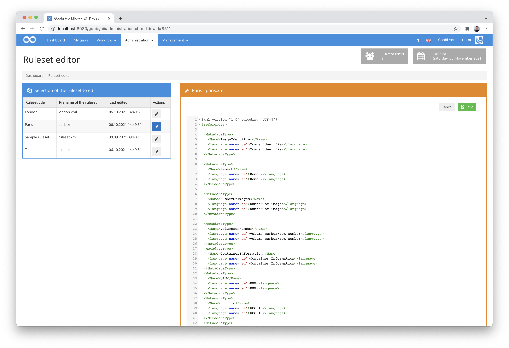

# October 2021

## Coming soon
- Extension of the plugin for issue recognition of newspapers
- Support of S3 as storage in further plug-ins
- Enhanced accessibility for tables
- AEON plugin development
- Documentation and code releases


## Extension of the display of available user rights
Already since a major change a few years ago, plugins can bring their own user rights. These can then be used in addition to the rights that Goobi workflow itself already brings. This is usually done by opening the plug-in to find out the name of the required right.


Then, within the user groups, you can enter the required right in the lower right area and thus also assign it to the user group.


In the case of very complex rights, of which individual plug-ins can also have several, the determination of the required rights is sometimes too cumbersome. For this reason, Goobi workflow has now been extended so that within the central Goobi configuration file all those rights can be made known that Goobi should list within the list of available rights. In this way, the rights of plug-ins are just as selectable and clickable as those already provided by Goobi itself.


The configuration of these additional rights is done within the configuration file `goobi_config.properties`. It looks as follows as an example:

```properties
userRight=RightA
userRight=RightB
userRight=RightC
```

If the rights entered in this way are also to be displayed with suitable translations, these must be entered accordingly within the local `messages_XY.properties` files. This must be done as an example:

```properties
rights_RightA=Right A for the user group
rights_RightB=Right B for the user group
rights_RightC=Right C for the user group
```


## New plugin to bring batch operations to a common status
As part of a project where Goobi is to notify another technical system (AEON) via an API when all operations in a batch have reached a certain status, a new plugin has been implemented. This is a step plugin that stops further execution of the workflow for the respective operation if there are other operations belonging to the same batch that have not yet reached the same status within the workflow. The last process that reaches the desired status triggers all processes to switch to the next process step together and thus continue to run through the workflow. This plug-in therefore serves to bring all processes back to the same status in the workflow. If desired, the plugin can also send a request to AEON via REST to inform about the change of status.

Detailed documentation for the plugin can be found here:


And this is where you will find both the source code of the plugin and the compiled version of the plugin:



## Catalogue-Request-Plugin and Catalogue-Poller extended
The two plug-ins that allow simple or repeated catalogue queries during the already running workflow have been extended to work with the new functions of the JSON-OPAC plug-in. Since multiple fields can be used there for a single query from a catalogue, i.e. to import a result with multiple search parameters, the configuration of both plugins has had to change. For updates of Goobi or the plugins, the configuration files have to be considered accordingly. Details on this can be found both within the documentation of the plugins here:



... and here:



And of course the necessary adjustments are also listed in detail within the update instructions:




## New plugin for editing configuration files
In the past, it was difficult to make small adjustments to Goobi when there was no direct access to the server. With the new plugin for editing configuration files directly from the Goobi user interface, this is now different. If a user has the necessary rights in the system, it is now possible to change configurations directly from Goobi. 


In the background, the plugin creates backups in a definable number, so that an administrator can also restore an earlier version on the server. In addition, the plug-in also offers the option of integrated help. Here, you can determine yourself whether your own help texts should be displayed for editing configuration files. These must then be stored accordingly within the so-called message files and can even contain formatting information.


More details about the plugin can be found in the very detailed documentation here:


The source code and a compiled version of the plugin can be found here as usual:



## Logging and login
When users logged in to Goobi workflow, it was difficult for us as developers to understand what was causing the technical problems. For this reason, we have taken the time to look into this issue and have thoroughly revised the writing of log files, especially with regard to logging in. The balancing act here is, of course, that we are allowed to log as little data as possible in view of the GDPR We have now thought of all these issues and adapted the logging accordingly. So we can work well with it in the future. And if someone wants to see it in action, they can simply try the following command on the server side:

``` bash
cat goobi.log | grep "LOGIN PROCESS"
```


## Institutions are only displayed to a limited extent
About two years ago we massively extended Goobi workflow to allow better multi-client capability. This is based on the fact that several institutions/clients can now be defined in one Goobi instance.


However, if several institutions were not defined in a Goobi instance, a new selection field was unnecessarily available in many areas, in which usually only one institution could be selected, because the use case of several institutions in one instance occurs relatively rarely. Therefore, we have now made changes in various places in order to only show this display of institutions if there really are several institutions. Otherwise, both the selection field and the table column are basically hidden. This way, the interface remains tidy and clear and does not display unnecessary information.


## Project names more prominent in editing
We are gradually changing some visual subtleties so that the operation of Goobi becomes even more intuitive. One such refinement is, for example, that when editing data sets, we now list the name of the respective data set much more prominently in the title of the page. The screenshot shown here illustrates this quite well, because it displays the name of the edited project in large letters at the top, even if you are on a tab within the editing form. This makes it clear at all times which project you are currently making changes to, for example.


## New plugin for editing rule sets
In order to enable the editing of ruleset files no longer only via server access, we have developed a new plugin. It allows editing of rule sets as xml files directly from the Goobi interface. 



The loss of changes made within the files is avoided by the fact that a change to other rule sets always also checks whether there may be unsaved data.


In case something goes wrong, the plugin automatically creates backups in the background in a definable number, so that even accidental changes can be undone by an administrator on the server.


Please note: Even with this plugin, one should know what to configure here and how. The facilitated access to the rule sets can lead to serious data loss of previously recorded metadata if used incorrectly.

A very detailed documentation for the plugin can be found at the following address:


The source code of the plugin together with a compiled version of the plugin can be found on GitHub:



## Better feedback when uploading files
When uploading files with the file upload plugin, misleading error messages came up in the past when a validation did not want to accept the uploaded files. Until now, the same not really helpful message came up that no objects could be found. The actual reason for the message in such cases was that files were found, but they did not correspond to the validation rule. We have now revised this and display clearer messages for such use cases.


## Version number
The current version number of Goobi workflow with this release is: **21.10**.
Within plugin developments, the following dependency must be entered accordingly for Maven projects within the `pom.xml` file:

```xml
<dependency>
  <groupId>de.intranda.goobi.workflow</groupId>
  <artifactId>goobi-core-jar</artifactId>
  <version>21.10</version>
</dependency>
```