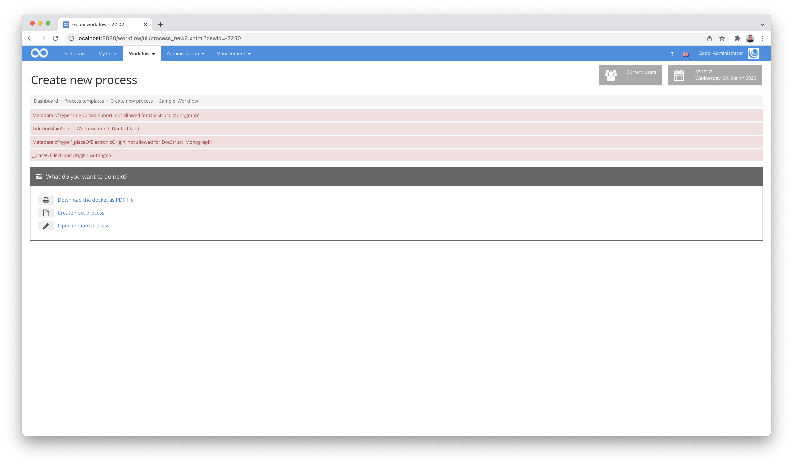
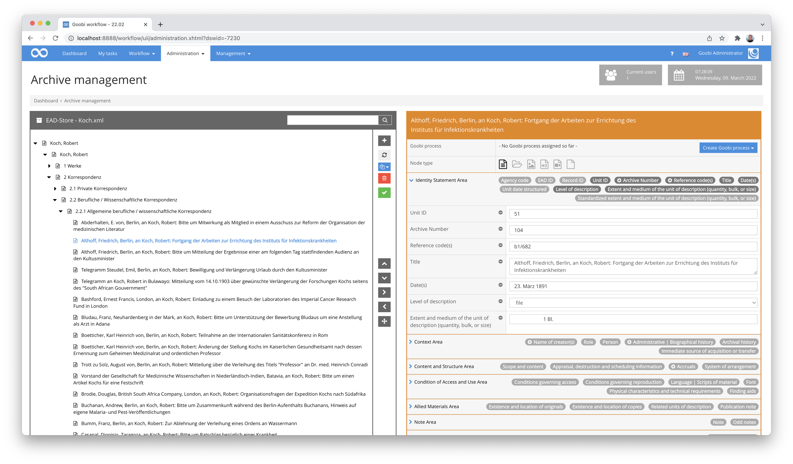
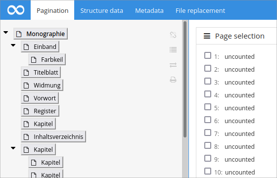
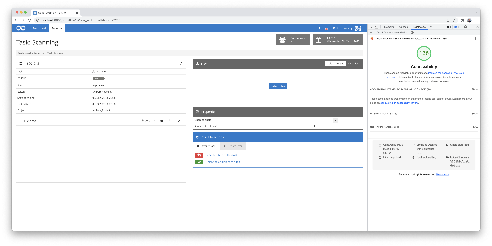
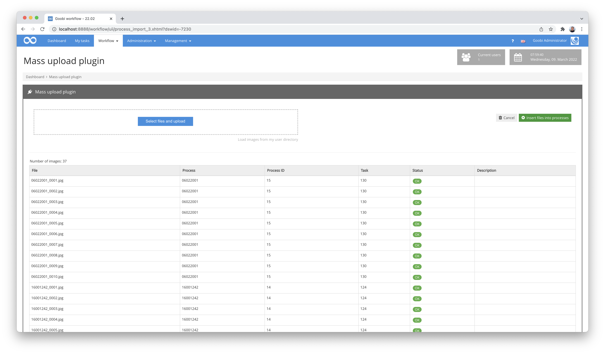
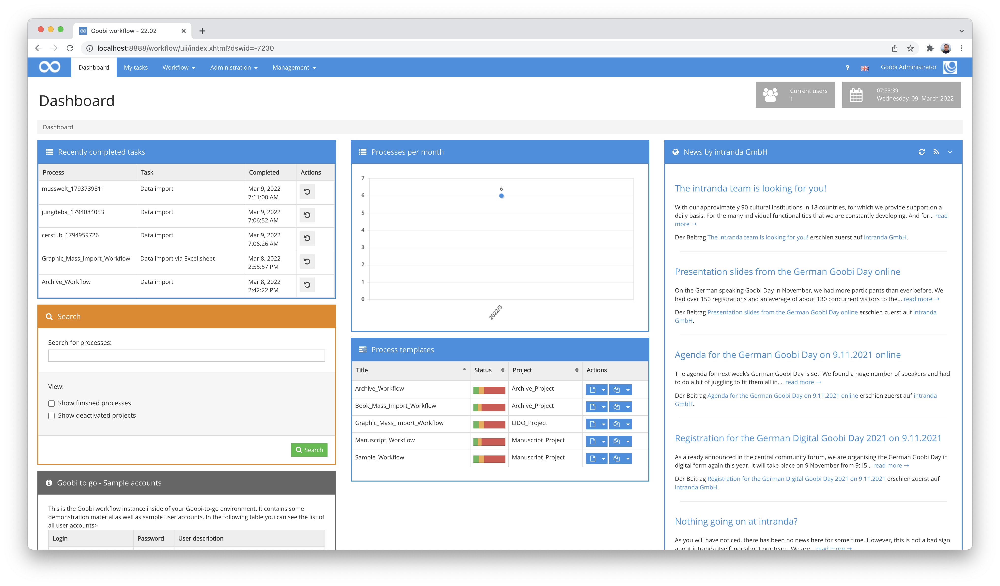
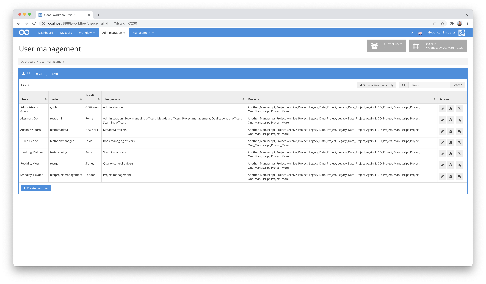
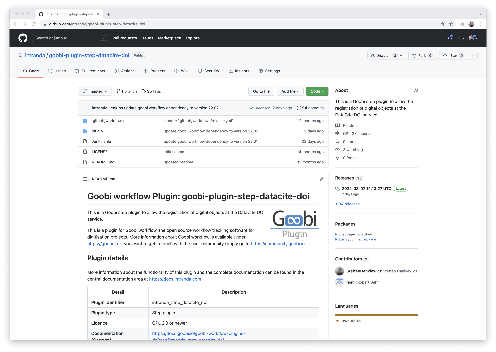
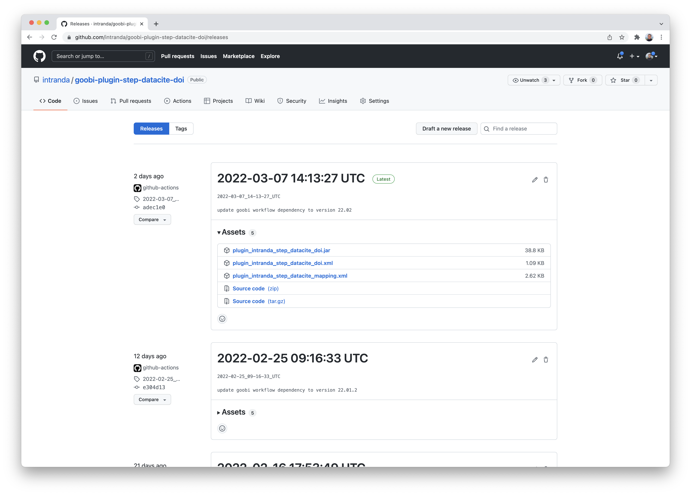

# November 2021

## Better display in case of metadata that cannot be imported

When a process is created in Goobi workflow and data from a catalogue is to be imported for it, it can occasionally happen that it has not already been configured for all the metadata provided where within the internal METS file the metadata is to be stored. This was previously not transparent for the user, so we have made a change. Metadata that cannot be transferred are now clearly visualised in the creation process.




## ALTO editor can be called from the thumbnail view

Since a few versions, Goobi workflow has offered the possibility to display and edit the results of a full-text recognition in ALTO format directly from the metadata editor. This functionality was previously only accessible from the single page display. With the changes made, however, this is also possible from the thumbnails and subsequently allows navigation between the images within the open editing screen.


## ALTO Editor supports ALTO 4.0

The already mentioned editor for full texts in ALTO format now supports the ALTO files in version 4.0 and allows their display and editing. This means that it is now also possible, for example, to display and edit the full texts of Transkribus.


## Various extensions to the archive management plugin

The archive management plugin is being used productively in more and more projects. In this context, new wishes, necessary adaptations or even visual changes are always needed, which we gradually implement. Recently, there have been several optical adjustments to the entry mask, which make it worthwhile to take a look at the functionality again.



As a reminder, here again is the detailed documentation of the plugin:




## Accessibility as an ongoing topic

With some developments, even with a lot of professional experience, one is still surprised at the extent to which they can take on and what one would not have expected. The topic of accessibility is a good example of this. We have already invested countless hours in optimising accessibility for Goobi workflow and already meet common validators. And yet there are always new surprises, as the following example shows:



This screenshot shows what effects changes can have if, for example, you change links to buttons so that screen readers, among others, can also handle them better. Of course, we didn't leave it like this, but styled it nicely again. However, if you find something similar in another part of Goobi workflow, please let us know so that we can correct it.

# Fine-tuning for accessibility

A few months after the actual accessibility work was completed, we noticed a few details that could be improved. These included the correct attributes in tables so that screen readers can interpret them correctly. 

The compatibility with the common validators remains under constant observation and we try to maintain 100% compatibility. However, it is important to keep in mind that validators change over time in terms of requirements and therefore constant monitoring of compatibility remains necessary. So the topic as such is probably never really finished. At the moment, however, it looks to Goobi workflow as if we have done our homework well:




## Mass Upload Plugin Customisation

The mass upload plugin is especially useful when many processes in Goobi worklow are to be automatically supplied with the corresponding image files. Experience has shown that this works quite well. However, the button for assigning the images to the identified processes allowed a double execution by repeatedly clicking on it. This then led to undefined behaviour, so this had to be changed. The corresponding button is therefore no longer displayed if it has already been clicked and images are being sorted into the processes.



By the way, we took the opportunity to make a small correction: If the parameter `use-barcodes` was set to `true` in the configuration and no barcode could be determined when uploading images, a meaningful error message is now displayed.

## Correction to Excel import

This item comes from the category "Unexpected side effects": In fact, a faulty configuration of the Excel import plugin could lead to the dashboard and the listing of process templates in Goobi workflow no longer being displayed correctly. We have made corrections here so that everything looks good again.



## Table layout in the user administration improved

Within the user administration, the display of the column with the buttons was too narrow, so that the buttons wrapped awkwardly. This has been remedied by making the column at least as wide as possible, so that it looks good even with many projects and user groups.




## Deleted and anonymised users removed from tasks

When users are deleted in Goobi, the user's record is not actually deleted in the background, but completely anonymised. This is done to ensure that the data as a whole remains complete. To make it clear that such users cannot actually be active in the workflow, such deleted users are now also removed from the list of authorised users for a task, provided they were assigned there. This is primarily a visual correction, as the user accounts were already deactivated and accordingly can no longer log in.


## Automatic release of almost all plugins as compiled files

The fact that Goobi worklow and almost all plug-ins are under an open source licence should already have become common knowledge. There are currently over 300 plug-ins for Goobi workflow and about 130 have already been published on GitHub at https://github.com/intranda. Many of the plug-ins already have quite detailed documentation at https://docs.goobi.io, which explains, among other things, how to install the plugins. Until now, however, you had to download and compile the plugins yourself as source code. This was cumbersome and very technical. Therefore we have changed this so that compiled versions of the plugins are now automatically stored on GitHub whenever we make a change to a plugin or release a new Goobi version. You can access these compiled plugins by clicking on `Releases` in the right-hand pane of the respective plugin.



Afterwards, one gets an insight into the downloadable files, which include the plugin itself as well as the possibly required configuration files. These files can now be downloaded and installed correctly according to the instructions, so that commissioning has been simplified considerably.




## Version number
The current version number of Goobi workflow with this release is: **21.11**.
Within plugin developments, the following dependency must be entered accordingly for Maven projects within the `pom.xml` file:

```xml
<dependency>
  <groupId>de.intranda.goobi.workflow</groupId>
  <artifactId>goobi-core-jar</artifactId>
  <version>21.11</version>
</dependency>
```