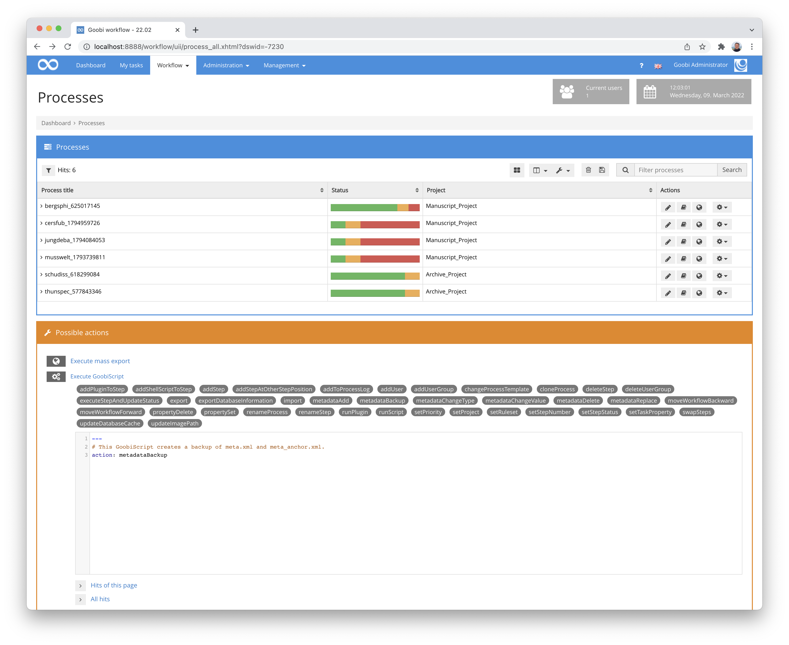
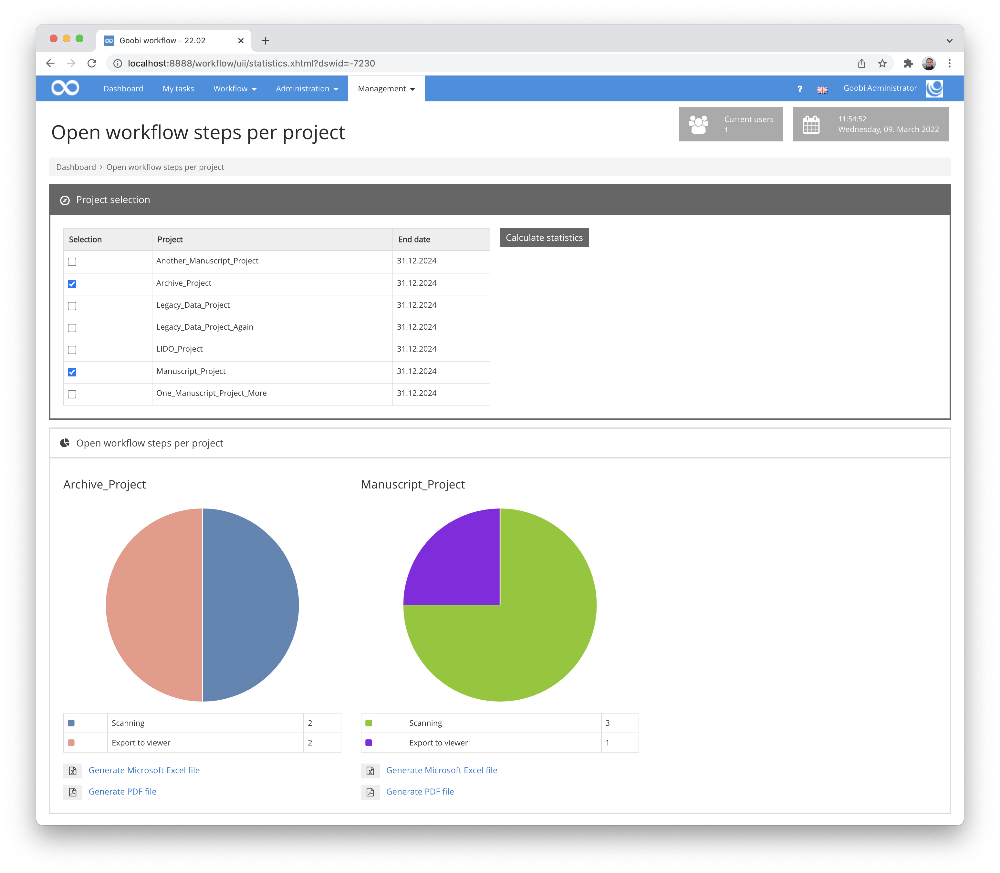
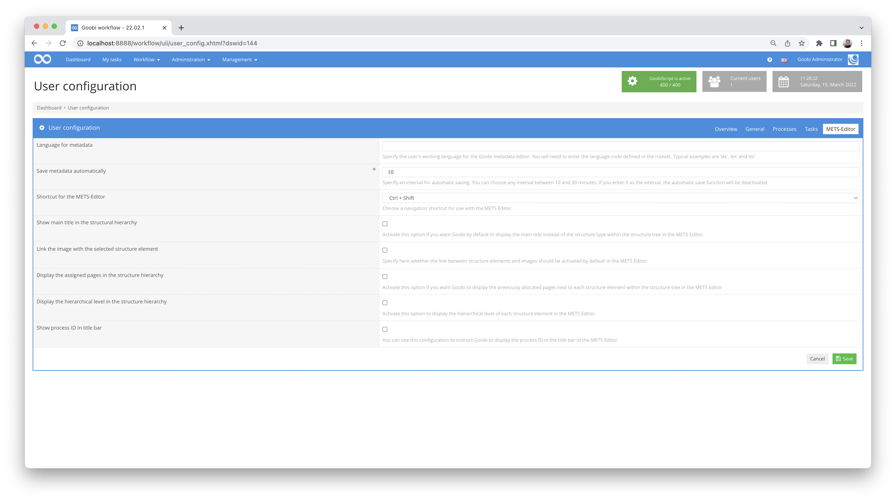
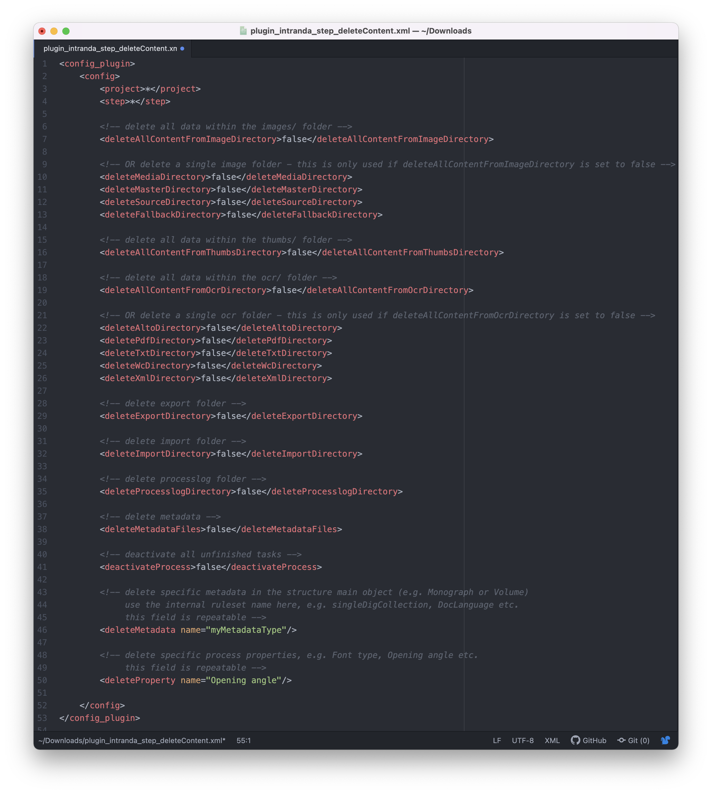
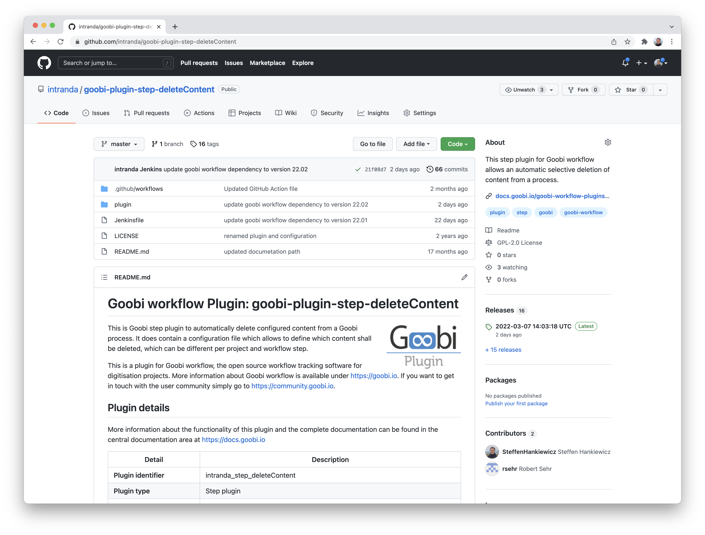
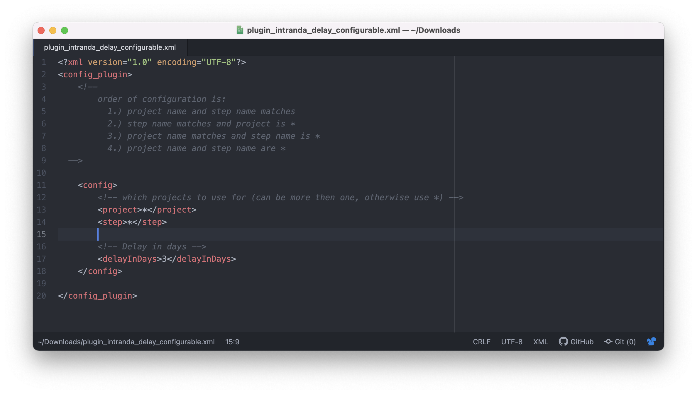
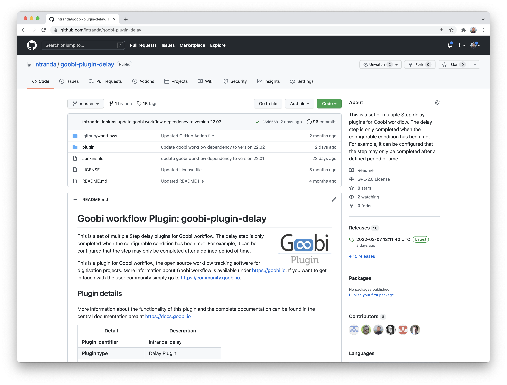
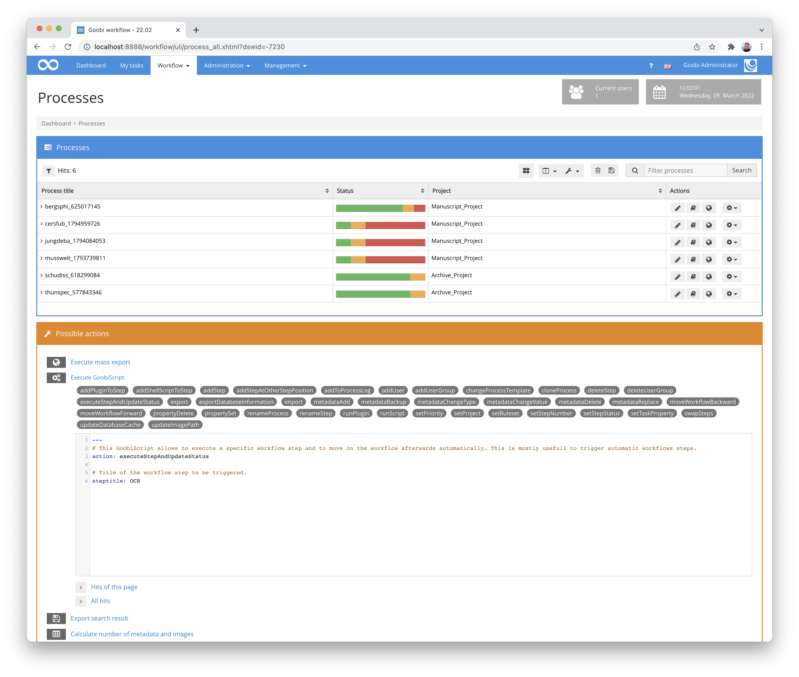
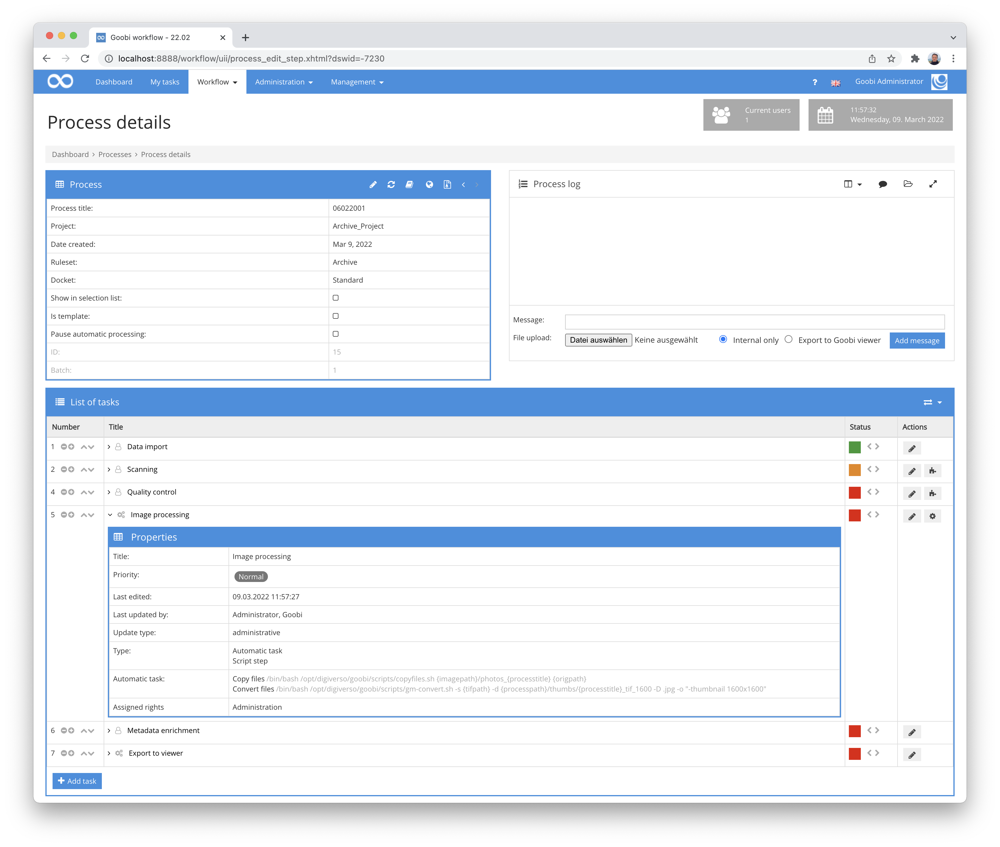
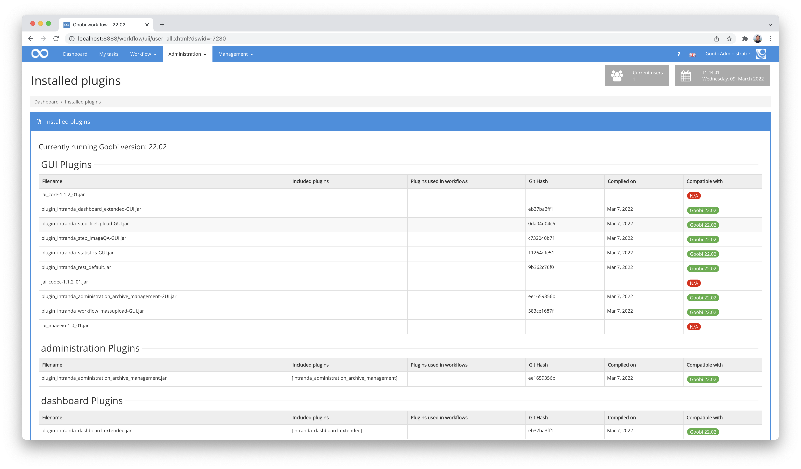

# December 2021

## Security vulnerability Log4j
Like many other well-known software solutions and websites, Goobi workflow was also affected by the security vulnerability within the Log4j programme library. At least theoretically. On the same day as the vulnerability became known, we updated the application, released a new version of Goobi workflow and updated about 200 servers. Security problems have therefore not occurred on any of the systems we look after. 


During the rest of the month, we continued to work intensively on Log4j, logging in general and further updates, and we developed several automatic junit tests.


## New GoobiScript: metadataBackup
Once again there is a new GoobiScript. It is called `metadataBackup` and allows you to easily create backups of the files `meta.xml` and `meta_anchor.xml`. These are the important internal METS files that belong to each process. Such a backup is particularly useful if automated changes are to be made to these files and a backup copy should therefore be created beforehand. 

The call of this GoobiScript is simple without further parameters:

```yaml
---
# This GoobiScript allows to create a backup of meta.xml and meta_anchor.xml.
action: metadataBackup
```




## Excel exports in statistics corrected
For a short moment, some Goobi installations were affected by the fact that Excel files could no longer be generated from the statistics. The reason for this was the update of a programme library for Excel files and the associated change of the file format. We have corrected this with the update.




## Corrected save interval error
If users adjusted the time period for the automatic saving of metadata, this caused loading problems when entering the metadata editor. This has been fixed.




## Extension of the plugin for automatic deletion of content
The plugin for automatically deleting content from Goobi workflow has been extended. It is now possible to delete specific metadata and properties. This is useful, for example, if data is to be automatically anonymised after a set period of time.

The configuration options have been extended and documented for this use case:



The plugin itself for the installation as well as the source code can be found as usual on GitHub at the following URL:






## Extension of the delay plugin for multiple configurations
The delay plugin for automatic pausing of workflows for a configurable time has been significantly extended. Instead of allowing only one central configuration as before, it is now possible to create a single configuration block per project or work step, as is the case with most other plugins. This means that the same plug-in can be used several times in different projects and workflow steps and can behave differently.

An exemplary configuration looks as follows:



And of course this plugin is also published on GitHub:






## GoobiScript executeStepAndUpdateStatus adapted
The GoobiScript `executeStepAndUpdateStatus` ignored the configured queues when calling steps. This has now been fixed, so that the execution is regularly enqueued in the configured message queue and thus correctly prioritised.




## Execution of scripts within the process details
The execution of scripts within the process details also previously ignored the execution within a queue. This has been corrected so that they are now also executed within the message queues and correctly prioritised.




## Plugin overview now also shows content from the goobi/lib folder
The handy plugin overview with its version display for each individual plugin is a great help to Goobi administrators for maintenance. After all, it is easy to see whether all plugins are compatible with the Goobi version installed. Missing from this list, however, are those plugins that are stored in the directory `goobi/lib`. In order to be able to see them in the list and check their status, the overview page has been extended.




## Accessibility: Dropdown buttons revised
Again this month, there have been some accessibility improvements. Among other things, all buttons that have a dropdown functionality have been adapted so that their state (open vs. closed) can be processed well by screen readers. 


## Version number
The current version number of Goobi workflow with this release is: **21.12**.
Within plugin developments, the following dependency must be entered accordingly for Maven projects within the `pom.xml` file:

```xml
<dependency>
  <groupId>de.intranda.goobi.workflow</groupId>
  <artifactId>goobi-core-jar</artifactId>
  <version>21.12</version>
</dependency>
```