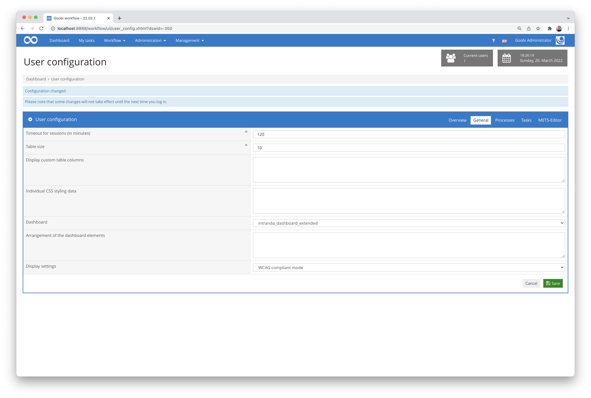
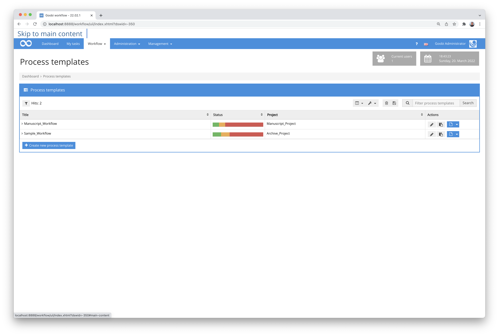
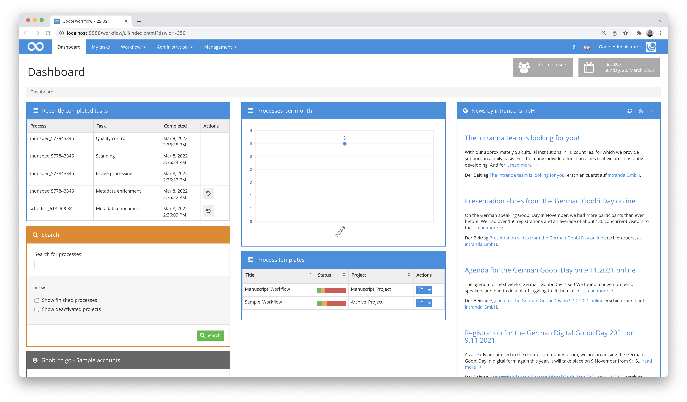
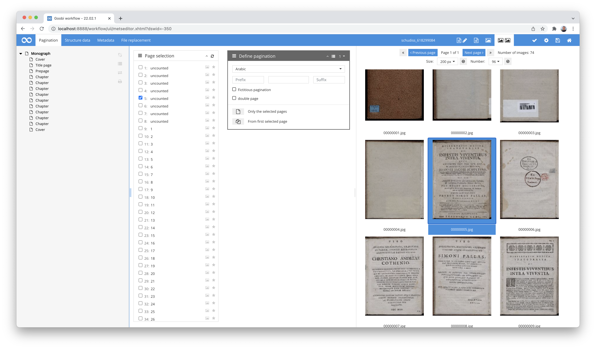
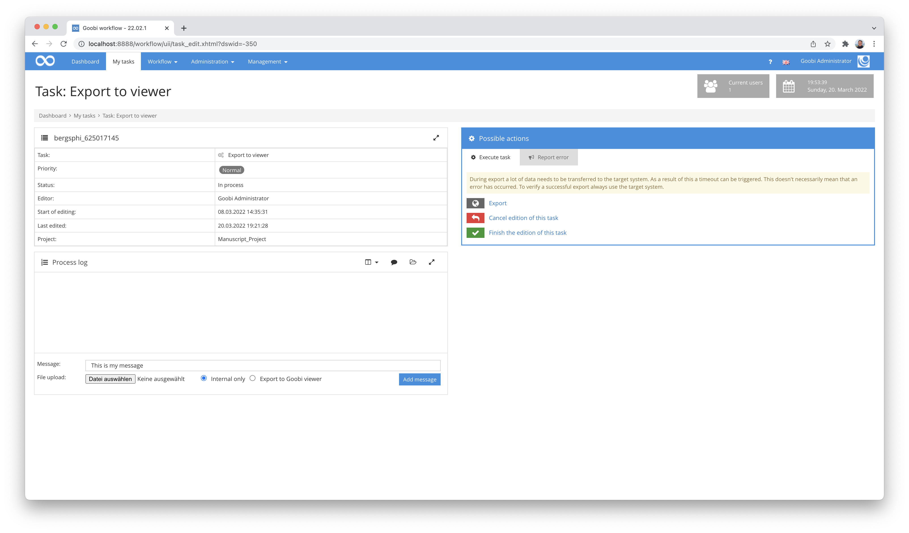
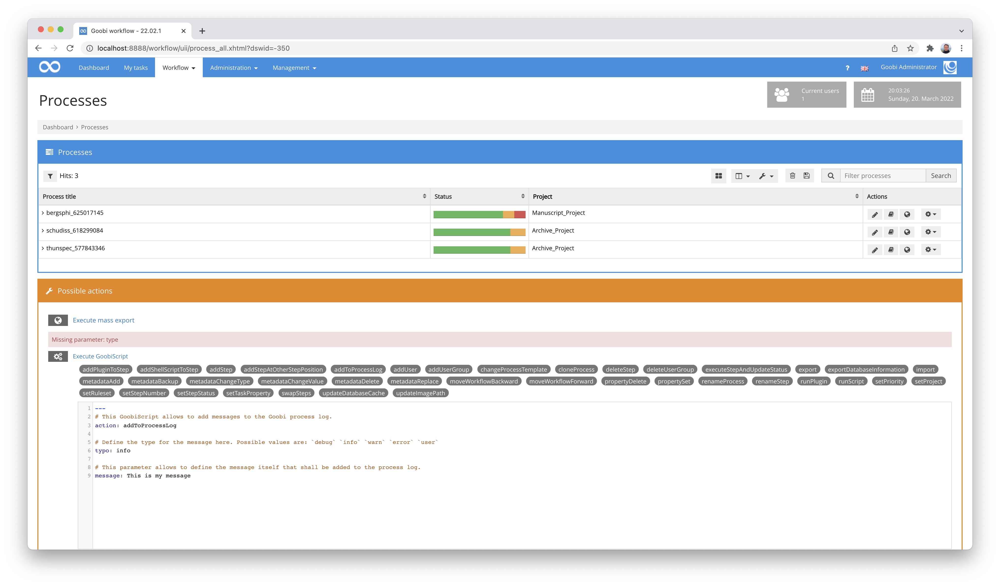
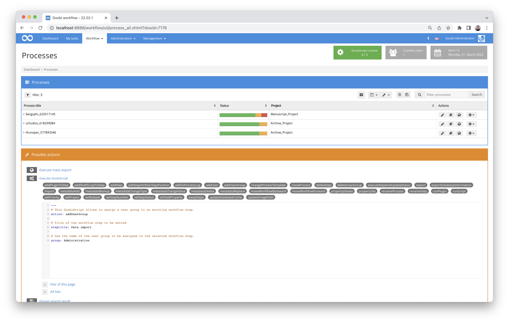
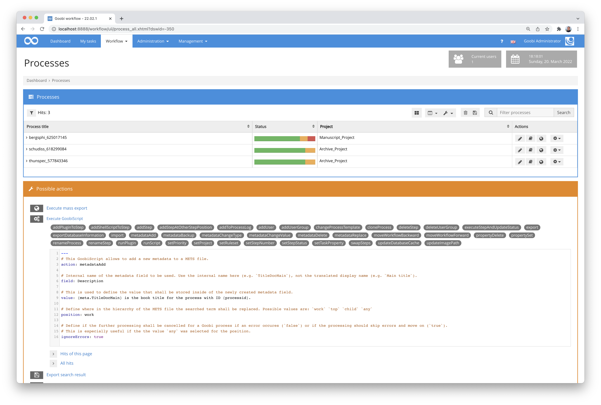

# January 2022

## Extension of the user settings for individual configuration of the display mode
Within the user settings, there is now the option in the `General` section for each user to individually define the display mode. You can choose between `Normal display`, `Low vision mode` and the `WCAG compliant mode`.



This option is of course in addition to the possibility for each user to customise the layout of Goobi themselves via their own CSS definitions.


## Adjustments to the configuration editor
In the configuration file editor plugin, it is now possible to configure a list of directories in which files are to be searched for editing. The new configuration now looks as follows:


```xml
<config_plugin>

    <configFileDirectories>
        <directory backupFiles="16">/opt/digiverso/goobi/config/</directory>
        <directory backupFolder="wizzardBackup/" backupFiles="4">/opt/digiverso/layoutwizzard/</directory>
        <directory backupFolder="itmPluginsBackup/" backupFiles="4" fileRegex="\.xml">/opt/digiverso/itm/plugins/config/</directory>
        <directory backupFolder="itmBackup/" fileRegex="\.xml">/opt/digiverso/itm/config/</directory>
        <!--
        Example:
        <directory backupFolder="exampleBackup/" backupFiles="12" fileRegex="\.xml">/opt/digiverso/example/config/</directory>
        -->
    </configFileDirectories>

</config_plugin>
```

In this context, it was considered that the editor should not be used to change its own configuration file. This would otherwise have allowed authorised users to define additional paths for the editor in order to carry out more profound interventions in the system.

The documentation for the plugin can be found here:




## Skip Link
As part of our ongoing improvement of the user interface to increase accessibility, we have now also taken a closer look at the central `Skip Link`. This is located at the top of all pages and allows users with keyboard control to navigate immediately to the content area of the page via the `TAB` key. So now there has been a small correction for the correct order of scrolling through the page elements.




## Tasks from production templates no longer in the dashboard
Within the dashboard, which the majority of Goobi workflow users use, the most recently completed tasks are displayed. In the past, tasks from recently processed production templates were inadvertently listed there. A correction has now been made to avoid this display error.




## Comments on individual images now possible
With the new developments, it is now possible to write comments on individual images. This comment function is integrated in several places in Goobi workflow: in the METS editor, in the ImageQA plugin and also in the LayoutWizzard. To use this new functionality, it must be activated within the central configuration file `goobi_config.properties`:

```toml
ShowImageComments=true
```


## Thumbnail selection only affects pagination
Until now, clicking on a thumbnail in the metadata editor always set the current page in the pagination, even if you were in the structure data view, for example. This could inadvertently lead to operating errors if further pagination work was to be carried out later. By changing the operating logic, a click on the thumbnails now only changes the page selected in the pagination if you are actually in the pagination.




## Error in the process log when Enter is pressed
There was an error in the transaction log when a user pressed Enter after entering a message. The display was changed there instead of sending the message. This error is now fixed.




## Checking all buttons
All buttons within Goobi workflow have been intensively checked to ensure that they continue to function and are displayed correctly after the extensive accessibility changes. If we have overlooked a button or functionality, please let us know.


## Invalid Goobiscript syntax now directly refuses to work
Up to now, the GoobiScript parser first displayed the confirmation prompt when invalid YAML syntax was used and then displayed an error at the very top of the page. This led to confusion among users because the previously sent GoobiScript was not executed as expected after all. For this reason, from now on the GoobiScript will be checked for validity directly after it has been sent and, in the event of an error, an error message will be displayed directly above the GoobiScript area.




## GoobiScript "addUserGroup" can now be successfully called multiple times
There was a misbehaviour in the GoobiScript `addUserGroup` which, when called multiple times, resulted in only the last added user group being added to the desired task. This behaviour has now been fixed and the GoobiScript behaves correctly from now on.




## No more leading or trailing spaces in vocabulary management
In the vocabulary management, leading and trailing spaces are now removed from all text fields (Input, Textara, HTML) to avoid such accidental entries and the potential problems resulting from them.


## Metadata changes via GoobiScript using VariableReplacer
The GoobiScripts `metadataChangeValue`, `metadataAdd`, `metadataDelete` and `metadataReplace` now use the Variable Replacer for content changes, allowing very flexible use involving other metadata field contents or even information about the process to which the metadata belongs.

An example call looks like this:

```yaml
# This GoobiScript allows to add a new metadata to a METS file.
action: metadataAdd

# Internal name of the metadata field to be used. Use the internal name here (e.g. `TitleDocMain`), not the translated display name (e.g. `Main title`).
field: Description

# This is used to define the value that shall be stored inside of the newly created metadata field.
value: {meta.TitleDocMain} is the book title for the process with ID {processid}.

# Define where in the hierarchy of the METS file the searched term shall be replaced. Possible values are: `work` `top` `child` `any`
position: work

# Define if the further processing shall be cancelled for a Goobi process if an error occures (`false`) or if the processing should skip errors and move on (`true`).
# This is especially useful if the the value `any` was selected for the position.
ignoreErrors: true
```

As before, more information is available here on the Goobi workflow variable system:






## Version number
The current version number of Goobi workflow with this release is: **22.01**.
Within plugin developments, the following dependency must be entered accordingly for Maven projects within the `pom.xml` file:

```xml
<dependency>
  <groupId>de.intranda.goobi.workflow</groupId>
  <artifactId>goobi-core-jar</artifactId>
  <version>22.01</version>
</dependency>
```