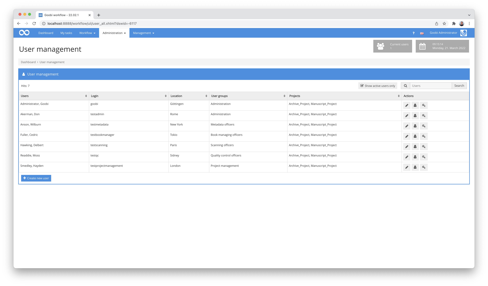

# February 2022

## Flip functionality in the QA plugin
Within the plugin for the quality control of files, it has already been possible for some time that specific individual files can also be changed, provided that this has been activated in the configuration. For example, images can be permanently rotated or even deleted. A new feature is that images can now also be mirrored. This is possible both horizontally and vertically.


To use this functionality, the configuration must be adapted according to the specifications. As before, the details can be found in the plugin documentation:




## Clearer reporting of errors when extracting PDF files
If PDF files are to be used in the workflow, routines are available that automatically extract the contents of the PDF files and convert them to images. In the past, however, there was occasionally a display of irritating messages in the case of errors that occurred. This has been changed accordingly and is now much more meaningful and helpful for users.


## Sorting of users now more intuitive
The sorting of the display of users within Goobi workflow was not quite intuitive until now. This has now been fixed and the sorting is more intuitive without the upper and lower case of names having unexpected side effects.




## New GoobiScript for cloning processes
Once again we have a new GoobiScript. This time we needed a functionality that allows us to completely duplicate existing processes in Goobi workflow together with their associated data. The title of the process to be used can be freely defined using variables. It is also possible to specify whether only the data from the database or also all internal directories are to be duplicated.

This is what the new GoobiScript looks like:

```yaml
---
# This GoobiScript allows to clone an existing process and store it under a new name.
action: cloneProcess

# Title for the new process that is created. Please notice that typically no special characters and no blanks are allowed.
title: "{processtitle}_copy"

# You can define here now much of the content shall be cloned. Possible values are `all` (all data, the database entry and the METS file), `empty` (no data, just the database entry and the corresponding METS file)
content: all
```

And as before, the full documentation for GoobiScript can be found at this address:




## Execution of a plugin from the transaction details now writes a message to the transaction log.
Until now, it was the case that the call of a plugin from the transaction details was not included in the transaction log. For better traceability, however, this would be practical from time to time. For this reason, we have now changed the logic of the execution so that such executions are also included in the operation log.


## Ruleset file now dropdown selectable
For the configuration of rulesets within the administrative interface of Goobi workflow, the file names of the rulesets in the central ruleset directory `/opt/digiverso/goobi/rulesets/` had to be specified until now. There has now been a small change here. Instead of having to enter the file name manually, it can now be selected from a drop-down list. This avoids possible typing errors when specifying rulesets for the future.


## Breadcrumbs corrected after creating a process
When you have created and saved a new process within Goobi workflow, it is possible to go directly to the newly created process from there by clicking on the link `Open the created process`. The breadcrumb displayed there for navigating to the complete list of all processes used to occasionally lead to an empty hit list. This has now been corrected so that the navigation works correctly and lists all processes at this point.


## Rights management: Bug fixed
Goobi workflow allows individual plugins to define their own rights, which a user must have in order to run the plugin. Accordingly, it is possible to configure such flexible rights in the user administration of Goobi worklow. However, until recently it was also possible to add empty rights there, i.e. without specifying a right. This has now been corrected so that such an error entry is no longer possible.


## Ruleset file can be viewed in the activity details
In the past, when working with several rule sets, it was often necessary to check again in the area `Administration` - `Rule sets` which rule set file it actually was (e.g. for the rule set `Standard`). In order to make this search easier, we have now implemented a small functionality that displays this file name directly within the transaction details when you hold the mouse pointer over the rule set name.


By the way, we have already implemented the same functionality in various other areas in the past. For example, in the properties:


And there is also this hidden function in the metadata:


## New backup system for meta.xml and meta_anchor.xml
The old backup system in Goobi workflow used to work only with a counter at the end of the file for the names of the backups. The file with the highest counter was the oldest backup:

```bash
meta.xml.1
meta.xml.2
meta.xml.3
```

This system had problems, especially in hierarchical file systems, because rarely used files are stored in a slower storage area. However, since the older backups were always renamed with the previous backup system, this sometimes resulted in very long storage times. Therefore, we have revised the mechanism of naming these backup files and now use a time stamp to name the backup files. The naming scheme is as follows:

```
YYYY-MM-DD-HHmmssii
2022-02-25-113430394
```

Here, `ii` is the milliseconds in the second. An example of a new backup file looks like this:

```bash
meta.xml.2022-02-25-113430394
```


## Backup rotation: Only files managed by Goobi are treated
With the old backup solution in Goobi workflow, files not managed by Goobi were included in the rotation in the past (for example `meta.xml.MYBACKUP`). This resulted in manually created backups being rotated away or the manually created file not being saved to disk. As of this release, Goobi only considers files `meta.xml.1`, `meta.xml.2`, `meta.xml.3` etc. and backups created according to the new scheme for rotation. Manually created backups, on the other hand, remain unchanged.


## Better metadata collection for image areas
The fact that metadata can now also be recorded for page areas in the metadata editor has been possible for about 1-2 years. What became apparent during daily use, however, was that better usability was still needed to add several page areas to a structural element or to adjust the size of such page areas or even to delete them. We have now implemented some improvements here.


Für ein Strukturelement können im Bereich zum `Ändern von Strukturelementen` nun weitere Seitenbereiche ergänzt werden:


Und hier lassen sich bereits angelegte Seitenbereiche auch wieder einfach entfernen.


## Excel import can now fail in a controlled way with missing images
Until now, the Excel Import plugin ignored missing image folders and continued with the next process. Our concern, however, was that in such a case of use, there should be transparent communication with the user so that he or she would also be better informed of the missing images. With the extension of the plugin, this has now become possible. The following excerpt from the configuration illustrates how such situations can be handled from now on:

```xml
<importImages failOnMissingImageFiles="true">
    <!-- prefix path to the image folder. Can be empty or missing if the import doesn't contain images or if the excel field contains absolute path  -->
    <imageFolderPath>/opt/digiverso/images/</imageFolderPath>
    <!-- define which column contains the image folder name. Can be combined with <imageFolderPath> prefix or an absolute path.
    If the field is missing, empty or does not contain an existing directory, no images will be imported -->
    <imageFolderHeaderName>images</imageFolderHeaderName>
    <!-- Image handling strategy. Valid values are "move", "copy" or "ignore".  -->
    <imageHandlingStrategy>move</imageHandlingStrategy>
</importImages>
```

## Improvements when updating the database schema
After an update, Goobi workflow checks whether the database schema is still up-to-date. If it is not up to date, an update is usually performed automatically, bringing the version of the schema to the current version. In some cases, however, something went wrong with this update and the version number in the database was increased anyway. This resulted in an outdated schema with the current version number saved. However, the error handling has now been improved so that the current version is no longer written to the database after an error. This prevents possible incompatibilities in the future.


## GoobiScript executeStepAndUpdateStatus now also closes the step for step plugins.
There was a misbehaviour in the GoobiScript `executeStepAndUpdateStatus` that prevented steps where a plugin is configured from closing correctly. This behaviour has now been corrected so that steps are now reliably closed when called by this GoobiScript.


## Determine number of metadata and images: Order of tables changed
Previously, when clicking on the `Get number of metadata and images` link below the table of processes in Goobi workflow, the table with the results for each process was displayed first. However, as most users are more interested in the table with the summary, we decided to swap the order of the tables so that the summary now appears first without having to scroll through all the processes first.


## Version number
The current version number of Goobi workflow with this release is: **22.02**.
Within plugin developments, the following dependency must be entered accordingly for Maven projects within the `pom.xml` file:

```xml
<dependency>
  <groupId>de.intranda.goobi.workflow</groupId>
  <artifactId>goobi-core-jar</artifactId>
  <version>22.02</version>
</dependency>
```