# March 2022

## New GoobiScript for changing person roles
For some time now, there have been various GoobiScripts that can very conveniently make changes even to metadata in bulk. In the past, we have often focused on regular metadata. With a new GoobiScript we now also allow changes to persons. The reason for this is that we needed a convenient way to change the roles of persons in bulk, for example, to be able to make inventors instead of wrongly assigned person roles as authors in 100,000 transactions. In such a case, the call to the new GoobiScript would look like this:

```yaml
# This GoobiScript allows to change the type of an existing person.
action: metadataChangePersonType

# Define the current type that shall be changed. Use the internal name here (e.g. `TitleDocMain`), not the translated display name (e.g. `Main title`).
oldType: Author

# Define the type that shall be used as new type. Use the internal name here as well.
newType: Inventor

# Define where in the hierarchy of the METS file the searched term shall be replaced. Possible values are: `work` `top` `child` `any`
position: work

# Define if the further processing shall be cancelled for a Goobi process if an error occures (`false`) or if the processing should skip errors and move on (`true`).
# This is especially useful if the the value `any` was selected for the position.
ignoreErrors: true
```

As always, this and the many other GoobiScripts are described in detail in the online documentation.

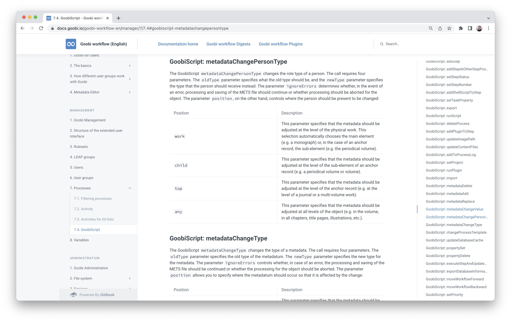

Here is the link to further help:




## New documentation for developers
It took a long time. But it has turned out really well: There is now very detailed documentation for future Goobi workflow developers. It shows in detail how to set up a development environment, which tools are needed for commissioning and which settings should be made here and there so that development runs smoothly.

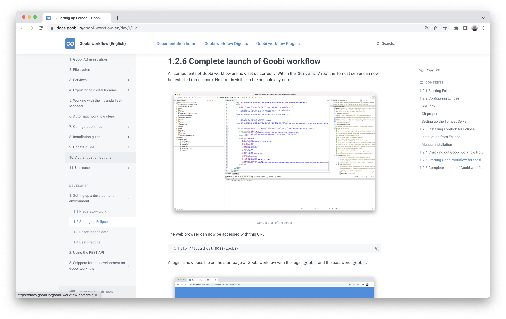

In order to make it as easy as possible for future developers, we have also documented in the instructions how to set up a small, meaningful dataset very conveniently, so that development is also possible with actual meaningful data. For this, we benefited from our many experiences with Goobi-to-go.

So if you've always wanted to help develop Goobi, it's now easier than ever. Click here for the documentation:




## Export button now in the "Actions" column of the workflow details
Goobi worklow has for some time allowed exports to take place within a workflow via plugins. This is sometimes necessary for individual exports to special systems with special format requirements. However, if several exports are to take place within a workflow, it was previously not possible for administrators to specifically execute a particular export of a workflow. However, the exports already functioned as desired when the workflow was run through.

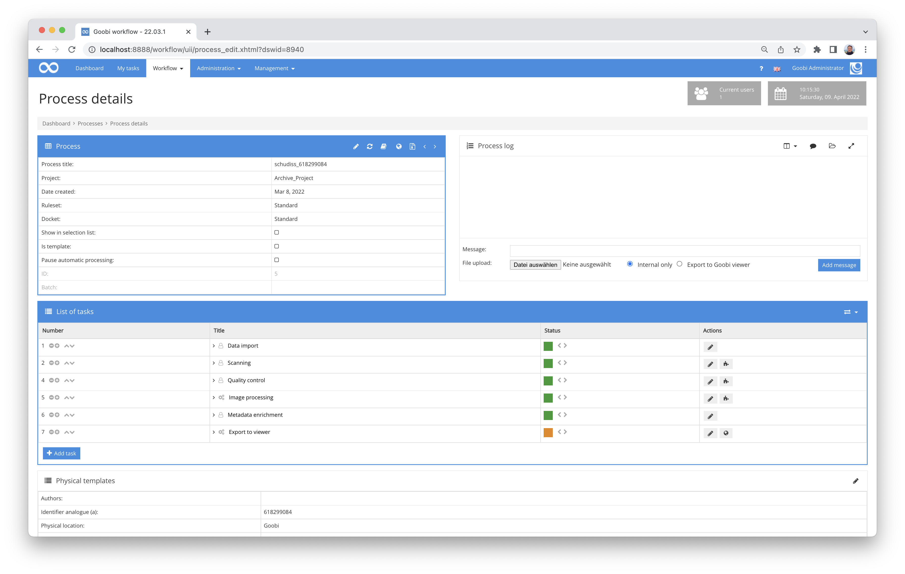

To make it easier for Goobi administrators to selectively call up individual export steps manually, export buttons are now displayed within the process details directly next to the relevant tasks. This means that they can now be called up as desired.


## Better logging when changing a step status via GoobiScript
We noticed that the logging within the process log was still in need of improvement when the status of tasks was changed via GoobiScript. We wanted both the old and the new status to be easily traceable in the process log. For this reason, we have now made a small adjustment that makes such status changes more comprehensible.

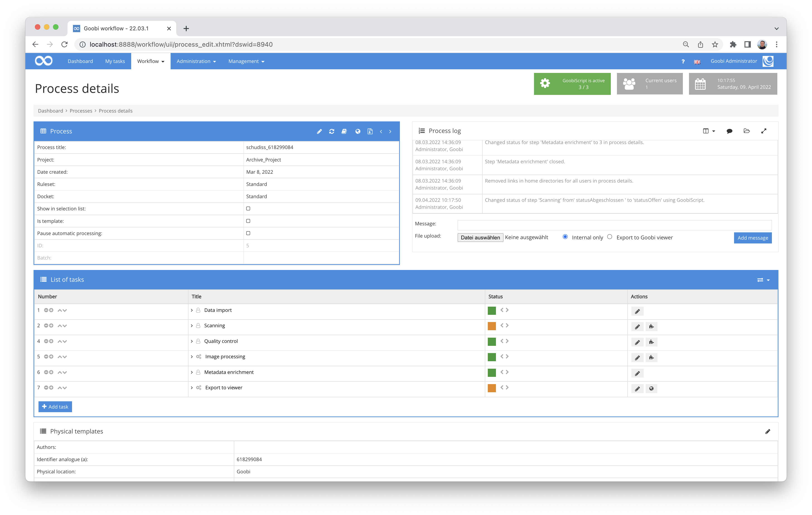


## Naming of backup files in the editor for configuration files and rule sets
We had recently already changed the naming of the backup files for the METS files of the Goobi processes so that they are better traceable in the editor, do not rotate further and thus cause unnecessary write accesses to slow memory areas. In order to implement this naming scheme consistently, we are now also using this mechanism for the automatically generated backups of the files that are created within the still quite new editors for the configuration files and rulesets.

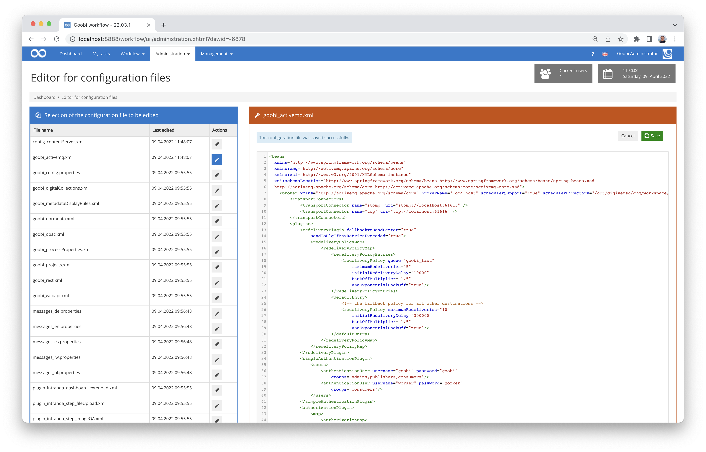

Here, too, the naming of the backup files is now such that the date and time of the backup is immediately apparent from the file name and is a good help if the worst comes to the worst.

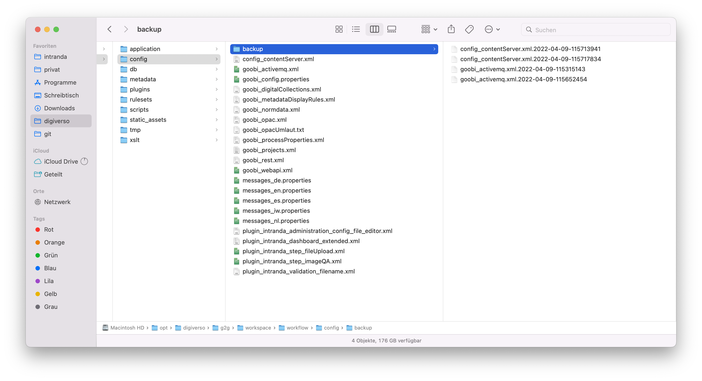


## WCAG: Changes here and there
We have already described several times that the topic of accessibility is not only of interest to us but also occupies us full-time. In this respect, it is only logical that we have again improved many small things in favour of accessibility this month. This mainly concerned the display of the process log and some adjustments for the display of the process list.

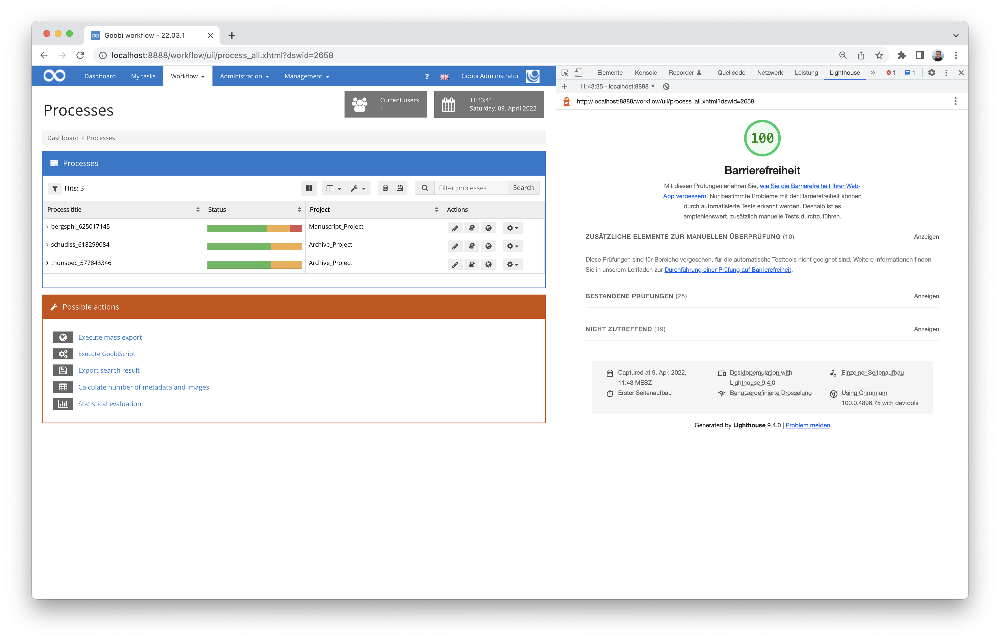

But it will certainly not be the last time that this item is listed here in the digests 😀


## Implementation of an ARK registration
We have already integrated various mechanisms for persistent identifiers into Goobi workflow in the past. In addition to URNs, Handle and DOI have also found their way into the Goobi universe. Recently, support for ARK identifiers was added. This is another system that, in interaction with the Goobi viewer, allows permanent linking of works and also granular linking at page level. Unlike other systems, ARK identifiers do not require a licence fee and can be freely assigned independently. More information on ARK in general can be found here:



And here you can find the documentation for the plugin we developed:



The source code for the plugin is published on GitHub here:




## Ruleset as new column for processes and process templates
Sometimes it is helpful to see at a glance which ruleset is used for a process template. For this reason, the ruleset can now be displayed within the listing of processes and process templates. This is what it looks like:

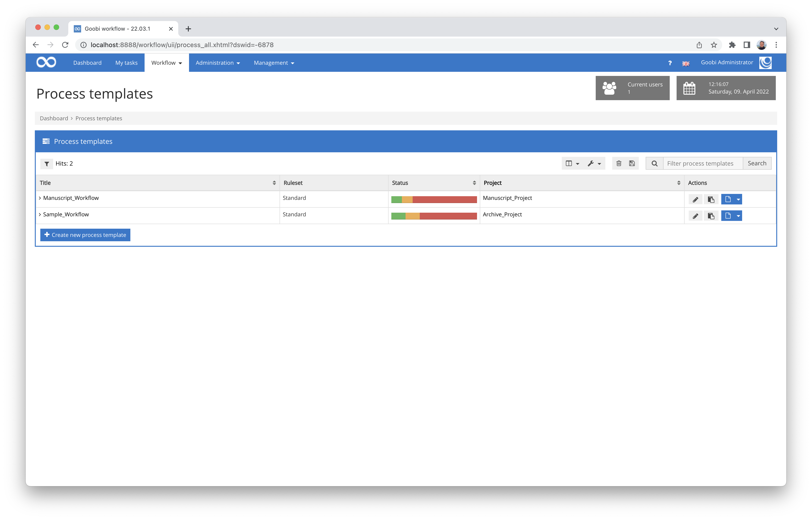


## Plugin for sending mails
A new plugin for sending mails within a task has been developed. The list of recipients and the text can be configured individually for different steps. All fields from the variable-replacer are also available. This means that metadata or information about the task, step or project can also be accessed in order to use them within the mail.

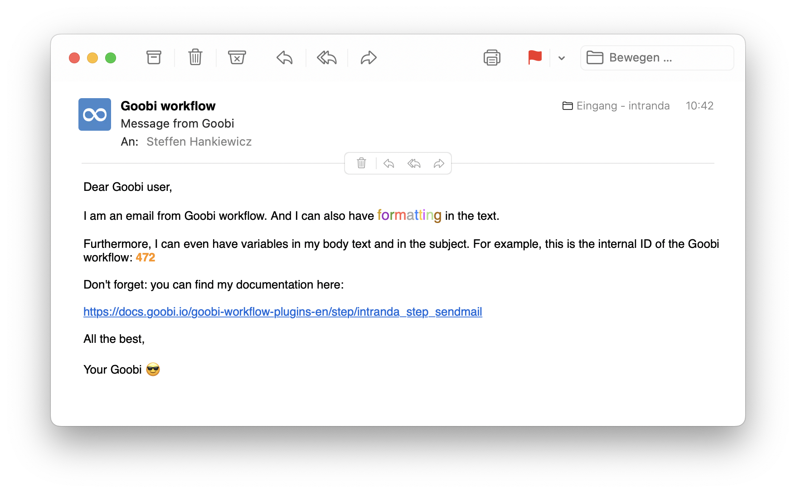

The detailed documentation for the commissioning of the plugin can be found here:



And at this point the plugin can be found as source code and in compiled version:




## Extension of the user settings for individual configuration of the display mode.

In the "General" area, there is now the option to individually define the display mode. Here you can choose between normal display, low vision mode and WCAG compatible mode.

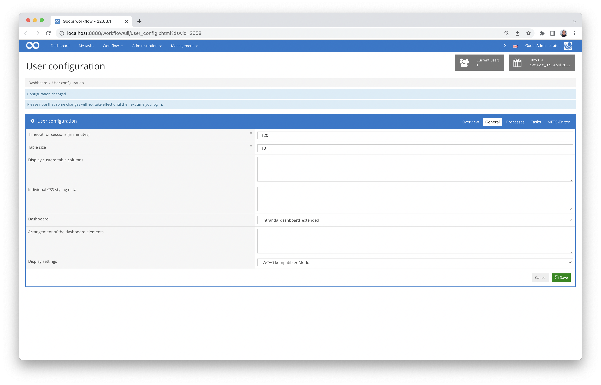


## Plugin for exporting newspapers to the DDB newspaper portal
We have developed a new plugin for exporting newspapers to the DDB newspaper portal. The plugin is used to create the specific METS structure required by the DDB for newspapers. A METS anchor file is created for the entire record of a newspaper. (https://wiki.deutsche-digitale-bibliothek.de/display/DFD/Gesamtaufnahme+Zeitung+1.0)

For each exported volume, another METS anchor file is created and linked within the overall record. The volume contains further structures for month and day. (https://wiki.deutsche-digitale-bibliothek.de/display/DFD/Jahrgang+Zeitung+1.0)

Each issue, on the other hand, is created as a single METS file and linked in the METS anchor file of the respective year. The issue may contain further structural data such as article descriptions or supplements. The digitised images are also referenced here. (https://wiki.deutsche-digitale-bibliothek.de/display/DFD/Ausgabe+Zeitung+1.0)

Detailed documentation for the plugin can be found here:


And at this point you will find both the source code of the plugin and the compiled version of the plugin:



## Extensive changes in the internal project structure
The development of Goobi workflow started in 2004. In the meantime, many new functionalities have been added and the application has grown many times over. In order to maintain a good overview, but also to comply with established best practice for software development (Maven directory structure) and to make it even easier to keep the programme libraries used up to date in the future, we have massively revised the project structure. This should not result in any functional changes for the users. For us as developers, however, these are extensive interventions in everyday work and project organisation. If you notice any undesirable side effects when using Goobi workflow in the near future, which should certainly not be desired, please let us know.

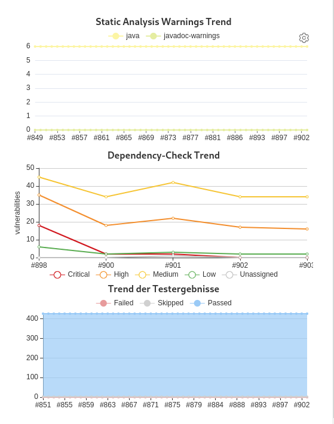

Incidentally, these changes have also already shown some positive results. The updates made to various programme libraries as a result of the changeover have already led to a measurable increase in the security of potentially vulnerable code components of external libraries and a better ability to automate testing for possible future security vulnerabilities.


## Display error in a dropdown in the own tasks
There was a small display error within the own tasks. There was an idiosyncratic line break with unusual character representation that did not belong there. We have corrected this. Nothing happened 😀


## Version number
The current version number of Goobi workflow with this release is: **22.03**.
Within plugin developments, the following dependency must be entered accordingly for Maven projects within the `pom.xml` file:

```xml
<dependency>
  <groupId>de.intranda.goobi.workflow</groupId>
  <artifactId>goobi-core-jar</artifactId>
  <version>22.03</version>
</dependency>