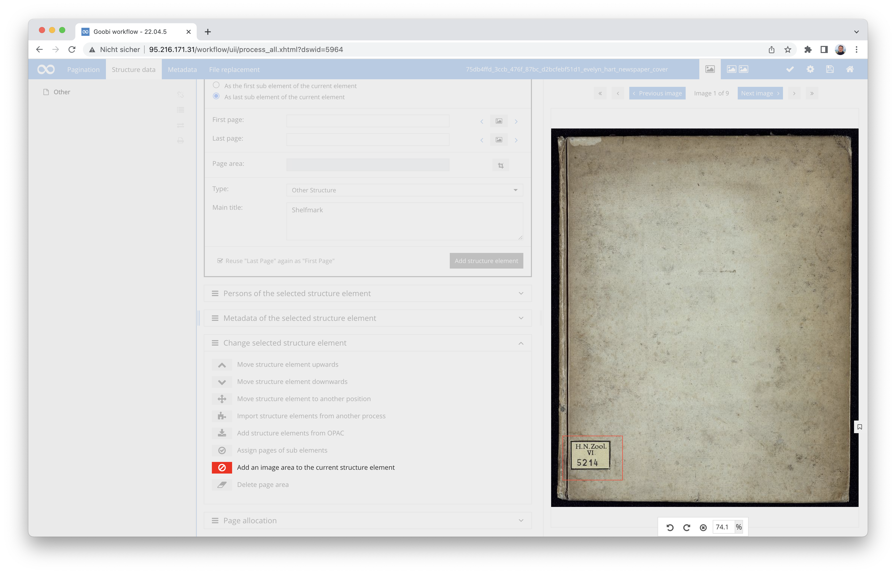
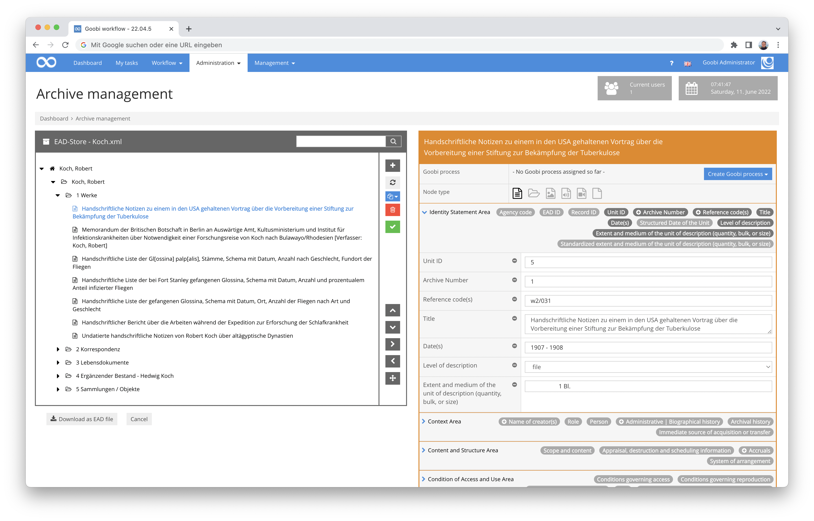
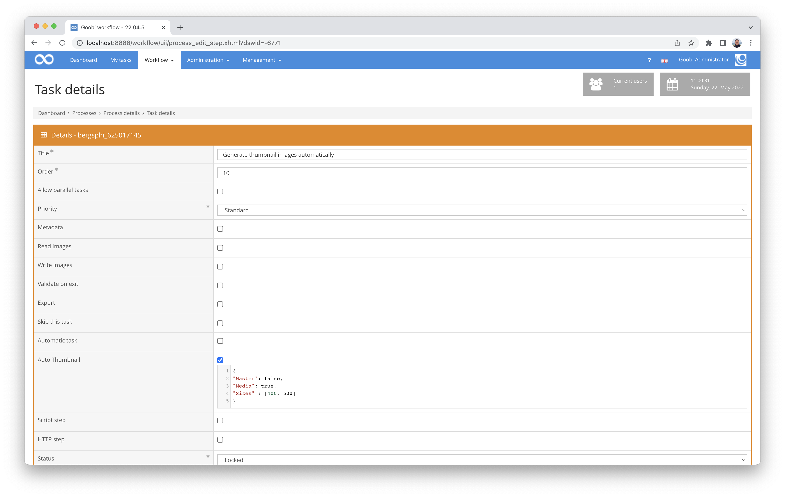
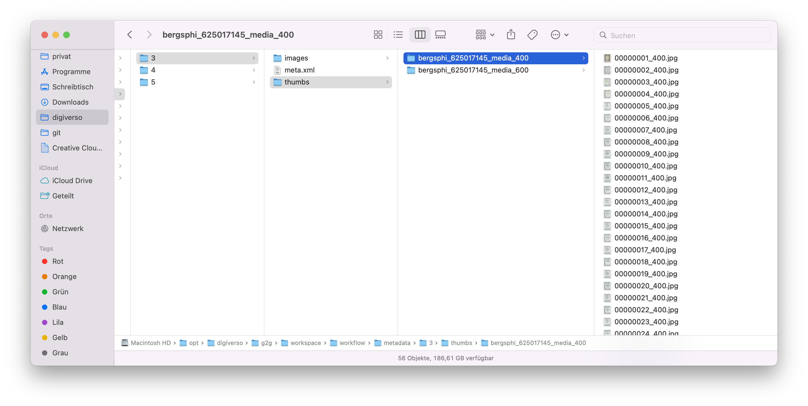
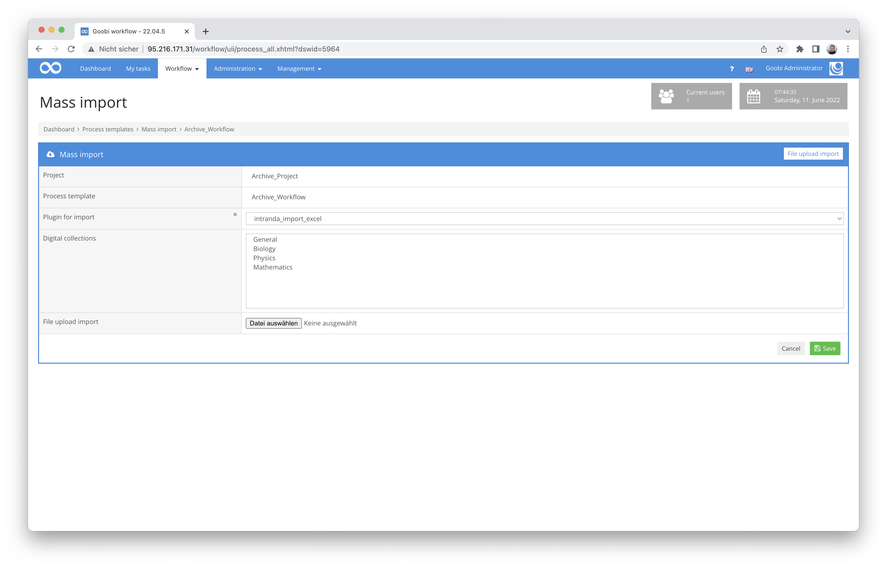

# April 2022

## Step plugin for the generation of run sheets
We have developed a new plugin that automates the generation of dockets during the workflow. Up to now, it was already possible to download routing slips immediately after creating tasks or with a plugin within tasks. What is new is that routing slips can be created as PDF or image files with a new plugin and that they can be saved automatically in the desired resolution within a configurable directory.

More details about the plugin can be found in the detailed documentation here:



The source code of the plugin can be found published on GitHub:




## Image areas can be captured better
It was not ensured in all cases that the image area capture in the metadata editor was only displayed if the associated rule sets also allowed this. We tested this again intensively and also made changes to the logic in order to avoid errors here. If we have thought of all areas, then no more difficulties should be expected here for the creation of new image areas, the addition of further image areas and the deletion of image areas for structural elements.



To ensure that we nevertheless take this well into account for updates, the update instructions have also been updated in this regard. There is a corresponding reference to the adjustments to be made within the rule sets:




## Extension of the editors for configuration files and rule sets
We had not expected the two still quite new plugins for editing configuration files and rulesets to become so popular so quickly. In the course of their rapid spread, we soon realised that we still had to optimise a few things. Among other things, we noticed that the naming of the backup files should be changed again, that it would make sense to check and visualise the write permissions for the backup files and the files to be edited, and that we should change the way we display the success or error messages again.

So all in all, both editors should now be a little bit more practical than they already were. :)

Here again are the links to the updated documentation:






## Icon for holdings in Archive Management
It is only a small thing, but in the end it bothered us ourselves so much that we are now happy about the change: The top node of each inventory within the Archive Management plugin was basically visualised incorrectly with a file icon. To avoid misunderstandings, this top node is now adequately labelled and thus self-explanatory for all users.




## Automatic generation of preview images
For a workflow step, it is now possible to configure that preview images are to be generated for display in the metadata editor or image QA plug-in.
The generation of these preview images takes place when the work step is to be opened. If the internal message queue is active, the processing takes place via it, otherwise the images are generated directly.
Only after the generation of these preview images has been successfully completed is the work step released for users to accept. Automatic tasks, on the other hand, are closed directly after the preview images have been generated.



An example of a configuration for the generation of such preview images looks like this:

```
{
"Master": false,
"Media": true,
# "Img_directory": additional directory,
# "Custom_script_command": "",
"Sizes" : [400, 600]
}
```
The preview images are thus created in the respective directories as configured.




## Password length controllable via configuration
To ensure that users use secure passwords, it is now possible to control the minimum length that passwords must have when they are reassigned, when they are reset or when a user wants to change the password himself.

In the configuration file `goobi_config.properties` the following optional value for the minimum length can be specified from now on:

```toml
minimumPasswordLength=12
```

This configuration switch and many others are documented in the Goobi workflow manual here:




## New plugin for metadata enrichment from an Excel file
There is a new plugin for enriching existing METS files on the basis of existing Excel files. Metadata and persons are read from a configurable file and transferred to the metadata of the process.

More details on the plugin and its configuration can be found here:



The source code of the plugin has been published here:




## New plugin for data transfer from a directory
Another new plugin has been developed to read existing data from a directory and transfer it to METS. Metadata, structural data and pagination information are transferred from the directories. More details can be found in the documentation:



And this plugin is also published on GitHub:




## New plug-in for manipulations within METS files
For a specific use case, we needed a way to automatically determine and interpret individual metadata within existing METS files in order to subsequently generate independent metadata within the METS file. The existing use case is currently still very much tailored to the needs of the Kiel City Archive and therefore may not be reusable unchanged for other Goobi users. However, the plugin offers a good basis for implementing similar specifications on this basis in the future.

The detailed documentation for this new plugin can be found here:



The source code of the plugin has been published at this address on GitHub:




## Selection of a bulk import plugin simplified
In most use cases, there are not multiple bulk import plugins installed within Goobi. For this reason, we have made a small change to simplify the selection of plugins in the user interface. If there is only one plugin to choose from, it will now always be selected immediately. This is not only logical and more convenient, but also saves unnecessary mouse clicks.




## Extension of the plugin for editing metadata
The existing plugin for editing metadata has been extended to add and delete metadata in the same way as in the metadata editor. This makes the operating logic more comprehensible for the user and the plugin allows additional application scenarios. The documentation of the plugin can still be found at this address:




## Archive management: Naming uploaded EAD files
With the possibility of directly uploading EAD files within the archive management plugin, some user scenarios were not initially considered. One such scenario is, for example, that the uploaded files may have unfavourable file names or the file extension may be missing. Such cases are now intercepted and spaces are also replaced by underscores. In this way, naming problems of EAD files should be a thing of the past. However, if you still encounter problems with future file names for EAD files, we would be happy to receive feedback on this so that we can make adjustments again.


## Errors in the GoobiScript metadataAdd are logged better
When executing the GoobiScript `metadataAdd`, logging in case of errors has not been exemplary so far. Specifically, we missed the display of information within the process log there. This has been corrected.


## Revision of the SRU client
It is probably more exciting for technicians than for others: We have completely revised the implementation of the SRU client, as the programme libraries used there have reached end-of-life. With a new implementation, which is also used in many OPAC plug-ins, for example, we are now back to the state of the art.


## Logging within the mass upload plugin
We noticed that the logging within the mass upload plugin was clearly too granular and thus no longer really helpful for administrators. We have made changes here so that logging now takes place to the extent that it can also provide relevant information about what happened during the upload in cases where this is necessary.


## Logging more helpful for logging out
More Goobi users always bring more potentially different use cases and other infrastructures. And so we sometimes notice where we can or should improve something for ourselves. This is also the case here in the area of logging out users. Here we already wished for better logging when users have logged in. And now we have done the same for logging out. Every admin is happy about that, right?


## Bugfix for the statistic "Memory increase over time
In the "Memory increase over time" statistics module, problems could occur with the display of large amounts of data. This was mainly due to the fact that the entered start time was not taken over and instead the first entry in the database was taken as the start date. This led to very large amounts of data (over 2500 data records), which the visualisation library used could no longer handle. The start date is now taken over correctly with the changes made and the display of not too large periods of time works again.


## Version number
The current version number of Goobi workflow with this release is: **22.04**.
Within plugin developments, the following dependency must be entered accordingly for Maven projects within the `pom.xml` file:

```xml
<dependency>
  <groupId>de.intranda.goobi.workflow</groupId>
  <artifactId>goobi-core-jar</artifactId>
  <version>22.04</version>
</dependency>
```