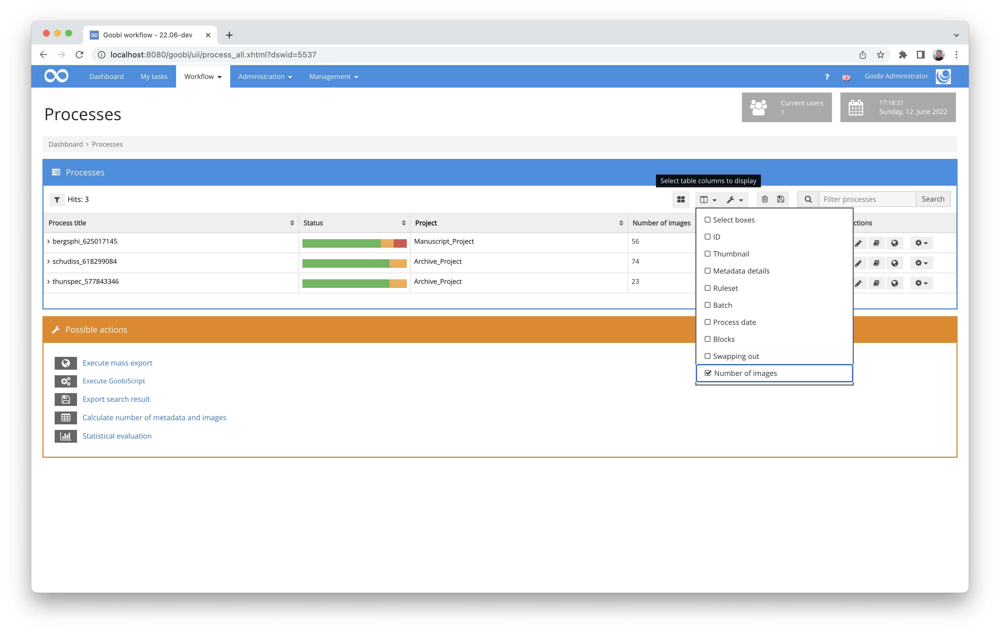
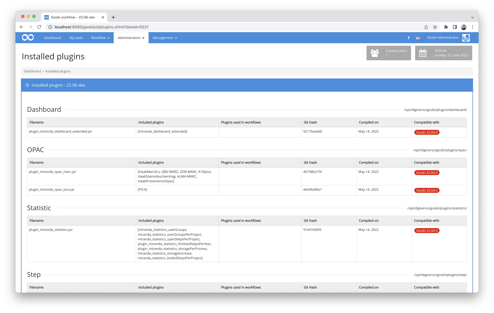
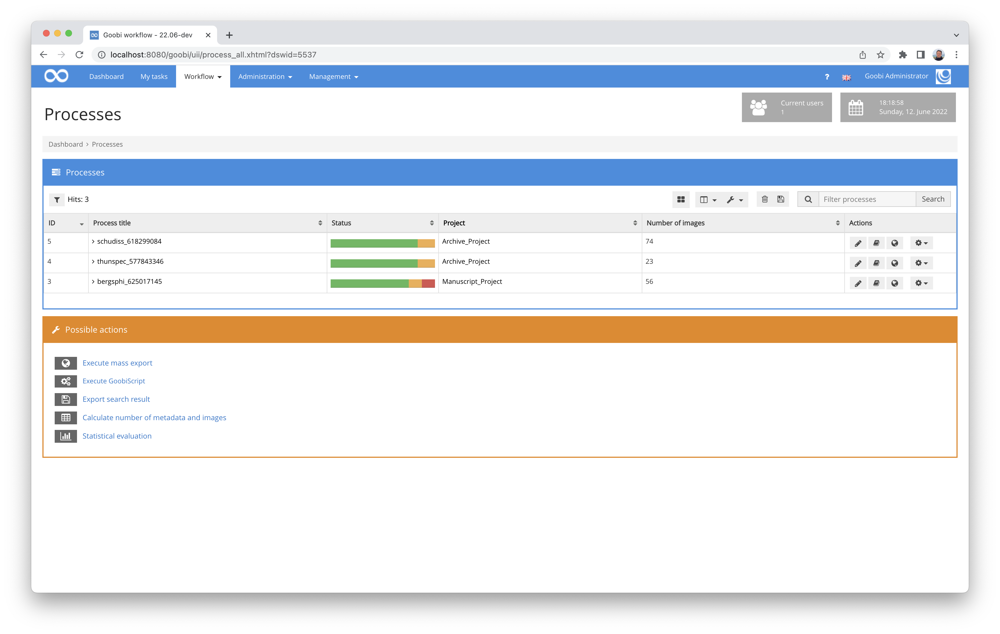
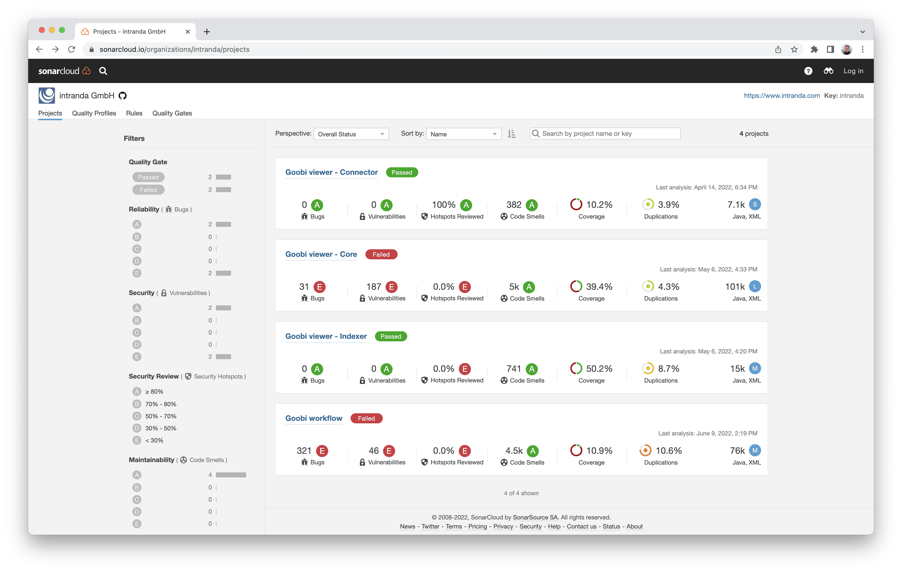
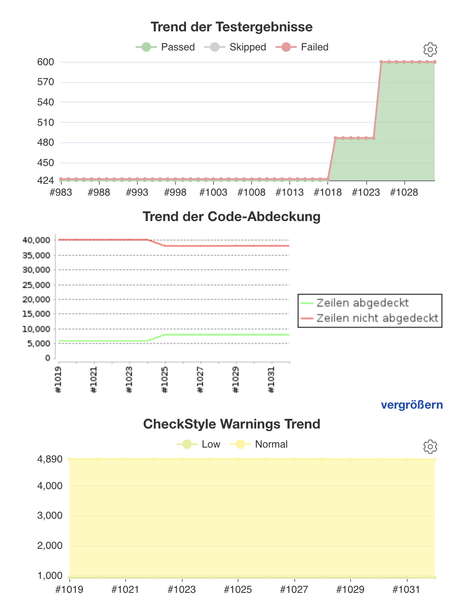
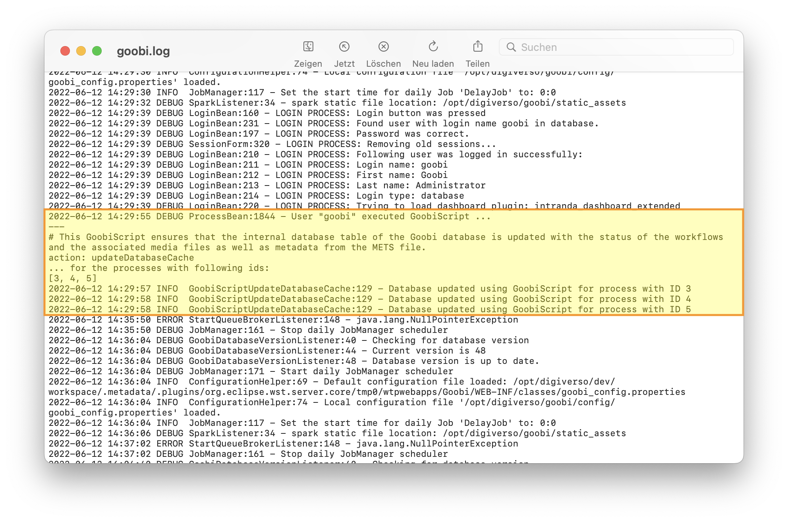
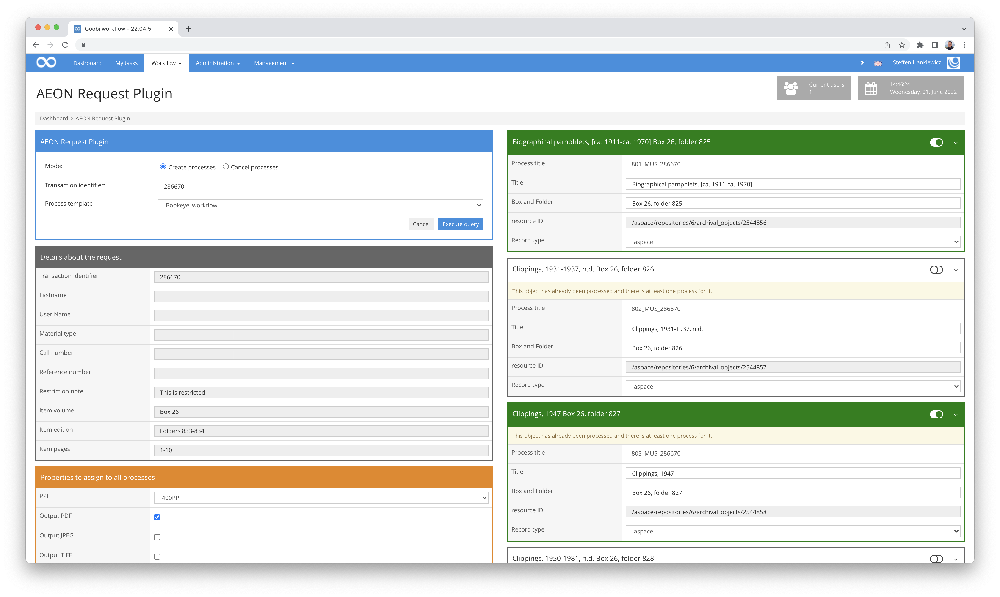
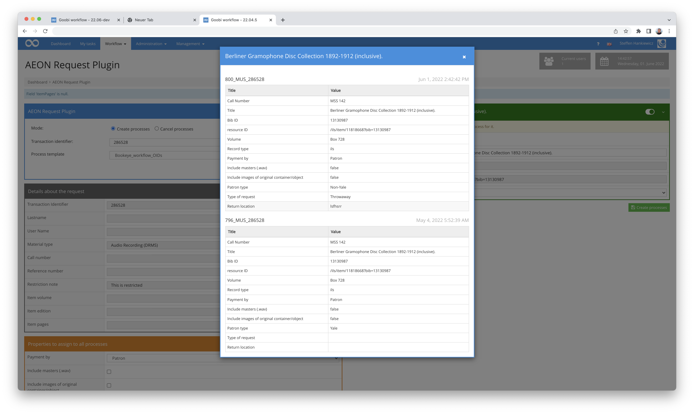
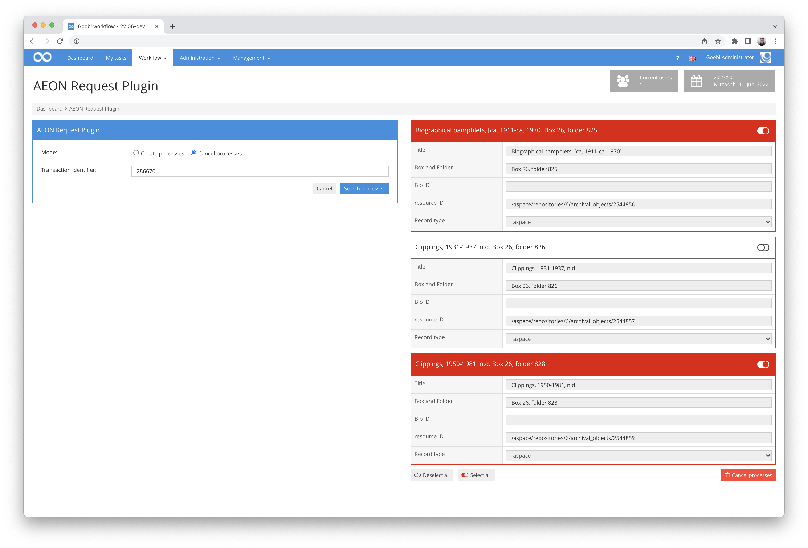
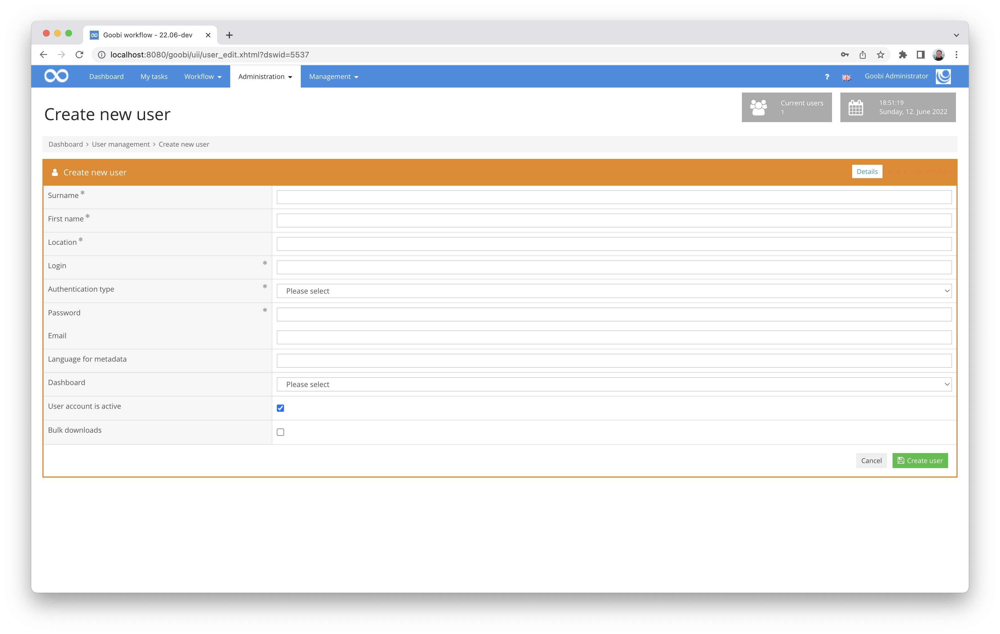

# May 2022

## Display of the number of images in tasks and activities
Within the user interface, it is now possible to display the number of images as a column. This can be done within the task list as well as in the own tasks. This looks like this, for example:




## Installed plugins better manageable
We have slightly revised the incredibly practical display of installed plug-ins and their versions. All existing plugins are now listed correctly sorted and the paths to the directories are also listed.



## Better sortability of tasks and assignments
In the list of tasks, we have made some improvements regarding sorting. The biggest noticeable difference will probably only be noticed by administrators:

All columns now sort lexicographically in ascending order when you activate the sorting of a column. Only the column with the ID behaves differently and sorts in descending order at the first click, in order to display the most recent transactions immediately at the top. Administrators will be pleased. :)




## Project structure optimised
Goobi workflow has been using Maven as a build system for a number of years. Last month, the project structure within Maven was further consolidated so that there is a dedicated module for running automated tests and checks within the Continuous Integration infrastructure.

The previously existing modules to build a .war file for deploying the known application within a Tomcat and the module to build a .jar file have been cleaned up and are now only responsible for compiling the artefacts. A new addition is a CI module that bundles previously scattered steps in the lifecycle and also integrates new checks. These are in detail:

* Running the JUnit tests
* Checking the dependencies used for known security vulnerabilities (OWASP)
* Creating an analysis of how much code is covered by unit tests (Jacoco)
* Checking the source code for violations of selected checkstyle rules
* Performing a static code analysis using Sonar

At the same time, the execution of the unit tests was changed from a suite-based infrastructure to a class-based one. The number of regularly checked tests could be massively increased. In addition, the last code sections that required compiling with Java 8 and explicit compiler options were cleaned up.

The changed project infrastructure now allows for faster building of the individual modules and thus less overhead in development, as well as expanded and improved testing of daily work to increase code quality.

Anyone who would like to track our progress in terms of code quality is welcome to do so here at any time:



The diagrams still show that we have a long way to go. But we are on the way.



And internally, progress looks something like this at the moment:



So things are moving forward. We'll report on it here more often in the future.


## Better log information about executed GoobiScript
In the past we often noticed that we would have liked to have more logging if a GoobiScript did not do what we had hoped. We have now addressed this issue and solved it in such a way that administrators can easily see in the log files what was called. It now looks something like this:




## Extensions for the AEON plugin
Some time ago we had already reported that we were implementing an extensive interface to the software AEON. There have been numerous extensions here again. Among other things, the look of the interface was massively revised.





Properties can be individually adjusted or adopted for entire datasets or even for individual objects that are actually to be digitised, with deviations from the default values clearly visualised. In addition, it is now possible for processes whose digitisation workflow is already in progress to be stopped, unless a configurable status has already been reached.



So, all in all, great progress, but also further work in progress.


## GoobiScripts for metadata manipulation extended
There are already a lot of GoobiScripts. But every now and then we notice that a certain functionality would be handy. This time we noticed that it would be quite practical if we could manipulate metadata not only in the logical areas of the METS files, but also within the metadata for the images. No sooner said than done. Besides the parameters `work` `top` `child` and `any` it is from now on possible for the GoobiScripts to understand and apply `physical` for manipulating the metadata. More details can be found here in the documentation:




## Changes to the database driver
To make Goobi workflow better able to handle newer MySQL databases, we have replaced the driver for communicating with the database. From now on we use the following driver:

```
software.aws.rds.jdbc.mysql.Driver
```

It is now possible to run Goobi workflow with MySQL versions 5.7 and 8. However, the earlier versions are no longer supported. This must be taken into account in future updates.

This is already mentioned in the update instructions:




## Extension of the Goobi manual
As you can see from our digests and plugins, the documentation of our developments has been very important to us for several years. Currently, we have also turned our attention to the configuration files. This area is still a work-in-progress. But if you want to take a look, you will find a few good examples here:





There will be a lot more happening here in the next few weeks.


## Better display of information in the process log
In the case of failed script calls, the process log was not really very helpful until now. This has been adjusted so that incorrect calls now appear with a clear error message in the process log.


## New user: Password was not a marked mandatory field
Incorrectly, when creating new users, it was not displayed that a password for a new account was a mandatory field. This has been corrected.




## Version number
The current version number of Goobi workflow with this release is: **22.05**.
Within plugin developments, the following dependency must be entered accordingly for Maven projects within the `pom.xml` file:

```xml
<dependency>
  <groupId>de.intranda.goobi.workflow</groupId>
  <artifactId>goobi-core-jar</artifactId>
  <version>22.05</version>
</dependency>
```