# June 2022

## Opac Plugin for Kalliope documented
The plugin has been around for a long time. But somehow we haven't found the time to document the plugin yet, and so one could almost think that Goobi has no connection to Kalliope. But this is not true, because this documentation proves that such a plugin already exists:



If you look closely at the source code published on GitHub, you can even see that the plugin has been around since November 2014. Who would have thought that?




## Opac plugin for Ariadne extended
We already implemented a plugin for the connection to Ariadne some time ago. This has now been extended to allow more flexible control of the publication type. We also took the opportunity to document the plugin in detail and publish it on GitHub.

Here you can find the detailed documentation for the plugin:



And here we have published the plugin on GitHub:




## New more flexible DOI plugin
About 1.5 years ago we already published a plugin that allowed the registration of DOIs. However, we were not entirely happy with the implementation. Especially if you take a close look at what can be reported in a separate metadata schema when registering persistent identifiers with DataCite, you realise that the previous solution had narrow limits there. For this reason, we have now implemented a second DOI plug-in that is much more flexible and could generate almost all conceivable data formats on the basis of XSLT.

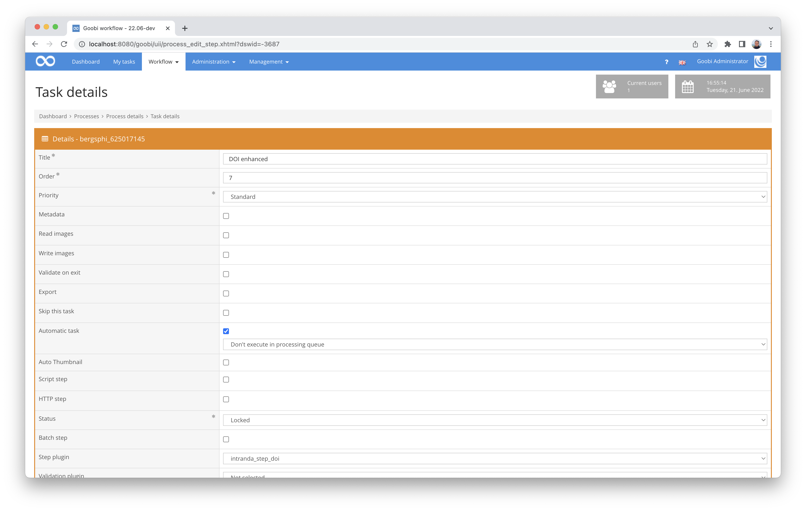

Here we have documented the plugin in detail:


The source code for the plugin has been published here on GitHub:



## Converting the inline help
Goobi worklow has had inline help for some time. This allows help texts to be displayed, especially for various forms, to support the input. Unfortunately, the problem was that the page was always reloaded when this integrated help was switched, so that values already entered or changed in the form were reset if they had not yet been saved.

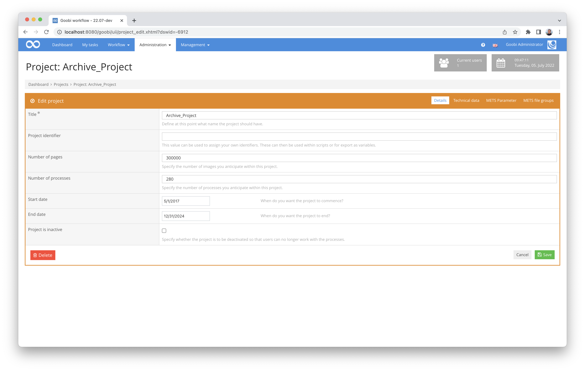

There has now been a change in how the help display is activated. From now on, it loads solely via JavaScript and can thus be displayed without reloading the page. This avoids the problem of unsaved content being accidentally reset.

## (Further) development of a plug-in for flexible export
Some years ago, we developed an export plugin that allows a very flexible export and where, among other things, it was possible to control which image directories should all be taken into account for the export. We have now massively extended this plugin and documented it in an exemplary manner. It now also allows, among other things, that within an export call, depending on an existing metadata, an export can take place in several Goobi viewers and, for example, different image directories can be used and different handling of OCR data should take place.

More information can be found here in the new documentation:


And here we have published the new plugin on GitHub:



## Extension of the Goobi manual for configuration files.
Basically, the whole month was strongly focused on documentation. In addition to the newly created documentation for new and existing plugins, a lot of new things have been added, especially in the area of configuration files.

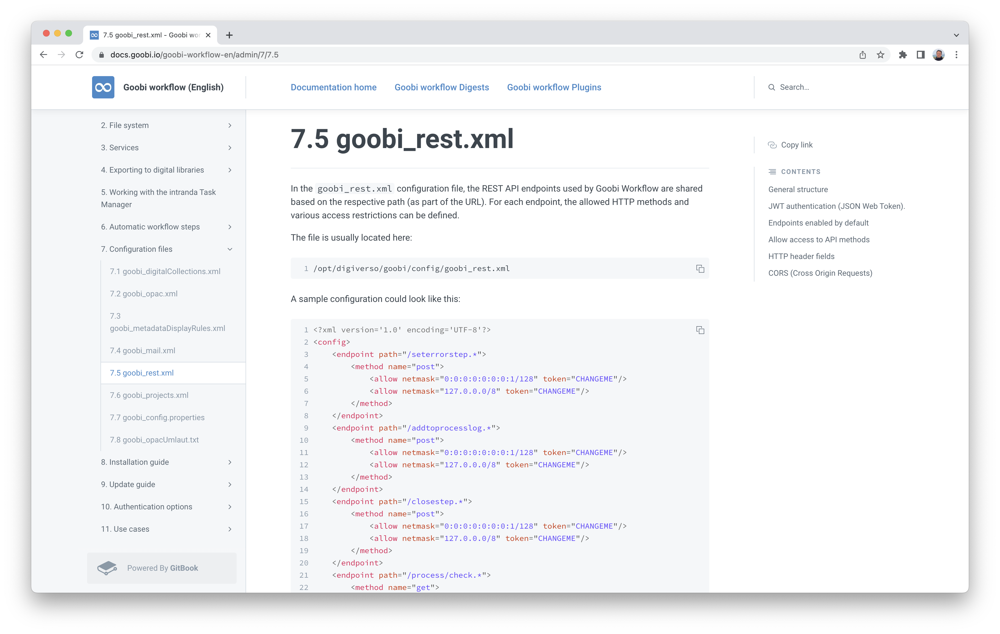

The following Goobi workflow configuration files have been newly documented or massively revised in their existing documentation:

### goobi_metadataDisplayRules.xml
This configuration file is decisive for how the input fields should behave within the metadata editor:



### goobi_rest.xml
This configuration file defines which areas of the REST API external services may access and how they must authenticate themselves:




### goobi_opac.xml
This configuration file specifies the catalogues from which Goobi workflow should be able to import data:




### goobi_opacUmlaut.txt
This configuration file controls how to deal with umlauts returned by the catalogue query:




### goobi_projects.xml
This extensive configuration file allows you to influence exactly how the Goobi creation mask should be structured.:




## Correction for GoobiScript when executing multiple setTaskProperty calls.
There were some special exceptions where the execution of multiple GoobiScripts only executed the last of the commands sent at the same time. Fortunately, this has now been found and fixed, so that even such similar commands can now be passed to Goobi and executed correctly..

```yaml
---
action: setTaskProperty
steptitle: "My step"
property: readimages
value: true

---
action: setTaskProperty
steptitle: "My step"
property: writeimages
value: true

---
action: setTaskProperty
steptitle: "My step"
property: metadata
value: false

---
action: setTaskProperty
steptitle: "My step"
property: exportdms
value: false
```


## Session validity period
For many years, Goobi workflow has offered the possibility for users to set an individual session timeout. Only very few users made use of this option and only because the default value was set to 30 minutes, which was too short. The new default value is now 4 hours.


## Processing and provision of e-mandatory publications - Work in Progress
Together with the Zentral- und Landesbibliothek Berlin (ZLB) we are currently developing a completely new functionality for the processing and provision of e-mandatory publications. Overall, this is quite an athletic undertaking with, in part, enormous complexity. For this reason, the development of the functionality will take a few more weeks. However, in order not to keep the world in suspense forever, we would like to provide a small insight into the current status quo of the developments by showing various screenshots of the (still) only German-language interface:

On a specially adapted interface in the corporate design, the deliverers can log in or register in Goobi workflow.

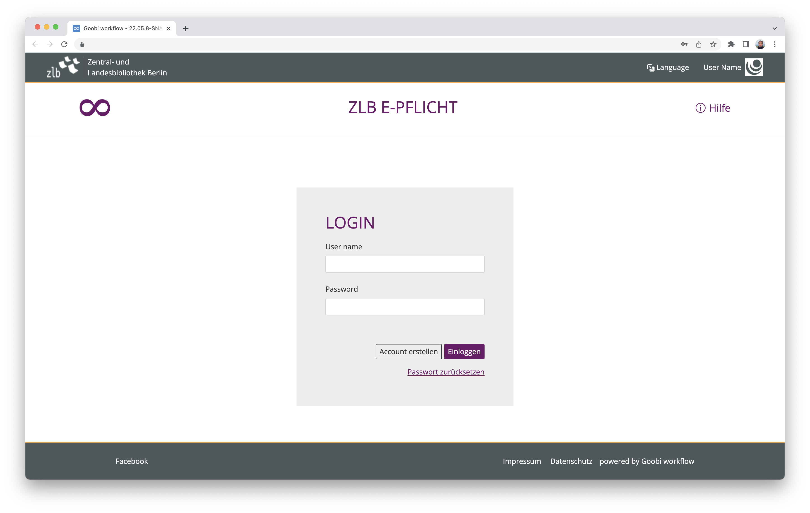

Delivering institutions create their own user accounts in an interface that is as intuitive to use as possible.

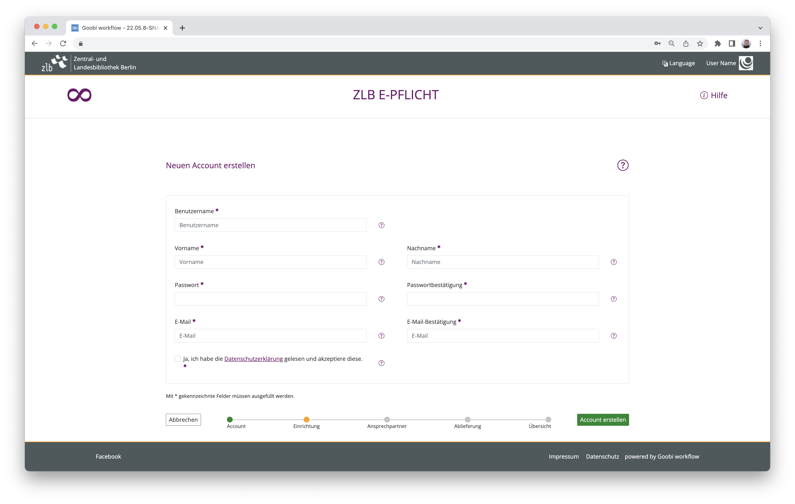

After the ZLB has activated newly registered users for submission, they can add further data on the submitting institution.

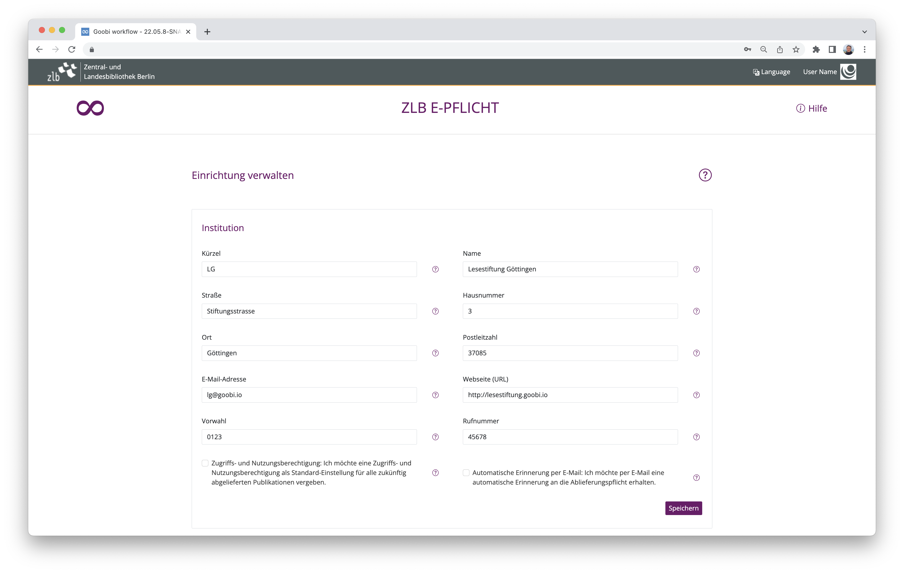

After complete registration of the delivering institution, various actions are possible, including the delivery of independent works.

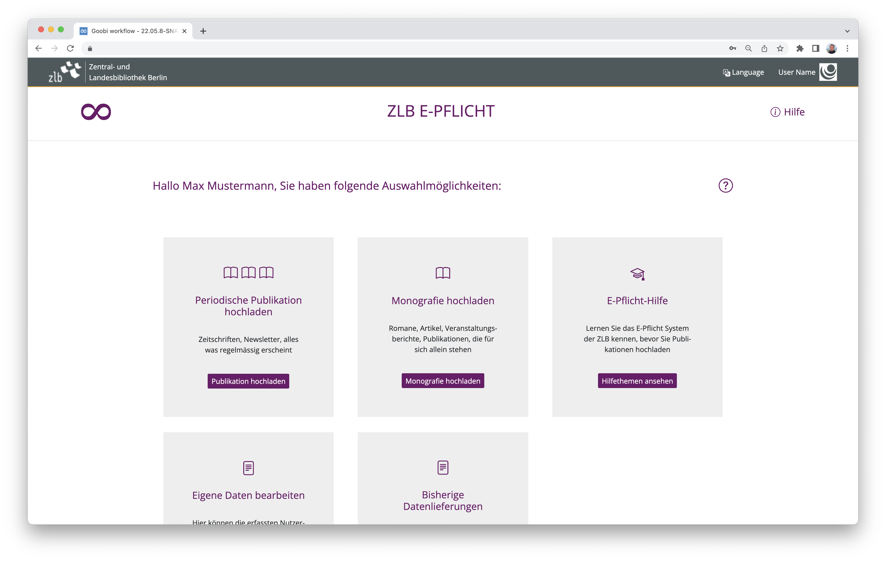

Within the user interface, it is possible at any time to have help texts displayed for input via an embedded help function..

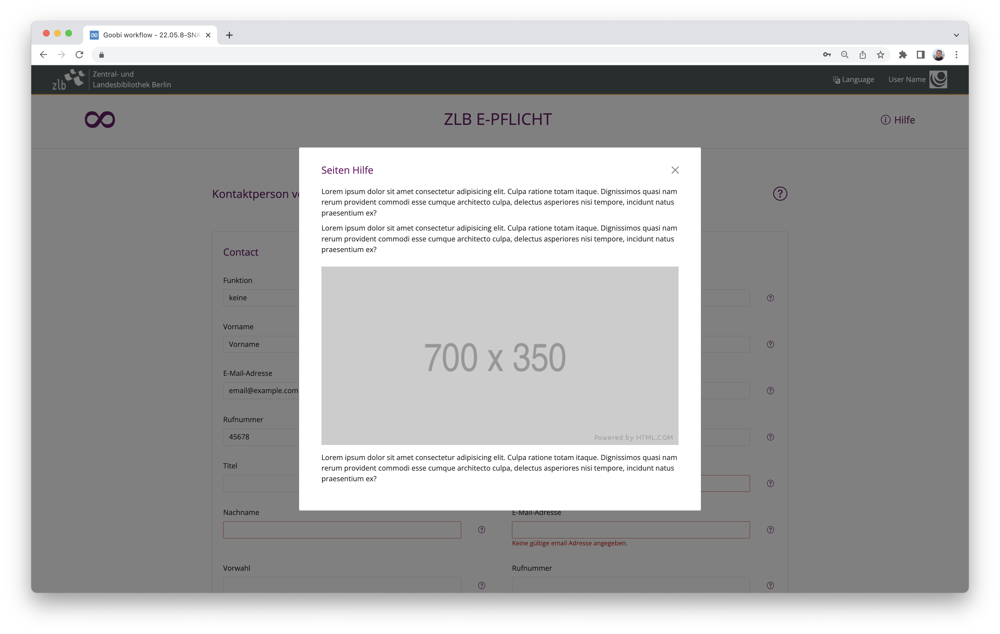

Within the regular Goobi workkflow interface, a special administration plug-in ensures that the ZLB has an overview of all delivering institutions that are available as clients in Goobi.

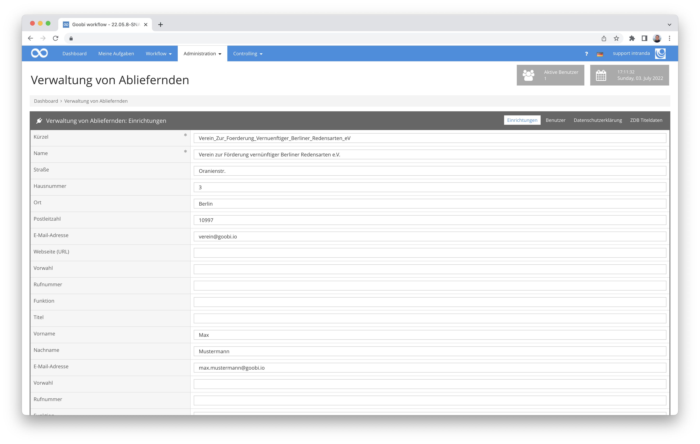

The associated users of a delivering institution can also be managed via the administrative areas.

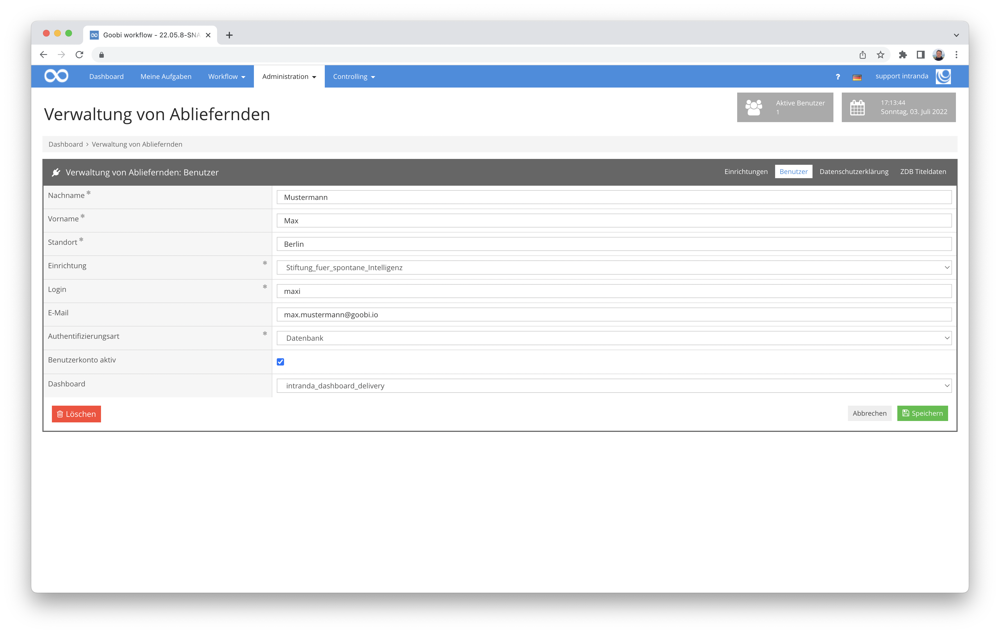

Among other things, the privacy policy, which the submitters accept during registration, can also be edited in this area.

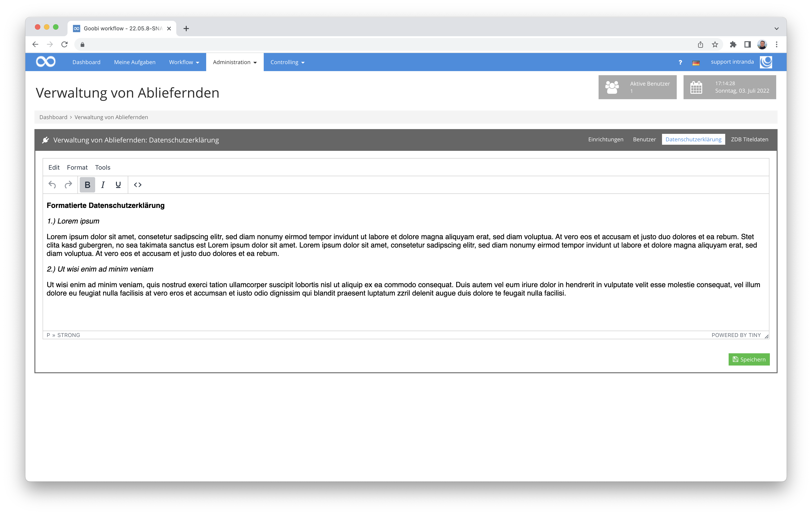

All in all, a lot has already been done here. However, the work is still in full swing and will take some time. Some functions and interfaces will probably change significantly in the coming weeks. But as a first glimpse, the screenshots here already show well what will be available in the coming weeks and months as additional functionality for all interested parties as an open source solution.


## Version number
The current version number of Goobi workflow with this release is: **22.06**.
Within plugin developments, the following dependency must be entered accordingly for Maven projects within the `pom.xml` file:

```xml
<dependency>
  <groupId>de.intranda.goobi.workflow</groupId>
  <artifactId>goobi-core-jar</artifactId>
  <version>22.06</version>
</dependency>
```