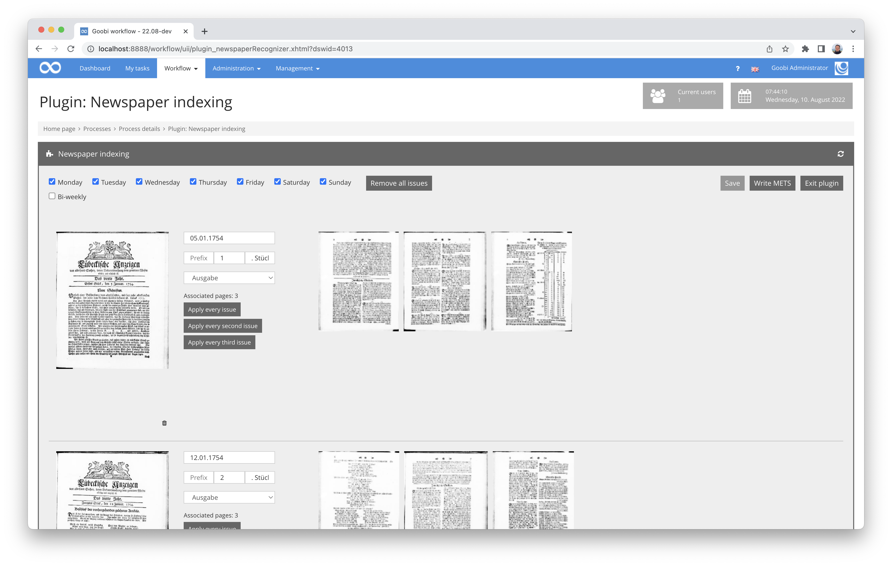

# July 2022

## Core

### Generation of URLs for the SRU Interface and the IIIF Manifest
In the project settings there are now two additional fields in the tab `METS Parameter` to record the URL to the SRU interface of the Goobi viewer and the URL of the IIIF Manifest for the complete work.


Example entries could look as follows:

```
http://viewer.example.org/sru/$(meta.CatalogIDDigital)
https://viewer.example.org/api/v1/records/$(meta.CatalogIDDigital)/manifest/
```

The result within a METS file created in this way is then accordingly as follows:

```xml
<dv:links>
<dv:iiif>https://viewer.example.org/api/v1/records/1234567889/manifest/</dv:iiif>
<dv:sru>http://viewer.example.org/sru/1234567889</dv:sru>
</dv:links>
```


### Adjustments for the image comments
Not too long ago we introduced the new image comments here. With their first use at various institutions, however, we noticed that the internal storage location for the data was not ideal. For this reason, we have made a change for this. Those who have already used this functionality should therefore follow our update instructions provided here for the next update:




### GoobiScript metadataChangeType fixed
In the GoobiScript `metadataChangeType` the parameter `any` did not work as expected. This has been corrected and now allows metadata to be changed at all levels of a METS file as desired. 


For the sake of completeness, here is the link to the detailed documentation of GoobiScript:




### Improved logging during application stop
Administrators love logging. It helps to better understand why a problem occurred in case of an error and what can be considered as the trigger for a failure. For reliable operation of productive applications, meaningful logging is not only helpful, but often simply mandatory. It is all the better if the developers of a software work closely together with the administrators who actually run the software. 

The result of such cooperation in the context of Goobi is that we are constantly trying to improve the logging of Goobi workflow. This month we took a closer look at the logging of the application stop and made some improvements. After all, sometimes too much logging is not right. 


## Plugins

### Processing newspapers
We had already reported on this at the Goobi Days. In recent months, however, our developments for processing newspapers have been used more and more frequently. That is why we would like to explicitly address this topic again together with the latest developments:

For some time now, it has been possible for Goobi to recognise newspaper editions semi-automatically and to index them with metadata. To this end, the workflow first automatically recognises newspaper editions on the basis of trained models. We have recently expanded this considerably and fed it with more ground truth data. Thus, the recognition accuracy of newspaper editions has improved many times over. 


After this automatic recognition, a plugin is available in Goobi worklow for enriching the newspaper editions with edition-related metadata. This makes it relatively easy to record issue numbers, dates and publication days, including morning and evening editions, without having to do this individually for each issue. Instead, a semi-automatic mechanism takes effect here, which counts up the subsequent issues accordingly with a few entries from a user, enriches them with dates and also names them.




In addition, supplements can also be created quickly here, so that a comprehensive METS file is subsequently generated, which has standardised date information and can be searched in the Goobi viewer, e.g. via a calendar entry. 


To meet the requirements of the German Digital Library and the DFG Viewer, by the way, an additional export plugin was recently added that prepares and provides the data according to the specifications.


We have worked a lot on the individual components described here in the last few months and have repeatedly optimised their operation. Some things will continue to happen here in the coming weeks. We would be happy to present this in detail in a workshop at the upcoming Goobi Days.


### Mass imports with archive stock enrichment
Up to now, we had not even mentioned the various newer import plugins that we had recently implemented for some specific mass imports. For these plugins, there is no detailed stand-alone documentation yet. 


However, it is important for us to point out that there are several new mass imports that not only create processes in Goobi workflow, but also increasingly create or enrich entire archive trees with tectonics.


Depending on the project, structured METS files can also be created here, as with other importers for Goobi workflow, where structural elements and associated metadata are imported together with authority data for the associated image files.


### Better full text extraction from PDF files

The step plugin `intranda_step_pdf-extraction` allows full texts to be extracted from PDF files and saved as ALTO files. However, we recently noticed an error in the processing, which was responsible for inappropriate gaps appearing within some words, among other things due to an existing hyphenation in the words.

We were now able to find and fix the cause of this problem. By the way, the plugin was already documented here:



We have published the plugin at the following URL, where the corrected version can now also be downloaded:




## Documentaries

A lot has happened again in the area of our documentation:

### Inline documentation for GoobiScript
In the GoobiScript `addToProcessLog` the included explanations were not ideal. There was a small correction here, which now looks like this:


### Small change in the update instructions
In order to make the update instructions for Goobi workflow more intuitive, they are now no longer structured by date, but by the respective published version. This change only applies to all future notes that are included there and not retroactively. It should hopefully make it a little clearer for administrators in the future. 


### Configuration files
We have again put a considerable amount of energy into documenting more configuration files. Almost all configuration files are now documented there in an exemplary manner. Some remaining work is still to be done. But if you want to have a look, here are some sample links to new documentation:

Configuration for dockets:


Configuration of the queues:


Configuration for properties:


Configuration for translations:


Configuration for the Web Api:


Configuration for the authority data:


Configuration for the field display in the metadata editor:



## Version number
The current version number of Goobi workflow with this release is: **22.07**.
Within plugin developments, the following dependency must be entered accordingly for Maven projects within the `pom.xml` file:

```xml
<dependency>
  <groupId>de.intranda.goobi.workflow</groupId>
  <artifactId>goobi-core-jar</artifactId>
  <version>22.07</version>
</dependency>
```