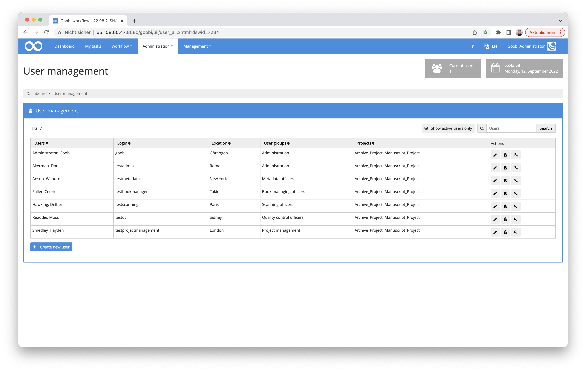
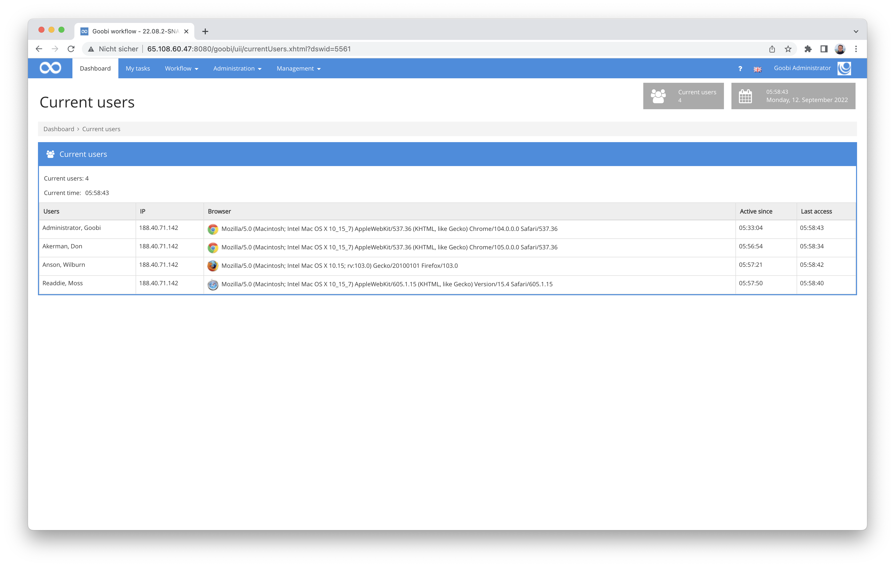
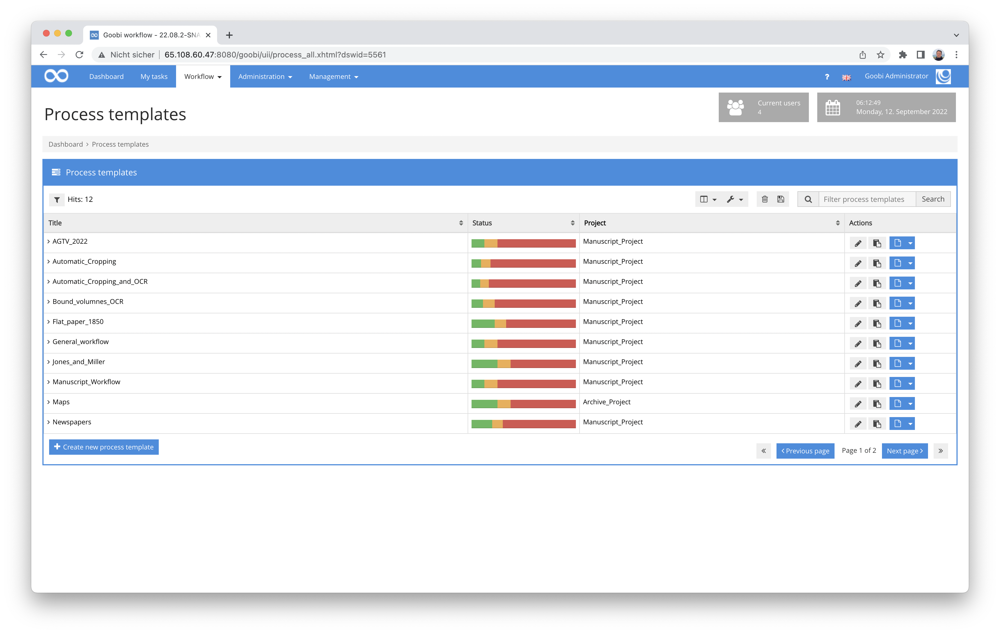
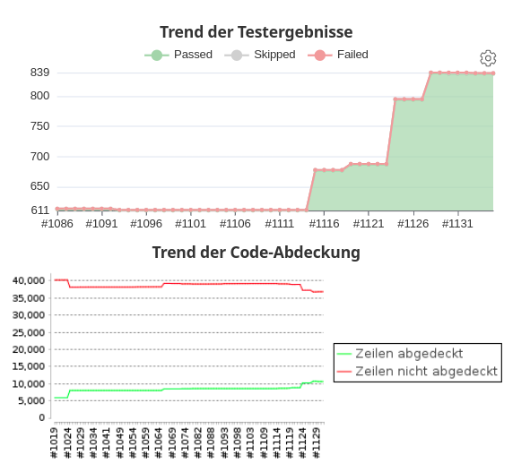
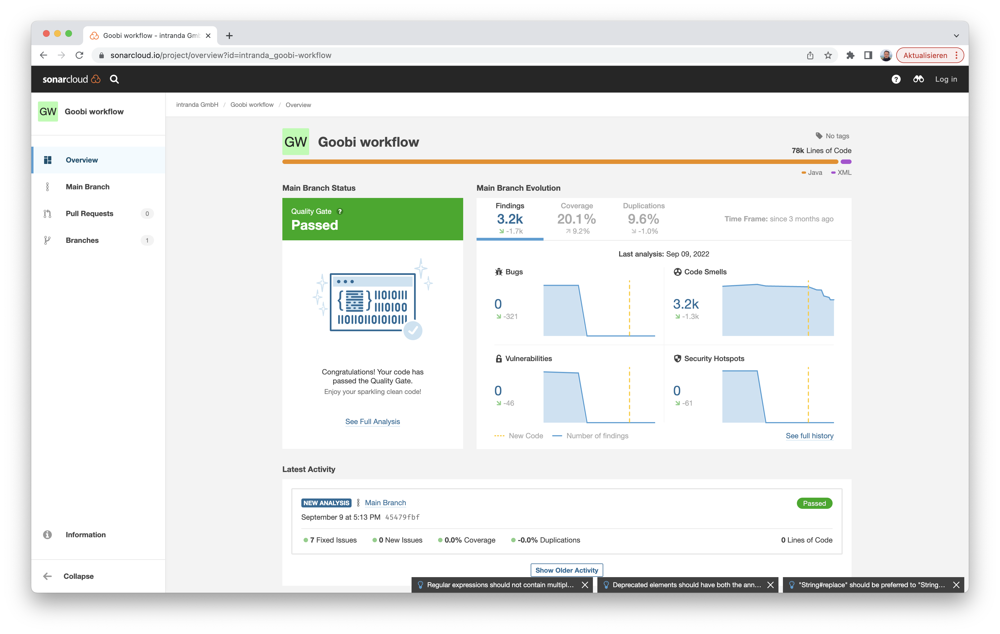
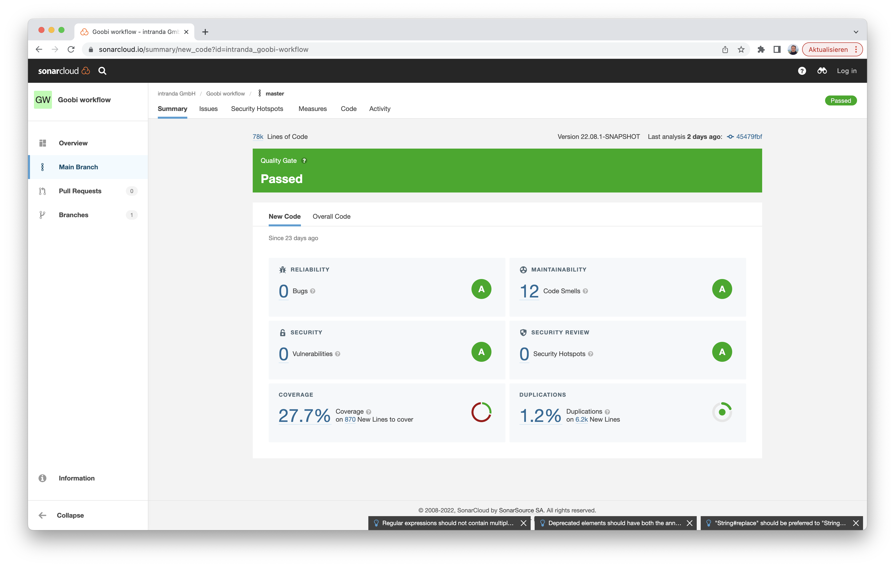
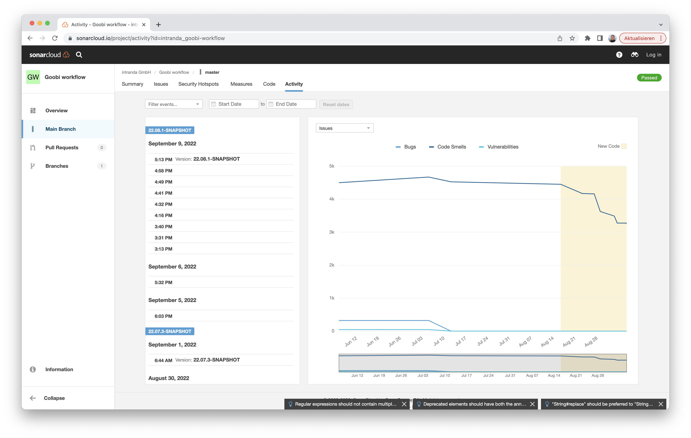
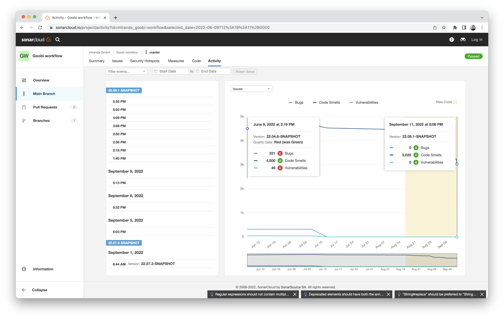
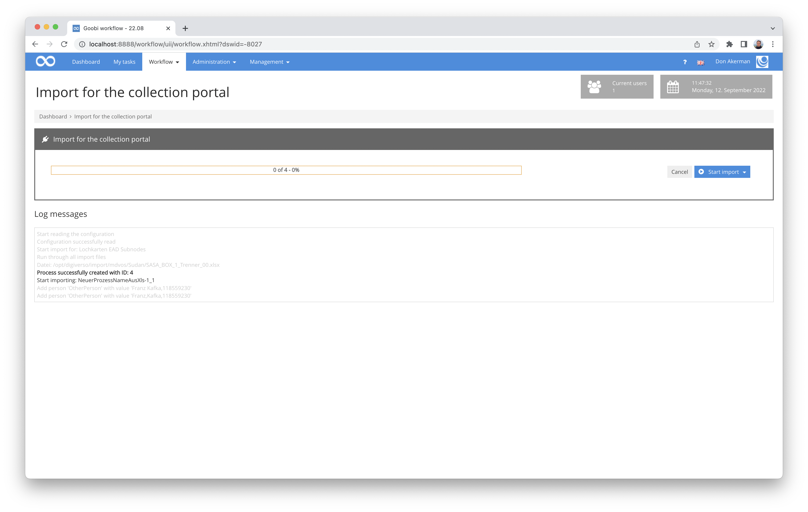

# August 2022

<!-- +++++++++++++++++++++++++++++++++++++++++++++++++++++++++++++++++++++++++++++++++++ -->
## Core

### General layout changeover to Bootstrap 5
We already announced it. Some users may have already noticed that the layout will change minimally (at first): We are gradually changing the layout of Goobi workflow to Bootstrap 5. The first pages have already been moved. 



But who would have thought it: it is more elaborate than expected. So it will continue to accompany us as a theme for a bit.


### Cleaning up the display of active sessions
We have already made some changes to the login and logout area in recent months, including the display of active users and logging. However, we noticed that after logging out, the user's session was not completely cleaned up immediately. We have adjusted a few things here and then put them through their paces. We are now satisfied with this, the storage space for the sessions is now somewhat smaller and, from our point of view, it can stay that way.




### Database connection for production templates optimised
On some Goobi systems, especially those with a large database, it was noticeable that the listing of production templates was significantly slower than the listing of tasks. We took a closer look at this this month and were able to determine that the more extensive rights check of the project memberships had a significant influence here. Fortunately, this could be remedied quite well, so that now no performance losses should be noticeable in the production templates. 




### Password length check corrected
Unfortunately, we noticed a small bug concerning the checking of the password length of users. The length of the password was incorrectly checked - and noted as too short - even if data of an existing user was to be changed without a field for password entry being displayed in the user interface at all. We have corrected the error in this release.


### Automatic unit tests
To ensure the quality of software, software developers can implement automatic tests. Such tests can then automatically check individual functionalities of the overall software and are run at least before a release is published.

Goobi workflow has had several hundred such tests for many years. Nevertheless, it is our goal to cover as much of the source code as possible with tests in order to ensure code quality on the one hand, and on the other hand, to always be sure that the existing functionality is still guaranteed in the case of new developments and adaptations.



With this month's release, about 230 new tests have been added. The remarkable thing here, however, is not just the number of tests alone. The newly added tests relate to one of the most complex areas of Goobi workflow, in that we have now also achieved significantly better test coverage in the metadata editor.


### Code quality
In addition to increasing test coverage by means of automated tests, we have been working intensively on the code quality of Goobi workflow. To this end, we have now registered Goobi workflow within Sonarcloud, so that we automatically receive code analysis results there and can make successive improvements to the software's source code.

There you can see, for example, how we achieved a level A rating for all important areas of quality analysis this month:







Here you can also see a comparison between before and after:



If you want to take a detailed look at the quality of the Goobi workflow source code, you can take a look here:

 


<!-- +++++++++++++++++++++++++++++++++++++++++++++++++++++++++++++++++++++++++++++++++++ -->
## Plugins

### Extension of the URN plugin for special construction
Not so long ago we reported here about a new plugin for registering URNs that uses the REST API of the German National Library. This plugin has now already gone into regular operation with the first Goobi users. In this context, we have then added an additional functionality: the construction of URNs can now use the timestamp of the registration if desired. 

Previous use with a counter:

```
...
urn:nbn:de:gbv:48-goobi-10
urn:nbn:de:gbv:48-goobi-11
urn:nbn:de:gbv:48-goobi-12
urn:nbn:de:gbv:48-goobi-13
...
```

New possibility with the use of a timestamp:

```
...
urn:nbn:de:gbv:48-goobi-2022-08-17-06-30-15
urn:nbn:de:gbv:48-goobi-2022-08-17-06-31-17
urn:nbn:de:gbv:48-goobi-2022-08-17-06-31-23
urn:nbn:de:gbv:48-goobi-2022-08-17-06-31-42
...
```

We have also taken the opportunity to make the log messages in the operation log a little clearer again, so that they all receive a prefix and are thus clearly distinguishable from other log messages, as in this example:

```
URN PLUGIN: Running URN generation for process ID 1234
URN PLUGIN: Finished URN generation for process ID 1234
```

And of course we have also expanded the documentary and added the new possibilities:



Here is also the link to the source code and the compiled version of the plugin on GitHub:




### Deleting multiple images in the Image-QA plugin
We have found a malfunction in the popular Image-QA plugin. There, it is possible to delete images, provided that this has been activated. Apparently an error had crept in here, which caused that when selecting several images for deletion, not always the selected images were deleted. This has now been corrected.


More information about the plugin can be found here in the documentation:



And if you don't use the plugin yet, you should definitely try it. You can get it here:




### Export-Package plug-in equipped with ZIP file functionality
With the Export-Package plug-in, a plug-in is available that allows almost all conceivable exports of data to third-party systems. It is possible to control exactly which data should be included in the export, where the data should be delivered and much more. Even a conversion of the METS files into third formats can be done by applying an xslt transformation. What was not yet possible, however, was that the exported result should not only be exported as a directory but also zipped afterwards. We have only developed this function and added it to the documentation accordingly.

Here you can find the detailed documentation of the plug-in:

 

And as usual, the source code of the plugin is here, together with the compiled version of the plugin: 




### New plugin for mass import from Excel files with EAD enrichment
We have implmeented and published a new plugin for the mass import of Excel files. The special feature here is that several structural elements are generated from each Excel file that is imported, one element per line. In addition, an existing EAD tree can be enriched with further nodes, so that an extensive inventory is created.



The functionality of the plugin can be viewed in detail here in the documentation:



And here is the source code of the plugin:




<!-- +++++++++++++++++++++++++++++++++++++++++++++++++++++++++++++++++++++++++++++++++++ -->

## Version number
The current version number of Goobi workflow with this release is: **22.08**.
Within plugin developments, the following dependency must be entered accordingly for Maven projects within the `pom.xml` file:

```xml
<dependency>
  <groupId>de.intranda.goobi.workflow</groupId>
  <artifactId>goobi-core-jar</artifactId>
  <version>22.08</version>
</dependency>
```