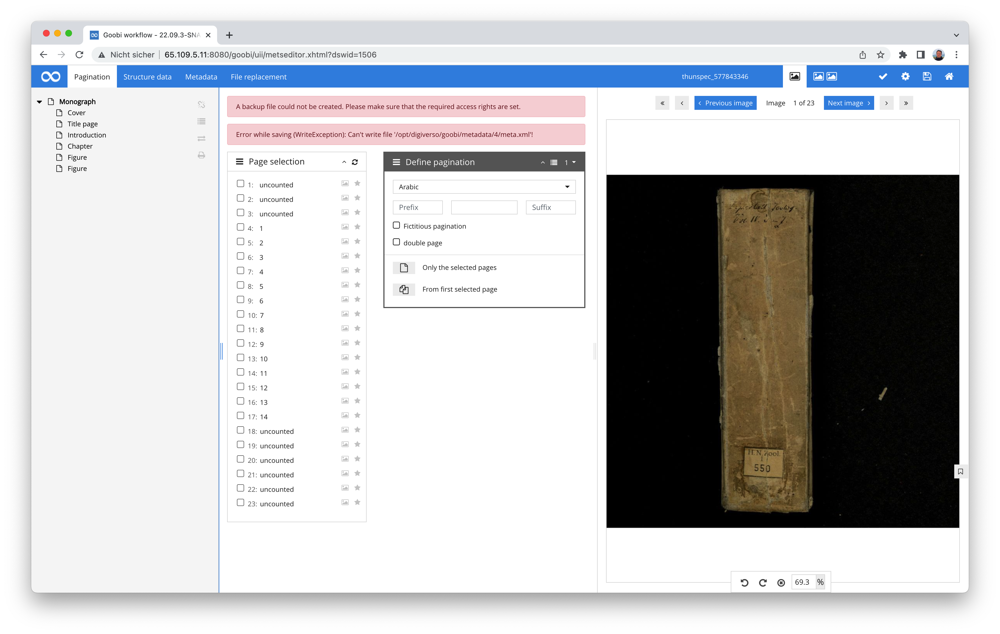

# September 2022

<!-- +++++++++++++++++++++++++++++++++++++++++++++++++++++++++++++++++++++++++++++++++++ -->
## Core


### Saving in the metadata editor
Within the metadata editor, we noticed that different browsers reacted differently when users clicked on the save button. Specifically, the Chrome and Safari web browsers did not perform any function when the Save button was clicked, while Firefox, for example, worked correctly. 


Incidentally, the button with the title 'Save and return' was not affected by this problem.. 


After some back and forth and a lot of research into the causes, we were finally able to solve the problem and provide a fix with the release.


### New journal functionality
For 8 years now, Goobi workflow has offered the possibility of tracking various information and communications via the process log. It has also been possible for some time to upload files (e.g. for restoration documents). This was expanded about 1.5 years ago to include the option of saving damage documents when creating processes. 


In other words: the process log is simply practical. So practical that we wanted to have it in other places as well. To do this, we had to foolishly rename it so that it would no longer be used only for processes. 


The result is the journal. Functionally, it has remained the same as for the processes. Now, however, it is also available for the institutions and, at least in one special case (delivery of deposit copies), also for users.


We can think of other places in Goobi workflow where the journal could be helpful (e.g. for projects). Perhaps there will be an opportunity to do this soon, because someone else would find it just as practical. In that case, we will be able to expand the journal and report back here.


### Accelerated loading behaviour for extensive works
Especially in the case of very extensive works, there were always enormous delays in the loading speed when using S3 as a storage system. The reason for this is that an S3 system has no folder hierarchy and all files instead have enormously long file names. This looks like this, for example:

```bash
s3://bucket/123/images/bla_media/00000001.tif
s3://bucket/123/images/bla_media/00000002.tif
s3://bucket/123/images/master_bla_media/00000001.tif
s3://bucket/123/images/master_bla_media/00000002.tif
s3://bucket/123/images/bla_jpg/00000001.tif
s3://bucket/123/images/bla_jpg/00000002.tif
``` 

This deviating structure meant that when determining the master directory, for example, all files always had to be run through in order to check whether the directory name being searched for was represented. Especially with very extensive works, performance suffered greatly. 

We have now changed this so that when searching for folders in the desired hierarchy level, everything after the next slash ( `/`) is no longer taken into account and so when searching within the images folder, significantly fewer file names to be checked are listed.

In addition, we have now always limited the file search to the actually relevant folder, so that even when searching for the master images, the data of all folders of a process are no longer queried.

Another big improvement in performance resulted from the fact that in the IIIF API we now no longer check per image whether a directory with the name 'thumbs' exists, but cache the result for a while. This has also allowed us to significantly reduce the number of requests to the system once again.


### Blemish with empty table columns removed
During the detailed display of workflow information of individual work steps, it occasionally happened that empty table columns were displayed. 


We have checked this once and revised it. This means that this small display error no longer occurs.


### Better check of the available storage space
We noticed that the metadata editor did not display a user-friendly message if there was not enough storage available on the Goobi server to save the metadata while editing the metadata. Ideally, of course, this should not happen at all in everyday life. However, if it does happen, Goobi now notices the lack of storage space better and displays an easily understandable message for the user. 




### Interaction with a proxy improved
If it is necessary for Goobi itself to communicate with other services via a proxy, this was already possible quite easily in the past. However, a new requirement has arisen due to the increasing use of archive management. This requires communication with another local database, which in turn does not require communication via a proxy. 

With this version, therefore, a new configuration option has been added, which from now on allows Goobi not to use the proxy for communication with its own server (localhost). This is configured with the new switch as follows:

```toml
http_proxyIgnoreHost=localhost
```


### Extended LIDO support
If Goobi is used to use the LIDO format instead of METS, especially in the case of museum objects, from this version onwards it is possible to write empty elements within the generated XML files. For this purpose, a new configuration option has been created for the rule sets, internally specifying the following there:

```xml
<exportEmptyNode>true</exportEmptyNode> 
```

Illustrated by a concrete example, this looks like this:

```xml
<Metadata>
    <InternalName>OtherTitle</InternalName>
    <exportEmptyNode>true</exportEmptyNode>
    <XPath>./lido:objectIdentificationWrap/lido:titleWrap/lido:titleSet/lido:appellationValue[@lido:pref='alternative']</XPath>
    <WriteXPath>./lido:objectIdentificationWrap/lido:titleWrap/lido:titleSet/#lido:appellationValue[@lido:pref='alternative']</WriteXPath>
</Metadata>
```

The result within the generated LIDO would then look like this:

```xml
<lido:objectIdentificationWrap>
    <lido:titleWrap>
        <lido:titleSet>
            <lido:appellationValue lido:pref="preferred">Testdatensatz_LIDO, Zusatztitel</lido:appellationValue>
            <lido:appellationValue lido:pref="alternative" />
        </lido:titleSet>
    </lido:titleWrap>
</lido:objectIdentificationWrap>
```

The configuration made here has the following influence:

If the metadatum in question exists, it is exported normally. If, on the other hand, it does not exist, it is checked whether it is permitted in the current structure element. If this is the case, 'WriteXPath' is also executed. Such a configuration can also be specified for a group or for a metadatum in a group.

If such a configuration is not made, this line is omitted in the generated LIDO:

```xml
<lido:appellationValue lido:pref="alternative" />
```

More on the configuration options for the metadata exports can be found in the following documentation:



<!-- +++++++++++++++++++++++++++++++++++++++++++++++++++++++++++++++++++++++++++++++++++ -->
## Plugins

### Plugin for editing personal data nears completion
Again this month, a lot of energy has gone into the completion of a new plugin for the granular collection of personal data. In addition to various minor and major bug fixes, the user interface, among other things, was once again thoroughly checked and adapted. 


We expect to complete the plugin in October and to be able to document it thoroughly then. We will keep you up to date.


### Extension of the Catalogue Poller
The Catalogue Poller is used to automatically update the metadata within the METS files periodically for numerous processes. In this way, catalogue changes can be automatically adopted and are subsequently also taken into account for the presentation of the digital copies.
This plugin has now been fundamentally revised and equipped with further functions. In addition to some changes to the user interface, the main addition here was the new possibility that the Catalogue Poller can now also carry out test runs, which make it possible to see what changes would be made to the data without actually changing it. The result of such a test run can be downloaded as an Excel file. 


Also new is the possibility that within the configuration of the metadata to be taken into account, it is no longer possible to name only those fields that are not to be changed (blacklist). Instead, it is now also possible to name only those fields that are to be changed (whitelist). Here is an excerpt from the configuration:

```xml
      <!-- fieldList: Must have a mode attribute which can contain either blacklist or whitelist as a value.
        blacklist: All fields are updated except the defined ones. This is a potential dangerous setting!
        whitelist: Only the definied fields are updated. All others are skipped. 
        field: Use the internal metadata names from the ruleset as field definition
      -->
      <fieldList mode="blacklist">
         <field>viewerinstance</field>
         <field>singleDigCollection</field>
         <field>pathimagefiles</field>
         <field>_urn</field>
         <field>_representative</field>
      </fieldList>
```

The documentation of the plugin can be found in an updated form at the following address:



The plugin can be downloaded as usual from GitHub here:




### Plugin for the generation of PDFs extended
For some time now, there has been a plugin that can automatically generate PDFs during workflow execution. Until now, however, its configurability was limited. This has improved with the new version, so that an individual configuration can be defined for each project and title of a work step. This can look like this, for example:

```xml
<?xml version="1.0" encoding="UTF-8"?>
<config_plugin>
    <!-- order of configuration is: 
         1.) project name and step name matches 
         2.) step name matches and project is * 
         3.) project name matches and step name is * 
         4.) project name and step name are * 
    -->
    <config>
        <!-- which projects to use for (can be more then one, otherwise use *) -->
        <project>*</project>
        <!-- which stepss to use for (can be more then one, otherwise use *) -->
        <step>*</step>
         <!-- Choose the source images folder that shall be used for PDF generation. Possible values are 'media' and 'master' -->
        <imagesFolder>media</imagesFolder>
        <!-- If enabled, PDF files for every single image are generated -->
        <pagePdf enabled="true" /> 
        <!-- If enabled, a PDF file for the entire record is generated. This file includes the table of contents from the METS file if exists. -->
        <fullPdf enabled="true" />
    </config>
    
    <config>
        <project>testocr</project>
        <step>testpdf</step>
        <imagesFolder>master</imagesFolder>
        <pagePdf enabled="true" />
        <fullPdf enabled="false" />
    </config>
</config_plugin>
```

In this way, the plugin can also be operated several times in a Goobi in different projects and workflows and with different settings in each case.


### New REST plugin for MARC data reference
In the context of our developments for electronic deposit copies, there was a requirement that it should be possible to extract data from selected processes in Goobi workflow from external systems. The following functionality is available for this purpose:

Within the workflow, there is first a step for MARC export, which exports the metadata as marcxml. The following plugin is used for this:



The exported data then ends up in a directory that is monitored by the new REST plugin. This is the following plugin:



Within this REST plugin, various commands are available to enable communication between Goobi workflow and a library catalogue. 

The following commands are available:

#### List all importable data
This command lists all records that are currently available. 

Calling the REST API:
```bash
curl -s -H "Content-Type: application/xml" -H "token:SECRET" http://127.0.0.1:8080/goobi/api/delivery/listfiles
```

Response of the REST API:
```xml
<?xml version="1.0" encoding="UTF-8" standalone="yes"?>
<files>
    <file>a643b394-d56c-415c-9da9-b07008187445.xml</file>
</files>
``` 

#### Query a specific data set
This command can be used to query a specific data set. 

Calling the REST API:
```bash 
curl -s -H "Content-Type: application/xml" -H "token:SECRET" http://127.0.0.1:8080/goobi/api/delivery/get/a643b394-d56c-415c-9da9-b07008187445.xml
``` 

The REST API then responds with the queried MARC data set. 

#### Successful data transfer
This call confirms the successful transfer of the data set and reports the catalogue ID (aDIS ID). The step is then closed.

Calling the REST API:
```bash
curl -s -X POST -H "Content-Type: application/xml" -H "token:SECRET" http://127.0.0.1:8080/goobi/api/delivery/finish/a643b394-d56c-415c-9da9-b07008187445.xml/aDIS-ID12345
``` 

#### Reporting a Data Transfer Error
This command is used to report a data set to Goobi whose data transfer was not successful. The error is reported and the work step is set to error status.

Calling the REST API:
```bash
curl -s -X POST -H "Content-Type: application/xml" -H "token:SECRET" -d'<msg><type>error</type><message>Corrupt filename</message></msg>' http://127.0.0.1:8080/goobi/api/delivery/error/a643b394-d56c-415c-9da9-b07008187445.xml
``` 

With the last two calls, a workflow step is closed or set to error status. The MARC data set is then removed from the export directory so that it is not listed again in the next search.


<!-- +++++++++++++++++++++++++++++++++++++++++++++++++++++++++++++++++++++++++++++++++++ -->
## Documentation

### Update instructions for the XMP plugin added
We noticed that the update instructions in July 2020 were still missing a note for the necessary adjustments to the configuration of the XMP header plugin. We have now added these so that everything should be up to date. 

As before, the update instructions can be found at the following address:




<!-- +++++++++++++++++++++++++++++++++++++++++++++++++++++++++++++++++++++++++++++++++++ -->
## Version number
The current version number of Goobi workflow with this release is: **22.09**.
Within plugin developments, the following dependency must be entered accordingly for Maven projects within the `pom.xml` file:

```xml
<dependency>
  <groupId>de.intranda.goobi.workflow</groupId>
  <artifactId>goobi-core-jar</artifactId>
  <version>22.09</version>
</dependency>
```