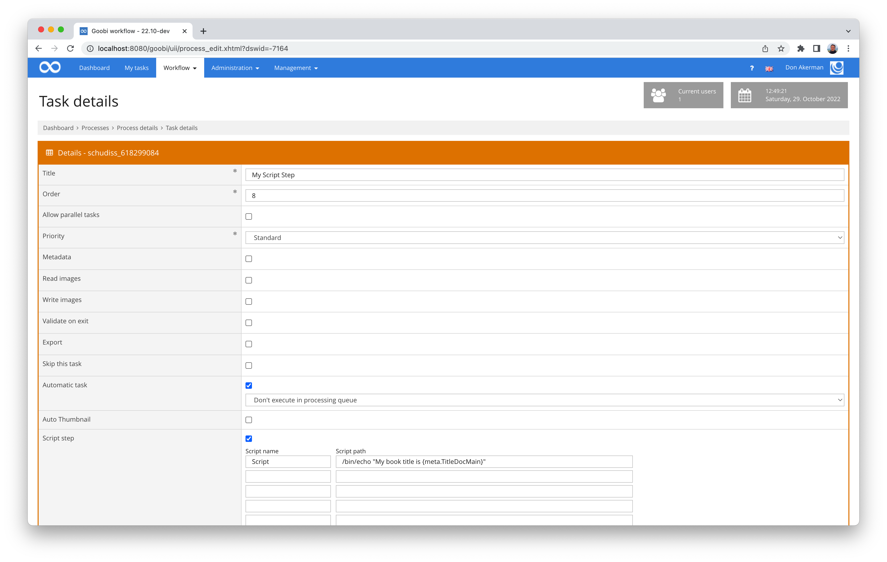

# October 2022

<!-- +++++++++++++++++++++++++++++++++++++++++++++++++++++++++++++++++++++++++++++++++++ -->
## Core


### Bessere Anzeige von Validierungsergebnissen im Metadateneditor
In Goobi workflow, the rule set can be used to control which metadata may occur, for example, how often, where they are permitted and what content is possible in them. In this way, a quality requirement for the metadata to be captured can be well controlled and adhered to. In order for the user to comply well with these requirements, the metadata editor displays validation messages that indicate problems. In the past, however, these messages were only ever displayed globally, not directly on the metadata in question itself and also not on the associated structural element. In other words: As a user, you were a bit perplexed as to which field was not valid and where exactly. You had to do some searching first.

From now on, there are some major changes at this point. Validation messages appear directly at the field in red colour and point out the problems directly with a helpful message. 


And also in the tree display of the structural elements in the left-hand pane, the validation problems are now highlighted and now allow the user to find very quickly the metadatum in question for which there is a message.


If you hold the mouse pointer over a structural element with errors, you will immediately see the corresponding message in a pop-up.


By the way, we also took the opportunity to introduce a new key combination for performing the validation. It is: `CTRL` + `SHIFT` + `V`.

### Search slot in the task list finally conveniently usable again
After minor optical adjustments the search slot within the task list of Goobi workflow had become too small, it was a bit too cumbersome to use lately. It was simply no longer possible to keep track of which search terms had already been entered when the search query became a little longer. 

As of this month, this circumstance is a thing of the past. The search slot is now basically much longer on regular displays.


And even on mobile devices, the usability is such that you can work reasonably with the search:


### Correction of URLs for vocabulary records
Goobi workflow has had a vocabulary management system for some time, which can be used, among other things, to make the metadata editor as convenient as possible by means of selection fields with controlled lists. It is also possible that the values are not only available in a selection field but can also be selected from a hit list after using a search mask. 


In such a case, not only the selected value is taken over for the subsequent display of the digitised material in the Goobi viewer. Instead, a URL for linking to the corresponding vocabulary record is also entered. 


Unfortunately, a small error had crept in here, so that these URLs may not have been correct. We have now corrected this behaviour so that the URLs are now correct. However, please check whether you have already used this functionality. In this case, the URLs you have already entered should be corrected.

### First layout changes go live
We had already announced that we would be making some major changes in the background with regard to accessibility and usability. In the case of the administration screen for users, we are now slowly putting these changes into operation. As announced, this will be accompanied by minor visual changes. This should soon have an impact on other areas as well. 

This is how it already looks:


### GoobiScript now also for changing metadata within metadata groups
For some time there have been various GoobiScripts for changing data within metadata. Unfortunately, until now this was not easily possible for metadata groups. There have been some changes this month so that the existing GoobiScripts can also be used for metadata groups if the parameters are set correctly. 


Since the changes are quite extensive, we have also adapted and extended the documentation. As before, it can be found at the following address:



### Calls of scripts in the journal better traceable
Within the journal (formerly `process log`), the individual activities of a workflow can usually be easily traced. Among other things, the calls of scripts were already logged there in the past in order to be able to trace them better in the event of problems. What was missing, however, was that the variables used were also displayed in their replaced form within the script calls. This has now been adapted so that after each call of a script within the journal, both the script call in its original form and in its resolved form are listed. 

In the case of a simple script like this one:



... this is what the call within the journal now looks like:


By the way, we also took the opportunity to adjust the height of the box so that it makes better use of the available space and you can see more information at once without having to scroll.

### Super admins now always have all rights
Goobi workflow has a fairly granular rights system. It is so flexible that even plugins can define their own rights that a user must have in order to work with the plugin. 

To make life a little easier for the administrators (including ourselves), we have now introduced that all users who have the status of 'super administrator' automatically have all rights in Goobi, including the individual rights that plug-ins bring with them. 


<!-- +++++++++++++++++++++++++++++++++++++++++++++++++++++++++++++++++++++++++++++++++++ -->
## Plugins


### New plugin for flexible file validation
As part of our developments in the delivery of electronic deposit copies, we needed a flexible way for files uploaded by users to be validated and checked for compliance with requirements. Among other things, it should be possible to use any external tools for validation and to ensure compliance with defined levels.

The result of the development is an extremely flexible validation plugin that can be configured very granularly. We have published extensive documentation for the plugin here, including several useful configuration examples:



And as usual, the source code of the plugin and a compiled version can be found on GitHub:



<!-- +++++++++++++++++++++++++++++++++++++++++++++++++++++++++++++++++++++++++++++++++++ -->
## Documentation


### URN plugin now allows use behind a proxy
This should only affect a few users, but for those it is important:

The still quite new plugin for URN registration could not be used until now if the Goobi server is only allowed to access the internet via a proxy. Here we have now made an adjustment that from now on also allows operation behind a proxy. 

We have updated the documentation for this change:



The plugin can be found as usual here on GitHub:



### Documentation for the Artist Dictionary Plugin is online
After a long development on the plugin for capturing linked entities, we have now also completed the related plugins and published them on GitHub. On the one hand, this is a special dashboard plugin:



On the other hand, this workflow plugin is also required:



The installation and configuration of these plugins are now also fully and very granularly documented. They are available as usual on our documentation platform:



<!-- +++++++++++++++++++++++++++++++++++++++++++++++++++++++++++++++++++++++++++++++++++ -->

## Version number
The current version number of Goobi workflow with this release is: **22.10**.
Within plugin developments, the following dependency must be entered accordingly for Maven projects within the `pom.xml` file:

```xml
<dependency>
  <groupId>de.intranda.goobi.workflow</groupId>
  <artifactId>goobi-core-jar</artifactId>
  <version>22.10</version>
</dependency>
```