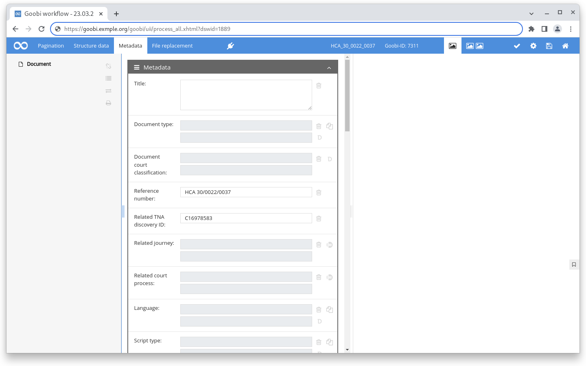
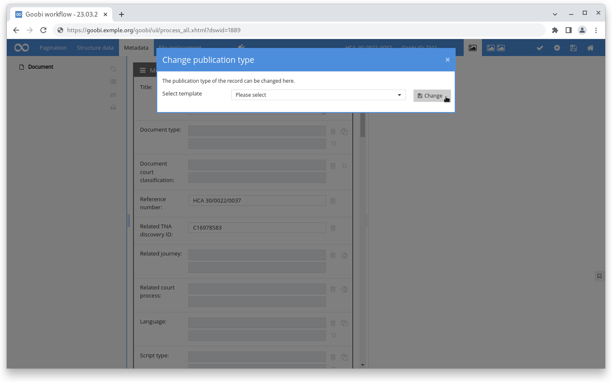
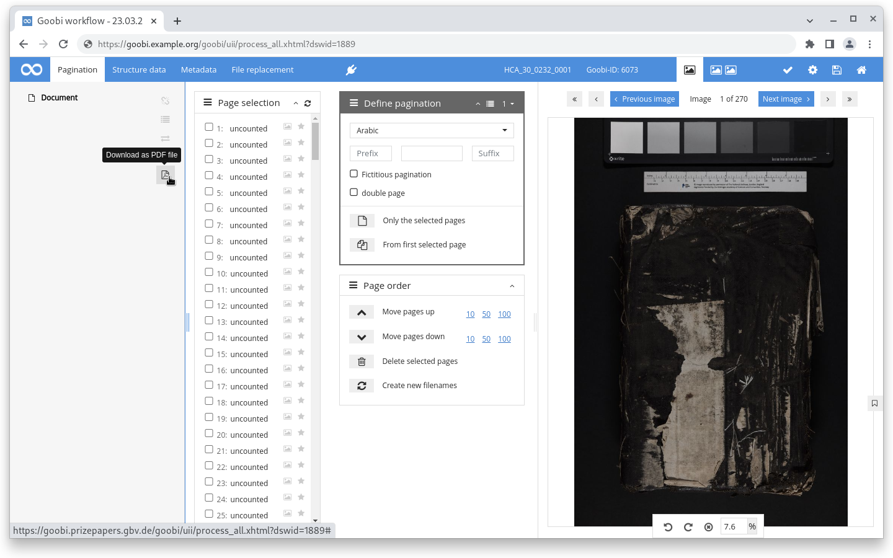

# November 2022

## Projects

### easydb

Together with a partner we developed a process chain that allows to import records exported from an easydb fully automatically into Goobi workflow, to process them and to export them into a Goobi viewer. For this process chain three plugins were used and extended to meet the requirements of the project.

The [generic XML OPAC plugin](https://github.com/intranda/goobi-plugin-opac-generic-xml) can now not only query a remote API, but also read XML files from the file system.

The [DataPoller](https://github.com/intranda/goobi-plugin-administration-catalogue-poller) (formerly CataloguePoller) has been extended as part of the project to not only work over a filter set of tasks, but also iterate over the files in a folder. Also new is the functionality for individual work orders to be processed through the internal ticket queue.

The [Fetch-Images-From-Metadata step plugin](https://github.com/intranda/goobi-plugin-step-fetch-images-from-metadata) has undergone minor adjustments to, for example, find files without file extensions, deal with duplicate file names, or skip error messages for missing images.

The process chain also works periodically, creating new operations or updating existing ones. Once imported, records proceed through the workflow steps as usual.

## Core

### Plugins in the metadata editor

The core of Goobi workflow has been extended to offer plugins within the metadata editor. These plugins are integrated in the blue header at the top and provide their functionality.

The decisive factor for the development was the requirement to be able to change the publication type within the metadata editor. For this, template processes should be created and certain, marked metadata should be taken over during the change.

<figure><figcaption><p>Plugins in the metadata editor at the top of the blue bar</p></figcaption></figure>

<figure><figcaption><p>Metadata editor plugin to change publication type</p></figcaption></figure>

### Metadata generation

It happens again and again that certain metadata are to be formed automatically from other values. An example could be the main title of a letter, which should always be generated as follows: "`Letter from [sender] to [recipient] at [place], [date]`".

To provide this functionality in the metadata editor the configuration file `goobi_metadataDisplayRules.xml` was extended by the possibility to generate values from other metadata values for certain metadata under configurable conditions.

A configuration for the above example could look like this:

<pre class="language-xml"><code class="lang-xml"><strong>&#x3C;generate ref="TitleDocMain">
</strong>    &#x3C;condition>goobi:metadata[@name='genre'][text()='Letter']&#x3C;/condition>
    &#x3C;value>Letter from [ACTOR_FROM] to [ACTOR_TO] at [PLACE], [DATE]&#x3C;/value>

    &#x3C;item>
        &#x3C;label>ACTOR_FROM&#x3C;/label>
        &#x3C;type>xpath&#x3C;/type>
        &#x3C;field>goobi:metadata[@type='group'][@name='name'][goobi:metadata[@name='name_role_roleTerm'][text()='is created by (intellectual)']]/goobi:metadata[@name='name_displayForm']&#x3C;/field>
        &#x3C;regularExpression>(.+), .*&#x3C;/regularExpression>
        &#x3C;replacement>$1&#x3C;/replacement>
    &#x3C;/item>
    &#x3C;item>
        &#x3C;label>ACTOR_TO&#x3C;/label>
        &#x3C;type>xpath&#x3C;/type>
        &#x3C;field>goobi:metadata[@type='group'][@name='name'][goobi:metadata[@name='name_role_roleTerm'][text()='is intended for']]/goobi:metadata[@name='name_displayForm']&#x3C;/field>
        &#x3C;regularExpression>(.+), .*&#x3C;/regularExpression>
        &#x3C;replacement>$1&#x3C;/replacement>
    &#x3C;/item>
    &#x3C;item>
        &#x3C;label>PLACE&#x3C;/label>
        &#x3C;type>xpath&#x3C;/type>
        &#x3C;field>goobi:metadata[@type='group'][@name='location_related_place'][goobi:metadata[@name='location_holdingExternal_relation_type'][text()='is bound from']]/goobi:metadata[@name='location_physicalLocation_related_place']&#x3C;/field>
    &#x3C;/item>
    &#x3C;item>
        &#x3C;label>DATE&#x3C;/label>
        &#x3C;type>variable&#x3C;/type>
        &#x3C;field>{meta.originInfo_dateCreated_start}&#x3C;/field>
        &#x3C;regularExpression>([0-9]{4})-[0-9]{2}-[(0-9]{2}&#x3C;/regularExpression>
        &#x3C;replacement>$1&#x3C;/replacement>
    &#x3C;/item>
&#x3C;/generate>
</code></pre>

### PDF download in the metadata editor

Within the metadata editor there is now the possibility to generate a PDF of all images at any time. For this purpose there is a new PDF button in the left column with the structure tree

<figure><figcaption><p>PDF download in metadata editor</p></figcaption></figure>

## Plugins

### Step: Rename process

There is a new step plugin to rename a task within a workflow. For this purpose, the variables available in Goobi workflow can be used. Additionally underscores and minus are allowed as characters. Empty variables are skipped and spaces are removed.



### Export: Newspaper export

The plugin for exporting to the DDB newspaper portal has been adapted for better display of data in the DFG Viewer.



## Documentation

The documentation of goobi_config.properties has been extensively revised, documented and is now available in [chapter 7.2](https://docs.goobi.io/goobi-workflow-en/admin/7/7.2) of the documentation:

## Version number

The current version number of Goobi workflow with this release is: **22.11**. Within plugin developments, the following dependency must be entered accordingly for Maven projects within the `pom.xml` file:

```xml
<dependency>
  <groupId>de.intranda.goobi.workflow</groupId>
  <artifactId>goobi-core-jar</artifactId>
  <version>22.11</version>
</dependency>
```