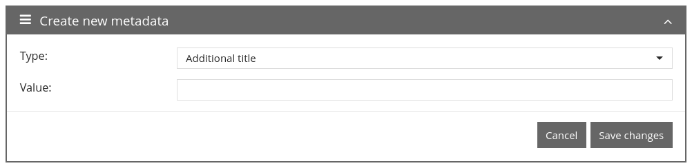
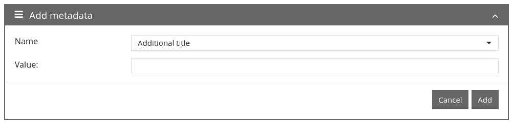

# January 2023

## Coming soon :rocket:

* Porting of **user interface** to **new framework**
* **Periodic tasks**
* **Documentation** of **step details**

## Core

### ALTO Editor

The ALTO Editor for OCR correction, which can be opened in the Metadata Editor if required, now also supports right-to-left languages. Switching is done automatically based on the selected setting in the Metadata Editor itself.

### Usability

Minor usability changes are gradually being incorporated into the interface. In this digest we would like to go into a tiny sub-area and show what this means in practice. The starting point in this case is the metadata editor and the possibility to add another metadata. So far this looked like this:

<figure><figcaption><p>Terminology before the change</p></figcaption></figure>

We have looked at this small sub-area and noted the following points:

* The heading "Create new metadata" suggests by the plural that one can "create" here several at the same time. But this is not possible because in the mask only one can be "created" at a time.
* The word "create" is linked by the terminology rather with "create process". The word "add" is more appropriate here, since a new metadatum is to be added to an existing process.
* Also, the word "new" in the context is actually too much. "Add metadata" is also clear and unambiguous. At this point, the ruleset is not edited.
* "Type" is more likely to be associated with something like "Text, MultiSelect, DropDown, Textarea", but not "Additional title". A metadata of type "Additional title" is weird. Better is simply "Name".
* "Save the changes" says that you have changed something. But something is "created" or isn't "Add" the correct terminology here?

The result of the considerations looks as follows:

<figure><figcaption><p>Terminology after the change</p></figcaption></figure>

Of course, there is much more you can ask yourself at this point:

* Why is the box collapsible and expandable?
* From a UX perspective, is it right to have the cancel and add buttons equally weighted visually?
* Why isn't this simply opened in a modal as an overlay?
* ...

But these questions are more complex to answer and we are taking small steps. This example is just to show how we make things better in various places and little by little.

## Plugins

### Step: Metadata editing

The step plugin to edit metadata directly from the accepted task can now hide empty fields. This was not possible before and led to very long lists in use cases where the plugin was used to quickly check metadata.



## Version number

The current version number of Goobi workflow with this release is: **23.01**. Within plugin developments, the following dependency must be entered accordingly for Maven projects within the `pom.xml` file:

```xml
<dependency>
  <groupId>de.intranda.goobi.workflow</groupId>
  <artifactId>goobi-core-jar</artifactId>
  <version>23.01</version>
</dependency>
```