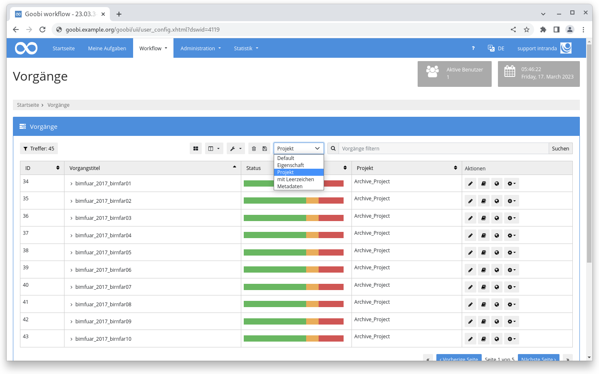

# February 2023

## Coming soon :rocket:

* Porting of **user interface** to **new framework**
* **Periodic tasks**
* **Documentation** of **step details**

## Core

### Performance

A bottleneck in the performance of SQL queries with "Like" queries could be identified and fixed if. This was the case, for example, when queries for step titles were executed. Loading times could be reduced from 155 seconds to 3.2 seconds in some cases.

A significant speed increase was also achieved in the area of automatic tasks by changing the SQL queries.

The result is a faster responding user interface in certain situations.

### Search

Users can now configure individual search entries. For this purpose, a new input area for individual search settings is available in the user settings in the "General" area.

Each line is structured according to the `name=search filter` principle where the placeholder `{}` stands for the search term. An example configuration could be as follows:

```
Default={}
Eigenschaft={} |processproperty:Template:{}
Projekt={} |project:{}
mit Leerzeichen="{}" "|processproperty:Material type:{}" 
Metadaten={} |meta:TitleDocMain:{}
```

If configured, a drop-down menu with the configured values appears in front of the search slot above the table on the "Operations" page.

<figure><figcaption><p>Individual search entries above the operation list</p></figcaption></figure>

## Plugins

### Step: Rename files

The file renaming plugin used to rename automatically in all task folders. Now it can also work only in certain folders. The use case is that one has different upload steps, the files are stored in each case in a temporary folder, then the plugin names the files individually and these are then moved with a script into the _master folder. This way you can ensure an individual and yet uniform naming of the files.



### Step: Change workflow

The plugin for changing the workflow based on task properties can now also influence the priority for individual or all steps of a task. The background to this enhancement is that within a workflow the decision is made whether the task has to be put on the fast lane or not. If overtaking lane, then all steps in the task get a higher priority and appear accordingly higher up in the tasks.



## Version number

The current version number of Goobi workflow with this release is: **23.02**. Within plugin developments, the following dependency must be entered accordingly for Maven projects within the `pom.xml` file:

```xml
<dependency>
  <groupId>de.intranda.goobi.workflow</groupId>
  <artifactId>goobi-core-jar</artifactId>
  <version>23.02</version>
</dependency>
```