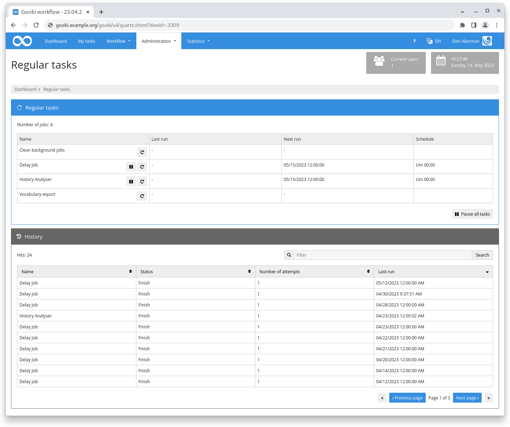
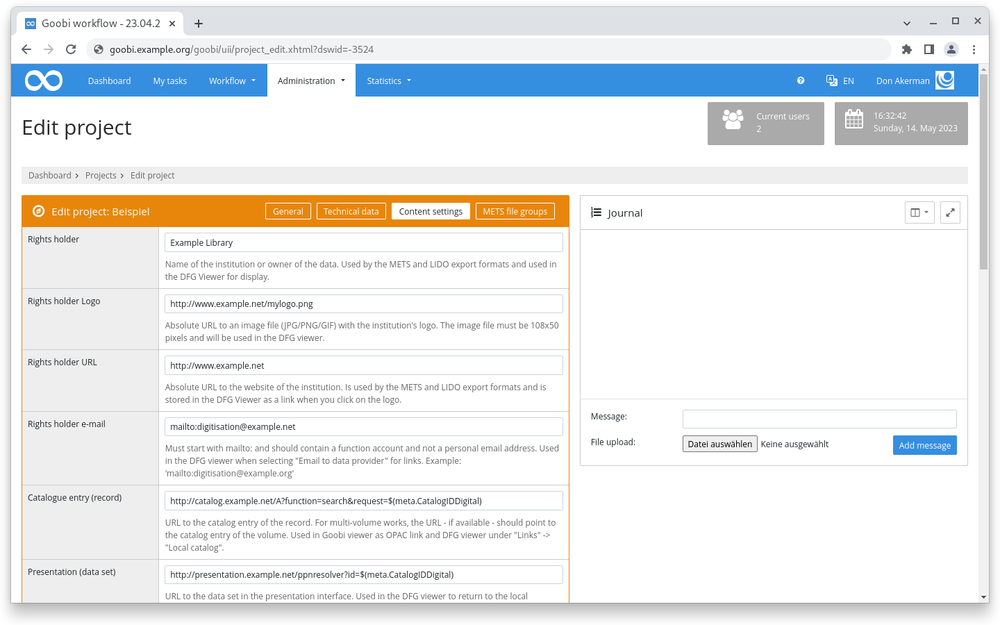

# March 2023

## Coming soon :rocket:

* Porting of **user interface** to **new framework**
* **Documentation** of **step details**
* Improved **PDF-A generation**
* **REST API**

## Core

### Periodic tasks

For some time now, Goobi workflow has been able to trigger certain tasks periodically. There are internal tasks that are executed once a day, but also plugins like DataPoller or delay plugins. This functionality works stably and reliably, but had two limitations that we addressed with this release.

First, everything was done in secret. There was no overview of which regular tasks existed, when they ran and if there was an error or not. For this overview, there is now a new page in the "Administration" section that lists the information mentioned. Also an individual execution or pausing of tasks is possible there.

The second part was the configuration options. Either things were not configurable at all or they were given in seconds since midnight. To start something at 15:30 then the value `55800` had to be specified. Not exactly intuitive. Now the cron syntax is used, which is much more intuitive to read and also more powerful in configuration. The syntax for 15:30 every day is now `0 30 15 * * ?`

<figure><figcaption>
Overview of periodic Tasks in the user interface
</figcaption></figure>

### Sorting for additional columns

For some time now, it has been possible to configure additional columns for the table on the "Tasks" and "My tasks" page in the settings of a user account. From now on these are also sortable if they are in the database. This is for example the case for variables like `{db_meta.XYZ}`, `{process.XYZ}`, `{product.XYZ`} or `{template.XYZ}`. Other variables like `{origpath}` or even `{meta.XYZ}` are not sortable.

### Usability

The usability issue is progressing in small steps. This month we have taken a look at the project configuration and there especially at the tab "METS Parameters" which has been renamed to "Content settings". The names of the lines as well as the inline help have been massively revised and provided with useful examples.

<figure><figcaption>
Revision of terminology in project settings
</figcaption></figure>

### Snippets

* In the queues, the error table is now automatically and regularly emptied.
* In the project settings, a custom URL for the DFG Viewer METS file can be stored in the "Content settings" area.