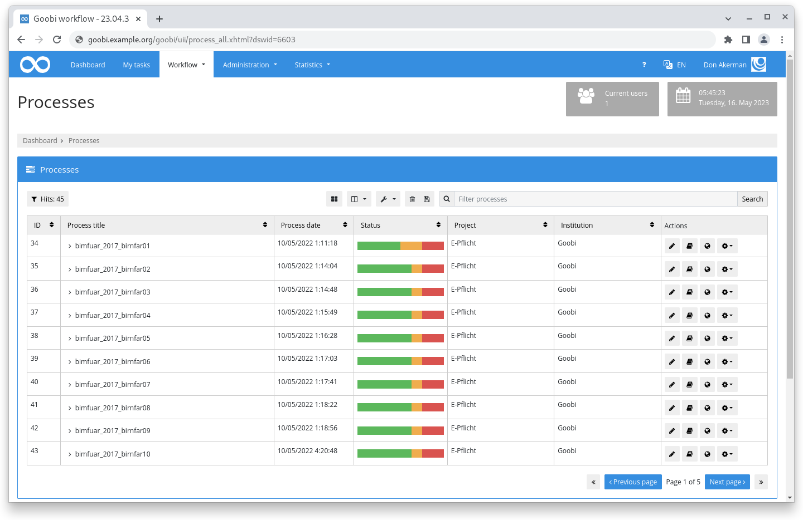
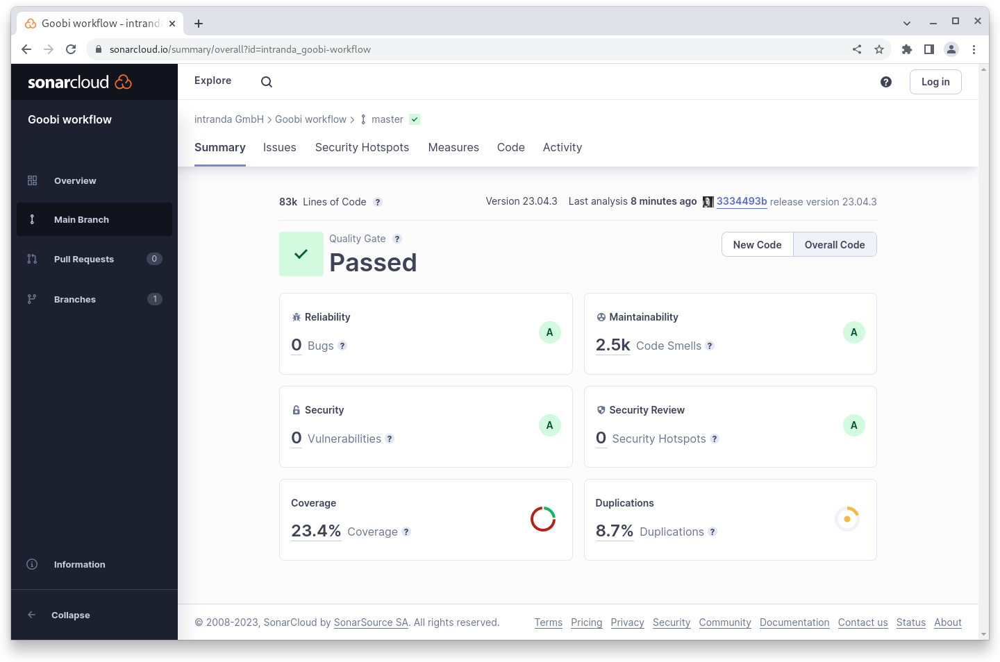

# April 2023

## Coming soon :rocket:

* **Documentation** of **step details**
* Improved **PDF-A generation**

## Core

### User interface

We have worked several hundred hours in the background on it and in the result only little changes at the surface first of all... In the substructure, however, a lot: Where source code was copied and modified over time, there is now a unified system again. New structures have been built, redundancies removed, code and markup for the same things unified and thus the whole structure simplified.

Probably the first thing you'll notice is that everything is a bit more airy and here and there some things might even look a bit strange now. Unusual in any case. But the basic structure and also the design remains the same.

Based on this work, we can now start to work on the usability: How do we want to arrange and name buttons and where? Where do we speak of the terminology in the plural and where singular? Which boxes are displayed where, what is the order of information, and how do we highlight relevant things, hide irrelevant or incidental ones, or reduce the focus? What is a consistent and reliable path to a goal and where do we want to deliberately create shortcuts? With this basis, we can change many things in one central place and it automatically affects all areas. Before we would have had to look at very very many places individually.

Please report things that now look funny or are incomprehensible.

<figure><figcaption><p>The ported user interface looks the same, but seems airier overall</p></figcaption></figure>

### REST API

In April, as part of a project, we began to revisit the REST API and develop what we believe to be essential functionality, refactoring and consolidating existing code as well. Specifically, we considered tasks, steps, properties and the journal and implemented the following functionalities:

* Create tasks, read information, update or delete tasks.
* Read out, update, add, delete or execute steps for an operation
* Read journal and add, update or delete records
* Read out, add, edit and delete properties

The logic uses - where possible - existing code from GoobiScript. The terminology is also chosen to be identical, so there should be recognition effects when working here. The new code has been given meaningful test coverage and the REST commands are also all listed and described in the Swagger documentation.

The new REST endpoints allow integration of functionality with external systems via a standardized interface in the Goobi workflow core.

Here are four example calls for the possibilities available for the journal:


[openapi2402.json](openapi2402.json)



[openapi2402.json](openapi2402.json)



[openapi2402.json](openapi2402.json)



[openapi2402.json](openapi2402.json)


## Plugins

For some time now, the plugins installed in an instance can be viewed via the interface. On the page you can also see if the plugin has been tested against the installed Goobi workflow version number.

With the April release, we started to not only test the plugins for compatibility, but also tag them with an identical version number. This way it is now also possible to immediately identify in the plugin repository the commits that ensure compatibility to a specific core version.

We still need to observe the solution we have found now and possibly also readjust it, but we have already come a big step closer to our goal: "To have plugin versions analogous to the Goobi workflow Core".

## Code analysis

The following screenshot shows the SonarCloud analysis of the current release. More information is available directly on the [project page](https://sonarcloud.io/organizations/intranda/projects).

<figure><figcaption><p>SonarCloud Analysis: Goobi workflow Core - for the Git Tag v23.04.3</p></figcaption></figure>

## Version number

The current version number of Goobi workflow with this release is: **23.04.3**. Within plugin developments, the following dependency must be entered accordingly for Maven projects within the `pom.xml` file:

```xml
<dependency>
  <groupId>de.intranda.goobi.workflow</groupId>
  <artifactId>goobi-core-jar</artifactId>
  <version>23.04.3</version>
</dependency>
```