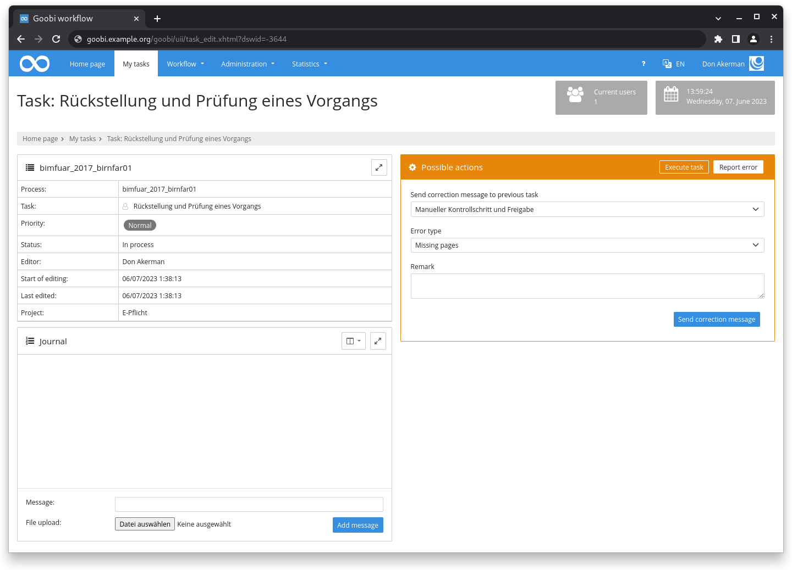
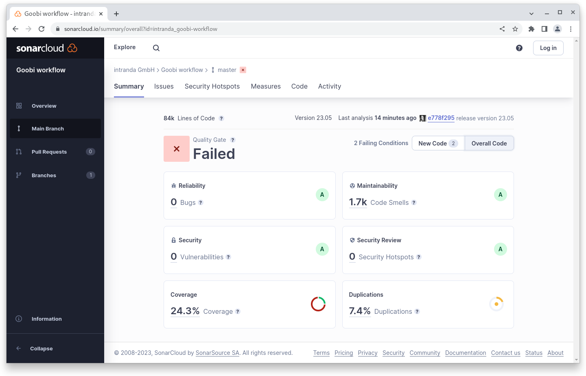

# May 2023

## Coming soon :rocket:

* **Documentation** of **step details**
* Personal **API Token**

## Core

### Error and correction messages

Error and correction messages can be sent in an accepted task. New is that now an optional dropdown menu is available where a list of classic error types can be configured.

The configuration is done for both error and correction messages in the central `goobi_config.properties` file. Here is an example configuration:

```properties
# Text templates for error reporting and problem solutions
task.error.Missing\ pages=The following pages are missing: {}
task.error.Blurred\ images=The images {} are unsharp. Please create these again.
task.solution.Problem\ solved=The problem was solved. {}
task.solution.The\ original\ print\ is\ blurred=The original pages are printed blurry. It is not possible to create sharper images. {}
```

<figure><figcaption><p>Dropdown with error type in "Report error" dialog</p></figcaption></figure>

### Mail sending

Mail sending from Goobi workflow has been unified and different plugins that can also send emails can now access the same configuration. This eliminates redundancies in the code, minimizes maintenance and makes configuration easier.

### Code quality

For some time, we have been working in Goobi workflow with Sonarcloud for static analysis of code quality. In July last year, we started with a good 4,600 issues noted. With this release we have reached about 1,600 issues. In the last month alone, we were able to process around 1,000 issues. In addition, around 75 unit tests were transferred to the core.

### Performance

When creating and deleting processes with a lot of steps (let's say more than 50) there were performance problems. These problems could be solved by changing SQL calls and Java code.

## Plugins

### Import: Excel import

The Excel import plugin now allows the specification of a replacewith attribute for the generation of task titles - analog to the configuration in `goobi_projects.xml` - in order to replace spaces with underscores, for example.



### Step: PDF generation

The PDF generation step plugin now allows specifying and using the PDF generation variants recently introduced in ContentServer. This allows, for example, valid PDF-A files to be generated as a step within a production template and stored in a specified location.



## Code analysis

The following screenshot shows the SonarCloud analysis of the current release. More information is available directly on the [project page](https://sonarcloud.io/organizations/intranda/projects).

<figure><figcaption><p>SonarCloud Analysis: Goobi workflow Core - for the Git Tag v23.05</p></figcaption></figure>

A few words about the failing analysis:

In SonarCloud, quality requirements, called quality gates, can be defined. The quality gates are applied once to the entire source code and once to the source code that has been modified in the last 30 days.

The now failing quality gate in Goobi workflow refers to the adapted source code in the last 30 days. There, a test coverage of at least 25% is required and the duplications should be below 10%. Since we have touched a lot of source code with this release, we do not meet these requirements - based on the source code of the last 30 days.

However, the quality gate for the entire source code is met.

## Version number

The current version number of Goobi workflow with this release is: **23.05.1**. Within plugin developments, the following dependency must be entered accordingly for Maven projects within the `pom.xml` file:

```xml
<dependency>
  <groupId>de.intranda.goobi.workflow</groupId>
  <artifactId>goobi-core-jar</artifactId>
  <version>23.05.1</version>
</dependency>
```