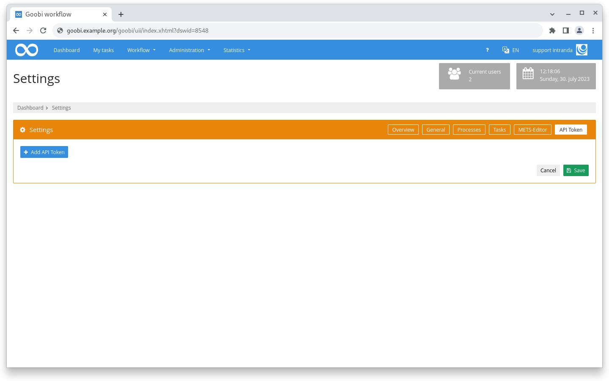
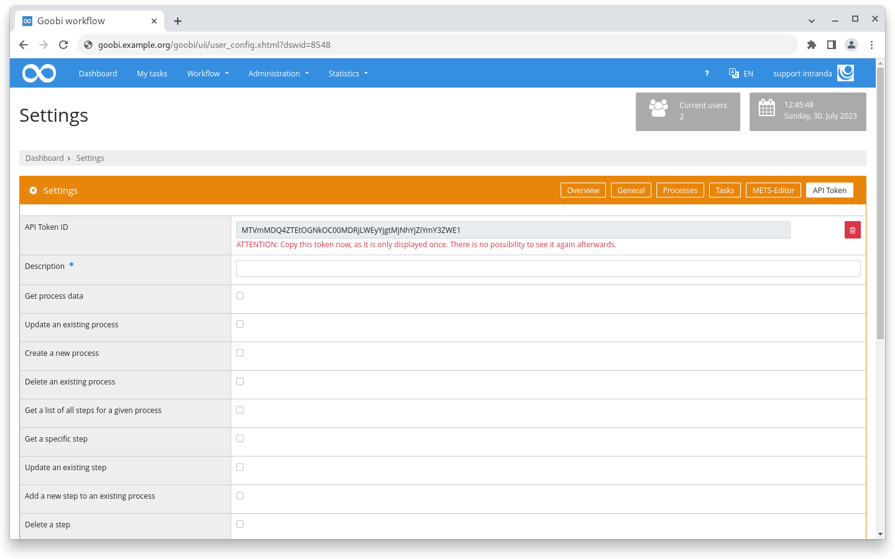
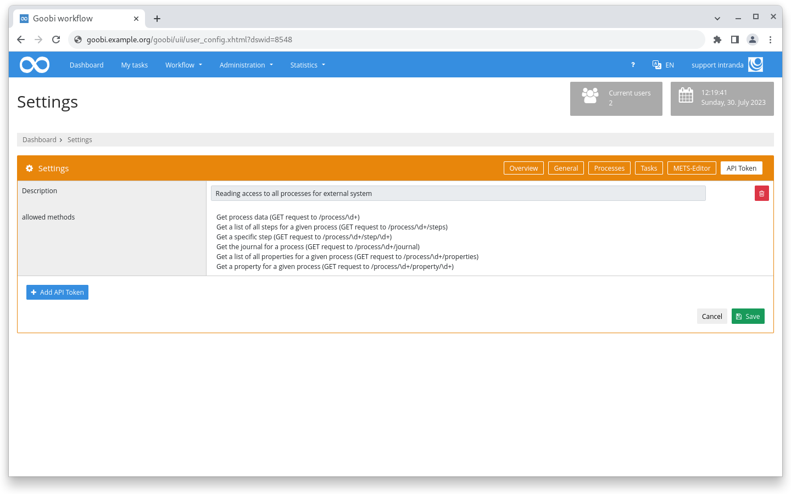
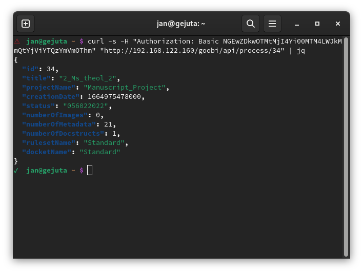

# June 2023

## Coming soon :rocket:

* **GoobiScript templates**
* **Documentation** of **step details**

## Core

### API Token

In the settings of one's own user account, there is a new tab in which an API token can be generated and equipped with the corresponding rights.

Only super administrators or user accounts that belong to a group to which the corresponding right has been assigned have the right to create a token.

This token can then be used with a basic auth to query the previously enabled commands.

<figure><figcaption>
A new API token can be added in the overview
</figcaption></figure>

<figure><figcaption>
When creating, selected REST endpoints can be enabled.
</figcaption></figure>

<figure><figcaption>
Created tokens are visible in the overview with the description and the allowed methods
</figcaption></figure>

<figure><figcaption>
Example call for an API endpoint with token
</figcaption></figure>

### Create process

When creating a task, the mask can be configured via the file `goobi_projects.xml`. Multiselect fields could also be defined with the attribute `multiselect="true"`. If several values were then selected, they ended up one after the other in the configured metadatum or the defined property.

As of this release, a separate metadatum or property is written for each value.

## Plugins

### Step: OCR to metadata

A new step plugin has been developed that allows to convert the OCR text of all images of a process into a metadatum.

## Snippets

* ALTO editing in the metadata editor can now also save files in S3.
* The plugin for automatic PDF extraction has received minor improvements, for example in the case of missing spaces in the full text.


There was no dedicated Goobi workflow release in June.
