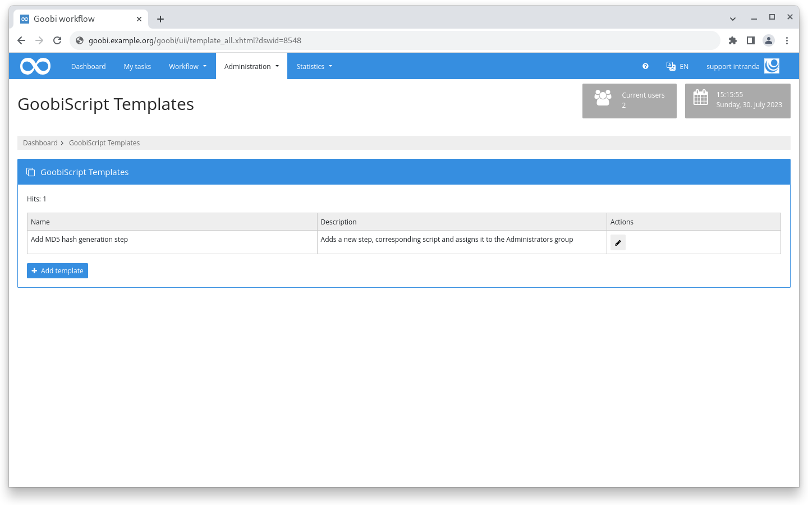
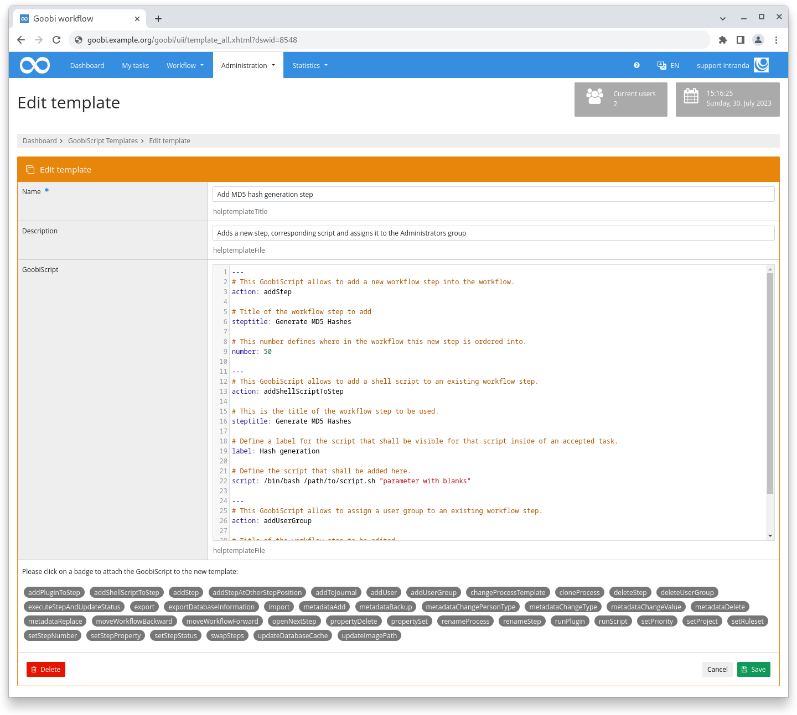
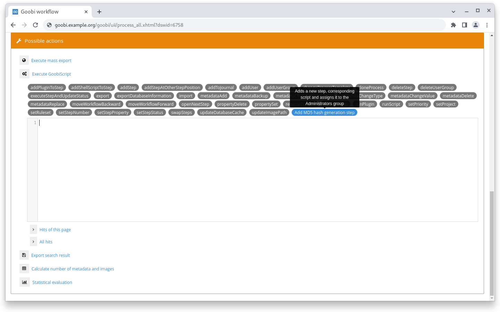
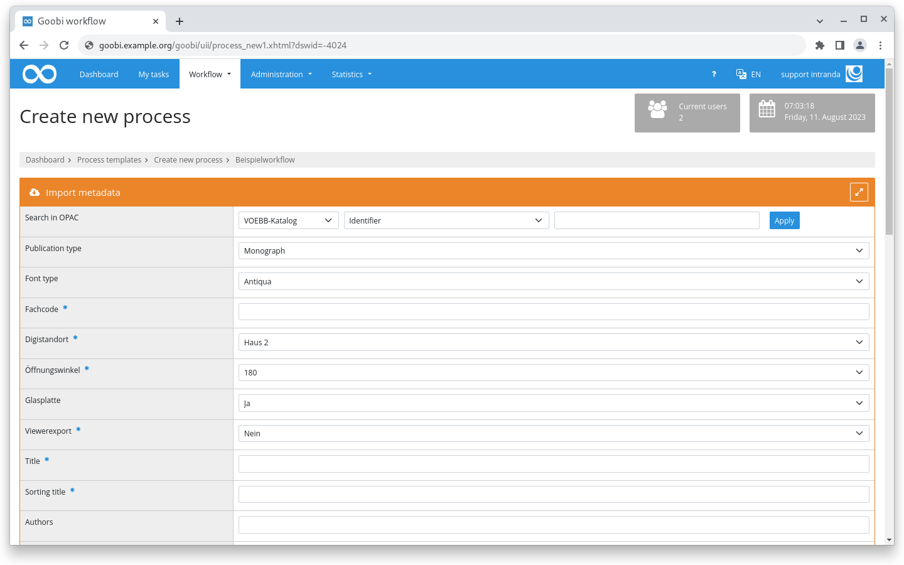
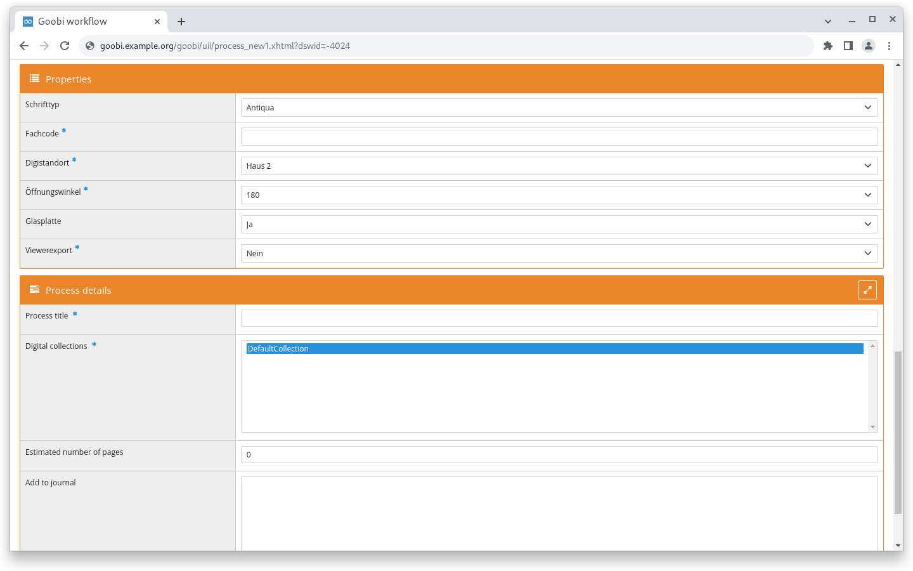
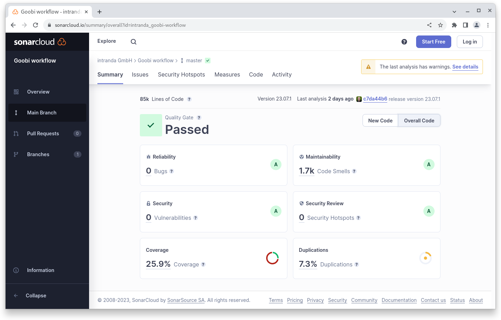

# July 2023

## Coming soon :rocket:

* **GoobiScript** changes
* **Documentation** of **step details**

## Core

### GoobiScript Templates

It often happens that several GoobiScript calls have to be made in succession. Often the calls are repeated because, for example, in a certain project under certain conditions it is necessary to insert a certain step again and again.

There is now a new mechanism to make these tasks more convenient. In the "Administration" section, the new GoobiScript Templates section has been introduced. There, multiple calls can be elegantly concatenated and saved as a template. Each template has a mandatory name and an optional description.

In the list of GoobiScript templates, the self-defined templates are displayed as badges with their own colour. The description is displayed when the mouse is moved over the badge. The same possibilities for dedicated rights management apply to the templates as to the built-in GoobiScript calls.

<figure><figcaption><p>Overview of existing GoobiScript templates</p></figcaption></figure>

<figure><figcaption><p>Mask for editing a GoobiScript template</p></figcaption></figure>

<figure><figcaption><p>GoobiScript templates in the selection of available GoobiScript entries</p></figcaption></figure>

### Properties during process creation

When creating a process, the process properties can now also be managed via the central configuration file `goobi_processProperties.xml`. For this purpose, the new XML element was added to the configuration file. The attributes are `access=""` and `template=""`. The values of the `access` attribute are analogous to the other options already available in the file. The `template` attribute controls which production template the setting applies to. The XML element is repeatable to be able to configure different production templates. It is possible to define a `*` in the `template` attribute so that the setting applies to all production templates.

With this change, it is possible for the first time to visually separate the metadata that is imported from the catalogue from the properties that are to be collected when creating an operation and are therefore completely different in terms of content. Until now, both were displayed mixed together in the upper area with the heading "Import metadata".

Here is an example of a configuration and a screenshot of how it had to be done and looked in `goobi_projects.xml`:

```xml
<item from="prozess" multiselect="false">
    Schrifttyp
    <select label="Antiqua">antiqua</select>
    <select label="Fraktur">fraktur</select>
    <select label="kein OCR">no_ocr</select>
</item>
<item from="prozess" required="true">Fachcode</item>
<item from="prozess" multiselect="false" required="true">
    Digistandort
    <select label="Haus 2">Haus 2</select>
    <select label="Haus 1">Haus 1</select>
</item>
<item from="prozess" multiselect="false" required="true">
    Öffnungswinkel
    <select label="180">180</select>
    <select label="110">110</select>
</item>
<item from="prozess" multiselect="false">
    Glasplatte
    <select label="Ja">true</select>
    <select label="Nein">false</select>
</item>
<item from="prozess" multiselect="false" required="yes">
    Viewerexport
    <select label="Nein">false</select>
    <select label="Ja">true</select>
</item>
```

<figure><figcaption><p>Properties and metadata are displayed together in the creation screen.</p></figcaption></figure>

The same configuration can now be mapped via `goobi_processProperties.xml`. A separate box is then displayed for this purpose in which the settings can be made. This makes it possible to realise a more clearly structured and thus clearer interface.

```xml
<?xml version="1.0" encoding="UTF-8"?>
<config_processProperties>
    <property name="Schrifttyp" container="0">
        <project>*</project>
        <showProcessCreation access="write" template="*" />
        <type>List</type>
        <value>Antiqua</value>
        <value>Fraktur</value>
        <value>kein OCR</value>
    </property>

    <property name="Fachcode" container="0">
        <project>*</project>
        <showProcessCreation access="writeRequired" template="*" />
        <type>Text</type>
        <defaultvalue></defaultvalue>
    </property>

    <property name="Digistandort" container="0">
        <project>*</project>
        <showProcessCreation access="writeRequired" template="*" />
        <type>List</type>
        <value>Haus 2</value>
        <value>Haus 1</value>
    </property>

    <property name="Öffnungswinkel" container="0">
        <project>*</project>
        <showProcessCreation access="writeRequired" template="*" />
        <type>List</type>
        <value>180</value>
        <value>110</value>
    </property>

    <property name="Glasplatte" container="0">
        <project>*</project>
        <showProcessCreation access="write" template="*" />
        <type>List</type>
        <value>Ja</value>
        <value>Nein</value>
    </property>

    <property name="Viewerexport" container="0">
        <project>*</project>
        <showProcessCreation access="writeRequired" template="*" />
        <type>List</type>
        <value>Nein</value>
        <value>Ja</value>
    </property>
</config_processProperties>
```

<figure><figcaption><p>Properties and metadata can now be displayed separately in the creation screen.</p></figcaption></figure>

### Snippets

* The newspaper export for the DDB now writes extended information to meet DFG viewer display requirements.

## Code analysis

The following screenshot shows the SonarCloud analysis of the current release. More information is available directly on the [project page](https://sonarcloud.io/organizations/intranda/projects).

<figure><figcaption><p>SonarCloud Analysis: Goobi workflow Core - for the Git Tag v23.07.1</p></figcaption></figure>

## Version number

The current version number of Goobi workflow with this release is: **23.07.2**. Within plugin developments, the following dependency must be entered accordingly for Maven projects within the `pom.xml` file:

```xml
<dependency>
  <groupId>de.intranda.goobi.workflow</groupId>
  <artifactId>goobi-core-jar</artifactId>
  <version>23.07.2</version>
</dependency>
```