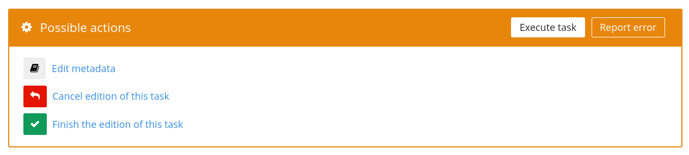
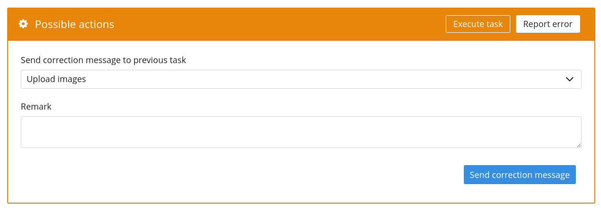
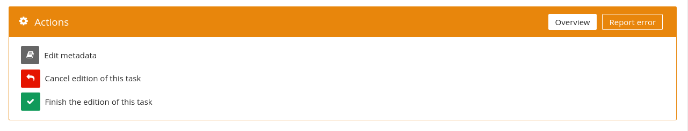
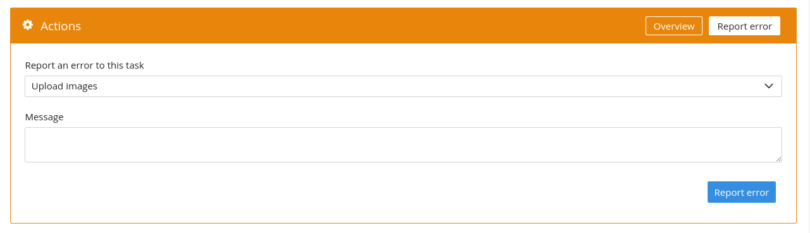
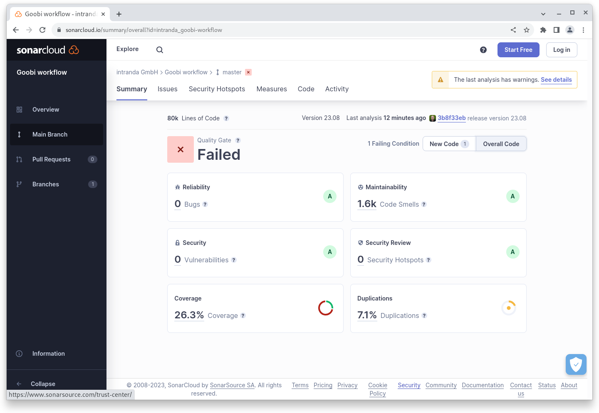

# August 2023

## Core

### Usability

We are always looking for small areas in the user interface in order to specifically improve usability. In August, it was the area of actions within an assumed task, where we tried to create clarity simply by adapting the terminology used.

Here are two screenshots of the area before the update:

<figure><figcaption><p>Old interface before the change in terminology</p></figcaption></figure>

<figure><figcaption><p>second tab in the old interface before the terminology change</p></figcaption></figure>

There was confusion mainly because the first tab was called "Execute task" and the visualisation suggested a button. However, nothing happened when you clicked on it. The second confusion arose in the area of errors and correction messages, where a "correction requested" and an "error solution reported" were displayed. The expectation here was rather that you would "report an error" and "send a correction". The user interface was made clearer simply by adapting the corresponding translations. Here is the result:

<figure><figcaption><p>Interface after renaming</p></figcaption></figure>

<figure><figcaption><p>Second tab in the interface after renaming</p></figcaption></figure>

### GoobiScript

The GoobiScript `openNextStep` has been added to set the first locked task of a process from the hit set to open if no other task is open. If it is an automatic task, it is also started automatically.

In addition, the `addStep` GoobiScript now has the option of using the `number: end` setting to insert the task at the end of the process, even without knowing the exact number. This is determined automatically during the setting.

### REST

A new endpoint has been added to the REST API to start open automatic tasks.



[openapi2402.json](openapi2402.json)


In addition, the endpoint for creating new processes has been extended so that metadata and properties can optionally be added at the same time.


[openapi2402.json](openapi2402.json)


## Plugins

### Export: VLM

In addition to a password, the VLM export now also supports the option of using the SFTP functionality with an SSKH key.

### Export: Heris

A special plugin for the export of five selected images and metadata as a JSON file was developed for the Federal Monuments Office in Austria.

### Import: Nuremberg House Books

A special import plugin was developed for the import of the Nuremberg house books and the conversion of an SQL data structure into METS/MODS files.

### Step: Image selection

A step plugin for selecting and defining a sequence of images and saving the result for further processing as a process property was finalised.

## Code analysis

The following screenshot shows the SonarCloud analysis of the current release. More information is available directly on the [project page](https://sonarcloud.io/organizations/intranda/projects).

<figure><figcaption><p>SonarCloud Analysis: Goobi workflow Core - for the Git Tag v23.08</p></figcaption></figure>

## Version number

The current version number of Goobi workflow with this release is: **23.08**. Within plugin developments, the following dependency must be entered accordingly for Maven projects within the `pom.xml` file:

```xml
<dependency>
  <groupId>de.intranda.goobi.workflow</groupId>
  <artifactId>goobi-core-jar</artifactId>
  <version>23.08</version>
</dependency>
```