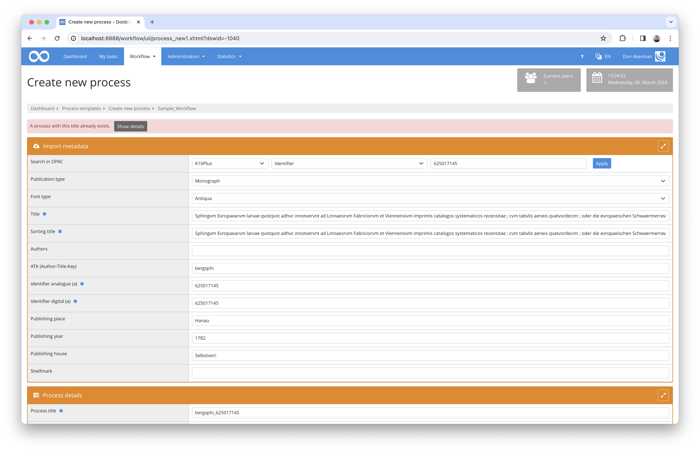
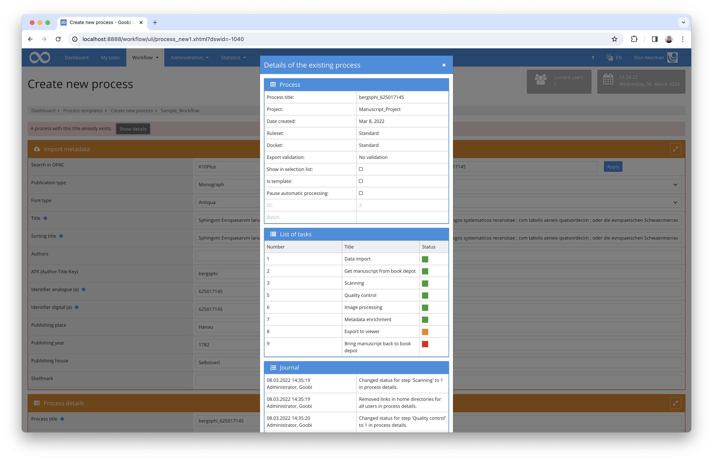

# September 2023

# September

## Core

### Usability

The Goobi workflow creation screen has always prevented a process with the same name from being created again. You would then receive a short error message saying that the process already exists. This has been enhanced so that you can now also view the details of the existing process.

<figure><figcaption>
Error message when creating a new process
</figcaption></figure>

<figure><figcaption>
Details of the existing process in the creation screen
</figcaption></figure>

### GoobiScript

The GoobiScript calls `metadataAdd` and metadataReplace can now also create or manipulate authority data values. This makes it possible, for example, to subsequently adjust the GND ID for persons in bulk.

At the same time, the GoobiScript `metadataReplaceAdvanced` was introduced. This call also allows you to work with regular expressions.

### REST

September also brought changes to the REST interface, two new endpoints were added. The first allows a search and returns a list of process IDs.

The second allows you to complete tasks with a defined title.

## Plugins

### Import: Excel to EAD

An import plugin has been developed to create an EAD archive structure with metadata from an Excel file.


There was no dedicated Goobi workflow release in September.
