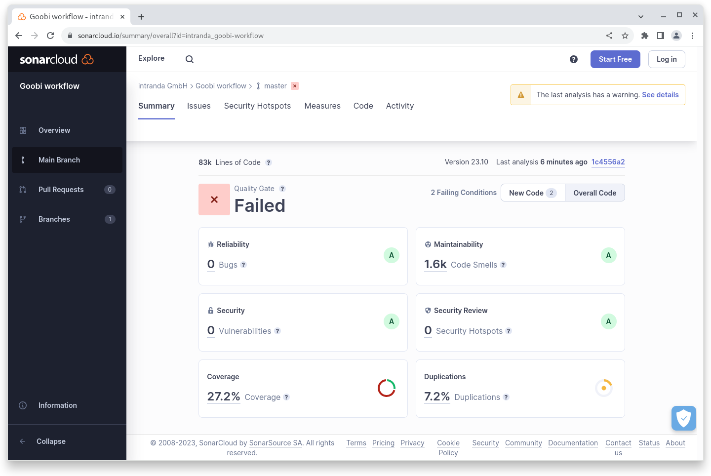

# October 2023

## Core

### Harvester

Much of the functionality of the intranda harvester has been integrated into the Goobi workflow core. Repositories of different types can now be created and configured. The harvester queries a repository, for example of type OAI-PMH, at a specified frequency and downloads the data records to a specified folder. Repositories can be switched on or off individually.

It is possible to define a script that is to be applied to each downloaded data record. This makes it very easy to modify the downloaded files.

If desired, processes can also be created in Goobi workflow. To do this, a project, a production template and the import format must be selected. The mapping from the rule set is available for the import formats.

This integration allows data records to be harvested from Goobi workflow, for example, prepared via a script and then forwarded directly to the Goobi viewer hotfolder. Another scenario is that, for example, MARC-XML data records are downloaded from an OAI-PMH interface and processes are created in Goobi workflow for further work.

### LIDO

The Java library UGH has been extended so that it can also generate empty elements, as is necessary for the LIDO format. With the following export mapping, for example, an element is created even if there is no value:

```xml
        <Metadata>
          <InternalName>Person</InternalName>
          <WriteXPath>./lido:eventActor/lido:displayActorInRole</WriteXPath>
          <exportEmptyNode>false</exportEmptyNode>
        </Metadata>
```

## Plugins

### Dashboard: Barcode

The dashboard plugin allows you to scan a barcode into an input box and directly execute a previously selected action. For example, a task can be accepted or accepted and directly completed again.

### Import: Liechtensteiner Volksblatt

A special import plugin has been developed for importing the Liechtensteiner Volksblatt.

## Code analysis

The following screenshot shows the SonarCloud analysis of the current release. More information is available directly on the [project page](https://sonarcloud.io/organizations/intranda/projects).

<figure><figcaption><p>SonarCloud Analysis: Goobi workflow Core - for the Git Tag v23.10</p></figcaption></figure>

## Version number

The current version number of Goobi workflow with this release is: **23.10.2**. Within plugin developments, the following dependency must be entered accordingly for Maven projects within the `pom.xml` file:

```xml
<dependency>
  <groupId>de.intranda.goobi.workflow</groupId>
  <artifactId>goobi-core-jar</artifactId>
  <version>23.10.2</version>
</dependency>
```