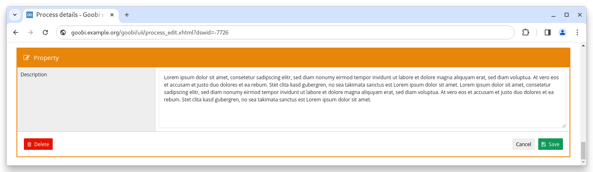

# November 2023

## Core

### Process properties

The process properties available in Goobi workflow can now also be displayed as a text area. They are configured using the familiar `goobi_processProperties.xml`. An example configuration is as follows:

```xml
    <property name="Beschreibung" container="0">
        <project>*</project>
        <showProcessCreation access="write" template="*" />
        <type>Textarea</type>
        <defaultvalue></defaultvalue>
    </property>
```

<figure><figcaption><p>Process property as text area</p></figcaption></figure>

### Snippets

* If the GoobiScript for deleting processes was called several times in succession using the same hit set, an error occurred which made it necessary to restart the application. The behaviour has been corrected.
* The default configuration of ActiveMQ has been adjusted so that the service only listens on localhost.
* An error that occurred when repeating certain variables in script steps has been fixed

## Plugins

### Import: Charité - Female doctors in the German Empire and persecuted doctors

A special import plugin was developed for the import of the two databases "Female Doctors in the German Empire and the Weimar Republic" and "Persecuted Doctors of the Berlin Municipal Health Service (1933-1945)" and the conversion into METS/MODS files.

### Step: Metadata per image

A very powerful step plugin was finalised this month. This allows a wide range of metadata and links to be recorded for each image in a process.

### Step: Duplicate tasks

The plugin makes it possible to read a task property and duplicate an existing workflow step multiple times for each line in the property. It also duplicates the properties split into individual properties per line.

### Step: Extract PDF files

The already known plugin for the fully automatic preparation of PDF files has been supplemented by free file naming and updated documentation.

## Code analysis

The following screenshot shows the SonarCloud analysis of the current release. More information is available directly on the [project page](https://sonarcloud.io/organizations/intranda/projects).

<figure><figcaption><p>SonarCloud Analysis: Goobi workflow Core - for the Git Tag v23.11</p></figcaption></figure>

## Version number

The current version number of Goobi workflow with this release is: **23.11.1**. Within plugin developments, the following dependency must be entered accordingly for Maven projects within the `pom.xml` file:

```xml
<dependency>
  <groupId>de.intranda.goobi.workflow</groupId>
  <artifactId>goobi-core-jar</artifactId>
  <version>23.11.1</version>
</dependency>
```