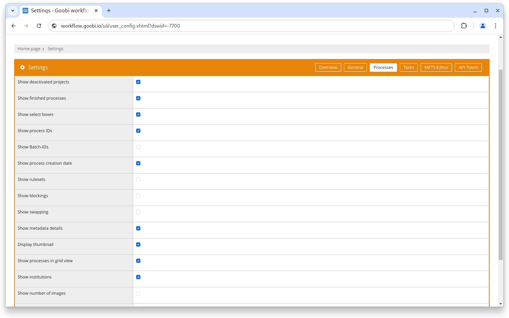
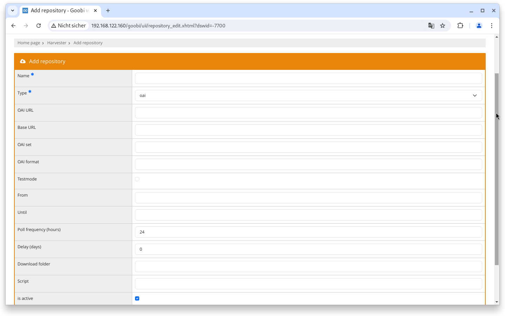
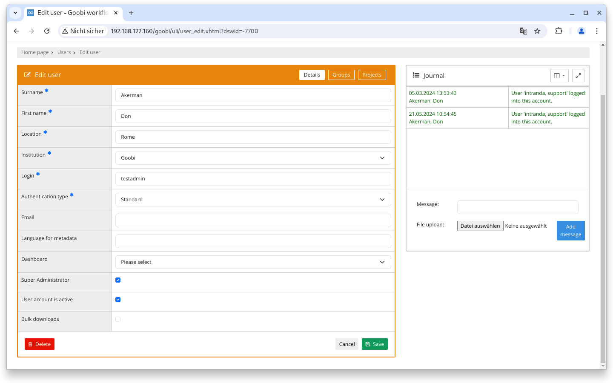
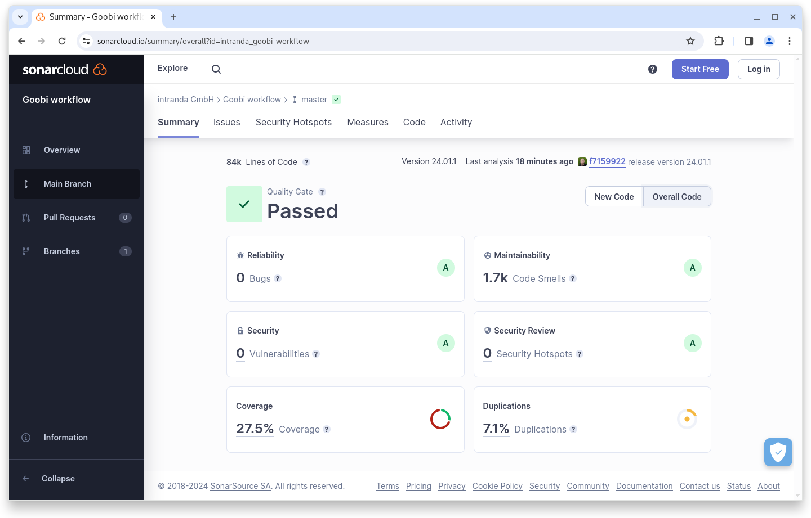

# January 2024

## General


We are planning a major change to the Maven architecture of Goobi workflow and the plugins in the coming months. This internal work may temporarily affect the way developers and system administrators work.


## Core

### User settings

For some time now, the number of images within a process can be displayed as an additional table column. Until now, however, it was not possible to activate this setting in general, but it had to be reset after each login. From the January release, it will be possible to save the option in the user settings so that it is active by default for an account.

<figure><figcaption><p>Number of images now also in the user settings</p></figcaption></figure>

### Search

It is now possible to search for all tasks that have a task with a specific title. Previously, the status of the task had to be specified (`steplocked:`, `stepopen:`, `stepinwork:`, `stepdone:`, ...). From now on, simply `step:` followed by a title or part of a title also works.

### Harvester

The harvester introduced in October has been extended to include a test mode for the OAI-PMH type. If this is activated, only the first page is queried rather than the complete hit set. The resumptionToken is ignored.

Static from and until values can also be set. If the values are empty, the system searches incrementally for all new data since the last query.

<figure><figcaption><p>New options for the integrated harvester, including a test mode</p></figcaption></figure>

### Accessibility

In the January release, we worked on many small construction sites in the context of improved usability and accessibility. For example, some page titles have been added, operation via the keyboard under Firefox has been improved, alternative texts for graphic elements have been added and the page structure has been improved. The changes are only noticeable when Goobi workflow is operated with a screen reader or without a mouse.

### Security

For some time now, the journal has also been displayed for user accounts. From the January release, a message is automatically left there when the user profile is entered by an administrator.

<figure><figcaption><p>User journal now contains information about loading the settings by an administrator</p></figcaption></figure>

### Snippets

* The `steptitle` option is now optional in the GoobiScript `setPriority` function.
* An error that occurred during an empty search for authority data is now intercepted.

## Plugins

### Import: Excel

The generic import plugin for Excel files can now also process the creation of processes via GoobiScript.

### OPAC: Soutron

The Soutron OPAC plugin now also supports the new XML API.

## Code analysis

The following screenshot shows the SonarCloud analysis of the current release. More information is available directly on the [project page](https://sonarcloud.io/organizations/intranda/projects).

<figure><figcaption><p>SonarCloud Analysis: Goobi workflow Core - for the Git Tag v24.01.1</p></figcaption></figure>

## Version number

The current version number of Goobi workflow with this release is: **24.01.2**. Within plugin developments, the following dependency must be entered accordingly for Maven projects within the `pom.xml` file:

```xml
<dependency>
  <groupId>de.intranda.goobi.workflow</groupId>
  <artifactId>goobi-core-jar</artifactId>
  <version>24.01.2</version>
</dependency>
```