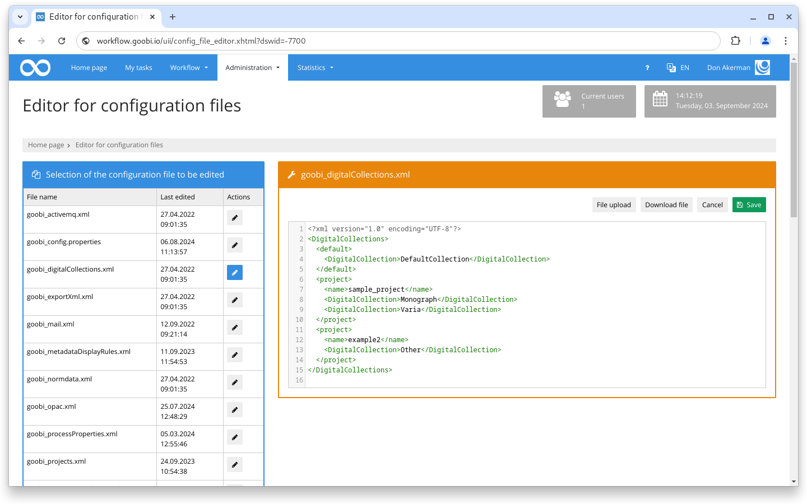
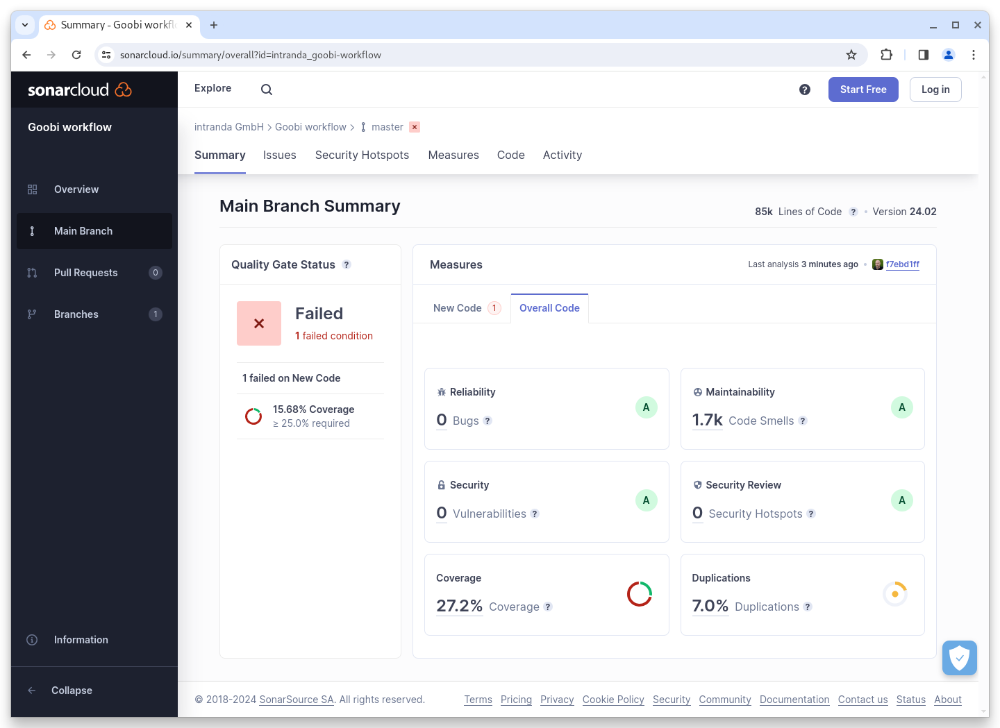

# February 2024

## General


We are planning a major change to the Maven architecture of Goobi workflow and the plugins in the coming months. This internal work may temporarily affect the way developers and system administrators work.



In the coming months, intensive work will be carried out on the ‘Archives’ and ‘Vocabularies’ areas.


## Core

### Config Editor

The former plugin for the Goobi workflow configuration editor has been integrated into the core and is available from this release without additional installation.

<figure><figcaption><p>The configuration editor has been integrated into the Goobi workflow Core</p></figcaption></figure>

### Frontend build system

The interface of Goobi workflow is significantly styled using the classic web technologies CSS and Javascript. However, development takes place in SASS or LESS files, for example, which are then compiled into CSS. There are also various individual files in JavaScript, which are then combined into one file for the application. In the past, compiling and summarising took place on the developer's PC, who then checked the finished files into the repository. From the February release onwards, these steps will be carried out automatically in the CI environment. This simplifies the development process and reduces the potential for merge conflicts.

### Snippets

* The comparator for file names has been fundamentally revised so that ascending and descending sorting of files in the core and in plugins is easier and more error-free.

## Plugins

### Export: VLM

The VLM export plugin can now use different configuration blocks based on metadata and conditions.

### Step: Rename files

The step plugin for renaming files has been massively extended and can now contain several `<condition />` and `<replace />` arguments in the new configuration section `<namepart />`.

### Step: Metadata edition

There was a bugfix in the step plugin for editing metadata to save information about the representative correctly.

## Code analysis

The following screenshot shows the SonarCloud analysis of the current release. More information is available directly on the [project page](https://sonarcloud.io/organizations/intranda/projects).

<figure><figcaption><p>SonarCloud Analysis: Goobi workflow Core - for the Git Tag v24.02</p></figcaption></figure>

## Version number

The current version number of Goobi workflow with this release is: **24.02.2**. Within plugin developments, the following dependency must be entered accordingly for Maven projects within the `pom.xml` file:

```xml
<dependency>
  <groupId>de.intranda.goobi.workflow</groupId>
  <artifactId>goobi-core-jar</artifactId>
  <version>24.02.2</version>
</dependency>
```