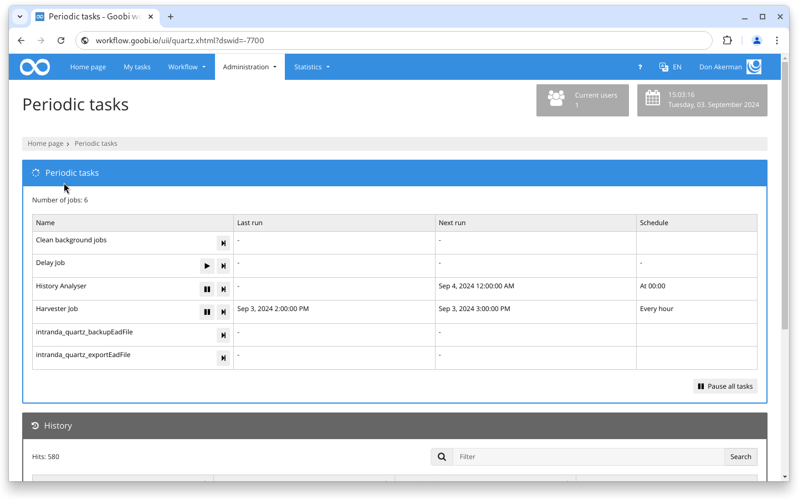

# March 2024

## General


The major changeover in the Maven architecture of Goobi workflow and the plugins is in full swing, which is why there will be no Goobi workflow release in March.


## Core

### Config Editor

The newly integrated configuration editor has been extended to allow complete files to be uploaded and downloaded. Furthermore, the backups of the files written in the background are optionally offered for download in the user interface

### Periodic tasks

There have been minor changes to the user interface in the Quartz job management section. When a task is paused, the schedule and date for the next execution are now not displayed. In addition, the icon for one-time execution has been changed.

<figure><figcaption>
Minor visual changes on the regular tasks page
</figcaption></figure>

### Vocabularies

In the area of vocabularies, work has begun on standardising the usability of importing and exporting data records.

### Archives

In the area of archives, work has begun on implementing the new Java logic for searching in collections.

## Plugins

### Export: ADM - BSME

An export plugin has been developed that supports the creation of special export formats in the Imagen Media Archive Management software.

### Step: ALMA API

The ALMA API plugin can now also contain conditions for variables.

### Step: Metadata enrichment via Excel file

The new step plugin allows metadata to be read from an Excel file and added to existing structural elements.