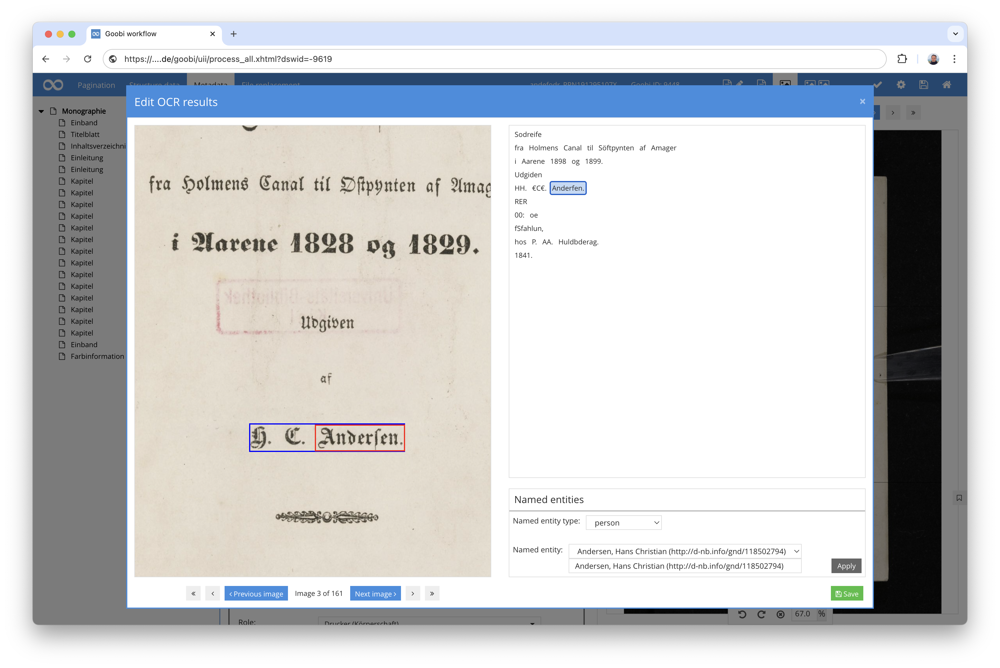
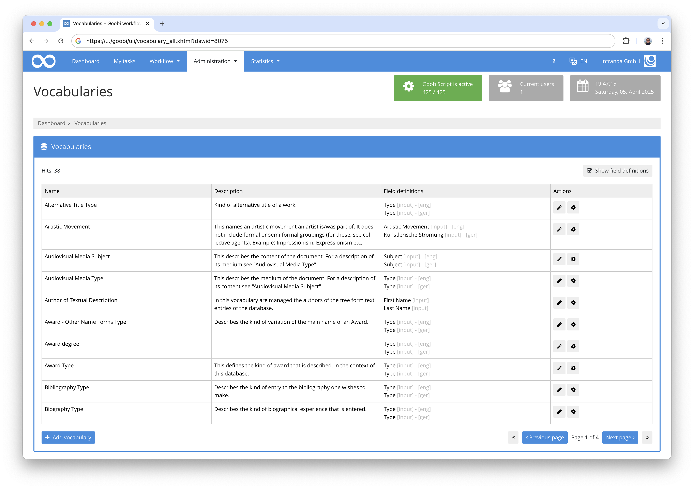
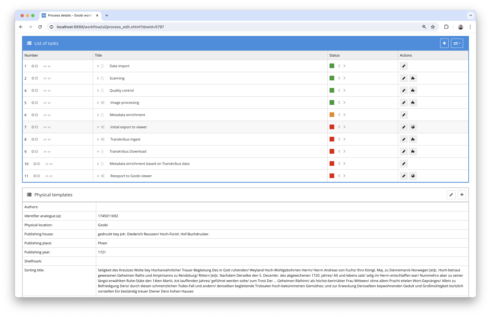
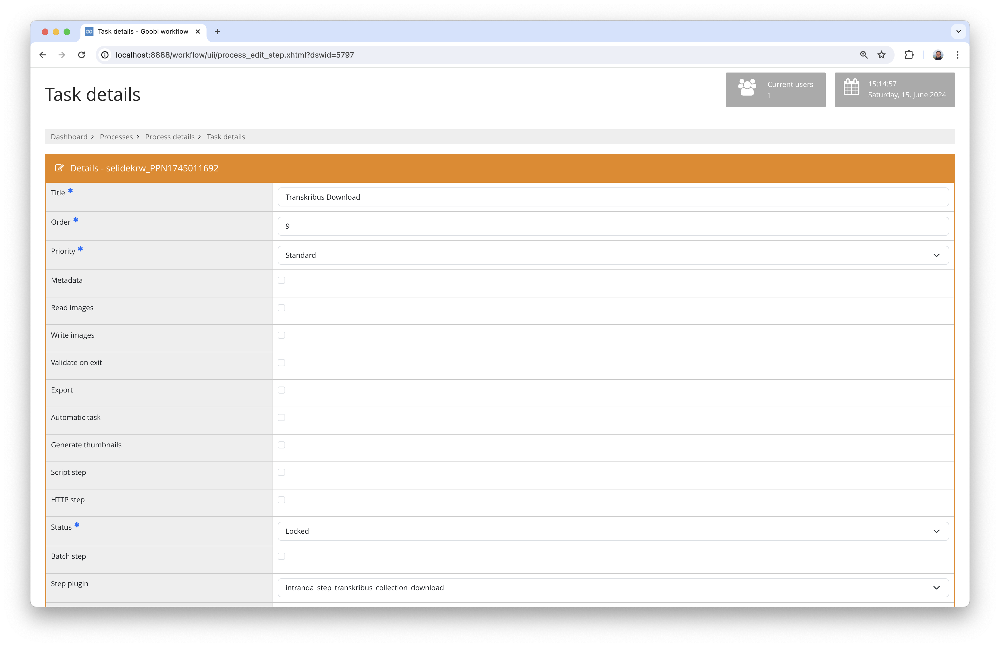

# May 2024

## General
The changes to the Maven infrastructure described in April have taken much longer than expected. However, progress has also been made in other areas, for example with the vocabularies and some plugins.


## Core

### ALTO Editor
A new tagging functionality has been added to the solution integrated into the metadata editor for editing ALTO files. One or more words can be marked and linked to an entity type and standard data. The standard data that is already known in the METS file is available in a drop-down menu. Alternatively, you can also enter your own URLs to enable the link to the standard data.



### New development of vocabularies
Due to new requirements, it has become necessary to significantly revise the management of vocabularies. We have decided to manage the vocabularies in a separate vocabulary server in future. This will then be available to Goobi workflow, Goobi viewer and other solutions via an API in order to retrieve information from it. Development is still at a very early stage and will probably continue for a few more weeks.




## Plugins

### Connecting COPE to Goobi workflow
In one project, the need arose to connect the COPE software from Digital Transitions to Goobi workflow. It is used to convert RAW files from Capture One into TIFF files while retaining all relevant image information. The particular difficulty here was connecting this Windows-based software to Goobi. Using Python scripts, we have now succeeded and gone live.


### Connection of the Transkribus Collections
In the context of a project, it became necessary to implement a further Transkribus connection. The specific aim was to use already digitised image files for labelling in Transkribus in order to be able to generate a ground truth for new recognition models.

Two new plugins were therefore implemented to realise this functionality. The first plugin is responsible for reporting the METS file already published in the Goobi viewer with the associated image files to Transkribus and importing them into the user's desired collection there.



The second plugin, on the other hand, is responsible for retrieving the data enriched in Transkribus and the results generated as ALTO files and saving them in the OCR folder of the respective process.



The documentation for both plugins can be found here:

[https://docs.goobi.io/workflow-plugins/en/step/goobi-plugin-step-transkribus-collection](https://docs.goobi.io/workflow-plugins/en/step/goobi-plugin-step-transkribus-collection)

The plugin can be downloaded for installation here:

[https://github.com/intranda/goobi-plugin-step-transkribus-collection](https://github.com/intranda/goobi-plugin-step-transkribus-collection)


## Version number
The current version number of Goobi workflow with this release is: `24.05`. Within plugin developments, the following dependency must be entered accordingly for Maven projects within the `pom.xml` file:

```xml
<dependency>
    <groupId>io.goobi.workflow</groupId>
    <artifactId>workflow-core</artifactId>
    <version>24.05</version>
    <classifier>classes</classifier>
</dependency>
```