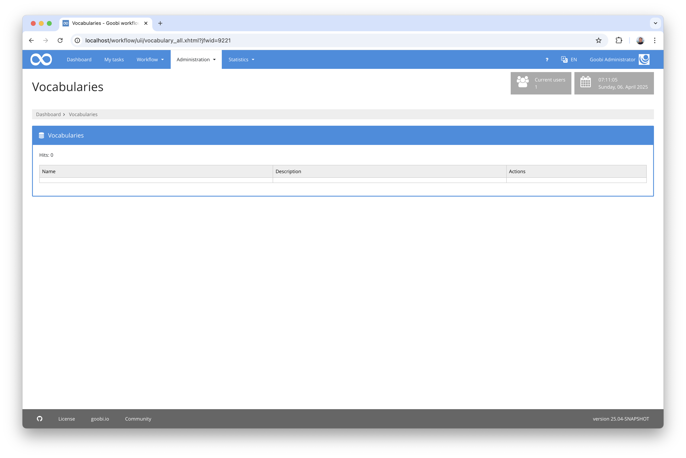
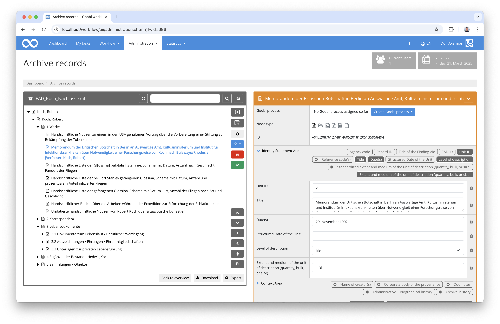

# June 2024

## General
This month, the focus was mainly on implementing the new vocabulary management system. However, the archive management has also been given a new look.


## Core  

### More flexible folder configuration
For some time now, it has been possible to configure various folders in order to use other directory structures in addition to `master` and `media`. This functionality has now been extended so that the configurable folders can now also be configured for other locations and are not just limited to those within the `images` directory of the process. An example configuration looks like this:

The directories are defined in the configuration file `goobi_config.properties` like this:

```toml
process.folder.ocr.pdf={processtitle}_pdf
process.folder.export.files={processtitle}_pdf
process.folder.validation.jpylyzer={processtitle}_xml
```

Such defined paths can then be used within a plugin, for example in the FileUpload plugin in its configuration file `plugin_intranda_step_fileUpload.xml`:

```xml
<config_plugin>
    <config>
            <project>*</project>
            <step>*</step>
            <regex>/.*/</regex>
            <folder>master</folder>
            <folder>media</folder>
            <folder>ocr.pdf</folder>
            <folder>export.files</folder>
            <folder>validation.jpylyzer</folder>                        
    </config>
</config_plugin>
```

### Vocabulary
Work on the vocabulary server started last month and is continuing. There is not much visible to report yet. We expect to be able to report more detailed progress in the coming weeks.



## Plugins 

### Archive management  
For greater performance and flexibility in the overall EAD / archive context, we have decided to remove the storage of archive records from the separately installed BaseX database and instead store all EAD data internally in the Goobi database, managed by Goobi workflow. This under-the-hood work has now been largely completed. This has already resulted in an enormous increase in performance.



The first changes to the user interface have now also been made. For example, it has been implemented that the `NodeID` can now always be displayed in the archive tree and nodes can be created in bulk and provided with metadata. The display of the metadata of the individual nodes can also be controlled somewhat better via the configuration file and links can be created between different nodes.

We will be busy with the developments for a few more weeks. We will report back here.


## Version number
The current version number of Goobi workflow with this release is: `24.06.1`. Within plugin developments, the following dependency must be entered accordingly for Maven projects within the `pom.xml` file:

```xml
<dependency>
    <groupId>io.goobi.workflow</groupId>
    <artifactId>workflow-core</artifactId>
    <version>24.06.1</version>
    <classifier>classes</classifier>
</dependency>
```