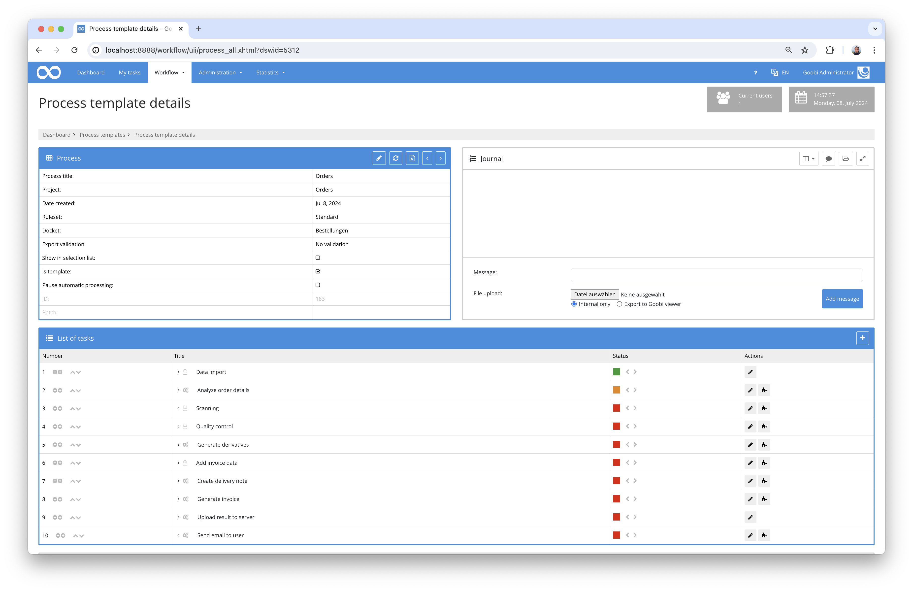

# July 2024

## General
This month, the focus was on three things in particular: remodelling the vocabulary, implementing the new archive management system and developing the plugin for the Austrian housing fund. 


## Core

### Vocabulary
Development work on the new vocabulary server is progressing well. Functionally, everything has been prepared for the new vocabulary server to such an extent that we were able to concentrate on implementing the user interface this month. 


The aim is to make as much as possible easy to use via the user interface. We will not yet implement an administrative interface for creating new vocabularies in this context. 


### User interface and Javascript frontend build
There are a lot of legacy issues that have accumulated over the years that we are currently cleaning up in parallel. We have been working on a revision of the user interface for quite some time now. In this context, we are also checking the dependencies of the JavaScript libraries used in the background as well as the entire compilation process for the user interface. Much of this work is not directly visible in the application later on. However, this work is still necessary.


## Plugins

### Data import for the Austrian housing fund
An automated data import was developed for the Austrian housing fund. This involves digitised files, which are provided in the form of several deliveries by the scanning service provider and are stored in json files, being broken down into their respective documents, structured and enriched with metadata.


The plugin is very specific to the Austrian housing fund and is therefore hardly usable for other projects. Nevertheless, further details can be found here on the documentation page for those interested:

[https://docs.goobi.io/workflow-plugins/en/quartz/goobi-plugin-quartz-bka-wohnbau](https://docs.goobi.io/workflow-plugins/en/quartz/goobi-plugin-quartz-bka-wohnbau)


### Implementation of invoice generation and delivery note generation with cost recording  
The central library in Zurich needed to be able to process user orders as automatically as possible. A very special workflow was developed for this purpose, which analyses the user orders and carries out the desired Workflow steps accordingly.



One part of the workflow is that information on costs can also be recorded. These are dependent on the currency, the order, the delivery type and other factors, so that a manual adjustment of the cost breakdown is actually required.


Finally, Goobi uses this plugin to automatically generate delivery notes, upload the data to a target server and also generate an invoice template for the accounting department.


More details about the plugin can be found as usual here on the documentation page:

[https://docs.goobi.io/workflow-plugins/en/step/goobi-plugin-step-zbz-order-delivery](https://docs.goobi.io/workflow-plugins/en/step/goobi-plugin-step-zbz-order-delivery)


### Archive management
We are in the final stages of the major remodelling of the archives. Our planning envisages that we will be finished with the developments next month. Detailed information about the new features will then finally be available.


## Version number
The current version number of Goobi workflow with this release is: `24.07`. Within plugin developments, the following dependency must be entered accordingly for Maven projects within the `pom.xml` file:

```xml
<dependency>
    <groupId>io.goobi.workflow</groupId>
    <artifactId>workflow-core</artifactId>
    <version>24.07</version>
    <classifier>classes</classifier>
</dependency>
```