# August 2024

## General

## Core

### New vocabulary server
Goobi workflow has already had a vocabulary management system for several years. This was previously permanently integrated in Goobi and could therefore be used in the various areas of Goobi itself, for example within the metadata editor and in some plugins. In the past, the vocabulary server also had an api to allow external applications to communicate with it. However, this has not yet been utilised.

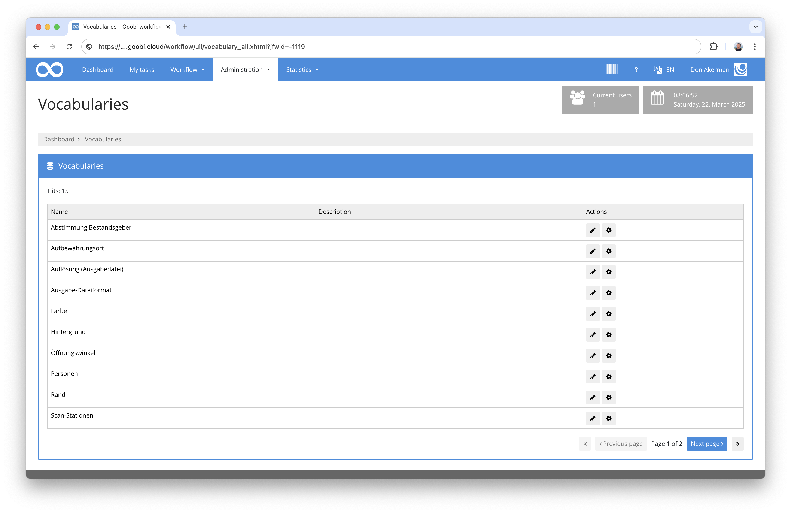

New requirements now presented us with the challenge that functionalities were needed that required more than just an adaptation of the existing vocabulary management. For this reason, we developed a new vocabulary server from scratch that is extremely flexible, recognises different data record types including validation and is designed to be multilingual from the outset. 

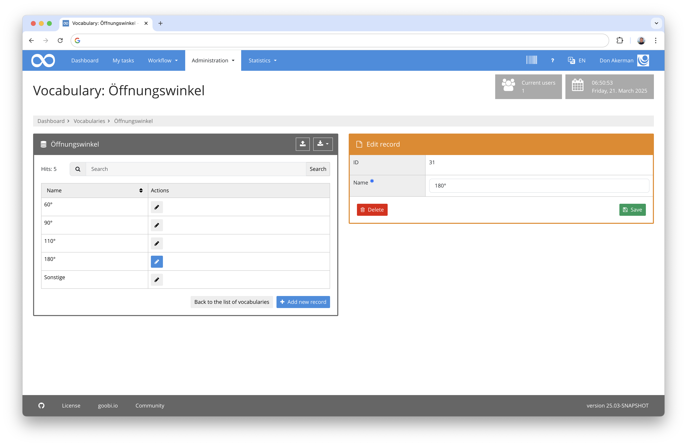

It also has an export mechanism in RDF format and a migration tool to move the data from the previous vocabulary management system to the new vocabulary server. And, of course, the new vocabulary server also has a very comprehensive REST API that enables full communication with the vocabularies. Goobi workflow now also communicates with the vocabulary server via this API. 

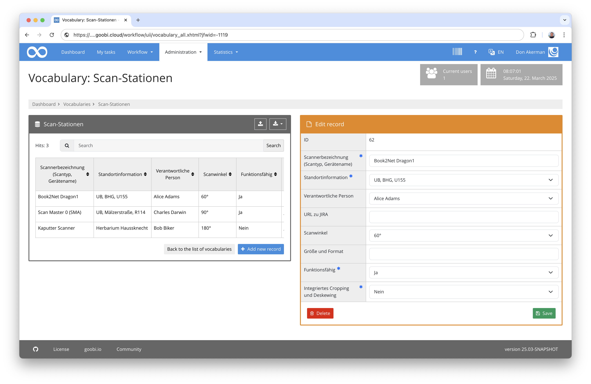

One of the side effects of this change is that the vocabulary server can now be operated independently and on its own infrastructure. This means that other applications from different network segments can now actually work with it without Goobi workflow itself having to become publicly accessible.

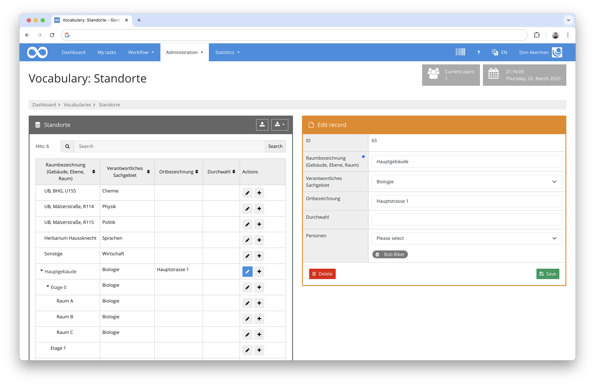

The Goobi viewer has not yet been connected to the vocabulary server, but this is planned for the coming year. What is also still open is the possibility of defining new vocabularies from the user interface as before. Vocabularies are currently defined in the vocabulary server via REST calls. There will certainly be a user interface for this soon too. Until then, however, we have already provided extensive documentation describing the installation and administration of the vocabulary server. It can be found here:

[https://github.com/intranda/goobi-vocabulary-server/blob/develop/docs/en/README.md](https://github.com/intranda/goobi-vocabulary-server/blob/develop/docs/en/README.md)

Like Goobi worklow, the vocabulary server has also been published and documented as open source on Github under GPL2. The repository can be found here:

[https://github.com/intranda/goobi-vocabulary-server/tree/develop](https://github.com/intranda/goobi-vocabulary-server/tree/develop)


### Conditionally displayed process properties   
The process properties are used in many Goobi installations to record information from processors while tasks are being carried out in Goobi. Typical such information includes the opening angle, the use of the glass plate, the device used and some others.

It has often been requested that the fields that can be entered here should not always be listed in full, but should only be displayed to the user when they are required, depending on the selection of another value in another property. We have now implemented this functionality.

For example, a property is displayed within the creation screen:

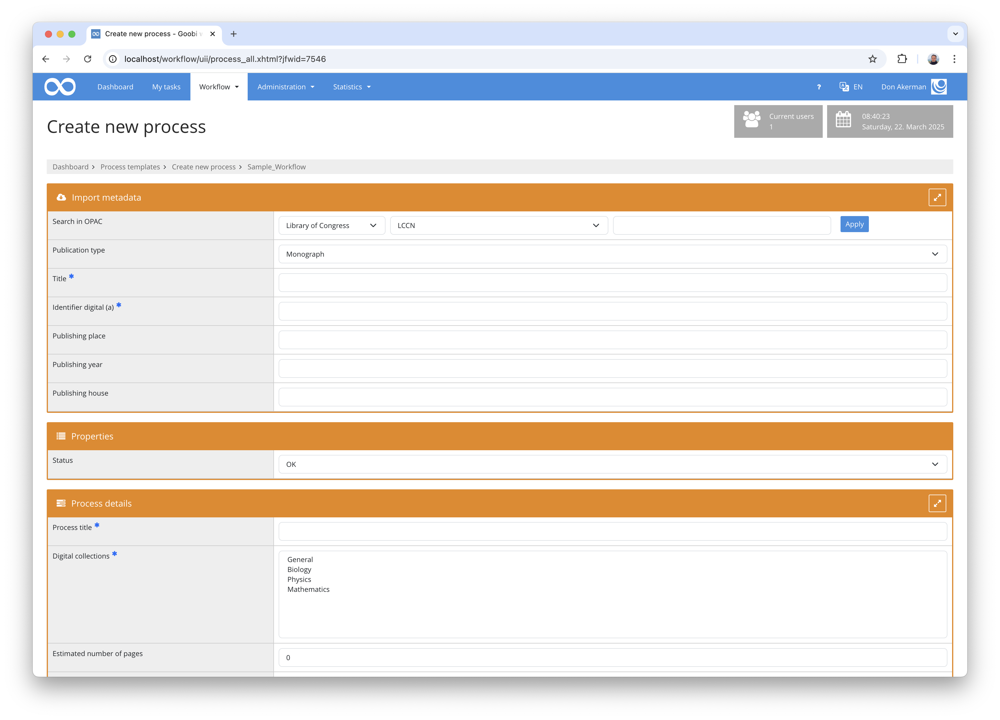

If the value of this property is changed, other properties are also displayed depending on this:

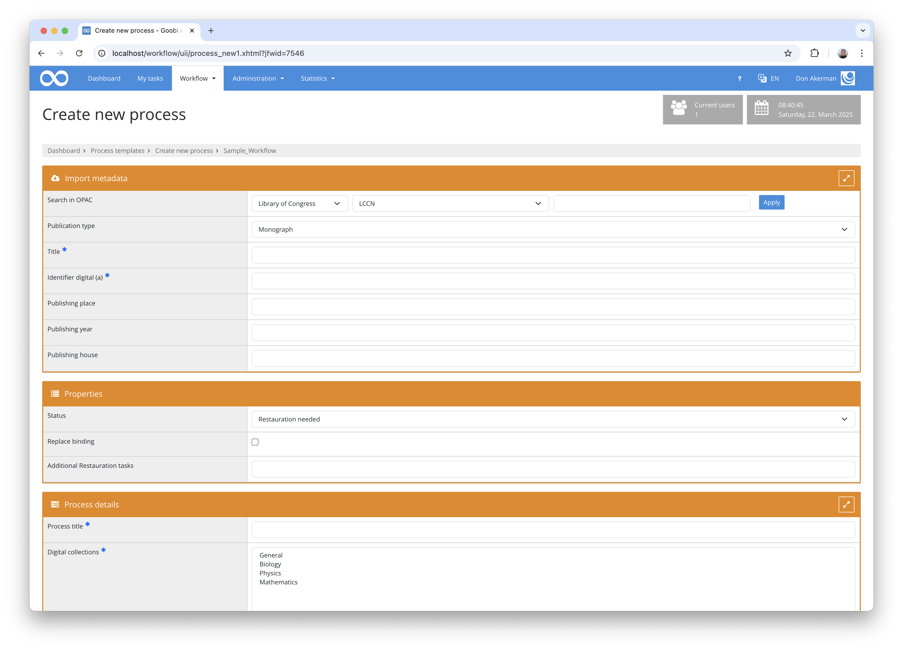

The same principle also works within the accepted tasks. A property is also displayed there:

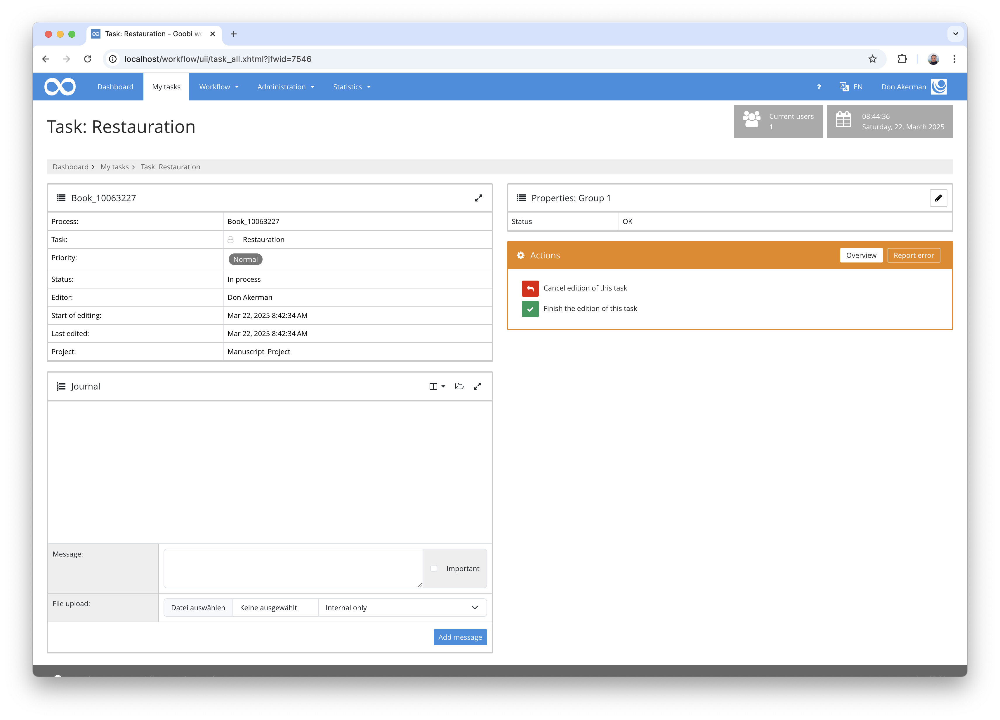

And other properties can also be displayed depending on the selection of the property:

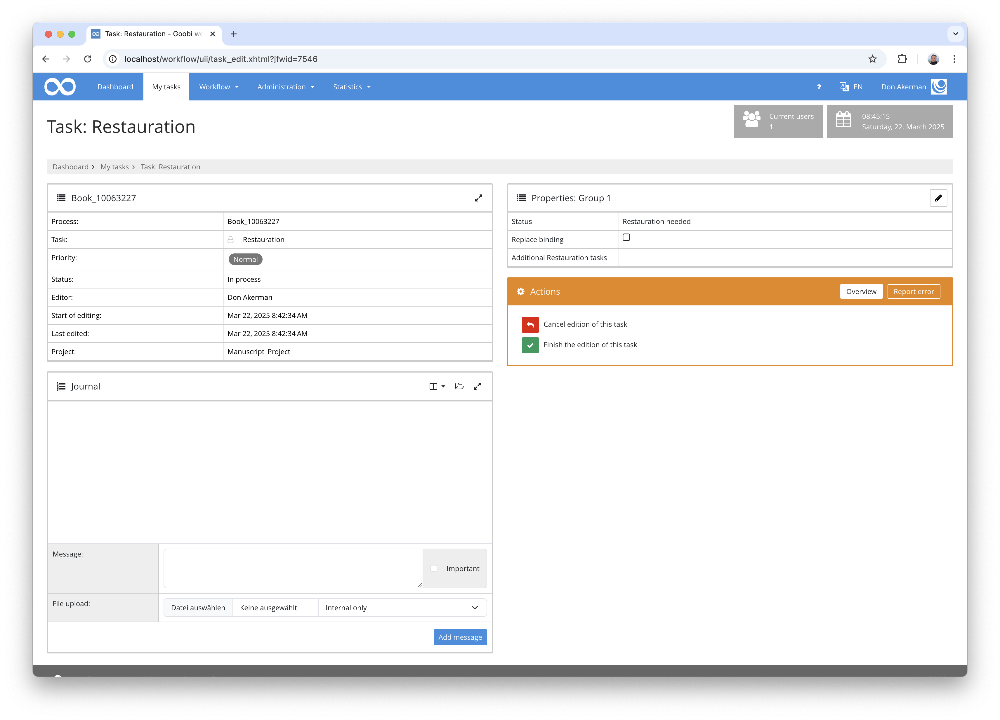

The configuration for the example shown here looks as follows within the configuration file `goobi_processProperties.xml`:

```xml
    <!-- check status of object -->
    <property name="Status" container="1">
        <project>*</project>
        <showProcessCreation access="write" template="*" />
        <showStep name="Restauration" access="write"/>
    	<type>List</type>
        <value>OK</value>
        <value>Restauration needed</value>
        <value>Cancel</value>
    </property>

    <property name="Replace binding" container="1">
        <project>*</project>
      
      	<!-- show inside of creation interface -->
        <showProcessCreation access="write" template="*">
            <display property="Status" value="Restauration needed" />
        </showProcessCreation>
      
      	<!-- show inside of task -->
      	<showStep name="Restauration" access="write">
      		<display property="Status" value="Restauration needed" />
        </showStep>
        <type>Boolean</type>
    </property>
  
    <property name="Additional Restauration tasks" container="1">
        <project>*</project>
      
      	<!-- show inside of creation interface -->
        <showProcessCreation access="write" template="*">
            <display property="Status" value="Restauration needed" />
        </showProcessCreation>
      
      	<!-- show inside of task -->
      	<showStep name="Restauration" access="write">
      		<display property="Status" value="Restauration needed" />
        </showStep>
        <type>Text</type>
    </property>
```

Documentation on these options can be found here in the manual:  
[https://docs.goobi.io/goobi-workflow/en/admin/06_config_files/10_goobi_processproperties.xml#conditional-display-of-properties](https://docs.goobi.io/goobi-workflow/en/admin/06_config_files/10_goobi_processproperties.xml#conditional-display-of-properties)


### Process title can be hidden in creation mask
Many Goobi users are not aware that I can also hide fields in the creation screen. A new addition this month is that the process title can also be hidden. This can be useful, for example, if it is generated automatically and should not be changed by users.

The configuration is done within the configuration file `goobi_projects.xml` and can be done there together with the other hiding options:

```xml
<hide>collections</hide>
<hide>doctype</hide>
<hide>images</hide>
<hide>processtitle</hide>
```

A documentation of the entire configuration file can be found here:  
[https://docs.goobi.io/goobi-workflow/en/admin/06_config_files/11_goobi_projects.xml](https://docs.goobi.io/goobi-workflow/en/admin/06_config_files/11_goobi_projects.xml)


### Redesign of the configuration for the creation screen
We have also made other changes to the Goobi creation screen. The complicated configuration within the `goobi_projects.xm` file has been a thorn in our side for some time, so we are now allowing new, shortened spellings for the same configuration that are more intuitive to use. Nevertheless, the mechanism remains downwards compatible and can be gradually converted to the more readable configuration.

Previous configuration of a main title:

```xml
<item from="vorlage" docstruct="topstruct" metadata="TitleDocMain" required="true" ughbinding="true">Title</item>
```

New abbreviated spelling for the main title:

```xml
<item from="template" metadata="TitleDocMain" required="true">Title</item>
```

If a property is to be stored directly in the process, the attribute `from can also be omitted:

```xml
<item metadata="TitleDocMain" required="true">Title</item>
```

If, on the other hand, information is only to be saved within the METS file, saving as a property can be prevented in this way:

```xml
<item metadata="TitleDocMain" required="true" from="-">Title</item>
```

We have also simplified the notation of the position where a metadata is saved. Previously, the position was expressed in this way:

```xml
<item metadata="PublisherName" docstruct="firstchild">Title</item>
```

In a nutshell, it now looks like this:

```xml
<item metadata="PublisherName" docstruct="child">Title</item>
```

### New field types for the creation screen
Until now, the field types in the Goobi worklow creation screen were quite limited. We have now created three new variants.

Information can now be entered in a text area:

```xml
<item metadata="TitleDocMain" required="true" type="textarea">Title</item>
```

Information can be taken from vocabularies:

```xml
<item metadata="DocLanguage" vocabulary="Languages">Language</item>
```

And dates with calendar selection are now also possible:

```xml
<item metadata="DateOfOrigin" required="true" type="date" pattern="yyyy-MM-dd">Issue Date</item>
```


## Plugins

### Conversion of documentation platform for plugins  
Currently, 143 of the 360 plugins already have very detailed bilingual documentation. In order to be able to continue to maintain this well with this large number of usage scenarios and plugin types, we have decided to revise the type of documentation. Instead of maintaining the documentation in a central location, we have moved all documentation to the `docs` subfolder of the respective plugin and homogenised its structure. As a result, it is now possible for the documentation for each plugin to be available in the same source code repository for the developer in order to have an overview of it and to be able to maintain its content.

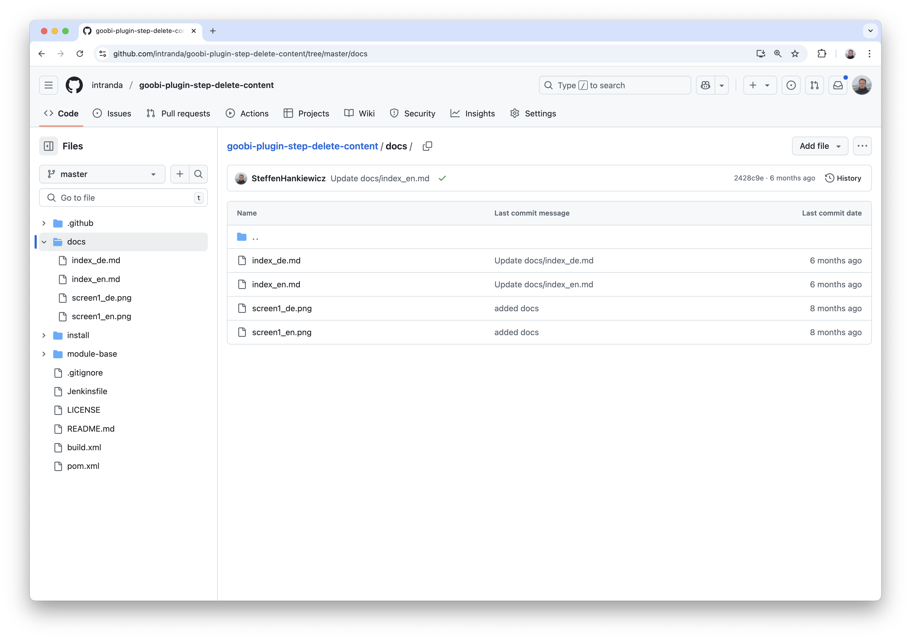

We now automatically generate a central data source in a separate repository from this individual documentation, which is therefore much easier to maintain:

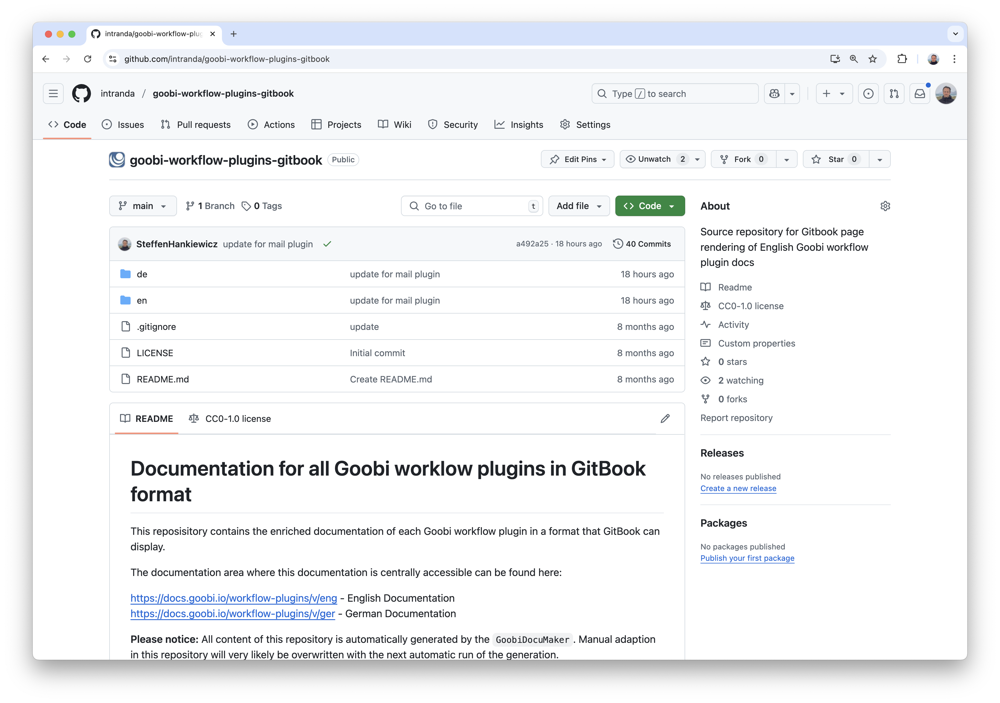

This repository in turn feeds our documentation platform at [https://docs.goobi.io/](https://docs.goobi.io/).

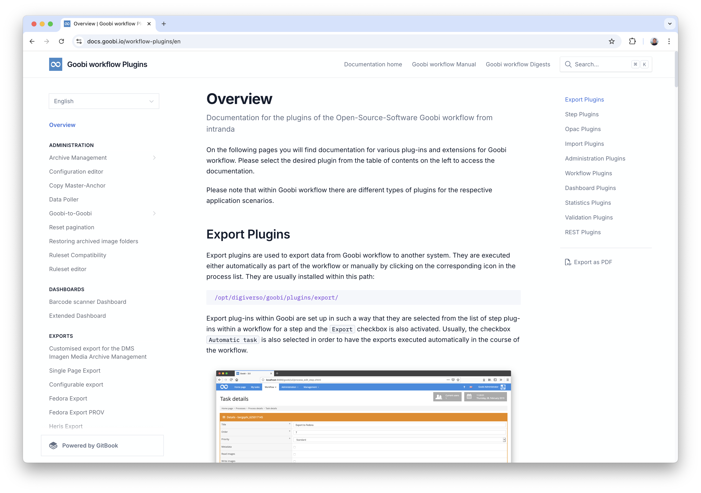


### Creation of plugin documentation for approx. 20 plugins  
And because we have been working so actively on the documentation of plugins anyway, we have simply documented another 20 plugins this month, which means that around 160 plugins are now already extensively documented.


### Completion of the new archive management plugins
Over the last few months, we have been working very intensively on revising the archive management plugin. The aim was to implement a number of functional and operational innovations. We have now finally been able to finalise these and put them into operation in a first project.

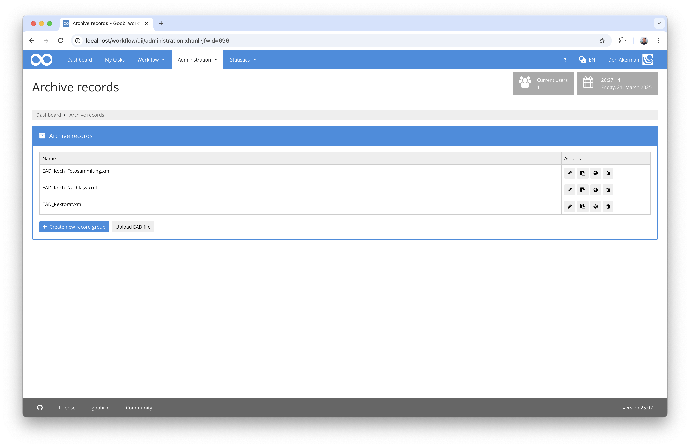

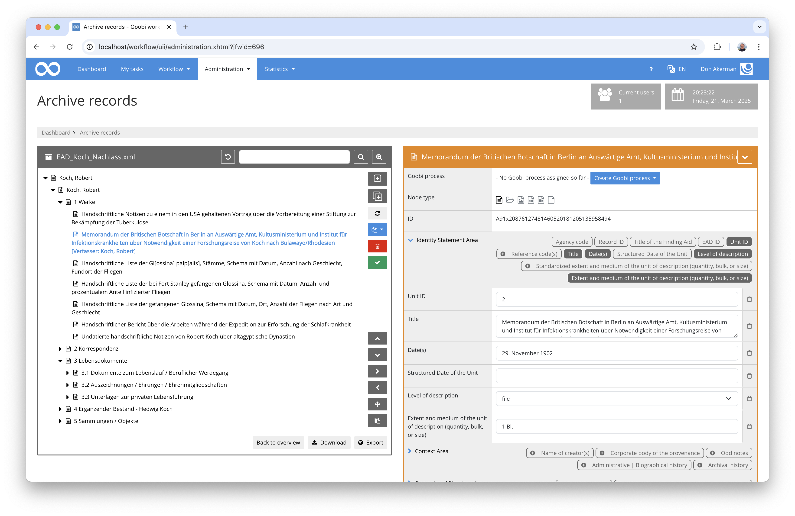

Some of the biggest innovations in this context include

- No additional BaseX database is required. Instead, Goobi stores the information of all nodes of the archive tree within the Goobi database.
- Several people can work in an archive tree at the same time without having to lock the entire tree.
- EAD2, EAD3 and EAD4 formats can now be read in and processed
- There is now an independent EAD export to the Goobi viewer
- Nodes and tree sections can now be reassigned within the tree
- Nodes can be duplicated
- Nodes can be created in bulk
- Very granular rights can be assigned for working with archive management
- Authorisations can be assigned for content
- Search for all metadata instead of just title content
- Composite fields as groups with multiple metadata fields
- Different field types per metadata item
- Periodic export of the entire EAD inventory to the Goobi viewer
- Highly configurable export for the entire inventory or per metadata

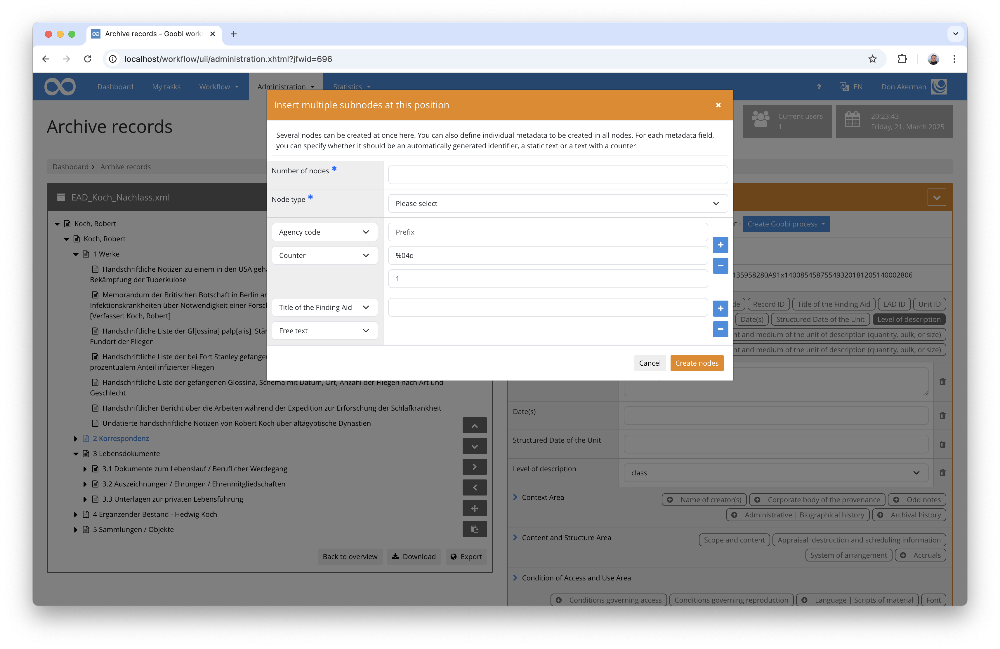

More information about the plugin, its installation and configuration can be found here:  
https://docs.goobi.io/workflow-plugins/en/administration/goobi-plugin-administration-archive-management


### New plugin for enriching MIX metadata
We have implemented a new plugin for enriching METS files with MIX metadata. It allows the metadata to be read from existing images and then saved in the METS file as MIX data. To do this, the plugin first calls JHove and extracts the desired metadata from the analysis result in accordance with the specified configuration. 

Here is an excerpt of such a configuration:

```xml
<jhoveConfig>/opt/digiverso/goobi/config/jhove/jhove.conf</jhoveConfig>
<renameMappings>
    ...
    <value from="ImageCaptureMetadata/ScannerCapture/scannerManufacturer" to="ImageCaptureMetadata/DigitalCameraCapture/digitalCameraManufacturer" removeEmptyParents="true"/>
    <value from="ImageCaptureMetadata/ScannerCapture/ScannerModel/scannerModelName" to="ImageCaptureMetadata/DigitalCameraCapture/DigitalCameraModel/digitalCameraModelName" removeEmptyParents="true"/>
    ...
</renameMappings>
<extraMappings>
    ...
    <value source="//jhove:property[jhove:name='ExposureTime']//jhove:value[1]" target="ImageCaptureMetadata/DigitalCameraCapture/CameraCaptureSettings/ImageData/exposureTime" transform="rational2real"/>
    <value source="//jhove:property[jhove:name='ISOSpeedRatings']//jhove:value[1]" target="ImageCaptureMetadata/DigitalCameraCapture/CameraCaptureSettings/ImageData/isoSpeedRatings"/>
    <value source="//jhove:property[jhove:name='ShutterSpeedValue']//jhove:value[1]" target="ImageCaptureMetadata/DigitalCameraCapture/CameraCaptureSettings/ImageData/shutterSpeedValue" transform="rational2rationalType"/>
    ...
</extraMappings>
```

In this way, the metadata is transferred to the Goobi METS file. In the further processing of the processes, especially with regard to publication, this configured technical metadata transferred from the master images is then available in the METS file and thus also conveniently available to users. 

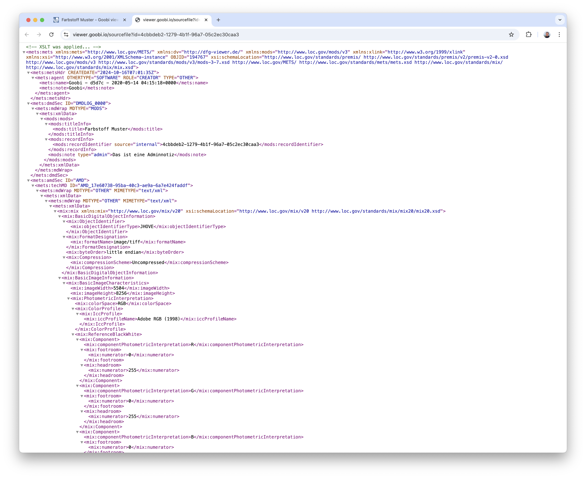

For example, they can be displayed next to the images or searched for.


More information about the plugin, its installation and configuration can be found here:  
[https://docs.goobi.io/workflow-plugins/en/step/goobi-plugin-step-mix-metadata-enrichment](https://docs.goobi.io/workflow-plugins/en/step/goobi-plugin-step-mix-metadata-enrichment)


## Version number
The current version number of Goobi workflow with this release is: `24.08.3`. Within plugin developments, the following dependency must be entered accordingly for Maven projects within the `pom.xml` file:

```xml
<dependency>
    <groupId>io.goobi.workflow</groupId>
    <artifactId>workflow-core</artifactId>
    <version>24.08.3</version>
    <classifier>classes</classifier>
</dependency>
```