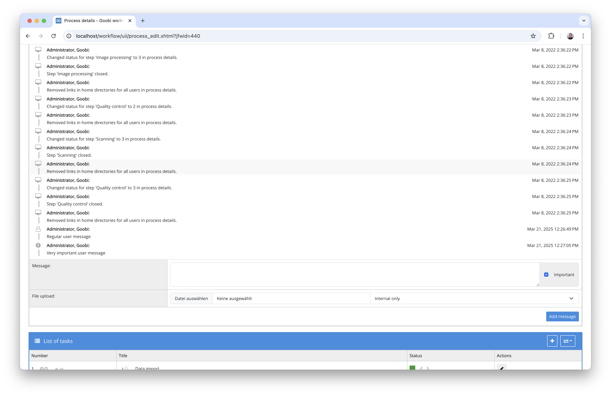

# September 2024

## General
As in previous years, the big user meeting was held in Göttingen again this year. Nevertheless, we were still able to achieve a lot this month.

## Core

### Conversion to Java 17
We have changed the source code of Goobi and the plugins from Java 11 to Java 17. This is not a major change for the time being because we are still compiling the source code with compatibility for Java 11. This means that the application can still be used in the tried and tested infrastructure without having to make any major changes. However, we will soon have to carry out a major update for Java 21 in order to be compatible with Tomcat 10. We will tackle this at the beginning of next year


### New interface for the journal
We have completely redesigned the interface of the journal, which is part of every process. Instead of working with different colours as before, a classification of the individual messages is now recognisable by the icons. This allows for much better accessibility.


As before, the journal can be switched to an expanded mode and is therefore much easier to read, especially with a lot of content, without having to scroll within the box.



And, of course, we have designed it in such a way that all areas of Goobi worklfow that use the journal benefit from it and therefore utilise the same internal components and therefore the same design. This applies, among other things, to the journal in the accepted tasks, in the projects and among the users.


## Plugins


### Processing user orders
Together with the Zentralbibliothek Zürich, we have created a very flexible plugin for handling user orders. This allows information provided by users when placing an order to be recorded and processed for billing purposes. On the one hand, this involves the possibility for users to be informed about their orders and to receive a delivery note. 


However, it was also important to ensure that order details that have an influence on the composition of costs can be processed and then made available to the accounting department.


More information about the plugin, its installation and configuration can be found here:  
[https://docs.goobi.io/workflow-plugins/en/step/goobi-plugin-step-zbz-order-delivery](https://docs.goobi.io/workflow-plugins/en/step/goobi-plugin-step-zbz-order-delivery)


### Extension of the mail plugin for attachments and variables
For some time now, there has been a plugin that allows Goobi to send e-mails with flexible content during the workflow. What was missing, however, was the ability to use information from the process properties to specify recipients. This was necessary for sending messages to the senders of a user order. 

In this context, the plugin has also been extended to allow attachments to be added to emails. These can also be defined very flexibly using variables from properties, metadata or paths of the process.


More information about the plugin, its installation and configuration can be found here:  
[https://docs.goobi.io/workflow-plugins/en/step/goobi-plugin-step-send-mail](https://docs.goobi.io/workflow-plugins/en/step/goobi-plugin-step-send-mail)

### PDF generation extended
The plugin, which can be used to flexibly generate PDF files in the course of workflows, has been significantly revised. The configuration of the plugin now allows even better control of where the PDF files should actually be generated from. On the one hand, this affects the specification of the directory from which the image files are to be used for the PDF files. On the other hand, it also affects the control of how the PDF is to be assembled. You can now specify whether individual pages are to be generated as PDFs or whether an overall PDF is to be generated. You can also control how the composition is to take place, so that, for example, an overall PDF is to be assembled from individual pages or controlled by the page assignment of the METS file. The location to which the PDF files are to be exported can now also be granularly controlled.

More information about the plugin, its installation and configuration can be found here:  
[https://docs.goobi.io/workflow-plugins/en/step/goobi-plugin-step-create-full-pdf](https://docs.goobi.io/workflow-plugins/en/step/goobi-plugin-step-create-full-pdf)


### Extensive documentation work
We are currently working very intensively on developing the documentation. On the one hand, this includes maintaining the actual documentation and configuration, including installation instructions in German and English. However, it also includes explaining the plugins in digests whenever there have been relevant changes, publishing them on Github and ensuring that they have an up-to-date readme file that guarantees a link between the reader-friendly documentation and the source code. 

For the following plugins, there were either extensive updates to the documentation or new documentation was created:

[https://docs.goobi.io/workflow-plugins/en/dashboard/goobi-plugin-dashboard-barcode](https://docs.goobi.io/workflow-plugins/en/dashboard/goobi-plugin-dashboard-barcode)  
[https://docs.goobi.io/workflow-plugins/en/dashboard/goobi-plugin-dashboard-extended](https://docs.goobi.io/workflow-plugins/en/dashboard/goobi-plugin-dashboard-extended)  
[https://docs.goobi.io/workflow-plugins/en/export/goobi-plugin-export-bda-single-image](https://docs.goobi.io/workflow-plugins/en/export/goobi-plugin-export-bda-single-image)  
[https://docs.goobi.io/workflow-plugins/en/export/goobi-plugin-export-configurable](https://docs.goobi.io/workflow-plugins/en/export/goobi-plugin-export-configurable)  
[https://docs.goobi.io/workflow-plugins/en/export/goobi-plugin-export-stanford](https://docs.goobi.io/workflow-plugins/en/export/goobi-plugin-export-stanford)  
[https://docs.goobi.io/workflow-plugins/en/metadata/goobi-plugin-metadata-change-type](https://docs.goobi.io/workflow-plugins/en/metadata/goobi-plugin-metadata-change-type)  
[https://docs.goobi.io/workflow-plugins/en/quartz/goobi-plugin-quartz-heris](https://docs.goobi.io/workflow-plugins/en/quartz/goobi-plugin-quartz-heris)  
[https://docs.goobi.io/workflow-plugins/en/step/goobi-plugin-step-alma-api](https://docs.goobi.io/workflow-plugins/en/step/goobi-plugin-step-alma-api)  
[https://docs.goobi.io/workflow-plugins/en/step/goobi-plugin-step-delay](https://docs.goobi.io/workflow-plugins/en/step/goobi-plugin-step-delay)  
[https://docs.goobi.io/workflow-plugins/en/step/goobi-plugin-step-delay-workflow-status](https://docs.goobi.io/workflow-plugins/en/step/goobi-plugin-step-delay-workflow-status)  
[https://docs.goobi.io/workflow-plugins/en/step/goobi-plugin-step-delete-content](https://docs.goobi.io/workflow-plugins/en/step/goobi-plugin-step-delete-content)  
[https://docs.goobi.io/workflow-plugins/en/step/goobi-plugin-step-download-and-verify-assets](https://docs.goobi.io/workflow-plugins/en/step/goobi-plugin-step-download-and-verify-assets)  
[https://docs.goobi.io/workflow-plugins/en/step/goobi-plugin-step-flex-editor](https://docs.goobi.io/workflow-plugins/en/step/goobi-plugin-step-flex-editor)  
[https://docs.goobi.io/workflow-plugins/en/step/goobi-plugin-step-generate-alto-ids](https://docs.goobi.io/workflow-plugins/en/step/goobi-plugin-step-generate-alto-ids)  
[https://docs.goobi.io/workflow-plugins/en/step/goobi-plugin-step-heris](https://docs.goobi.io/workflow-plugins/en/step/goobi-plugin-step-heris)  
[https://docs.goobi.io/workflow-plugins/en/step/goobi-plugin-step-metadata-update-field](https://docs.goobi.io/workflow-plugins/en/step/goobi-plugin-step-metadata-update-field)  
[https://docs.goobi.io/workflow-plugins/en/step/goobi-plugin-step-mets-creation](https://docs.goobi.io/workflow-plugins/en/step/goobi-plugin-step-mets-creation)  
[https://docs.goobi.io/workflow-plugins/en/step/goobi-plugin-step-user-assignment](https://docs.goobi.io/workflow-plugins/en/step/goobi-plugin-step-user-assignment)  
[https://docs.goobi.io/workflow-plugins/en/step/goobi-plugin-step-vocabulary-enrichment](https://docs.goobi.io/workflow-plugins/en/step/goobi-plugin-step-vocabulary-enrichment)  
[https://docs.goobi.io/workflow-plugins/en/workflow/goobi-plugin-workflow-aeon-process-creation](https://docs.goobi.io/workflow-plugins/en/workflow/goobi-plugin-workflow-aeon-process-creation)  
[https://docs.goobi.io/workflow-plugins/en/workflow/goobi-plugin-workflow-close-step](https://docs.goobi.io/workflow-plugins/en/workflow/goobi-plugin-workflow-close-step)  
[https://docs.goobi.io/workflow-plugins/en/workflow/goobi-plugin-workflow-yerusha-aim25](https://docs.goobi.io/workflow-plugins/en/workflow/goobi-plugin-workflow-yerusha-aim25)  


There have been changes to the README files for the following plugins this month:

```
goobi-plugin-administration-data-poller
goobi-plugin-administration-goobi2goobi-import
goobi-plugin-administration-reset-pagination
goobi-plugin-administration-restore-archived-image-folders
goobi-plugin-administration-ruleset-compatibility
goobi-plugin-dashboard-barcode
goobi-plugin-dashboard-extended
goobi-plugin-export-adm-bsme
goobi-plugin-export-bda-single-image
goobi-plugin-export-configurable
goobi-plugin-export-fedora
goobi-plugin-export-fedora-prov
goobi-plugin-export-heris
goobi-plugin-export-newspaper
goobi-plugin-export-nli-pdf-to-folder-structure
goobi-plugin-export-selected-images
goobi-plugin-export-stanford
goobi-plugin-export-vlm
goobi-plugin-export-weimar-haab
goobi-plugin-export-zop
goobi-plugin-import-bka-bda
goobi-plugin-import-crown
goobi-plugin-import-eth-no-catalogue
goobi-plugin-import-excel
goobi-plugin-import-katzoom
goobi-plugin-import-mab
goobi-plugin-import-sisis-sunrise-file
goobi-plugin-import-wuwien
goobi-plugin-import-zbz-alma
goobi-plugin-import-zbz-cmi
goobi-plugin-import-zbz-no-catalogue
goobi-plugin-metadata-change-type
goobi-plugin-metadata-create-structure-elements
goobi-plugin-opac-ariadne
goobi-plugin-quartz-heris
goobi-plugin-statistics-sudan-memory
goobi-plugin-statistics-user-throughput
goobi-plugin-opac-ead
goobi-plugin-opac-generic-xml
goobi-plugin-opac-json
goobi-plugin-opac-kalliope
goobi-plugin-opac-marc
goobi-plugin-opac-pica
goobi-plugin-opac-soutron
goobi-plugin-quartz-bka-wohnbau
goobi-plugin-step-abbyy-finereader
goobi-plugin-step-alma-api
goobi-plugin-step-analysis-imagename
goobi-plugin-step-archive-image-folder
goobi-plugin-step-ark
goobi-plugin-step-bag-creation
goobi-plugin-step-batch-progress
goobi-plugin-step-catalogue-request
goobi-plugin-step-change-workflow
goobi-plugin-step-create-full-pdf
goobi-plugin-step-create-structure-from-filenames
goobi-plugin-step-datacite-doi
goobi-plugin-step-delay
goobi-plugin-step-delay-workflow-status
goobi-plugin-step-delete-content
goobi-plugin-step-display-metadata
goobi-plugin-step-doi
goobi-plugin-step-download-and-verify-assets
goobi-plugin-step-duplicate-tasks
goobi-plugin-step-epic-pid
goobi-plugin-step-ewig
goobi-plugin-step-excel-metadata-enrichment
goobi-plugin-step-export-package
goobi-plugin-step-fetch-images-from-metadata
goobi-plugin-step-file-upload
goobi-plugin-step-file-validation
goobi-plugin-step-flex-editor
goobi-plugin-step-generate-alto-ids
goobi-plugin-step-generate-identifier
goobi-plugin-step-geonames-auto-annotator
goobi-plugin-step-geonames-correction
goobi-plugin-step-handle-mets
goobi-plugin-step-heris
goobi-plugin-step-image-metadata-extraction
goobi-plugin-step-image-resize-and-watermark
goobi-plugin-step-image-selection
goobi-plugin-step-imageqa
goobi-plugin-step-import-from-folder
goobi-plugin-step-kiel-archive-cleanup
goobi-plugin-step-metadata-edition
goobi-plugin-step-metadata-per-image
goobi-plugin-step-metadata-replacement
goobi-plugin-step-metadata-structure-import
goobi-plugin-step-metadata-update-field
goobi-plugin-step-mets-creation
goobi-plugin-step-mets-enhancer
goobi-plugin-step-mix-metadata-enrichment
goobi-plugin-step-mixed-ocr
goobi-plugin-step-ocr-selector
goobi-plugin-step-ocr-to-metadata
goobi-plugin-step-oid-creation
goobi-plugin-step-olr-correction
goobi-plugin-step-pdf-book-interchange-convert
goobi-plugin-step-pdf-extraction
goobi-plugin-step-pdf-upload
goobi-plugin-step-placeholder-creation
goobi-plugin-step-process-folder-migration
goobi-plugin-step-rename-files
goobi-plugin-step-rename-files-before-rosetta
goobi-plugin-step-rename-process
goobi-plugin-step-reorder-images
goobi-plugin-step-replace-images
goobi-plugin-step-representative-creation
goobi-plugin-step-reverse-image-order
goobi-plugin-step-rki-import
goobi-plugin-step-save-docket-file
goobi-plugin-step-send-mail
goobi-plugin-step-tei-import
goobi-plugin-step-tif-validation
goobi-plugin-step-transcription
goobi-plugin-step-transkribus-collection
goobi-plugin-step-urn
goobi-plugin-step-user-assignment
goobi-plugin-step-vocabulary-enrichment
goobi-plugin-step-xmp-header
goobi-plugin-step-yerusha-validation
goobi-plugin-step-zbz-order-delivery
goobi-plugin-workflow-aeon-process-creation
goobi-plugin-workflow-barcode-generator
goobi-plugin-workflow-charite-importer
goobi-plugin-workflow-excel-import
goobi-plugin-workflow-file-upload-process-creation
goobi-plugin-workflow-hu-importer
goobi-plugin-workflow-import-json
goobi-plugin-workflow-layoutwizzard
goobi-plugin-workflow-linked-process-creation
goobi-plugin-workflow-mass-upload
goobi-plugin-workflow-newspaper-pages-importer
goobi-plugin-workflow-project-export
goobi-plugin-workflow-yerusha-aim25
```

## Version number

The current version number of Goobi workflow with this release is: `24.09.9`. Within plugin developments, the following dependency must be entered accordingly for Maven projects within the `pom.xml` file:

```xml
<dependency>
    <groupId>io.goobi.workflow</groupId>
    <artifactId>workflow-core</artifactId>
    <version>24.09.9</version>
    <classifier>classes</classifier>
</dependency>
```