# October 2024

## General
This month's release comes a little late and is correspondingly extensive. We will limit ourselves here to the most important points of this month.

## Core

### Access restrictions for metadata
The UGH program library, which as part of Goobi is responsible for ensuring that metadata, structural data, pagination, catalogue mapping, exports and much more function properly, has been extended so that individual metadata can now be assigned access restrictions. Within the rule set, an additional attribute `allowAccessRestriction` must simply be added to the desired metadata. 


Once this configuration has been made in the rule set, the metadata editor displays a small icon in its interface in front of the respective metadata that allows the access restriction to be activated.

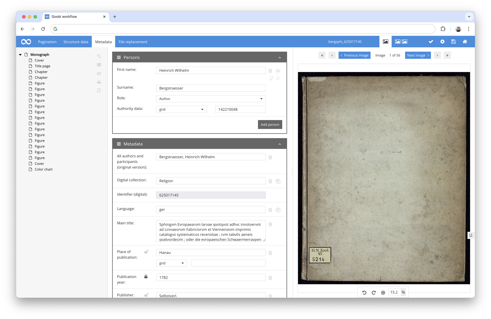

If works have been assigned such defined access restrictions and the exported METS file therefore contains the access restriction information, a target system such as the Goobi viewer can make use of this. In the case of the Goobi viewer, for example, the METS file is now checked for such restrictions for access by users and then cleansed of the protected data for unauthorised persons. In this way, the information is not only hidden in the interface for unauthorised persons but also for access to the underlying METS file.

Further information on the configuration of the standard rate can be found in the UGH documentation here:  
[https://docs.goobi.io/ugh-en/3/3.1#id-3.1.8-access-restricted-metadata](https://docs.goobi.io/ugh-en/3/3.1#id-3.1.8-access-restricted-metadata)

Detailed information on configuring the Goobi viewer and how to correctly configure access to metadata for access restrictions can be found here:  
[https://docs.goobi.io/goobi-viewer-en/misc/1/15](https://docs.goobi.io/goobi-viewer-en/misc/1/15)


### Docker support extended - preparation for a new Goobi-to-go
There are already some Goobi users who no longer install Goobi workflow directly on the servers and instead use Docker to run the application within containers. A Docker image has therefore been available for Goobi workflow for some time, which can be found here:

[https://hub.docker.com/r/intranda/goobi-workflow](https://hub.docker.com/r/intranda/goobi-workflow)

We are currently working relatively intensively on this infrastructure and are converting some of it. Not only so that users who want to install it on their servers can benefit from it. But also because we have been working for some time on designing a completely new version of the popular Goobi-to-go, which will then be operated on the basis of Docker. So there are big changes and announcements to come in the next few weeks.

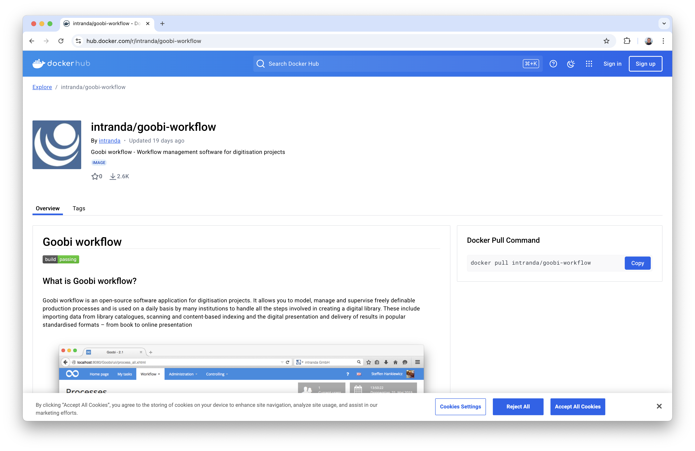


### Process properties with better labelling
Previously, process properties were displayed in a common box and listed one below the other. In the past, it usually looked something like this:

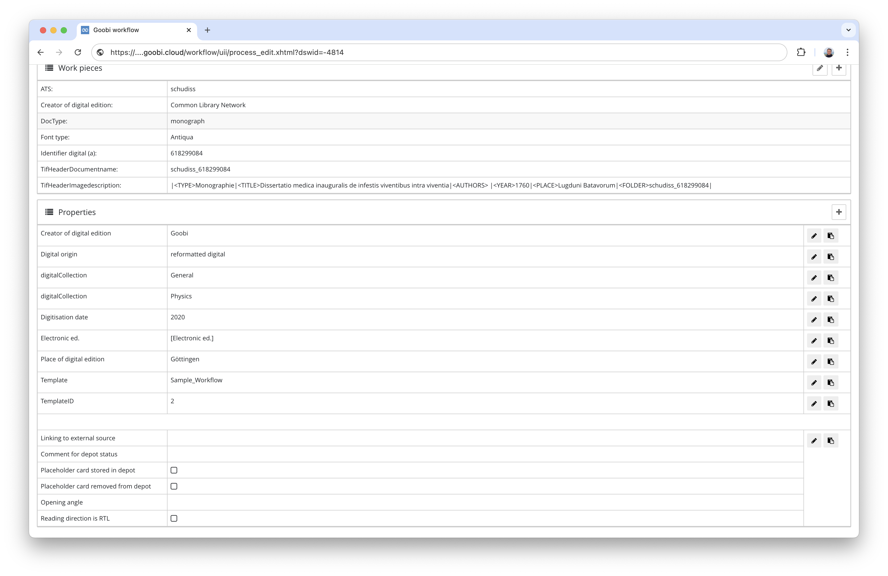

The individual areas could group several properties as `containers`. But there was no obvious classification of these containers. These are now to be extended so that they are no longer just listed, but can actually be displayed as independent containers, where the affiliation to the respective containers is also more obvious:

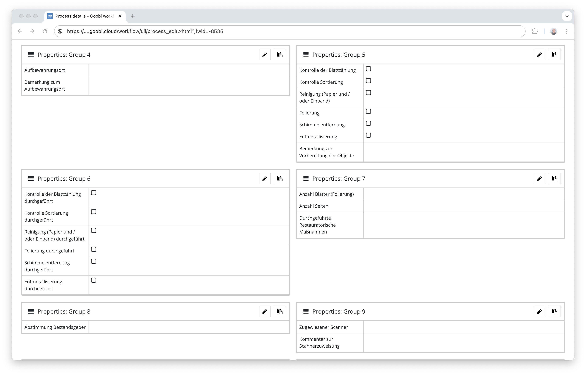

To make operation even easier for users, however, container management has now been extended so that each container can now be given a name. This is defined in the configuration file as follows, for example:

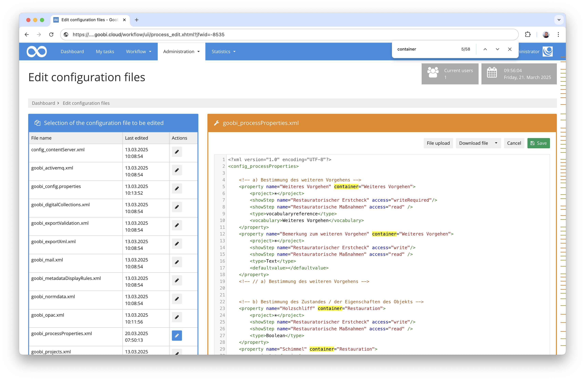

The presentation of the properties is then clearer for the user and the affiliation to the respective named containers is easier to understand:

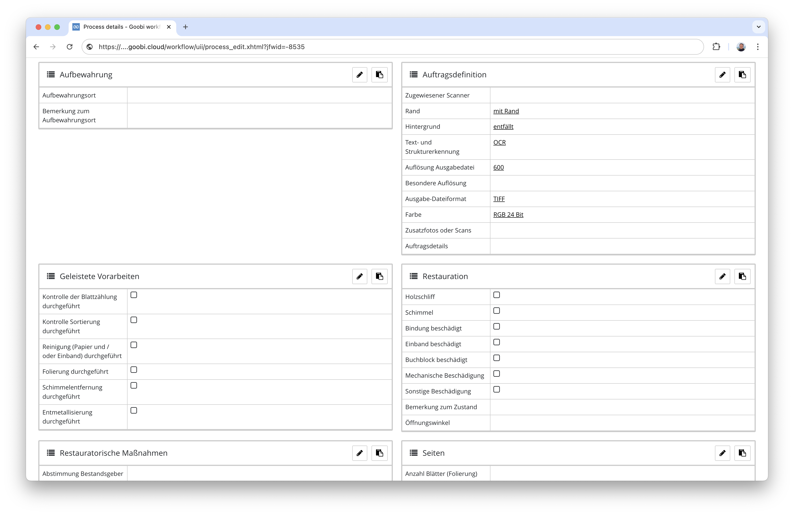

The same presentation in this box form is of course also taken into account within the assumed tasks in order to ensure standardised operation:

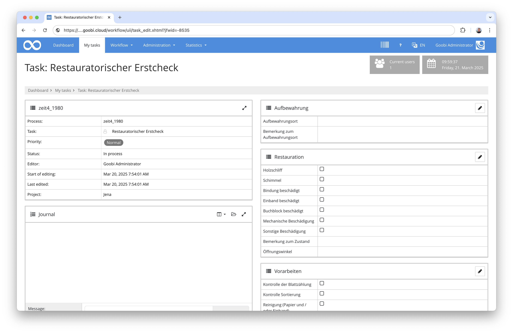


### New notification system and footer
We already announced it at the Goobi Days. Now it has also gone into production: We have implemented a completely different display of notifications. Success and error messages are no longer simply displayed at the top, but can now also be hidden and superimposed on the interface so that they no longer interfere so much with the layout of the entire page if several messages are displayed at the same time.

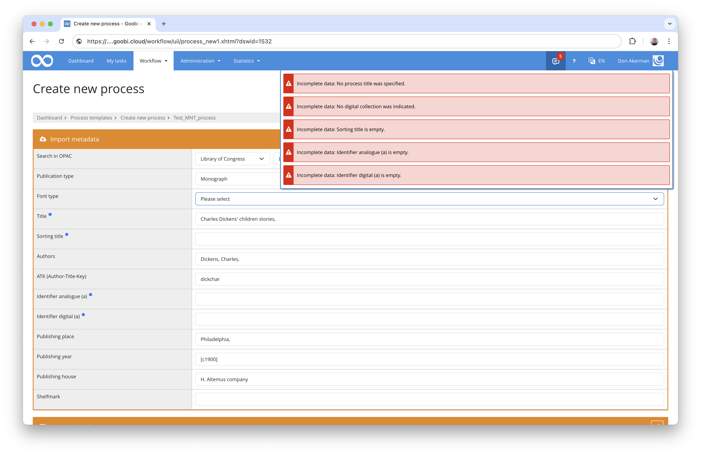

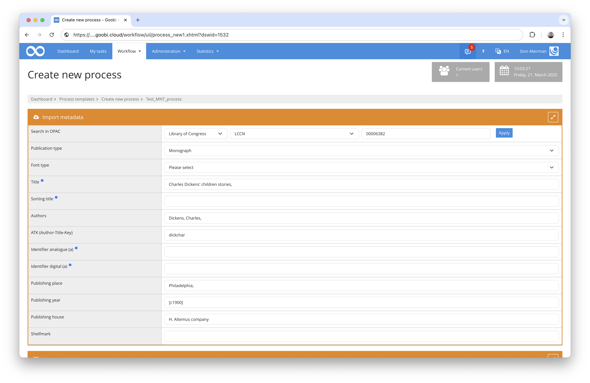

The original plan was that the messages might also come from the footer area of Goobi. We have therefore equipped Goobi worklow with a footer that already contains some useful links and information. We will be adding more practical things here in the future.

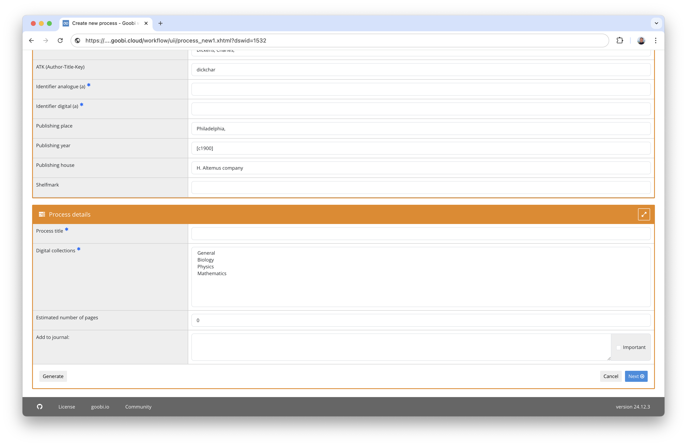


### Vocabulary server as a Docker image
So that the new vocabulary server can not only be installed regularly on Severn, we have now also made it available as a Docker image. This also makes it easier to operate within Docker environments. In the future, this will also enable us to make good use of the vocabulary server within the new Goobi-to-go infrastructure.

The Dockerfile for commissioning can be found here:
[https://github.com/intranda/goobi-vocabulary-server/blob/develop/Dockerfile](https://github.com/intranda/goobi-vocabulary-server/blob/develop/Dockerfile)


### Vocabulary with monitoring interface
The vocabulary server has been made a little more robust. Among other things, it has a method for checking its own operation and makes this available as a query for monitoring. This makes it possible for external applications such as Goobi workflow to check the correct operation of the vocabulary server before communicating with it. This makes it easier to avoid potential errors. 

A version check was also implemented in this context, which allows other applications to query the version status of the vocabulary server. Based on this, external applications can decide better whether and how they want to continue communicating with the vocabulary server.


### User interface based on Bootstrap 5
We are of course still working on the Goobi workflow user interface. As announced, the switch to Bootstrap 5 is in full swing and unfortunately still not complete. Overall, however, we have already made great progress and are now focussing on revising the user interface of the 300 or so plug-ins so that Goobi workflow and the plug-ins have a uniform appearance.

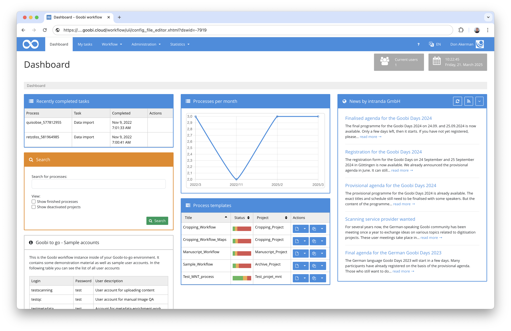


## Plugins

### Revision of the entity editor
The editor for editing entities has been significantly revised this month in order to simplify operation, improve the storage of relationships between data records, performance and interaction with the vocabulary server.

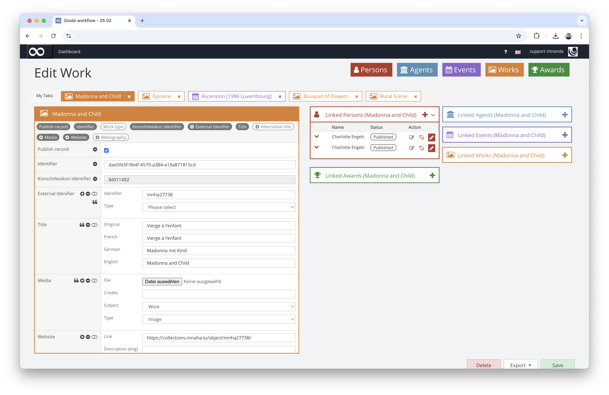

Further information can be found in the documentation here:  
[https://docs.goobi.io/workflow-plugins/en/workflow/goobi-plugin-workflow-entity-editor](https://docs.goobi.io/workflow-plugins/en/workflow/goobi-plugin-workflow-entity-editor)


### Revision of the Data Poller
During the Goobi Days in September, it was once again discussed that the functionality of the Data Poller (formerly `Catalogue Poller`) needs to be intensively reviewed. In the previous months, this had been equipped with the option of test runs, the results of which should be visible to users before they are actually executed. There was also a desire for a configurable `whitelist` for the metadata `to be updated` instead of the previously only available `blacklist` for the metadata `not to be updated`.

The functionality has now been tested and errors have been corrected. In this context, the user interface has also been ported to Bootstrap 5.

Further information can be found in the documentation here:  
[https://docs.goobi.io/workflow-plugins/en/administration/goobi-plugin-administration-data-poller](https://docs.goobi.io/workflow-plugins/en/administration/goobi-plugin-administration-data-poller)


## Version number

The current version number of Goobi workflow with this release is: `24.10`. Within plugin developments, the following dependency must be entered accordingly for Maven projects within the `pom.xml` file:

```xml
<dependency>
    <groupId>io.goobi.workflow</groupId>
    <artifactId>workflow-core</artifactId>
    <version>24.10</version>
    <classifier>classes</classifier>
</dependency>
```