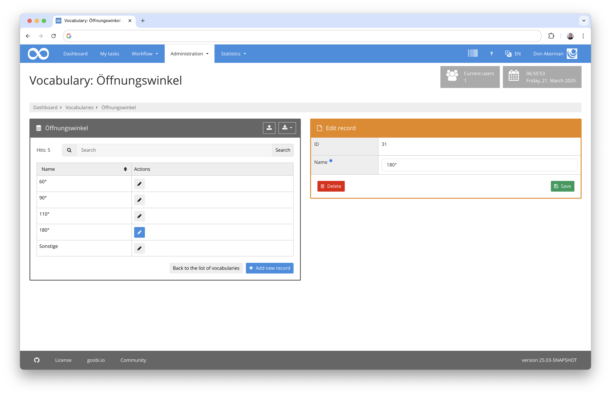

# November 2024

## General
As the October release was published relatively late, there was not much time left in November to develop new features. The digest is correspondingly shorter.


## Core

### Adjustments to the vocabulary server
The possible uses of the new vocabulary server are much more extensive than we had initially assumed. And with these additional application options, there are always small adjustments that need to be made. For example, there was a need to revise the saving of vocabulary data records. However, the user interface has not changed for users.



There was also a need for Goobi workflow to have a check routine for interaction with the vocabulary server in order to query the version status of the vocabulary server and check a minimum version to ensure smooth communication between the two applications.

### Swiss German as an additional language for the user interface
Even if Goobi workflow is already equipped with the German language in the user interface, this is not automatically the best choice for users from different German-speaking regions. For example, it has been found that the number formats make a big difference for users when it comes to billing for user orders. 


The mere fact that the numeric keypad on a Swiss keyboard does not have a comma but a full stop made it somewhat awkward for Swiss users to enter numbers with decimal places. 


The display of price information, which must be processed as part of the billing of user presentations, therefore also made it necessary for Goobi workflow to now offer Swiss German (DE-CH) in addition to German (DE) within the language switcher.


## Plugins

### Mass import for the advertising material archive
A new mass import plugin has been developed for the Vienna University of Economics and Business, which allows the advertising material and brand studies available there to be imported. These were previously available as PDF files and were described within JSON files. We have developed a new plugin to import them and carried out the import.


The detailed documentation for the plugin can be found here:

[https://docs.goobi.io/workflow-plugins/en/workflow/goobi-plugin-workflow-wu-wma-import](https://docs.goobi.io/workflow-plugins/en/workflow/goobi-plugin-workflow-wu-wma-import)


## Code analysis
The following screenshot shows the SonarCloud analysis of the current release. Further information can be found directly on the [project page](https://sonarcloud.io/organizations/intranda/projects).


## Version number
The current version number of Goobi workflow with this release is: `24.11.4`. Within plugin developments, the following dependency must be entered accordingly for Maven projects within the `pom.xml` file:

```xml
<dependency>
    <groupId>io.goobi.workflow</groupId>
    <artifactId>workflow-core</artifactId>
    <version>24.11.4</version>
    <classifier>classes</classifier>
</dependency>
```