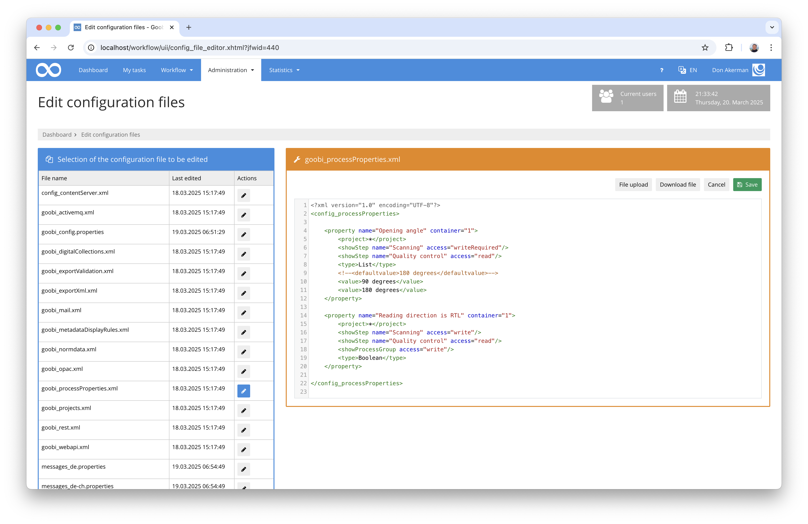
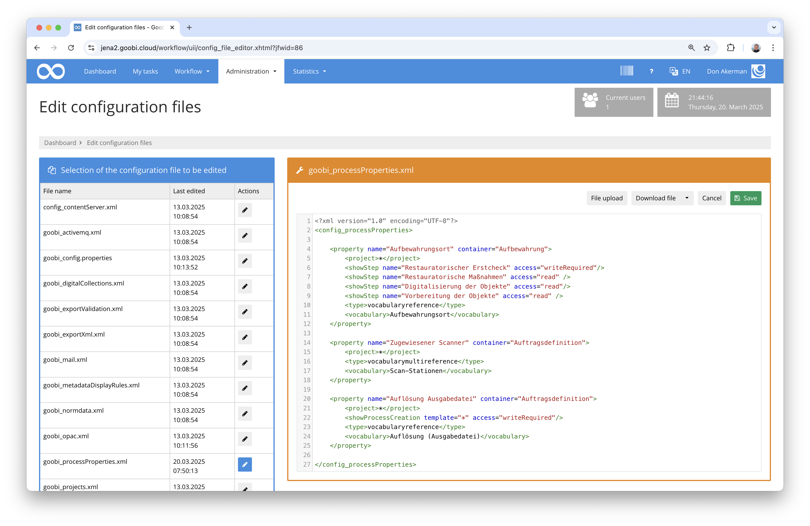
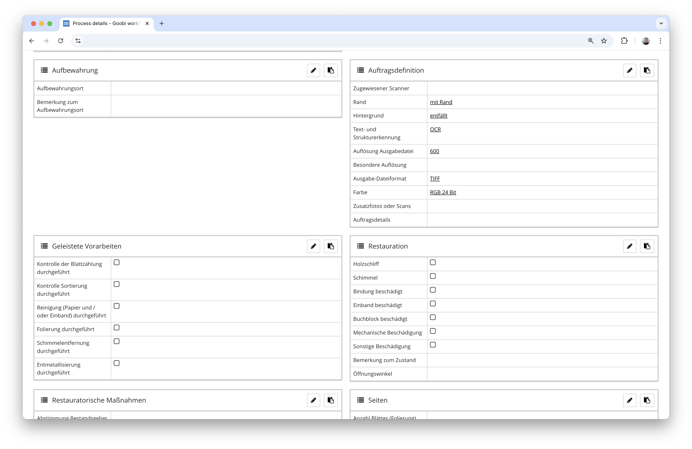
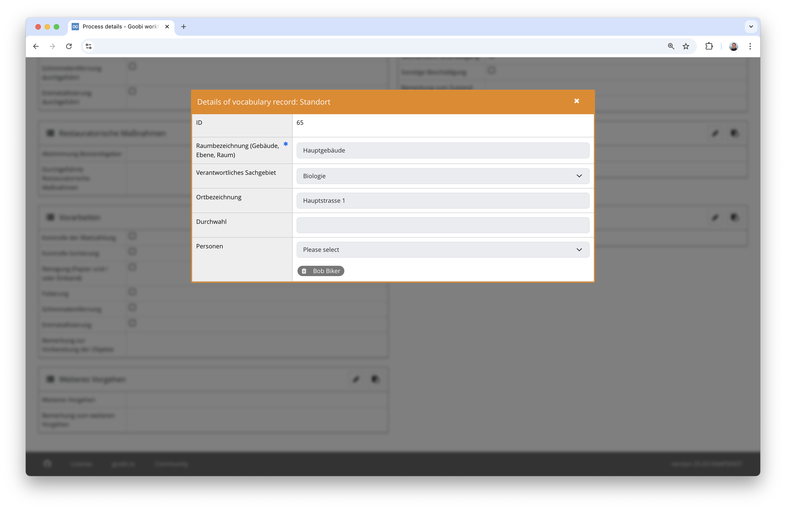
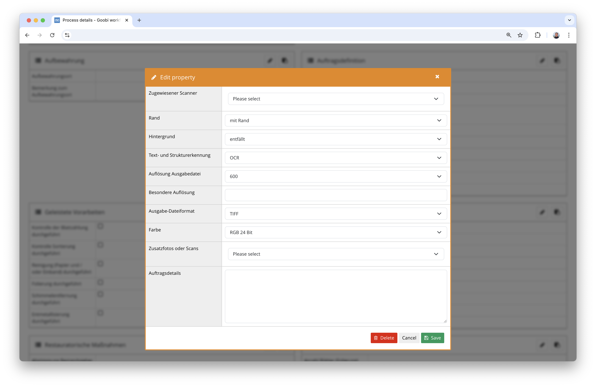
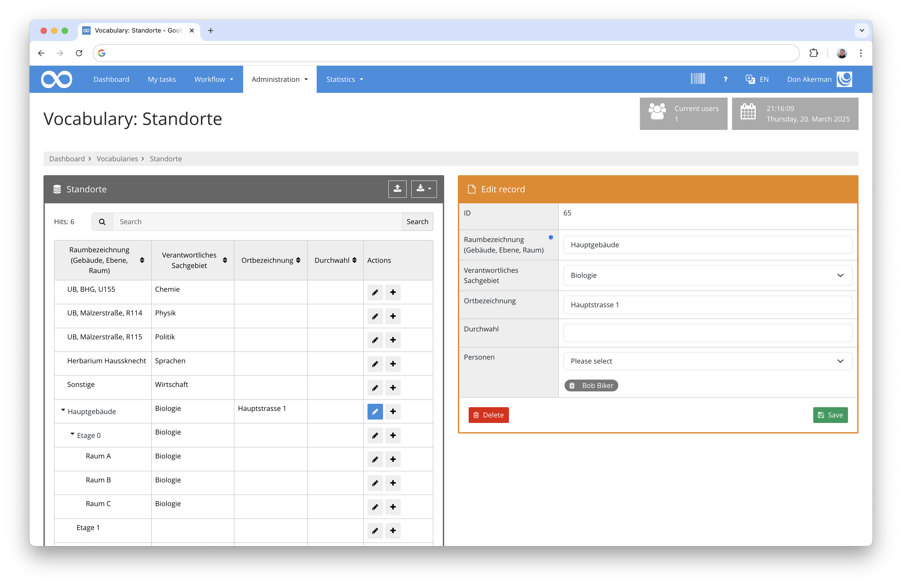
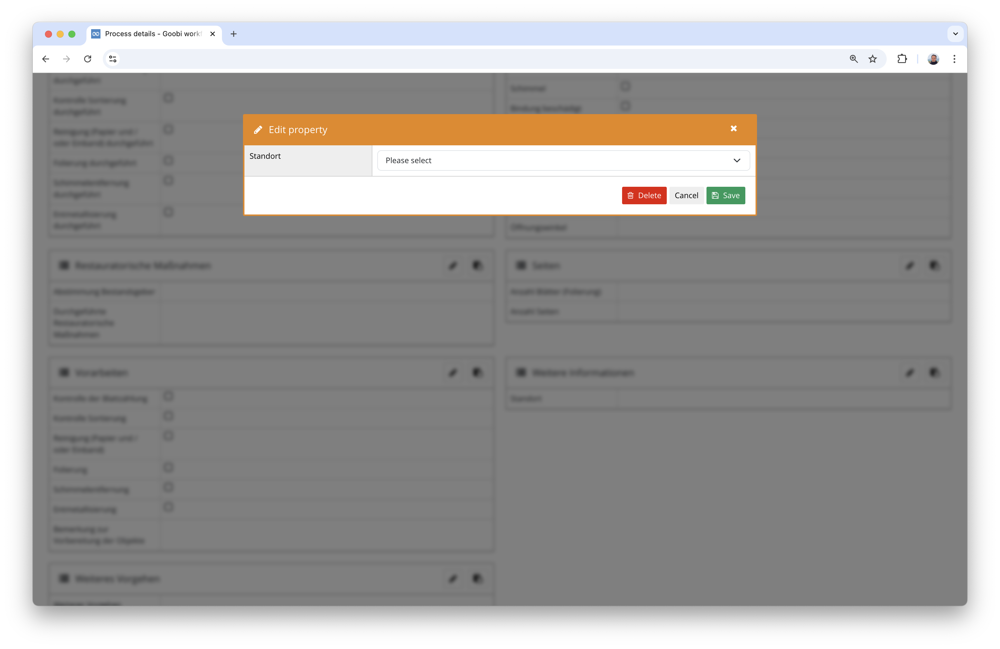
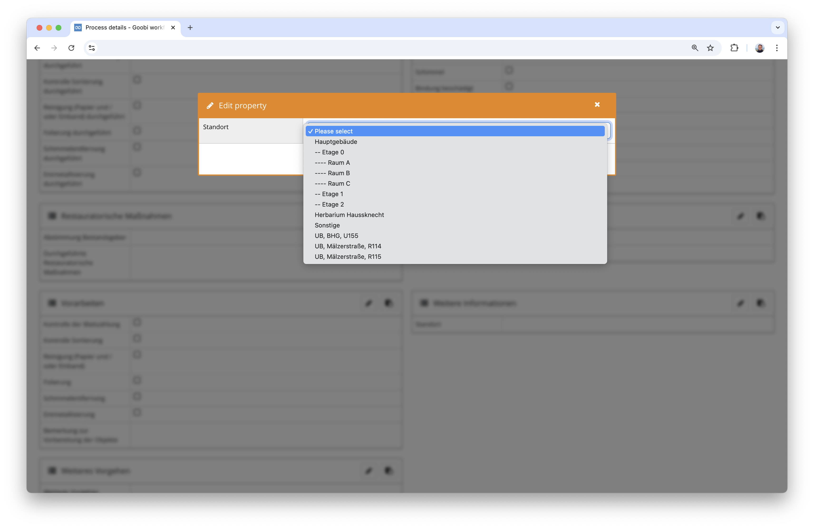
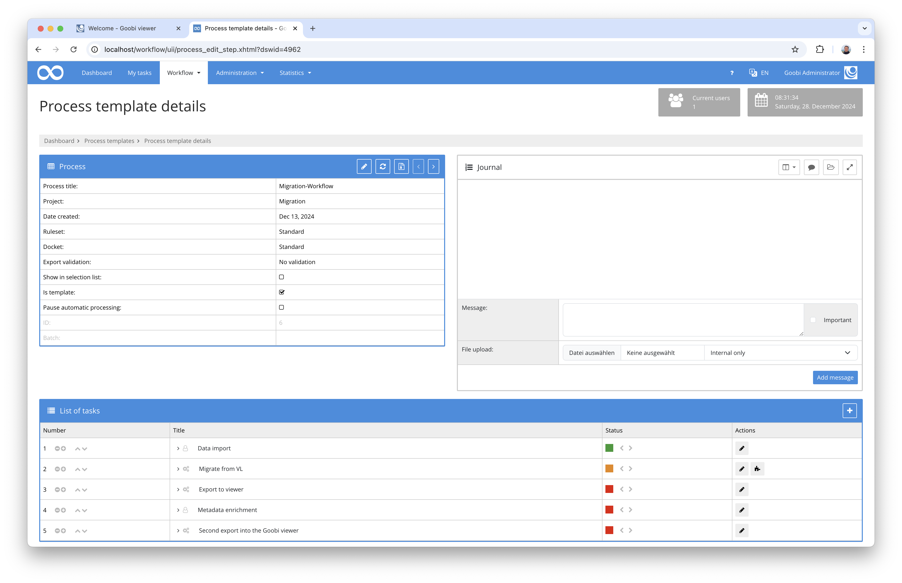

# December 2024

## General information
With this last version of the year, we are probably releasing the last Goobi workflow release that can still be operated under Java 11 and Tomcat 9. From next month, we will begin the transition to Java 21 and Tomcat 10. 

**Attention:** Please note that the upcoming releases will require a one-time major update effort.

## Core

### Process properties with vocabulary content
Process properties have existed in Goobi for a long time. They are often used to record and evaluate information during the workflow that is not part of the digitised material's metadata. Typical examples of this are specifications for working methods, scripts or statistics (e.g. opening angle, reading direction, glass plate utilisation).

Previously, the properties in the configuration file `goobi_processProperties.xml` could be typified for different content, for example to define free text fields, checkboxes or selection lists from which the user should select information. 



What is new is that such information can now also come from vocabularies. They are defined in the same configuration file.



This means that the properties are now available in the modified interface with the values that were specified there as the main value.



Clicking on such a value opens a window that shows all the details of the vocabulary entry.



A data entry screen is also available for editing properties, which lists the values from the vocabularies.




### Extension for handling hierarchical vocabularies
The major development work on the new vocabulary system has already taken place in recent months. In this context, vocabularies can also be structured hierarchically. 



What was missing until now, however, was the ability to select vocabulary content within drop-down lists for properties. This is now possible with this update.






### Further preparatory work for Goobi-to-go changeover
As already announced at the Goobi Days, we are currently working intensively on a complete overhaul of Goobi-to-go. This is currently being implemented and tested on the basis of Docker and already looks very promising. This month, we have adapted the start of Goobi workflow specifically for this purpose so that it is more robust in the event of a slower database connection of a freshly started database. In our opinion, this only plays a major role for Goobi-to-go on Docker as an infrastructure.


## Plugins


### Migration from Visual Library to Goobi
Time and again, users of Visual Library software approach us and plan to migrate their data to Goobi. We have now developed a plugin for this purpose that greatly simplifies the migration process. The data transfer from a running VL instance can be carried out in the same way as a catalogue query. Goobi then starts a workflow that uses the migration plugin to query the data via the OAI interface and, in addition to pagination, structural data and metadata, also automatically migrates the images and full texts to Goobi. An example of such a workflow is as follows:



Following this migration, the works will be available in Goobi as usual and can also be edited there in the metadata editor, for example:


Export to other systems such as long-term archiving, repositories and catalogues as well as publication in the Goobi viewer or other systems is also possible as usual:


A screencast is available here to illustrate how such a migration process can be carried out for individual works of different Visual Library instances:



Further information on the plugin for migrating Visual Library content to Goobi can be found in the documentation here:

[https://docs.goobi.io/workflow-plugins/en/step/goobi-plugin-step-migrate-visual-library-to-goobi](https://docs.goobi.io/workflow-plugins/en/step/goobi-plugin-step-migrate-visual-library-to-goobi)


### Adjustments to the Transkribus plugin
Transkribus is very suitable for performing OCR or HCR and can also be automated very easily using Goobi with the existing plugin. In the past, when processing really large lists of processes with significantly more than 100,000 pages in particular, connections were often interrupted, resulting in time-consuming manual intervention. However, these are no longer necessary. A revision of the connection of Transkribus with an automatic repetition of connection attempts in the event that Transkribus cannot be reached now results in significantly less problematic mass processing of OCR. At the same time, the processing of the processes has also been adapted in such a way that they are now processed together and the overview of the progress has been significantly improved. A side effect of this was an enormous increase in page throughput.

More information on OCR processing using Transkribus can be found in the documentation here:

[https://docs.goobi.io/workflow-plugins/en/step/goobi-plugin-step-transkribus](https://docs.goobi.io/workflow-plugins/en/step/goobi-plugin-step-transkribus)


### Extension of the validation methods for image files
The Tif validation plugin has been slightly extended to perform further validations on the basis of JHove. The comparison options have been extended so that the expected values can now be defined even more flexibly. The examples for the use of these comparison options in the reference configuration and also in the documentation have also been significantly expanded, so that initial installation of the plugin together with the documentation should now be much easier and more flexible. The updated documentation of the plugin can be found here:

[https://docs.goobi.io/workflow-plugins/en/step/goobi-plugin-step-tif-validation](https://docs.goobi.io/workflow-plugins/en/step/goobi-plugin-step-tif-validation)


### Customisation of the newspaper export for the DDB newspaper profile
Goobi workflow and Goobi viewer already handle newspaper editions very elegantly and offer various options, e.g. with calendars, metadata and structural data, so that users can easily navigate to the desired newspapers. For the import of newspapers into the newspaper portal of the German Digital Library, however, a special processing of the metadata is necessary so that the newspaper, the year and the individual issues are displayed differently as intermediate levels. The necessary conventions have now been taken into account within a special export plug-in, so that the transfer to the DDB is now even easier.


## Version number
The current version number of Goobi workflow with this release is: `24.12.4`. Within plugin developments, the following dependency must be entered accordingly for Maven projects within the `pom.xml` file:

```xml
<dependency>
    <groupId>io.goobi.workflow</groupId>
    <artifactId>workflow-core</artifactId>
    <version>24.12.4</version>
    <classifier>classes</classifier>
</dependency>
```