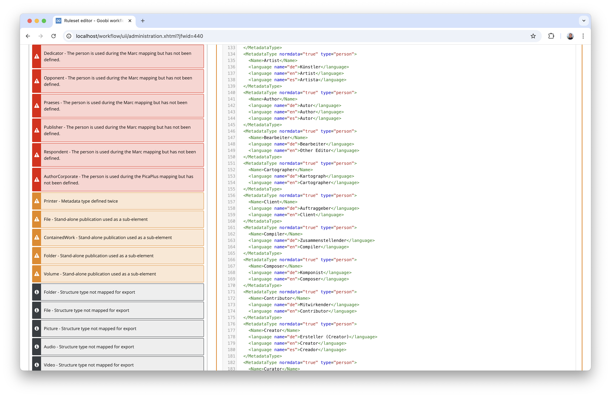

# January 2025

## General
A lot of development work has taken place this month to migrate Goobi workflow and all plugins to Java 21. However, as the work is so extensive, we have decided not to publish a release this month. The latest release is therefore, for once, the one from the previous month.

## Core

### Conversion to Java 21 and Tomcat 10

Goobi workflow is currently based on Java 11 and can be operated under various operating systems with Apache Tomcat 9 as the web server. However, this technical basis is currently undergoing major changes. Java 11 will only be supported by the individual operating systems for a limited time. And Tomcat 9 is also no longer available in the repositories of several Linux distributions. Using Ubuntu Linux as an example, it is easy to see which versions are still supported and for how long. This in turn determines how long Java 11 will be available for the respective distributions:


Before support for Java 11 and Tomcat 9 expires for the typical systems on which Goobi is operated, we need to upgrade Goobi workflow and all associated components to a new version of Java and Tomcat. However, this is a very extensive task with regard to Java 21 and Tomcat 10. We are currently working on migrating around 400 repositories with source code to Java 21. We had hoped that we would be able to complete the work in January. However, the scope of the work is much larger than anticipated. Therefore, this can only remain an announcement for the upcoming release in February. We are still working on it.


### Conversion of the metadata editor to Bootstrap 5

The conversion of the metadata editor to Bootstrap 5 is still in full swing, as it was previously based on Bootstrap 4 and was always slightly different in terms of operation and design to other areas of Goobi workflow. We are currently trying to eliminate these differences and are porting the metadata editor to the same HTML infrastructure as the rest of Goobi workflow. On the one hand, we hope that this will improve usability and accessibility. On the other hand, we also hope that these changes will make the future development of the metadata editor a little easier.

The work has not yet been finalised. However, here is a preview of what the interface will look like after the changeover:


### Adaptations for mobile devices

With the increasing use of mobile devices such as tablets and mobile phones, Goobi workflow must of course also be easy to use. Here, too, there have been some minor adjustments to make operation easier. 


Even the metadata editor is now easier to use on mobile devices. However, only time will tell whether users will make use of this.


## Plugins

### Rule set editor

For some time now, the rule set editor plug-in has provided Goobi workflow users with a convenient mechanism for configuring metadata and structural data directly from the user interface.


This editor not only allows convenient editing, but also the automatic creation of backups of the previous version when a change is saved. It also allows the entire rule set to be validated.


We worked intensively on this validation in December and January in order to expand it. It is great that numerous misconfigurations can now be checked and thus avoided. What is not so nice is that due to the complexity of the rule sets, which also take over the mapping of data from catalogues as MARC and PICA and into the target formats METS and LIDO, every rule set actually has errors that should be looked at. 


Configurations that have grown historically, that appeared to be correct and have been changed over time through further adjustments, contain various small and non-critical but also critical errors that are now becoming apparent for the first time with the new validation options. It is therefore worth installing or updating this plugin to check your own rule sets thoroughly.




## Version number

The current version number of Goobi workflow with this release is: `24.12.4`. Within plugin developments, the following dependency must be entered accordingly for Maven projects within the `pom.xml` file:

```xml
<dependency>
    <groupId>io.goobi.workflow</groupId>
    <artifactId>workflow-core</artifactId>
    <version>24.12.4</version>
    <classifier>classes</classifier>
</dependency>
```